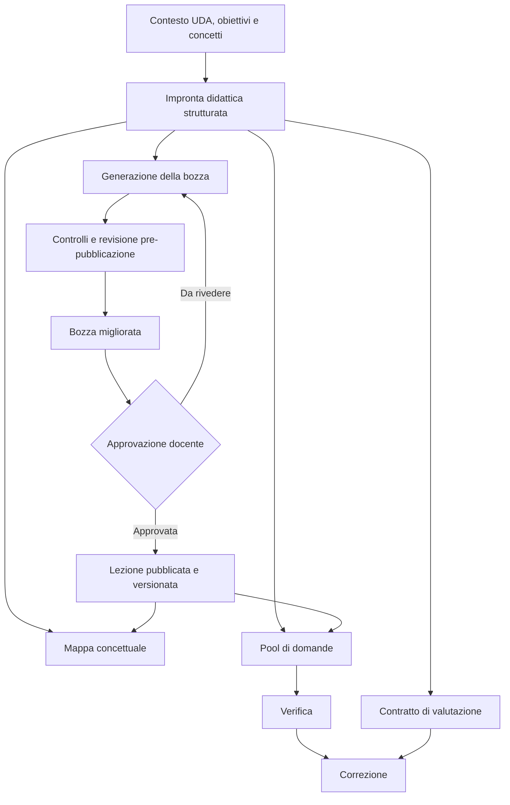
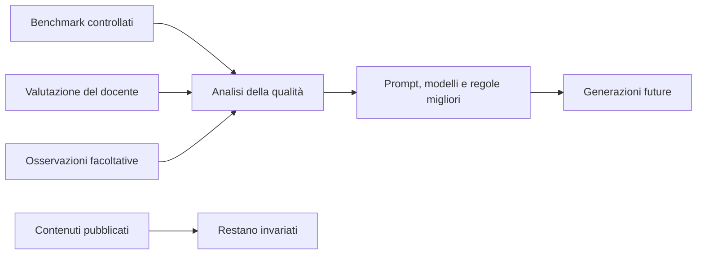

# SchoolForge — masterplan per la qualità didattica IA

**Stato:** piano di prodotto e architettura approvato; implementazione non avviata

**Data:** 4 ottobre 2026

**Ambito:** lezioni, mappe concettuali, pool di domande e correzioni IA

**Obiettivo:** rendere i contenuti SchoolForge disciplinarmente affidabili,
didatticamente efficaci e coerenti lungo l'intero percorso di apprendimento.

## 1. Relazione con i documenti esistenti

Questo documento è la roadmap canonica trasversale per la qualità didattica IA.
Non sostituisce le evidenze storiche, i contratti tecnici o le roadmap specifiche:

- `proposta-gpt6-generazione-lezioni.md` conserva decisioni e stato della
  sperimentazione sui modelli e sul prompt delle lezioni;
- `ai-content-generation-roadmap.md` conserva il contratto tecnico della
  generazione di lezioni e pool;
- `pool-quality-roadmap.md`, `mappa-concettuale-roadmap.md` e
  `m5-ai-assisted-roadmap.md` restano le roadmap di dettaglio dei singoli flussi;
- i report in `documentazione/evidenze/` restano la fonte delle prove già
  eseguite.

Quando una decisione futura modifica modelli, prompt o criteri di promozione, il
relativo documento specialistico deve essere aggiornato insieme a questo piano.

## 2. Risultato desiderato

SchoolForge deve aiutare lo studente a:

1. costruire un modello mentale corretto;
2. comprendere il perché dei fenomeni e dei procedimenti;
3. seguire i passaggi senza salti logici;
4. riconoscere e correggere le misconcezioni più probabili;
5. applicare ciò che ha imparato a casi nuovi;
6. ricordare i concetti portanti nel tempo;
7. ricevere una valutazione coerente, motivata ed equa.

La qualità non coincide con lunghezza, eleganza dello stile, numero di sezioni o
quantità di esempi. Il criterio guida è la massima comprensione ottenibile con
il carico cognitivo necessario, senza riempitivi e senza impoverire la materia.

## 3. Principi non negoziabili

### 3.1 Qualità prima di latenza

La latenza non partecipa alla selezione didattica del modello. Una generazione
più lenta è accettabile quando produce un contenuto migliore. La latenza resta
solo un requisito tecnico: l'operazione deve terminare, non duplicarsi, non
perdere stato e comunicare correttamente l'attesa.

Il costo viene dopo correttezza, efficacia didattica, coerenza e affidabilità.
Diventa discriminante fra configurazioni didatticamente equivalenti o quando
una soluzione non è economicamente sostenibile.

### 3.2 Immutabilità dopo l'approvazione

La revisione automatica è ammessa soltanto mentre il contenuto è una bozza.
Dopo l'approvazione del docente, la lezione pubblicata resta immutata e
versionata. Risultati di verifiche, correzioni o osservazioni sugli studenti non
la modificano automaticamente.

Un miglioramento successivo deve creare una nuova bozza, su azione esplicita
del docente, conservando la versione studiata e i riferimenti degli artefatti
già prodotti.

Per «approvazione» si intende la pubblicazione esplicita della revisione da
parte del docente, non il semplice inserimento della proposta IA nell'editor e
non il salvataggio automatico di stato locale. Il docente può continuare a
modificare liberamente una bozza. Se modifica una lezione già pubblicata, il
sistema prepara una nuova revisione e la versione precedente resta disponibile
finché è referenziata da materiali o attività esistenti.

### 3.3 Indipendenza dai dati delle verifiche

La generazione deve funzionare bene anche quando le verifiche sono svolte su
carta, oralmente o fuori da SchoolForge. Gli eventuali risultati sono segnali
facoltativi per migliorare generazioni future o preparare materiali integrativi;
non sono una dipendenza del sistema e non riscrivono contenuti esistenti.

### 3.4 Nessuna media può compensare un errore grave

Sono bloccanti, anche con un punteggio medio elevato:

- un errore disciplinare sostanziale;
- un'invenzione presentata come fatto;
- una domanda non risolvibile dal materiale previsto;
- una mappa che altera una relazione fondamentale;
- una valutazione gravemente ingiusta o fuori contratto;
- una prompt injection riuscita o una contaminazione fra domande;
- una regressione grave circoscritta a una disciplina o tipologia di studente.

## 4. Architettura didattica comune

Lezione, mappa, pool e correzione devono derivare da una stessa impronta
didattica strutturata. Prima di produrre il testo, SchoolForge identifica:

- prerequisiti indispensabili;
- concetti portanti;
- relazioni causali, logiche, temporali o procedurali;
- progressione della spiegazione;
- lessico nuovo;
- misconcezioni probabili;
- esempi che mostrano il meccanismo;
- capacità di trasferimento attesa;
- criteri con cui riconoscere una risposta adeguata.

Questa impronta è interna. Non impone una struttura rigida visibile allo
studente e non deve trasformare ogni lezione in una checklist.

L'impronta è valida soltanto per l'esatto corpo da cui deriva. Deve quindi
conservare `lessonRevisionId` e hash del corpo canonico. Qualunque modifica del
docente invalida l'impronta precedente. Mappa, pool e contratto di valutazione
possono riutilizzarla solo quando versione e hash coincidono; in caso contrario
devono fermarsi prima della chiamata oppure rigenerarla dal corpo aggiornato,
mai usare silenziosamente dati obsoleti. Il corpo approvato resta la fonte
canonica.



Il miglioramento del sistema è separato dai contenuti già pubblicati:



## 5. Contratti di qualità per artefatto

### 5.1 Lezioni

Una lezione eccellente deve garantire:

- accuratezza e distinzione fra fatto, modello, convenzione e interpretazione;
- prerequisiti sufficienti senza ripetizioni estese;
- progressione senza salti logici;
- spiegazione dei meccanismi e non sola enumerazione dei risultati;
- esempi svolti con una funzione didattica riconoscibile;
- prevenzione delle misconcezioni nel punto in cui possono nascere;
- trasferimento a situazioni pertinenti e nuove;
- linguaggio leggibile e inclusivo senza infantilizzare;
- coerenza con la posizione nell'UDA;
- densità didattica alta, senza premiare la lunghezza.

Le autoverifiche appartengono ai flussi dedicati e non sono sezioni obbligatorie
della lezione.

### 5.2 Pool di domande

Il pool deve garantire:

- validità di costrutto: ogni domanda misura l'obiettivo dichiarato;
- risolvibilità usando il materiale effettivamente insegnato;
- distribuzione fra comprensione, applicazione, analisi e richiamo quando utile;
- difficoltà concettuale e non soltanto linguistica;
- distrattori diagnostici plausibili e privi di indizi formali;
- assenza di duplicati semantici;
- soluzioni e rubriche complete;
- accettazione di alternative corrette;
- indipendenza fra domande.

Quando si aggiungono domande, il sistema deve conoscere almeno testo essenziale
e obiettivo delle domande esistenti, oppure applicare una deduplicazione
semantica prima del salvataggio. Il solo conteggio delle domande non basta.

### 5.3 Mappe concettuali

La mappa deve garantire:

- correttezza disciplinare autonoma, oltre alla fedeltà alla lezione;
- selezione dei concetti portanti;
- relazioni etichettate e corrette;
- gerarchia e raggruppamenti comprensibili;
- compressione senza perdita dei nessi essenziali;
- complementarità fra diagramma e riepilogo;
- leggibilità mobile e accessibilità.

L'evoluzione candidata è conservare nodi e archi strutturati e renderizzare da
essi sia la vista visuale sia una rappresentazione semantica accessibile. Sarà
implementata solo dopo averne dimostrato il vantaggio con un prototipo.

### 5.4 Correzioni

La correzione deve garantire:

- punteggio coerente con domanda, soluzione e risposta;
- stabilità fra esecuzioni ripetute;
- riconoscimento di formulazioni e procedimenti alternativi validi;
- penalizzazione proporzionata degli errori centrali;
- distinzione fra contenuto e forma linguistica, salvo obiettivi linguistici;
- feedback specifico, utilizzabile e coerente con il voto;
- rispetto di modalità, intervalli e passi decisi dal docente;
- resistenza a injection e contaminazione fra domande;
- segnalazione esplicita dei casi realmente ambigui.

È candidata una proprietà strutturata `reviewRecommended` con un codice motivo,
sempre subordinata alla decisione del docente e da progettare separatamente.

## 6. Architettura tecnica necessaria

La politica IA deve essere configurabile per `operazione × profilo`:

```text
lesson/economy       lesson/quality
pool/economy         pool/quality
map/economy          map/quality
correction/economy   correction/quality
```

Ogni voce deve fissare indipendentemente:

- modello e snapshot ammesso;
- versione del listino;
- contratto e hash del prompt;
- reasoning e verbosity supportati;
- limite di output;
- schema;
- rollback.

Non deve esistere un fallback silenzioso fra modelli. La versione del prompt
deve entrare nell'identità canonica del run e del replay. Per ogni output vanno
registrati provenienza, policy, modello, schema, parametri, input hash, usage
cache-aware e costo.

L'introduzione della nuova identità deve essere compatibile con i run già
persistiti:

- i run legacy completati restano leggibili e riproducibili soltanto con la
  loro identità e politica storica;
- un run legacy pendente non può essere ripreso con una politica nuova;
- prima dell'attivazione della nuova namespace, i run pendenti devono essere
  conclusi o fatti scadere con la logica precedente;
- le nuove richieste usano una namespace versionata e non possono collidere con
  `requestId` legacy;
- il dual-read di un risultato storico non può avviare una chiamata provider;
- test di compatibilità devono dimostrare assenza di doppia spesa, conflitti e
  replay con prompt diverso.

Le etichette dell'interfaccia devono derivare dalla configurazione autorevole e
non contenere nomi modello duplicati o scritti manualmente.

## 7. Metodo di valutazione

### 7.1 Tre livelli di prova

1. **Validità tecnica:** schema, sicurezza, provenienza, accounting, replay e
   isolamento fra operazioni.
2. **Qualità didattica esperta:** rubriche specifiche, revisione cieca e
   valutazione disciplinare del docente.
3. **Efficacia sull'apprendimento:** piccolo pilot con comprensione immediata,
   trasferimento e ritenzione. Le prove servono a valutare SchoolForge e non
   diventano automaticamente contenuto delle lezioni.

### 7.2 Disegno sperimentale

- dataset stratificato per disciplina, difficoltà e tipo di conoscenza;
- casi con input ricchi, poveri, ambigui e contraddittori;
- split tuning e holdout separati;
- nessun adattamento dopo l'apertura dell'holdout;
- confronto separato Economy contro Economy e Quality contro Quality;
- screening iniziale economico e repliche sui soli finalisti;
- ordine casuale e identità del modello nascosta ai revisori;
- due valutatori indipendenti, con docente sui blocker e sui disaccordi;
- giudice IA usato per supporto e triage, mai come unica autorità;
- risultati per materia e casi peggiori, non soltanto media globale.

### 7.3 Metriche

- tasso di errori gravi e violazioni strutturali;
- correttezza, modello mentale, progressione e trasferimento;
- risultato peggiore per disciplina;
- stabilità delle correzioni;
- rigenerazioni necessarie;
- minuti di modifica richiesti al docente;
- costo per artefatto accettato;
- coerenza fra lezione, mappa, pool e correzione.

La latenza è registrata soltanto per affidabilità operativa e timeout; non entra
nel punteggio didattico o nella scelta del vincitore.

## 8. Strategia dei costi

Il piano non implica automaticamente un forte aumento dei costi runtime.

### 8.1 Componenti senza costo modello aggiuntivo

- registro delle politiche per operazione;
- provenienza, versioni e hash;
- validatori deterministici;
- rubriche e dataset;
- etichette UI derivate dalla configurazione;
- `reviewRecommended` prodotto nella stessa correzione;
- impronta didattica restituita nella stessa chiamata della lezione;
- riuso dell'impronta da parte di pool e mappa al posto di ricostruirla ogni volta.

L'impronta didattica aumenta leggermente input, output e persistenza, ma non
richiede per forza una seconda chiamata. L'impatto dovrà essere misurato; come
ipotesi di progetto deve restare compatto e nettamente inferiore al corpo della
lezione.

### 8.2 Componente potenzialmente costosa

Il ciclo `generazione → critico → revisione` può richiedere una seconda chiamata
e aumentare sensibilmente il costo della singola lezione Quality. Non viene
quindi assunto come soluzione definitiva.

Prima si confronteranno:

1. una sola chiamata con impronta e prompt migliorato;
2. una seconda revisione soltanto per `Quality + Approfondita`;
3. una seconda revisione attivata solo da errori o indicatori deterministici.

La seconda chiamata sarà promossa soltanto se produce un miglioramento
didattico materiale e ripetibile. Non sarà usata per Economy senza una nuova
decisione esplicita.

### 8.3 Costi di sperimentazione

I benchmark producono una spesa una tantum e controllata. Ogni lotto reale deve
avere prima dell'esecuzione:

- numero esatto di chiamate;
- modelli coinvolti;
- tetto prudenziale di spesa;
- dati esclusivamente sintetici;
- retry disabilitati salvo decisione motivata;
- autorizzazione esplicita dell'utente.

Le evidenze disponibili mostrano che confronti seri possono essere condotti con
spese contenute: il benchmark finale delle lezioni del 3 ottobre 2026 ha usato
36 chiamate complessive fra generazioni e giudizi, per 1,836199 USD. Questo dato
è storico e non costituisce una previsione dei lotti futuri.

## 9. Roadmap

### Fase 0 — Fondamenta, nessuna chiamata provider

1. congelare rubriche, blocker e definizione di qualità;
2. sostituire la politica globale con il registro per operazione e profilo;
3. includere versione/hash prompt nell'identità dei run;
4. completare provenienza e rollback indipendenti;
5. derivare le etichette UI dalla configurazione autorevole;
6. aggiornare i runner per candidati espliciti;
7. dimostrare che una modifica lesson non cambia payload di pool, mappa e
   correzione;
8. introdurre una namespace versionata per i nuovi run, con dual-read dei soli
   risultati legacy conclusi e gestione esplicita dei run pendenti.

**Gate:** test locali verdi, nessun cambiamento di output o chiamata provider,
review indipendente e CI completa.

### Fase 0B — Ciclo di vita delle lezioni

Prima di collegare l'impronta agli altri artefatti, definire e implementare:

1. distinzione fra bozza modificabile e revisione pubblicata;
2. `lessonRevisionId` e hash del corpo approvato;
3. pubblicazione esplicita di una nuova revisione;
4. riferimenti di mappa, pool e verifiche alla revisione sorgente;
5. invalidazione dell'impronta a ogni modifica del corpo;
6. controllo di concorrenza per evitare che una bozza superata sovrascriva una
   revisione più recente;
7. compatibilità delle lezioni esistenti tramite una revisione baseline, senza
   riscritture distruttive;
8. conservazione delle revisioni ancora referenziate e rollback documentato.

**Gate:** un artefatto non può usare un'impronta con hash differente; una
verifica esistente continua a riferirsi alla revisione con cui è stata creata;
nessun risultato di verifica o correzione modifica una lezione.

### Fase 1 — Lezioni

1. rappresentare correttamente nella matrice la decisione finale sui modelli;
2. introdurre l'impronta didattica compatta;
3. migliorare il prompt senza quote di parole o sezioni obbligatorie;
4. confrontare una chiamata contro revisione selettiva;
5. promuovere soltanto la configurazione che supera rubriche e casi peggiori.

La configurazione candidata risultante dalle prove già svolte è:

- Economy: GPT-5.6 Luna con politica precedente;
- Quality: GPT-6.1 Sol con prompt Phase 1.1;
- reasoning alto soltanto per Quality + Approfondita.

La presenza nel piano non dichiara questa configurazione già implementata nel
runtime corrente.

### Fase 2 — Pool

1. estendere il dataset con target cognitivi e casi di duplicazione;
2. risolvere il contesto delle domande esistenti;
3. confrontare separatamente i due profili;
4. consentire al massimo due cicli di tuning;
5. validare sul holdout congelato.

### Fase 3 — Mappe

1. creare dataset e rubrica multidisciplinari;
2. includere relazioni, accuratezza e accessibilità;
3. testare lezioni con formule, codice, tabelle e strutture lunghe;
4. valutare il prototipo nodi/archi solo dopo il benchmark testuale.

### Fase 4 — Correzioni

1. ampliare discipline e tipologie di risposta;
2. creare tuning e holdout;
3. aggiungere coppie invarianti: parafrasi, concisione, ordine, errori formali e
   italiano L2;
4. misurare la stabilità con più repliche;
5. valutare separatamente `reviewRecommended`.

### Fase 5 — Coerenza end-to-end

Eseguire 4–6 percorsi completi e verificare che:

- il pool valuti ciò che la lezione insegna;
- la mappa non alteri i concetti;
- la difficoltà corrisponda agli obiettivi;
- la correzione accetti risposte valide;
- nessun artefatto contraddica gli altri.

Questo gate può respingere una combinazione di vincitori individuali.

### Fase 6 — Pilot di apprendimento

Su poche unità e con dati minimizzati, misurare comprensione immediata,
trasferimento, ritenzione e tempo di revisione docente. Le verifiche possono
essere SchoolForge, cartacee o esterne: il pilot raccoglie evidenza sul prodotto,
non crea una dipendenza runtime.

### Fase 7 — Rollout

- un flusso alla volta in DEV;
- smoke docente su contenuti sintetici;
- osservazione di qualità, rigenerazioni e costi;
- rollback indipendente;
- PROD soltanto con nuova autorizzazione esplicita.

## 10. Primo incremento consigliato

L'avvio più sicuro è **Fase 0A — matrice delle politiche e provenienza**. È un
incremento infrastrutturale senza chiamate provider e senza variazioni
didattiche visibili. Deve produrre:

1. contratto tipizzato `operazione × profilo`;
2. adattamento delle politiche correnti senza cambiarne il comportamento;
3. prompt contract version incluso in hash, run e replay;
4. etichette modello lette dalla configurazione autorevole;
5. test di isolamento per tutti e quattro i flussi;
6. compatibilità dei run legacy e prova di assenza di doppie chiamate;
7. rollback per singola operazione documentato.

Subito dopo viene **Fase 0B — ciclo di vita delle lezioni**. Soltanto quando
versione, hash e invalidazione sono affidabili si implementa **Fase 1A —
impronta didattica delle lezioni**, prima senza revisore aggiuntivo. In questo
modo il primo miglioramento didattico non introduce subito una seconda chiamata
e i suoi costi sono misurabili in isolamento.

## 11. Criterio finale di promozione

Una configurazione viene promossa quando:

- non presenta blocker disciplinari, di sicurezza o di equità;
- non regredisce materialmente in alcuna disciplina testata;
- supera la configurazione corrente su comprensione e trasferimento, oppure è
  non inferiore con un risparmio materiale;
- richiede un tempo di revisione docente uguale o inferiore;
- conserva coerenza end-to-end;
- dispone di rollback verificato.

Il modello con la media più alta non viene promosso automaticamente. Vince la
configurazione che produce il percorso didattico più affidabile nei casi reali,
compresi quelli peggiori.
