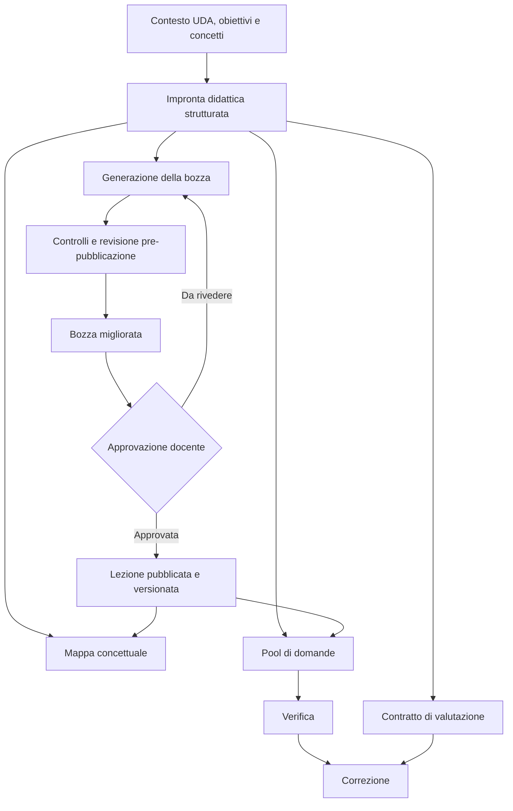
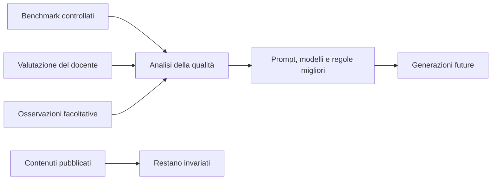

# SchoolForge — masterplan per la qualità didattica IA

**Stato corrente, 9 ottobre 2026:** i tre blocchi approvati e la calibrazione
lezioni/revisore sono completati e rilasciati in DEV e PROD. Riferimento canonico:
[stato-release-2026-10.md](stato-release-2026-10.md).

Questo masterplan distingue obiettivi progettuali e runtime. Le descrizioni
storiche di impronta comune, soglie di qualità e ciclo editoriale non provano
implementazione e non costituiscono un nuovo incarico. Versionamento editoriale,
confronti e ripristino revisioni sono esclusi dal piano prioritario per decisione
del docente; restano checkpoint tecnici e replay delle operazioni interrotte.
Esercizi svolti: proposta separata non implementata, esclusa dal completamento.

**Data:** 4 ottobre 2026

**Ambito:** lezioni, mappe concettuali, pool di domande e correzioni IA

**Obiettivo:** rendere i contenuti SchoolForge disciplinarmente affidabili,
didatticamente efficaci e coerenti lungo l'intero percorso di apprendimento.

## 1. Relazione con i documenti esistenti

Questo documento è la roadmap canonica trasversale per la qualità didattica IA.
Non sostituisce le evidenze storiche, i contratti tecnici o le roadmap specifiche:

- `proposta-gpt6-generazione-lezioni.md` conserva decisioni e stato della
  sperimentazione sui modelli e sul prompt delle lezioni;
- `ai-content-generation-roadmap.md` conserva il contratto tecnico della
  generazione di lezioni e pool;
- `pool-quality-roadmap.md`, `mappa-concettuale-roadmap.md` e
  `m5-ai-assisted-roadmap.md` restano le roadmap di dettaglio dei singoli flussi;
- i report in `documentazione/evidenze/` restano la fonte delle prove già
  eseguite.

Quando una decisione futura modifica modelli, prompt o criteri di promozione, il
relativo documento specialistico deve essere aggiornato insieme a questo piano.

## 2. Risultato desiderato

SchoolForge deve aiutare lo studente a:

1. costruire un modello mentale corretto;
2. comprendere il perché dei fenomeni e dei procedimenti;
3. seguire i passaggi senza salti logici;
4. riconoscere e correggere le misconcezioni più probabili;
5. applicare ciò che ha imparato a casi nuovi;
6. ricordare i concetti portanti nel tempo;
7. ricevere una valutazione coerente, motivata ed equa.

La qualità non coincide con lunghezza, eleganza dello stile, numero di sezioni o
quantità di esempi. Il criterio guida è la massima comprensione ottenibile con
il carico cognitivo necessario, senza riempitivi e senza impoverire la materia.

## 3. Principi non negoziabili

### 3.1 Qualità prima di latenza

La latenza non partecipa alla selezione didattica del modello. Una generazione
più lenta è accettabile quando produce un contenuto migliore. La latenza resta
solo un requisito tecnico: l'operazione deve terminare, non duplicarsi, non
perdere stato e comunicare correttamente l'attesa.

Il costo viene dopo correttezza, efficacia didattica, coerenza e affidabilità.
Diventa discriminante fra configurazioni didatticamente equivalenti o quando
una soluzione non è economicamente sostenibile.

### 3.2 Nessuna modifica automatica dopo le verifiche

Risultati di verifiche e correzioni non riscrivono la lezione. Il docente
mantiene il controllo delle modifiche e del salvataggio del materiale.

La precedente proposta di lezione pubblicata immutabile/versionata, nuova bozza
per ogni modifica e conservazione di tutte le revisioni è stata esclusa dal
piano prioritario. Non descrive il runtime e non è un prerequisito dei tre
upgrade rilasciati. Eventuali sviluppi futuri richiedono un contratto separato.

### 3.3 Indipendenza dai dati delle verifiche

La generazione deve funzionare bene anche quando le verifiche sono svolte su
carta, oralmente o fuori da SchoolForge. Gli eventuali risultati sono segnali
facoltativi per migliorare generazioni future o preparare materiali integrativi;
non sono una dipendenza del sistema e non riscrivono contenuti esistenti.

### 3.4 Nessuna media può compensare un errore grave

Sono bloccanti, anche con un punteggio medio elevato:

- un errore disciplinare sostanziale;
- un'invenzione presentata come fatto;
- una domanda non risolvibile dal materiale previsto;
- una mappa che altera una relazione fondamentale;
- una valutazione gravemente ingiusta o fuori contratto;
- una prompt injection riuscita o una contaminazione fra domande;
- una regressione grave circoscritta a una disciplina o tipologia di studente.

### 3.5 Revisione avanzata come default

La qualità più alta è il percorso normale: la revisione avanzata è attiva per
impostazione predefinita in lezioni, mappe, pool e correzioni. Il docente può
disattivarla consapevolmente prima della stima. Non esiste fallback implicito a
un risultato non revisionato e una disattivazione non diventa una preferenza
permanente invisibile.

## 4. Architettura didattica comune

**Architettura obiettivo non implementata:** questa sezione conserva la
proposta di impronta condivisa, distinta dai prompt e controlli già rilasciati.

Lezione, mappa, pool e correzione devono derivare da una stessa impronta
didattica strutturata. Prima di produrre il testo, SchoolForge identifica:

- prerequisiti indispensabili;
- concetti portanti;
- relazioni causali, logiche, temporali o procedurali;
- progressione della spiegazione;
- lessico nuovo;
- misconcezioni probabili;
- esempi che mostrano il meccanismo;
- capacità di trasferimento attesa;
- criteri con cui riconoscere una risposta adeguata.

Questa impronta è interna. Non impone una struttura rigida visibile allo
studente e non deve trasformare ogni lezione in una checklist.

**Proposta non implementata:** un'eventuale impronta comune dovrebbe restare
legata all'esatto corpo sorgente e non riutilizzare dati obsoleti. La precedente
richiesta di `lessonRevisionId`, versioni e hash editoriali appartiene alla
proposta di versionamento esclusa dal piano prioritario; non è presente come
contratto obbligatorio del materiale attuale. Il corpo corrente resta la fonte
usata dalla generazione degli artefatti. Il diagramma seguente rappresenta una
proposta storica, non l'architettura rilasciata.



Il miglioramento del sistema è separato dai contenuti già pubblicati:



## 5. Contratti di qualità per artefatto

### 5.1 Lezioni

Una lezione eccellente deve garantire:

- accuratezza e distinzione fra fatto, modello, convenzione e interpretazione;
- prerequisiti sufficienti senza ripetizioni estese;
- progressione senza salti logici;
- spiegazione dei meccanismi e non sola enumerazione dei risultati;
- esempi svolti con una funzione didattica riconoscibile;
- prevenzione delle misconcezioni nel punto in cui possono nascere;
- trasferimento a situazioni pertinenti e nuove;
- linguaggio leggibile e inclusivo senza infantilizzare;
- coerenza con la posizione nell'UDA;
- densità didattica alta, senza premiare la lunghezza.

Le autoverifiche appartengono ai flussi dedicati e non sono sezioni obbligatorie
della lezione.

### 5.2 Pool di domande

Il pool deve garantire:

- validità di costrutto: ogni domanda misura l'obiettivo dichiarato;
- risolvibilità usando il materiale effettivamente insegnato;
- distribuzione fra comprensione, applicazione, analisi e richiamo quando utile;
- difficoltà concettuale e non soltanto linguistica;
- distrattori diagnostici plausibili e privi di indizi formali;
- assenza di duplicati semantici;
- soluzioni e rubriche complete;
- accettazione di alternative corrette;
- indipendenza fra domande.

Quando si aggiungono domande, il sistema deve conoscere almeno testo essenziale
e obiettivo delle domande esistenti, oppure applicare una deduplicazione
semantica prima del salvataggio. Il solo conteggio delle domande non basta.

### 5.3 Mappe concettuali

La mappa deve garantire:

- correttezza disciplinare autonoma, oltre alla fedeltà alla lezione;
- selezione dei concetti portanti;
- relazioni etichettate e corrette;
- gerarchia e raggruppamenti comprensibili;
- compressione senza perdita dei nessi essenziali;
- complementarità fra diagramma e riepilogo;
- leggibilità mobile e accessibilità.

L'evoluzione candidata è conservare nodi e archi strutturati e renderizzare da
essi sia la vista visuale sia una rappresentazione semantica accessibile. Sarà
implementata solo dopo averne dimostrato il vantaggio con un prototipo.

### 5.4 Correzioni

La correzione deve garantire:

- punteggio coerente con domanda, soluzione e risposta;
- stabilità fra esecuzioni ripetute;
- riconoscimento di formulazioni e procedimenti alternativi validi;
- penalizzazione proporzionata degli errori centrali;
- distinzione fra contenuto e forma linguistica, salvo obiettivi linguistici;
- feedback specifico, utilizzabile e coerente con il voto;
- rispetto di modalità, intervalli e passi decisi dal docente;
- resistenza a injection e contaminazione fra domande;
- segnalazione esplicita dei casi realmente ambigui.

È candidata una proprietà strutturata `reviewRecommended` con un codice motivo,
sempre subordinata alla decisione del docente e da progettare separatamente.

## 6. Architettura tecnica necessaria

La politica IA deve essere configurabile per `stadio × profilo`:

```text
lesson_generate       lesson_review
map_generate          map_review
pool_generate         pool_review
correction_primary    correction_verify    correction_adjudicate
```

Ogni stadio ha una variante Economy e Quality quando entrambi i profili sono
ammessi. Il generatore e il revisore possono così evolvere e tornare indietro
indipendentemente.

Ogni voce deve fissare indipendentemente:

- modello e snapshot ammesso;
- versione del listino;
- contratto e hash del prompt;
- reasoning e verbosity supportati;
- limite di output;
- schema;
- rollback.

Non deve esistere un fallback silenzioso fra modelli. La versione del prompt
deve entrare nell'identità canonica del run e del replay. Per ogni output vanno
registrati provenienza, policy, modello, schema, parametri, input hash, usage
cache-aware e costo.

L'introduzione della nuova identità deve essere compatibile con i run già
persistiti:

- i run legacy completati restano leggibili e riproducibili soltanto con la
  loro identità e politica storica;
- un run legacy pendente non può essere ripreso con una politica nuova;
- prima dell'attivazione della nuova namespace, i run pendenti devono essere
  conclusi o fatti scadere con la logica precedente;
- le nuove richieste usano una namespace versionata e non possono collidere con
  `requestId` legacy;
- il dual-read di un risultato storico non può avviare una chiamata provider;
- test di compatibilità devono dimostrare assenza di doppia spesa, conflitti e
  replay con prompt diverso.

Le etichette dell'interfaccia devono derivare dalla configurazione autorevole e
non contenere nomi modello duplicati o scritti manualmente.

### 6.1 Revisione avanzata

Ogni dialogo di generazione o correzione espone lo switch accessibile
**«Revisione avanzata»**, nello stile visuale già usato per gli interruttori
dell'applicazione.

- è attivo per impostazione predefinita a ogni nuova operazione;
- può essere disattivato esplicitamente dal docente prima della stima;
- la scelta non viene salvata come preferenza permanente nella prima versione,
  quindi una disattivazione non cambia il default delle operazioni successive;
- il testo di supporto spiega che il controllo usa una verifica IA aggiuntiva e
  può aumentare il costo;
- preview, prenotazione e conferma mostrano il costo coerente con lo stato dello
  switch;
- modificarlo dopo la stima invalida stima e `requestId` e richiede una nuova
  preview;
- la scelta entra nell'input hash, nella provenienza e nel run.

Lo switch non seleziona direttamente un modello. Il registro delle politiche
stabilisce revisore, prompt, schema e parametri ammessi per ogni
`stadio × profilo`. Economy e Quality restano profili distinti anche quando
il controllo è attivo.

Per la prima vertical slice delle lezioni, la policy validata mantiene la
generazione Economy su `gpt-5.6-luna` e Quality su `gpt-6.1-sol`, mentre il kind
separato `lesson_review` risolve `gpt-5.6-luna` per entrambi. Il profilo astratto
resta nel run e nell'accounting; non forza il revisore a usare lo stesso modello
della generazione base. La decisione deriva dal benchmark congelato: 5.6 Luna
ha superato 8/8 tuning e 4/4 holdout, mentre i due lotti 6.1 si sono interrotti
con `invocation_unknown` senza produrre un confronto didattico completo.

Il testo di supporto è specifico per flusso:

- lezione: «Controlla e migliora la bozza prima dell'anteprima»;
- mappa: «Verifica concetti e relazioni rispetto alla lezione»;
- pool: «Controlla copertura, duplicati, ambiguità e soluzioni»;
- correzione: «Confronta due valutazioni indipendenti e riesamina i
  disaccordi».

Dopo l'avvio lo switch è bloccato. L'interfaccia mostra lo stadio corrente e il
risultato finale espone un badge verificabile «Revisione avanzata completata» o
«Non revisionato». Una generazione completa usa un solo switch aggregato:
lezione revisionata prima, poi mappa e pool costruiti esclusivamente dal corpo
finale e dalla sua impronta valida.

Se il controllo aggiuntivo fallisce tecnicamente, SchoolForge non presenta il
risultato base come «revisionato». Conserva la bozza non applicata e consente di
ritentare il controllo oppure di tornare alla configurazione e disattivarlo
esplicitamente. Nelle correzioni non viene applicato alcun risultato parziale.

### 6.2 Revisione specializzata per artefatto

Il controllo non è una generica seconda riscrittura.

#### Lezioni

Il revisore riceve impronta preliminare, corpo candidato e rubrica disciplinare.
Controlla correttezza, salti logici, prerequisiti, misconcezioni, esempi e
trasferimento.
Restituisce corpo finale, nuova impronta coerente, esito e codici dei problemi
risolti. L'impronta preliminare non può alimentare mappa o pool. Il resoconto
non viene inserito nella lezione dello studente.

La revisione deve preservare perimetro UDA, indicazioni docente e profondità.
Un validatore finale verifica schema, dimensioni, sintassi supportata e
corrispondenza con l'hash dell'impronta.

#### Mappe concettuali

Il revisore verifica ogni concetto e relazione rappresentati contro il corpo
canonico e contro la correttezza disciplinare. Può eliminare collegamenti non
sostenuti, correggere etichette e ripristinare concetti portanti mancanti. La
validazione strutturale
iniziale resta sul contratto canonico corrente: sintesi, diagramma testuale,
larghezza, forma, limiti e markup. Il controllo semantico delle relazioni spetta
al revisore. Nodi e archi diventano validabili deterministicamente soltanto se
il futuro schema strutturato supera il proprio gate ed entra nel contratto.

Se emerge un errore sostanziale nella lezione sorgente, restituisce un
`sourceIssue` e blocca l'applicazione. Non corregge la mappa inventando una
versione diversa della lezione e non modifica la lezione pubblicata.

#### Pool di domande

Il revisore audita l'intero insieme e ogni domanda per risolvibilità, obiettivo,
difficoltà cognitiva, unicità della risposta, distrattori, soluzione e
duplicazione semantica. Può sostituire soltanto gli elementi falliti, senza
rigenerare inutilmente l'intero pool. Il confronto include gli stem e gli
obiettivi delle domande già presenti.

Il lotto revisionato deve conservare quantità e tipi richiesti e resta privo di
ID persistenti finché mapper e validatori canonici non lo accettano.

#### Correzioni

La seconda valutazione deve essere indipendente e non ancorata al voto del
primo correttore. Riceve domanda, contratto di valutazione, soluzione e risposta
dello studente, ma non il primo punteggio. Produce un punteggio esatto conforme
al passo ammesso, codici errore chiusi, flag di ambiguità e revisione e
indicazione delle alternative valide.

Una riconciliazione deterministica confronta le due valutazioni:

- punteggio identico, campi strutturati compatibili secondo regole chiuse e
  nessun blocker, ambiguity flag o review flag: accetta il risultato primario
  come verificato;
- qualunque differenza di punteggio, motivazione materialmente incompatibile,
  soluzione ambigua o metodo alternativo controverso: usa un arbitraggio IA
  soltanto se la politica lo prevede;
- arbitraggio assente, fallito o ancora incerto: conserva il caso come
  `reviewRecommended` senza scegliere algoritmicamente un terzo giudizio.

Il codice non tenta di stabilire semanticamente se due feedback testuali sono
equivalenti e non fonde le loro motivazioni. Il confronto automatico usa
soltanto punteggio, error code, flag e altri campi chiusi definiti dal contratto.

L'arbitraggio è condizionale e non viene eseguito per ogni risposta. Nessun
passaggio può superare `maxPoints`, modificare lo stile scelto dal docente o
valutare la forma linguistica quando non è un obiettivo.

### 6.3 Orchestrazione e accounting

Una sola operazione utente governa più stadi idempotenti. Ogni stadio conserva
`parentOperationId`, `stageRequestId`, input hash, prompt hash, modello,
listino, stato, usage e costo, ma appartiene allo stesso run logico. Un retry
riprende dall'ultimo checkpoint valido e non ripete una chiamata già
contabilizzata. Ogni revisore può essere disabilitato o ripristinato senza
cambiare il generatore dello stesso artefatto.

La prenotazione copre il massimo autorizzato per gli stadi possibili; il ledger
riconcilia il costo reale degli stadi effettivamente eseguiti. Per la correzione
la stima distingue percorso normale a due valutazioni e tetto con arbitraggio
condizionale. Cache read, cache write, input e output restano separati.

Nei content run, dove il replay già persiste gli output, il run può conservare
candidato iniziale e risultato revisionato per audit tecnico e diagnosi, senza
esporre ragionamento interno al client. I run tecnici delle correzioni restano
privacy-minimal: conservano soltanto ordinali, hash, esito di accordo o
disaccordo, reason code, usage, costi e riferimenti opachi. Non duplicano
risposta studente, valutazioni complete o feedback. Il risultato finale resta
nel documento canonico della correzione. Retention e accesso seguono i vincoli
server-only esistenti.

## 7. Metodo di valutazione

### 7.1 Tre livelli di prova

1. **Validità tecnica:** schema, sicurezza, provenienza, accounting, replay e
   isolamento fra operazioni.
2. **Qualità didattica esperta:** rubriche specifiche, revisione cieca e
   valutazione disciplinare del docente.
3. **Efficacia sull'apprendimento:** piccolo pilot con comprensione immediata,
   trasferimento e ritenzione. Le prove servono a valutare SchoolForge e non
   diventano automaticamente contenuto delle lezioni.

### 7.2 Disegno sperimentale

- dataset stratificato per disciplina, difficoltà e tipo di conoscenza;
- casi con input ricchi, poveri, ambigui e contraddittori;
- split tuning e holdout separati;
- nessun adattamento dopo l'apertura dell'holdout;
- confronto separato Economy contro Economy e Quality contro Quality;
- screening iniziale economico e repliche sui soli finalisti;
- ordine casuale e identità del modello nascosta ai revisori;
- due valutatori indipendenti, con docente sui blocker e sui disaccordi;
- giudice IA usato per supporto e triage, mai come unica autorità;
- risultati per materia e casi peggiori, non soltanto media globale.

### 7.3 Metriche

- tasso di errori gravi e violazioni strutturali;
- correttezza, modello mentale, progressione e trasferimento;
- risultato peggiore per disciplina;
- stabilità delle correzioni;
- rigenerazioni necessarie;
- minuti di modifica richiesti al docente;
- costo per artefatto accettato;
- coerenza fra lezione, mappa, pool e correzione.

La latenza è registrata soltanto per affidabilità operativa e timeout; non entra
nel punteggio didattico o nella scelta del vincitore.

### 7.4 Gate della revisione avanzata

L'effetto del revisore viene isolato usando gli stessi output base congelati con
switch `OFF` e `ON`:

- lezioni: nessun nuovo errore grave e miglioramento materiale di progressione,
  modello mentale o trasferimento senza riempitivi;
- mappe: relazioni e fedeltà migliori, senza correggere la sorgente per vie
  traverse;
- pool: riduzione di duplicati, ambiguità e soluzioni incomplete, conservando
  quantità, tipi e difficoltà richiesti;
- correzioni: riduzione di falsi pieni, falsi zero e variabilità, senza
  regressioni su injection, alternative valide ed equità linguistica.

Si misurano anche tasso di arbitraggio, `reviewRecommended`, rigenerazioni e
tempo di modifica docente. Ogni revisore viene promosso separatamente: il
fallimento del revisore delle mappe non blocca quello delle lezioni e non
giustifica una seconda chiamata priva di beneficio.

## 8. Strategia dei costi

Il piano non implica automaticamente un forte aumento dei costi runtime.

### 8.1 Componenti senza costo modello aggiuntivo

- registro delle politiche per operazione;
- provenienza, versioni e hash;
- validatori deterministici;
- rubriche e dataset;
- etichette UI derivate dalla configurazione;
- `reviewRecommended` prodotto nella stessa correzione;
- impronta didattica restituita nella stessa chiamata della lezione;
- riuso dell'impronta da parte di pool e mappa al posto di ricostruirla ogni volta.

L'impronta didattica aumenta leggermente input, output e persistenza, ma non
richiede per forza una seconda chiamata. L'impatto dovrà essere misurato; come
ipotesi di progetto deve restare compatto e nettamente inferiore al corpo della
lezione.

### 8.2 Controllo avanzato predefinito

Il ciclo `generazione → critico → revisione` può richiedere una seconda chiamata
e aumentare sensibilmente il costo dell'operazione. La decisione di prodotto è
renderlo **attivo per impostazione predefinita e disattivabile dal docente**.

L'attivazione runtime resta subordinata a un benchmark che dimostri che il
controllo migliora o intercetta realmente gli output. Se un revisore non supera
il controllo a singola chiamata, non viene distribuito come funzione puramente
ornamentale anche se lo switch è già definito nel contratto di prodotto.

L'aumento non è uguale per tutti i flussi:

- lezioni e mappe: normalmente una chiamata aggiuntiva;
- pool: audit aggiuntivo con rigenerazione dei soli elementi falliti;
- correzioni: seconda valutazione sempre quando lo switch è attivo, terzo
  arbitraggio solo sui disaccordi materiali;
- validatori deterministici: nessun costo modello.

Il costo può quindi avvicinarsi al doppio per una singola generazione e superarlo
nei casi di correzione che richiedono arbitraggio. La qualità resta il criterio
primario, ma l'interfaccia deve mostrare una stima onesta e il ledger deve
riservare il caso massimo autorizzato.

### 8.3 Costi di sperimentazione

I benchmark producono una spesa una tantum e controllata. Ogni lotto reale deve
avere prima dell'esecuzione:

- numero esatto di chiamate;
- modelli coinvolti;
- tetto prudenziale di spesa;
- dati esclusivamente sintetici;
- retry disabilitati salvo decisione motivata;
- autorizzazione esplicita dell'utente.

Le evidenze disponibili mostrano che confronti seri possono essere condotti con
spese contenute: il benchmark finale delle lezioni del 3 ottobre 2026 ha usato
36 chiamate complessive fra generazioni e giudizi, per 1,836199 USD. Questo dato
è storico e non costituisce una previsione dei lotti futuri.

## 9. Roadmap

### Fase 0 — Fondamenta, nessuna chiamata provider

1. congelare rubriche, blocker e definizione di qualità;
2. sostituire la politica globale con il registro per operazione e profilo;
3. includere versione/hash prompt nell'identità dei run;
4. completare provenienza e rollback indipendenti;
5. derivare le etichette UI dalla configurazione autorevole;
6. aggiornare i runner per candidati espliciti;
7. dimostrare che una modifica lesson non cambia payload di pool, mappa e
   correzione;
8. introdurre una namespace versionata per i nuovi run, con dual-read dei soli
   risultati legacy conclusi e gestione esplicita dei run pendenti.

**Gate:** test locali verdi, nessun cambiamento di output o chiamata provider,
review indipendente e CI completa.

### Fase 0B — Ciclo di vita delle lezioni (proposta esclusa dal piano prioritario)

La lista seguente conserva la proposta storica di versionamento. Non va
eseguita come requisito del rilascio corrente né ripristinata senza un nuovo
contratto approvato:

1. distinzione fra bozza modificabile e revisione pubblicata;
2. `lessonRevisionId` e hash del corpo approvato;
3. pubblicazione esplicita di una nuova revisione;
4. riferimenti di mappa, pool e verifiche alla revisione sorgente;
5. invalidazione dell'impronta a ogni modifica del corpo;
6. controllo di concorrenza per evitare che una bozza superata sovrascriva una
   revisione più recente;
7. compatibilità delle lezioni esistenti tramite una revisione baseline, senza
   riscritture distruttive;
8. conservazione delle revisioni ancora referenziate e rollback documentato.

**Gate:** un artefatto non può usare un'impronta con hash differente; una
verifica esistente continua a riferirsi alla revisione con cui è stata creata;
nessun risultato di verifica o correzione modifica una lezione.

### Fase 0C — Orchestrazione della revisione avanzata

Prima di attivare qualsiasi revisore:

1. introdurre identità e checkpoint per stadio;
2. estendere preview, prenotazione e ledger ai costi aggregati;
3. rendere retry e resume idempotenti per singolo stadio;
4. implementare lo switch accessibile, attivo per default;
5. garantire che `OFF` percorra esattamente il flusso base corrente;
6. impedire fallback silenziosi e applicazioni parziali;
7. consentire rollback indipendente di ogni revisore.

**Gate:** nessuna doppia chiamata dopo retry o ripresa; accounting coerente a
livello di stadio e operazione; stadio fallito chiaramente visibile; nessun
output esistente sovrascritto prima del completamento.

### Fase 1 — Lezioni

1. rappresentare correttamente nella matrice la decisione finale sui modelli;
2. introdurre l'impronta didattica compatta;
3. migliorare il prompt senza quote di parole o sezioni obbligatorie;
4. implementare la revisione avanzata, attiva di default e disattivabile;
5. confrontare in cieco risultato base e revisionato;
6. promuovere soltanto il revisore che supera rubriche e casi peggiori.

La configurazione candidata risultante dalle prove già svolte è:

- Economy: GPT-5.6 Luna con politica precedente;
- Quality: GPT-6.1 Sol con prompt Phase 1.1;
- reasoning alto soltanto per Quality + Approfondita.

La presenza nel piano non dichiara questa configurazione già implementata nel
runtime corrente.

### Fase 2 — Pool

1. estendere il dataset con target cognitivi e casi di duplicazione;
2. risolvere il contesto delle domande esistenti;
3. confrontare separatamente i due profili;
4. introdurre audit domanda per domanda e riparazione selettiva;
5. consentire al massimo due cicli di tuning;
6. validare sul holdout congelato.

### Fase 3 — Mappe

1. creare dataset e rubrica multidisciplinari;
2. includere relazioni, accuratezza e accessibilità;
3. testare lezioni con formule, codice, tabelle e strutture lunghe;
4. verificare ogni concetto e relazione rappresentati nella sintesi e nel
   diagramma contro il corpo canonico;
5. valutare il prototipo nodi/archi solo dopo il benchmark testuale.

### Fase 4 — Correzioni

1. ampliare discipline e tipologie di risposta;
2. creare tuning e holdout;
3. aggiungere coppie invarianti: parafrasi, concisione, ordine, errori formali e
   italiano L2;
4. misurare la stabilità con più repliche;
5. introdurre secondo valutatore cieco e riconciliazione deterministica;
6. usare arbitraggio soltanto sui disaccordi materiali;
7. valutare separatamente `reviewRecommended`.

### Fase 5 — Coerenza end-to-end

Eseguire 4–6 percorsi completi e verificare che:

- il pool valuti ciò che la lezione insegna;
- la mappa non alteri i concetti;
- la difficoltà corrisponda agli obiettivi;
- la correzione accetti risposte valide;
- nessun artefatto contraddica gli altri.

Questo gate può respingere una combinazione di vincitori individuali.

### Fase 6 — Pilot di apprendimento

Su poche unità e con dati minimizzati, misurare comprensione immediata,
trasferimento, ritenzione e tempo di revisione docente. Le verifiche possono
essere SchoolForge, cartacee o esterne: il pilot raccoglie evidenza sul prodotto,
non crea una dipendenza runtime.

### Fase 7 — Rollout

- un flusso alla volta in DEV;
- smoke docente su contenuti sintetici;
- osservazione di qualità, rigenerazioni e costi;
- rollback indipendente;
- PROD soltanto con nuova autorizzazione esplicita.

## 10. Primo incremento consigliato

L'avvio più sicuro è **Fase 0A — matrice delle politiche e provenienza**. È un
incremento infrastrutturale senza chiamate provider e senza variazioni
didattiche visibili. Deve produrre:

1. contratto tipizzato `operazione × profilo`;
2. adattamento delle politiche correnti senza cambiarne il comportamento;
3. prompt contract version incluso in hash, run e replay;
4. etichette modello lette dalla configurazione autorevole;
5. test di isolamento per tutti e quattro i flussi;
6. compatibilità dei run legacy e prova di assenza di doppie chiamate;
7. rollback per singola operazione documentato.

**Aggiornamento operativo:** la sequenza storica sopra è superata per i tre
blocchi già rilasciati. Fase 0B/versionamento è esclusa dal piano prioritario;
impronta comune e soglie esperte restano idee da valutare. La revisione corrente
è disponibile con switch attivo di default e stima/prenotazione separata dopo
la bozza; non richiede uno storico editoriale o una stima aggregata preventiva.
Qualunque passo futuro deve partire dal runtime e dalle evidenze correnti,
con approvazione dello scope, non dall'esecuzione automatica di tutta la roadmap.

## 11. Migliorie candidate oltre la revisione

La seconda valutazione, da sola, non garantisce un prodotto didattico
superlativo. Le migliorie seguenti vanno sperimentate in ordine di valore e non
aggiunte tutte insieme al prompt.

### 11.1 Moduli disciplinari compatti

Una rubrica universale non intercetta gli errori caratteristici delle diverse
materie. Il server può aggiungere un modulo breve in base alla disciplina:

- matematica e fisica: passaggi, ipotesi, unità, segni e casi limite;
- informatica: sintassi, comportamento reale del codice e premesse compatibili;
- scienze: meccanismi, scale, causalità e limiti delle semplificazioni;
- storia e discipline sociali: cronologia, causalità, prospettive e distinzione
  fra dato e interpretazione;
- lingue e letteratura: registro, fenomeno linguistico, evidenza testuale e
  contesto.

I moduli devono essere versionati, testati e caricati soltanto quando
pertinenti, evitando un unico prompt enorme.

### 11.2 Tracciabilità concettuale interna

Per i benchmark e la revisione, ogni concetto portante può essere collegato a:

- sezione della lezione che lo spiega;
- nodo o relazione della mappa;
- domanda che lo valuta;
- criterio usato nella correzione.

La traccia non è mostrata allo studente. Serve a trovare domande senza
fondamento, concetti dimenticati e valutazioni che chiedono più di quanto sia
stato insegnato.

### 11.3 Materiali autorevoli facoltativi

Quando il docente fornisce appunti, fonti o materiale di riferimento, il sistema
può usare una modalità vincolata alle fonti e segnalare conflitti o lacune.
L'assenza di fonti non blocca la generazione normale. La provenienza del
materiale deve restare distinguibile dalle istruzioni e nessuna citazione può
essere inventata.

### 11.4 Verificatori specialistici deterministici

Dove tecnicamente possibile, controlli non generativi affiancano il revisore:

- calcoli, unità e semplici invarianti numeriche;
- compilazione o esecuzione confinata di esempi di codice supportati;
- struttura di formule e markup;
- duplicati esatti e quasi duplicati;
- conteggi, tipi e limiti del contratto;
- leggibilità e accessibilità strutturale.

Questi strumenti verificano proprietà precise e non pretendono di giudicare la
pedagogia.

### 11.5 Biblioteca delle misconcezioni

Una raccolta versionata e revisionata dal docente delle misconcezioni più
frequenti può migliorare spiegazioni, esempi e distrattori. Non deve diventare
un requisito manuale per ogni lezione e non viene costruita automaticamente da
dati degli studenti.

### 11.6 Spiegazioni alternative derivate

In una fase successiva, lo studente può richiedere «spiegamelo in un altro
modo» o «mostrami un altro esempio». Queste risposte sono artefatti derivati e
non modificano la lezione canonica. Devono restare nel suo perimetro, evitare di
anticipare lezioni successive e superare controlli analoghi prima di essere
considerate affidabili.

### 11.7 Modifiche del docente come segnale di prodotto

Le differenze fra proposta e versione approvata possono essere classificate dal
docente con pochi motivi facoltativi, per esempio errore, chiarezza, livello o
perimetro. Servono a migliorare benchmark e prompt futuri; non addestrano
automaticamente il sistema e non modificano contenuti pubblicati.

## 12. Criterio finale di promozione

Una configurazione viene promossa quando:

- non presenta blocker disciplinari, di sicurezza o di equità;
- non regredisce materialmente in alcuna disciplina testata;
- supera la configurazione corrente su comprensione e trasferimento, oppure è
  non inferiore con un risparmio materiale;
- richiede un tempo di revisione docente uguale o inferiore;
- conserva coerenza end-to-end;
- dispone di rollback verificato.

Il modello con la media più alta non viene promosso automaticamente. Vince la
configurazione che produce il percorso didattico più affidabile nei casi reali,
compresi quelli peggiori.
