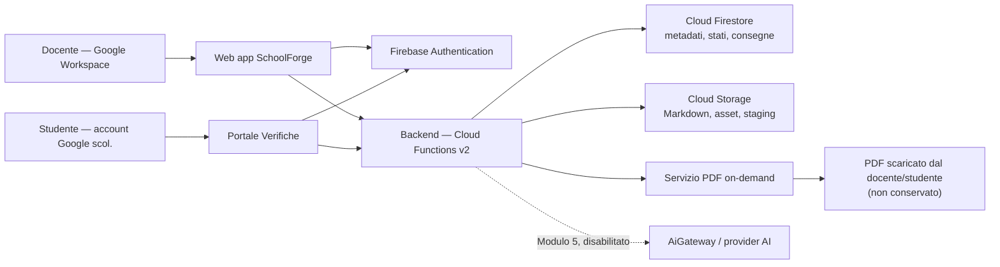
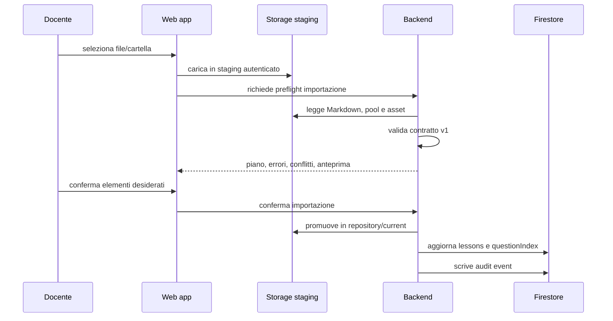
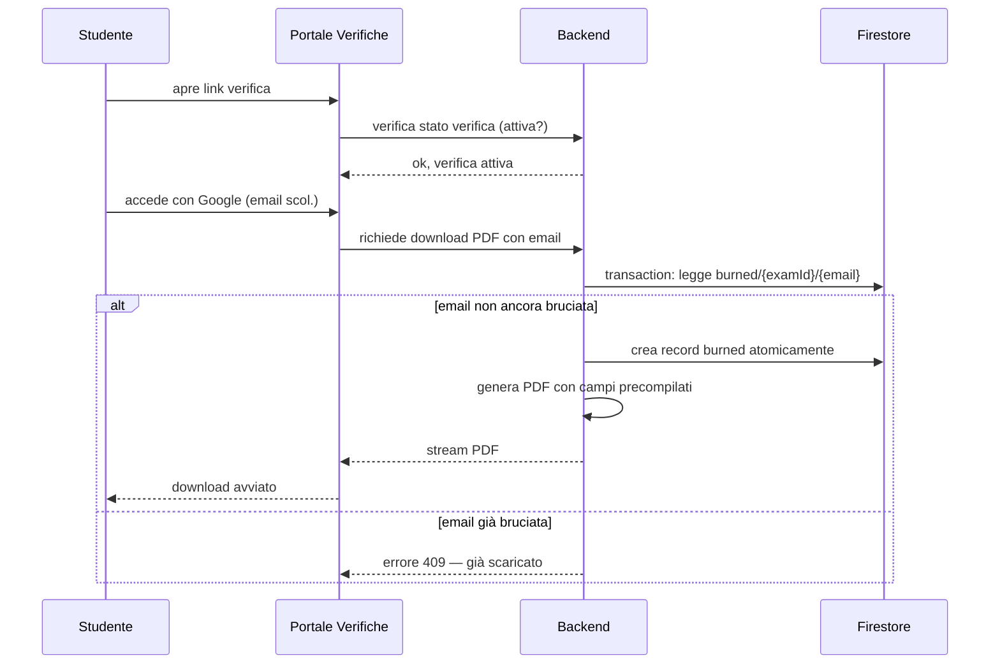

# SchoolForge — Architettura di sistema

**Versione:** 2.0
**Data:** 24 giugno 2026
**Stato:** architettura target per l'implementazione
**Input vincolante:** [Analisi dei requisiti v2.0](analisi-requisiti.md)
**Destinatario:** team di implementazione e responsabile di esercizio

---

## 1. Obiettivo e perimetro architetturale

Questo documento definisce la soluzione tecnica di SchoolForge. Traduce i requisiti in componenti, confini, dati, flussi e decisioni implementative. È intenzionalmente una soluzione **minimale, modulare e gestita**: un'applicazione web per un solo docente, un backend serverless, un portale studenti leggero e servizi Firebase.

L'architettura non introduce LMS, Google Forms, Google Drive, sincronizzazione automatica, versioni delle lezioni, varianti della stessa verifica o rubriche di correzione. Il sistema conserva il Markdown come conoscenza portabile; i PDF di verifica sono generati su richiesta e mai conservati.

### 1.1 Esito atteso

Al termine dell'implementazione il docente deve poter:

1. accedere con il proprio account Google Workspace for Education;
2. caricare, validare, consultare ed esportare lezioni e pool di domande Markdown;
3. comporre una verifica da lezioni/UDA selezionate e scaricare il PDF della versione docente;
4. distribuire agli studenti un link al Portale Verifiche per lo svolgimento digitale;
5. scaricare le risposte, correggere manualmente e registrare punteggi e percentuali;
6. esportare il programma svolto come file di testo per il deposito scolastico;
7. aggiungere in seguito AI per generazione e correzione senza alterare i flussi manuali.

## 2. Principi architetturali

| Principio | Decisione concreta |
|---|---|
| Markdown-first | I file `.md` originali e gli asset sono archiviati in Cloud Storage ed esportabili. Firestore contiene solo indice, stati e dati operativi. |
| Semplicità operativa | Un frontend docente, un portale studenti leggero, un backend serverless modulare, un database documentale e uno storage a oggetti. Nessun cluster, container, broker o microservizio. |
| Un solo docente | Tutte le risorse sono protette da un unico proprietario Google configurato. Non vengono progettati tenant, organizzazioni, ruoli o condivisione. |
| Backend autorevole | Le scritture con regole di business passano dal backend. Il browser non può pubblicare verifiche, scrivere audit, esporre soluzioni o gestire credenziali esterne direttamente. |
| PDF su richiesta, mai conservato | Il PDF è un artefatto temporaneo generato dal backend e scaricato immediatamente. Non viene scritto su Cloud Storage né su Drive dopo il download. |
| Studenti senza account | Gli studenti accedono al Portale Verifiche con il link della verifica e la propria email Google scolastica. Non hanno un account SchoolForge. Il record studente è creato in modo lazy al primo accesso al portale. |
| Email bruciata | Un Firestore transaction atomica garantisce che ogni email possa scaricare il PDF di una verifica una sola volta. Il docente non ha questo limite. |
| AI opzionale | L'AI è un adattatore disabilitato per default. I moduli 1–4 non hanno dipendenze runtime da un provider AI. |
| Sicurezza per difetto | Accesso del solo docente alla web app, autenticazione Google per il portale studenti, token esterni in Secret Manager, audit append-only e minimizzazione dei dati fuori dall'applicazione. |

## 3. Decisioni architetturali

### ADR-01 — Firebase su piano Spark come piattaforma

**Decisione.** SchoolForge usa Firebase: Firebase Hosting, Firebase Authentication, Cloud Firestore, Cloud Storage e Cloud Functions v2. Secret Manager e Cloud Logging sono aggiunti su piano Blaze (pay-as-you-go) solo se necessario per il go-live; per lo sviluppo locale si usa Firebase Emulator Suite.

**Motivazione.** L'uso obbligatorio di Google Workspace for Education rende naturale l'ecosistema Firebase. Il piano Spark è gratuito e sufficiente per un singolo docente. La piattaforma gestita riduce al minimo gestione di server, certificati e scalabilità.

**Alternative valutate e scartate.**

| Alternativa | Perché scartata |
|---|---|
| Backend tradizionale (VM/container) + Postgres | Costo operativo e di manutenzione ingiustificato per un singolo docente; nessuno scale-to-zero; gestione certificati/patch a carico nostro. |
| Supabase / altro BaaS | Sposterebbe l'identità fuori dall'ecosistema Google, mentre Google Workspace for Education è un prerequisito non negoziabile: l'autenticazione del docente e degli studenti è già lì. |
| Firebase su piano Blaze fin da subito | Non necessario per un singolo docente in V1; Spark + Emulator Suite copre sviluppo e go-live iniziale. Si passa a Blaze solo se Secret Manager/Logging lo richiedono. |

La scelta di Firebase non è un'assunzione: deriva dal vincolo Education e dal profilo d'uso (un docente, volumi bassi, nessun server da presidiare).

**Conseguenza.** Il progetto è TypeScript end-to-end. Non sono previsti Kubernetes, VM permanenti, Cloud SQL, code di messaggi o infrastruttura multi-account nella V1.

### ADR-02 — Monolite modulare serverless, non microservizi

**Decisione.** Il backend è un unico progetto Cloud Functions con moduli di dominio interni. Ogni funzione pubblica chiama servizi applicativi e repository condivisi, non altri servizi distribuiti.

**Motivazione.** I confini funzionali sono chiari, ma il volume e il numero di utenti non giustificano costi operativi di microservizi. I moduli restano separati nel codice.

### ADR-03 — Storage separato per conoscenza e metadati; nessun Drive

**Decisione.**

- Cloud Storage conserva Markdown originali, asset e file temporanei di staging.
- Firestore conserva indice, stati, relazioni, configurazioni verifiche, consegne, correzioni e audit.
- Google Drive non è utilizzato in nessuna forma: né per storage PDF né per link/ID archiviati.

**Motivazione.** Il PDF è usa-e-getta. Il docente lo scarica, lo usa, fine. Conservare link Drive aggiungerebbe dipendenze, token, scope e complessità senza valore.

### ADR-04 — Verifica come configurazione immutabile; PDF on-demand

**Decisione.** Non esistono versioni o varianti della verifica né revisioni storiche delle lezioni. Una verifica passa da bozza ad attiva una sola volta. Al momento dell'attivazione il backend congela la configurazione (domande, soluzioni, punteggi) in Firestore. Il PDF è generato su richiesta e scaricato; non viene scritto su nessuno storage permanente.

**Motivazione.** La verifica deve rimanere leggibile e correggibile anche se il docente riscrive o elimina una lezione. La generazione on-demand elimina il bisogno di archiviazione e link Drive.

### ADR-05 — Portale Verifiche come app separata

**Decisione.** Il Portale Verifiche è una seconda applicazione React (o framework leggero) deployata su un URL diverso (es. `portale.schoolforge.app`). Gli studenti vi accedono con il link della verifica e autenticazione Google scolastica. Non condivide route, stato globale o autenticazione con la web app docente.

**Motivazione.** Separare il portale isola la superficie d'attacco, semplifica il fullscreen-mode durante la prova e chiarisce i confini di ruolo: il docente gestisce, lo studente svolge.

### ADR-06 — Email bruciata con transazione Firestore

**Decisione.** Il download del PDF da parte di uno studente è protetto da una transazione Firestore che verifica assenza di un record `burned/{examId}/{email}` e lo crea atomicamente prima di servire il PDF. Se il record esiste, il download è rifiutato. Il docente non è soggetto a questo meccanismo.

**Motivazione.** Garantisce un solo download per studente per verifica senza race condition, senza dipendere da lock applicativi o sessioni.

### ADR-07 — AI dietro un adattatore chiuso

**Decisione.** Ogni chiamata AI passa da `AiGateway`. Il gateway riceve un pacchetto di contesto costruito dal backend (lezione + pool + risposta studente), non espone browsing, tool esterni o retrieval e registra provenienza. Il provider concreto resta non selezionato fino alla decisione C-02.

**Motivazione.** Il vincolo "solo dalle lezioni selezionate" va applicato dal sistema, non affidato a una semplice istruzione testuale del modello.

## 4. Architettura logica



### 4.1 Confini di responsabilità

| Componente | Responsabilità | Non deve fare |
|---|---|---|
| Web app (docente) | Interfaccia docente, rendering sicuro, anteprime, richieste al backend, conferme esplicite | Applicare transizioni di stato, pubblicare verifiche, inviare prompt AI direttamente, conservare PDF |
| Portale Verifiche (studente) | Link verifica, autenticazione Google, email bruciata, download PDF, invio risposte digitali | Accedere a dati di altri studenti, aggirare l'email bruciata, mostrare soluzioni |
| Backend | Autorizzazione, regole di business, transazioni, audit, import/export, PDF, email bruciata | Renderizzare UI, conservare Markdown come unico dato proprietario, esporre soluzioni nel rendering |
| Cloud Storage | Originali Markdown, asset e staging temporaneo | Indice relazionale, stati, PDF persistenti |
| Firestore | Indice, relazioni, configurazioni verifiche, consegne, punteggi, percentuali, audit, email bruciate | Sostituire file Markdown/asset come fonte canonica delle lezioni |
| AiGateway | Generazione/correzione opzionale con contesto chiuso | Browser, RAG web, pubblicazione, cancellazione o decisioni irreversibili |

## 5. Architettura fisica e runtime

### 5.1 Servizi gestiti

| Livello | Servizio | Note |
|---|---|---|
| Frontend docente | Firebase Hosting | SPA React, HTTPS gestito, cache per asset con hash |
| Frontend studenti | Firebase Hosting (seconda app) | React o framework leggero, URL separato, fullscreen exam mode |
| Identità | Firebase Authentication con Google | Account proprietario/dominio Education consentito; studenti autenticati con email Google scolastica |
| API e job | Cloud Functions v2, TypeScript | Endpoint autenticati, timeout configurati, nessuna funzione pubblica anonima |
| Metadati | Cloud Firestore | Modalità nativa, indici espliciti per filtri dello storico |
| File | Cloud Storage | Bucket privato, accesso solo al proprietario e al service account backend |
| Segreti | Secret Manager | Credenziali AI future; token backend; mai nel client o in Firestore |
| Osservabilità | Cloud Logging | Errori strutturati, durata operazioni, esclusione di testo risposte/PDF |

### 5.2 Ambienti

| Ambiente | Uso | Dati |
|---|---|---|
| `dev` | sviluppo locale e Firebase Emulator Suite | dati sintetici; nessun token o studente reale |
| `test` | test di integrazione e collaudo portale | account e dati di prova separati |
| `prod` | docente reale | solo dati operativi autorizzati |

`dev` e `prod` devono usare progetti Firebase distinti.

## 6. Struttura del codice e toolchain

```text
SchoolForge/
├─ apps/
│  ├─ web/                       # SPA React + TypeScript (Vite) — docente
│  └─ portale/                   # App React leggera — studenti
├─ functions/
│  └─ src/
│     ├─ api/                    # handler HTTP/callable sottili
│     ├─ domain/                 # programmi, uda, lezioni, verifiche, correzione
│     ├─ services/               # PDF, audit, autorizzazione, import/export, email-bruciata
│     └─ repositories/           # Firestore e Storage
├─ packages/
│  └─ lesson-contract/           # parser, validatore e tipi Markdown condivisi
├─ documentazione/
│  ├─ diagrammi/
│  └─ ...
├─ firestore.rules
├─ storage.rules
├─ firestore.indexes.json
├─ firebase.json
├─ pnpm-workspace.yaml
└─ package.json
```

### 6.1 Toolchain

| Strumento | Versione | Scopo |
|---|---|---|
| **pnpm workspaces** | 9.x | Gestione monorepo |
| **TypeScript** | 5.x | Linguaggio end-to-end; strict mode su tutti i package |
| **Vite** | 5.x | Build e dev server delle web app |
| **ESLint** | 9.x | Linting con `eslint-plugin-security` |
| **Vitest** | 2.x | Test unitari e di integrazione; compatibile con Firebase Emulator Suite |
| **Playwright** | 1.45.x | Test end-to-end su browser headless |
| **Firebase Emulator Suite** | ultima stabile | Sviluppo locale senza dipendenza da cloud reali |
| **Zod** | 3.x | Validazione runtime dei payload API e output AI |

### 6.2 Workspace pnpm

```yaml
# pnpm-workspace.yaml
packages:
  - 'apps/*'
  - 'functions'
  - 'packages/*'
```

### 6.3 Pacchetto `lesson-contract`

Il pacchetto `lesson-contract` è condiviso tra web app, portale e backend. Evita che browser e server interpretino il front matter, i file UDA.md o i pool `.pool.md` in modo diverso. Il backend resta l'autorità finale: una lezione è utilizzabile soltanto dopo la sua validazione lato server.

Il pacchetto esporta:
- `parseUda(source: string): UdaParseResult`
- `parseLessonMarkdown(source: string): LessonParseResult`
- `parsePoolMarkdown(source: string): PoolParseResult`
- Tipi TypeScript (`Uda`, `Lesson`, `PoolQuestion`, `ParseError`, ...)
- Fixture di test per casi validi e invalidi del contratto

## 7. Struttura dei file Markdown

### 7.1 UDA.md

```yaml
---
schoolforge: 1
kind: uda
id: uda-001
titolo: "Reti locali e protocolli"
competenze:
  - "Configurare reti LAN in ambiente simulato"
obiettivi:
  - "Conoscere il modello OSI"
periodo: "Ottobre–Dicembre 2025"
ore: 20
---
```

Il file `UDA.md` è l'entità organizzativa. Ogni UDA ha il proprio file nella cartella del programma. Gli UDA di un programma possono essere flaggati per il programma svolto.

### 7.2 lezione-XXX-titolo.md

```yaml
---
schoolforge: 1
kind: lesson
id: lez-001
titolo: "Il modello OSI"
uda: uda-001
obiettivi:
  - "Elencare i 7 livelli OSI"
---
```

Contiene solo il contenuto didattico, immagini e domande di autoverifica (`kind: self_check`). Non contiene domande di verifica.

### 7.3 lezione-XXX-titolo.pool.md

```yaml
---
schoolforge: 1
kind: pool
lesson_id: lez-001
---
```

```schoolforge-question
id: q-001
tipo: closed_single
difficoltà: media
peso: alto
testo: "Quale livello OSI gestisce il routing?"
opzioni:
  - id: a
    testo: "Livello 2 — Data Link"
  - id: b
    testo: "Livello 3 — Network"
  - id: c
    testo: "Livello 4 — Transport"
soluzione:
  corrette: [b]
```

Il file `.pool.md` contiene esclusivamente domande di verifica con campi obbligatori `id`, `tipo`, `difficoltà`, `peso`, `testo`, `soluzione`. Campo opzionale: `opzioni` (per domande chiuse).

### 7.4 Tipi di domanda

| `tipo` | Descrizione |
|---|---|
| `open` | Risposta aperta libera; soluzione = risposta modello testuale |
| `closed_single` | Scelta singola; soluzione = `{ corrette: [id] }` |
| `closed_multiple` | Scelta multipla; soluzione = `{ corrette: [id, ...] }` |

### 7.5 Coefficienti di punteggio

| `difficoltà` / `peso` | Basso / Bassa (0.75) | Medio / Media (1.00) | Alto / Alta (1.50) |
|---|---|---|---|
| **Bassa (0.75)** | 0.75 × 0.75 = **0.56** | 1.00 × 0.75 = **0.75** | 1.50 × 0.75 = **1.13** |
| **Media (1.00)** | 0.75 × 1.00 = **0.75** | 1.00 × 1.00 = **1.00** | 1.50 × 1.00 = **1.50** |
| **Alta (1.50)** | 0.75 × 1.50 = **1.13** | 1.00 × 1.50 = **1.50** | 1.50 × 1.50 = **2.25** |

`punteggio_max_item = coeff_difficoltà × coeff_peso`

`percentuale = (Σ punti assegnati / Σ punti massimi) × 100`

## 8. Dati e persistenza

### 8.1 Cloud Storage: conoscenza Markdown corrente

```text
repository/
  current/
    {programId}/uda.md
    {programId}/{udaId}/lezione-001-titolo.md
    {programId}/{udaId}/lezione-001-titolo.pool.md
    {programId}/{udaId}/assets/{relative-path}
  exports/{exportId}/schoolforge-repository.zip   # temporaneo, con scadenza
staging/{importId}/...                            # temporaneo, con scadenza
```

Regole:
- sostituzione aggiorna i file correnti; non crea revisioni storiche;
- staging è rimosso dopo importazione/annullamento/scadenza;
- i PDF non vengono mai scritti in questo bucket.

### 8.2 Firestore: modello dati operativo

Ogni documento contiene `ownerUid`, `createdAt`, `updatedAt`.

| Collezione | Campi principali | Note |
|---|---|---|
| `settings/owner` | `googleSubject`, `allowedEmail`, `allowedDomain`, feature flags | Documento unico configurato al bootstrap |
| `programs` | `id`, `title`, `active`, `sortOrder` | Disattivazione, non cancellazione se referenziato |
| `udas` | `id`, `programId`, `title`, `competenze`, `obiettivi`, `periodo`, `ore`, `active`, `sortOrder`, `svolto` | `svolto: true` include l'UDA nell'export programma svolto |
| `lessons` | `id`, `programId`, `udaId`, `title`, `storagePath`, `poolPath`, `status`, `validationErrors`, `plainText` | `status`: `valid` / `invalid` |
| `questionIndex` | `id`, `lessonId`, `tipo`, `difficoltà`, `peso`, `testo`, `availability` | Indice derivato; non è fonte canonica |
| `exams` | `id`, `status`, `config`, `sourceLessonIds`, `createdAt`, `activatedAt` | `status`: `bozza` / `attiva` / `chiusa` / `annullata` |
| `exams/{examId}/items` | `questionId`, `tipo`, `difficoltà`, `peso`, `punteggio_max`, `testo`, `opzioni`, `soluzione`, `lessonId` | Snapshot immutabile al momento dell'attivazione |
| `burned/{examId}` (subcollection: `emails`) | `email`, `burnedAt` | Record atomico dell'email che ha scaricato il PDF |
| `students` | `id`, `email`, `nome?`, `cognome?`, `classe?`, `createdAt` | Creazione lazy al primo accesso al portale; email = chiave univoca |
| `submissions` | `id`, `examId`, `studentId`, `email`, `risposte[]`, `submittedAt`, `channel` | `channel`: `portale` / `cartacea` |
| `corrections` | `submissionId`, `items[]` (punteggio, commento, provenienza, definitivo), `percentuale`, `stato` | Stato: `da_correggere` / `in_corso` / `definitiva` |
| `auditEvents` | `attore`, `azione`, `oggetto`, `timestamp`, `esito`, `motivazione` | Append-only, scritto solo dal backend |

### 8.3 Immutabilità e transazioni

| Evento | Garanzia del backend |
|---|---|
| Attivazione verifica | Transazione Firestore: copia snapshot item, imposta `attiva`, scrive audit |
| Modifica verifica attiva | Rifiutata — il docente crea una nuova verifica |
| Download studente (email bruciata) | Transazione: verifica assenza record in `burned/{examId}/emails`, crea record, serve PDF |
| Sostituzione lezione | Aggiorna `lessons` e `questionIndex`; non tocca `exams/{id}/items` |
| Rettifica punteggio | Conserva valore precedente, nuovo valore, motivazione; ricalcola percentuale |

### 8.4 Calcolo percentuale

```text
punteggio_max_item = coeff_difficoltà × coeff_peso
punteggio massimo verifica = Σ punteggio_max_item (tutti gli item)
percentuale = (Σ punti assegnati definitivi / punteggio massimo) × 100
```

La percentuale è `non_definitiva` finché mancano punteggi per uno o più item. Il backend è l'unico responsabile del calcolo; non esiste conversione automatica in voto.

## 9. Flussi applicativi principali

### 9.1 Accesso del docente

1. Il docente esegue Google Sign-In nella web app.
2. Firebase Authentication rilascia un token applicativo.
3. Il backend verifica token Firebase, soggetto Google stabile e configurazione `settings/owner`.
4. Se soggetto/account/dominio non sono autorizzati, il backend rifiuta ogni richiesta.

### 9.2 Importazione di lezioni



### 9.3 Composizione e attivazione di una verifica

1. Il docente seleziona UDA/Lezioni → il backend risolve le lezioni valide.
2. Il backend legge `questionIndex` corrente, applica filtri tipo/difficoltà/peso/quantità.
3. Il docente approva e modifica la composizione in bozza.
4. Il backend verifica completezza (soluzioni, punteggi massimi, almeno una domanda).
5. All'attivazione: copia le domande in `exams/{examId}/items`, imposta `attiva`, scrive audit.
6. La verifica non legge più Markdown dopo l'attivazione.

### 9.4 Download PDF docente

1. Il docente richiede il PDF (versione docente o versione studente vuota).
2. Il backend legge lo snapshot `exams/{examId}/items` e genera il PDF on-demand.
3. Il PDF è restituito come stream HTTP; non viene scritto su Cloud Storage.
4. Campi PDF: titolo (precompilato), nome/cognome/email (vuoti compilabili), classe (opzionale), data (vuota), Punti/Max Punti (vuoti).
5. Nessun record `burned` viene creato per il docente.

### 9.5 Accesso studente al Portale Verifiche e download PDF



Il PDF studente contiene: titolo (precompilato), nome/cognome/email (precompilati dall'autenticazione Google), data (precompilata), Punti/Max Punti (vuoti).

### 9.6 Consegna e correzione manuale

1. Il docente raccoglie i PDF compilati dagli studenti (cartaceo o digitale).
2. Per ogni consegna digitale, il portale permette allo studente di caricare le risposte (testo/file).
3. Il docente vede tutte le consegne in stato `da_correggere`.
4. Per ogni item il docente inserisce il punteggio (0 ... punteggio_max_item).
5. Il backend calcola la percentuale quando tutti gli item hanno punteggio definitivo.
6. Rettifiche successive conservano il valore precedente e la motivazione.

### 9.7 Export programma svolto

1. Il docente flagga UDA e/o lezioni come "svolte" nel programma.
2. Richiede l'export del programma svolto.
3. Il backend genera un file `.txt` con struttura:

```text
Programma: TPSIT — Terzo Anno
Anno scolastico: 2025/2026

UDA 1 — Reti locali e protocolli
  * Lezione 001 — Il modello OSI
  * Lezione 002 — Indirizzamento IP
UDA 2 — Sicurezza informatica
  * Lezione 005 — Crittografia simmetrica
```

4. Il file è scaricato immediatamente; non viene conservato su Cloud Storage.

### 9.8 Correzione AI — Modulo 5

L'AI non viene attivata prima della decisione C-02. Quando attiva:

1. Il backend costruisce un contesto chiuso: testo domanda, soluzione, risposta studente.
2. `AiGateway` invia il contesto al provider senza web o retrieval esterno.
3. L'output diventa proposta `ai_proposed` con provenienza registrata.
4. Il docente approva/modifica/rifiuta ogni proposta o usa "approva tutte le proposte idonee".
5. Il backend esclude proposte incomplete/rifiutate, mostra riepilogo, richiede conferma.
6. Dopo conferma aggiorna solo le proposte idonee e registra audit per operazione e item.

## 10. API applicative

| Modulo | Operazioni principali |
|---|---|
| Autorizzazione | `getSession`, `getOwnerConfiguration` |
| Repository | `createProgram`, `updateProgram`, `createUda`, `updateUda`, `stageImport`, `previewImport`, `commitImport`, `replaceLesson`, `deleteLesson`, `exportRepository`, `exportProgrammaSvolto` |
| Verifiche | `createExamDraft`, `composeExam`, `updateExamDraft`, `activateExam`, `closeExam`, `cancelExam`, `generatePdfDocente` |
| Portale | `getExamPublic`, `burnEmailAndGeneratePdf`, `submitAnswers` |
| Correzione | `listSubmissions`, `updateItemScore`, `finalizeCorrection` |
| Storico | `listStudents`, `getStudentHistory`, `listExamResults` |
| AI futuro | `connectAiProvider`, `proposeCorrection`, `approveCorrection`, `bulkApproveCorrections` |

Operazioni che modificano stato irreversibile (`activateExam`, `commitImport`, `bulkApproveCorrections`) richiedono un `confirmation` esplicito dal client.

## 11. Sicurezza e autorizzazione

### 11.1 Regole di accesso

| Risorsa | Lettura | Scrittura |
|---|---|---|
| Firestore dati docente | Solo token del Docente proprietario | Solo Cloud Functions |
| Firestore `burned` | Solo backend | Solo backend (transazione atomica) |
| Firestore `submissions`/`corrections` | Solo Docente proprietario | Backend (portale per insert, docente per update) |
| Cloud Storage `repository/current` | Solo Docente tramite backend | Solo backend |
| Cloud Storage `staging` | Solo Docente nell'import corrente | Upload docente nel prefisso; promozione solo backend |
| Secret Manager | Solo service account funzioni | Solo procedura amministrativa |

### 11.2 Portale studenti

- Gli studenti si autenticano con Google (account scolastico); il backend verifica che l'email appartenga al dominio Education configurato.
- Il portale non espone soluzioni, punteggi di altri studenti o configurazioni interne.
- Il fullscreen è imposto dal portale durante la prova (deterrenza, non garanzia tecnica).
- L'unica garanzia tecnica di integrità è l'email bruciata: un download = una persona.

### 11.3 Gestione dati sensibili

- Risposte, punteggi e percentuali non vengono riportati integralmente nei log.
- Gli audit registrano identificativi e metadati, non il testo completo delle risposte.
- I PDF non vengono scritti su nessuno storage; non sono recuperabili dopo il download.
- Prima di una chiamata AI con risposte studenti, il backend verifica configurazione espressa del docente.

## 12. Affidabilità, osservabilità e backup

### 12.1 Osservabilità minima

Ogni endpoint produce log strutturati con `requestId`, modulo, azione, esito e durata. Dashboard iniziali: errori import Markdown, fallimenti PDF, errori AI, fallimenti backup.

### 12.2 Backup

1. Export/snapshot programmato Firestore.
2. Protezione e verifica del bucket Cloud Storage.
3. Test di ripristino periodico in ambiente non produttivo.
4. Verifica che un export repository produca Markdown e asset leggibili fuori da SchoolForge.

Frequenza, regione, RPO e RTO sono bloccati dalla decisione C-01.

## 13. Prestazioni e scelte di efficienza

- Hosting statico e funzioni scale-to-zero: nessun server inattivo.
- Markdown e asset serviti da Storage con cache per file con hash.
- `questionIndex` derivato all'import, non estratto a ogni composizione.
- PDF generato su richiesta, non precomputato.
- Ricerca V1 locale nel browser su `plainText` paginato da Firestore.
- Query Firestore su indici dichiarati, non scansioni client.

## 14. Piano di implementazione in cinque moduli

| Modulo | Componenti | Prodotto funzionante |
|---|---|---|
| M1 — Repository | Auth, programmi, UDA, import Markdown (lesson + pool), validazione, rendering, export ZIP | Il docente carica lezioni con pool, vede rendering senza soluzioni, esporta repository |
| M2 — Verifiche e Portale | Composizione verifica, attivazione, PDF docente, Portale Verifiche, email bruciata, export programma svolto | Il docente pubblica una verifica; lo studente scarica il PDF una sola volta |
| M3 — Correzione manuale | Consegne (digitale + cartacea), punteggi, percentuali, rettifiche, audit | Il docente corregge manualmente e ottiene percentuali affidabili |
| M4 — Storico | Lista studenti lazy, storico risultati per studente e per verifica, filtri e ricerche | Il docente consulta lo storico delle verifiche corrette |
| M5 — AI | AiGateway, proposta correzione, approvazione massiva, anomaly detection | L'AI propone punteggi; il docente approva con un clic (feature-flaggata) |

Ogni modulo rilascia un prodotto utilizzabile. Non è ammesso anticipare AI o roster nella M1.

## 15. Strategia di test

| Livello | Oggetto | Evidenza richiesta |
|---|---|---|
| Unit | parser Markdown (lesson/pool/uda), calcolo percentuale, transizioni stato | test TypeScript deterministici |
| Contract | front matter, blocchi domanda pool, payload API, errori strutturati | fixture valide/invalide e snapshot di output |
| Integration | Firestore/Storage rules, import atomico, attivazione verifica, email bruciata atomica | Firebase Emulator Suite e test backend |
| End-to-end | login docente, import, rendering senza soluzioni, verifica/PDF, portale studente, correzione | Playwright su ambiente test |
| AI futuro | contesto consentito, assenza web/retrieval, provenienza, approvazione massiva | provider sandbox/mock e audit log |
| Restore | ripristino Firestore/Storage ed export Markdown | prova documentata secondo C-01 |

Casi negativi obbligatori: account non autorizzato, Markdown invalido, asset assente, email già bruciata (secondo tentativo), tentativo di modificare verifica attiva, tentativo di esporre soluzioni nel rendering, proposta AI incompleta nell'approvazione massiva.

## 16. Tracciabilità requisiti → architettura

| Requisito/decisione | Meccanismo architetturale |
|---|---|
| Markdown indipendente | Cloud Storage degli originali, export ZIP, Firestore come indice/operativo |
| Nessuna revisione lezione | Storage corrente per le lezioni; snapshot immutabile in `exams/{id}/items` |
| Google Education docente | Firebase Auth Google + controllo server-side soggetto/dominio |
| Studenti senza account | Nessun ruolo studente in web app; portale separato con autenticazione Google scolastica |
| PDF mai conservato | Generazione on-demand, stream HTTP, nessuna scrittura su storage |
| Email bruciata | Transazione Firestore atomica su collezione `burned` |
| Pool domande con peso/difficoltà | File `.pool.md` con campi obbligatori; `questionIndex` Firestore derivato |
| Scoring `coeff_d × coeff_p` | Servizio calcolo server-side; tabella coefficienti in `lesson-contract` |
| Portale Verifiche separato | App React separata, URL distinto, ADR-05 |
| Nessun Drive | ADR-03: eliminato definitivamente; nessun link/ID archiviato |
| Nessun Forms | ADR-03: eliminato definitivamente; portale è l'unico canale digitale |
| Nessuna rubrica | Domande hanno solo `soluzione`; il punteggio è assegnato liberamente dal docente |
| Export programma svolto | Flag `svolto` su UDA/lezioni; export `.txt` on-demand |
| AI optional | `AiGateway`, contesto chiuso, feature flag, audit provenienza |

## 17. Decisioni ancora aperte e limiti deliberati

| ID | Decisione | Impatto | Scadenza |
|---|---|---|---|
| C-01 | Regione, backup, RPO/RTO | Parametri Firebase, piano di restore | Prima del go-live M1 |
| C-02 | Provider AI, condizioni, residenza | Implementazione concreta `AiGateway` | Prima del gate M5 |
| C-03 | Regola per correzione automatica | Il flag resta disabilitato fino alla decisione | Prima del gate M5 |

Ogni decisione aperta produce un verbale nel repository: data, approvatore, opzioni valutate, scelta effettuata.

Limitazioni intenzionali della V1:

- nessun editor Markdown nel browser;
- nessuna sincronizzazione Drive o Forms;
- nessun invio automatico di email agli studenti;
- nessun supporto multi-docente;
- nessuna versione di lezione o di verifica;
- nessuna rubrica di correzione;
- nessun PDF conservato.

## 18. Criteri di accettazione dell'architettura

L'implementazione è conforme se dimostra che:

1. solo il docente Google Education autorizzato può leggere o modificare dati SchoolForge;
2. Markdown e asset sono esportabili e leggibili fuori dall'applicazione;
3. le soluzioni delle domande di verifica non vengono esposte nel rendering delle lezioni;
4. una verifica attivata conserva i propri item anche se la lezione viene modificata o eliminata;
5. il backend impedisce modifiche a una verifica attiva e registra le azioni rilevanti;
6. il PDF non viene scritto su nessuno storage dopo il download;
7. un'email studente che ha già scaricato il PDF non può riscaricare lo stesso PDF (409);
8. il docente non ha restrizioni di download del PDF;
9. punteggio e percentuale sono calcolati nel backend senza logica di voto;
10. AI, se abilitata, riceve solo il contesto autorizzato (domanda + soluzione + risposta), non usa web/retrieval e consente approvazione massiva auditabile;
11. ambiente `dev` non contiene dati o token di produzione;
12. backup, export e restore sono verificabili prima del go-live secondo C-01.

---

## Appendice A — Diagrammi di dettaglio

I seguenti diagrammi sono disponibili nella cartella `documentazione/diagrammi/`:

| File | Contenuto |
|---|---|
| [`er-model.md`](diagrammi/er-model.md) | Modello dati ER Firestore con indici |
| [`sequence-import-lezione.md`](diagrammi/sequence-import-lezione.md) | Import cartella, preflight, commit atomico |
| [`sequence-attivazione-verifica.md`](diagrammi/sequence-attivazione-verifica.md) | Composizione → attivazione → PDF docente |
| [`sequence-portale-studente.md`](diagrammi/sequence-portale-studente.md) | Portale: autenticazione → email bruciata → download PDF |
| [`sequence-correzione-ai.md`](diagrammi/sequence-correzione-ai.md) | Correzione AI, approvazione massiva |
| [`component-frontend.md`](diagrammi/component-frontend.md) | Architettura componenti React (web + portale) |

---

## Appendice B — Stato della proposta

Questa architettura è pronta per l'avvio dell'implementazione di M1–M3. Le scelte C-01, C-02 e C-03 restano bloccanti solo per i rispettivi aspetti di esercizio e AI; non autorizzano scorciatoie nel modello di sicurezza, nella portabilità Markdown o nella tracciabilità delle verifiche.
