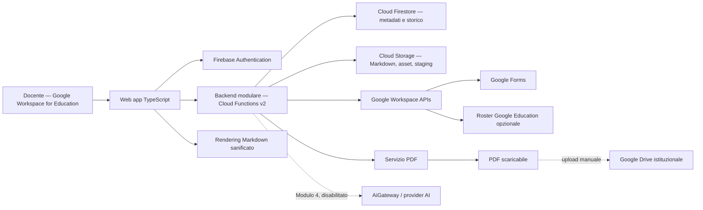
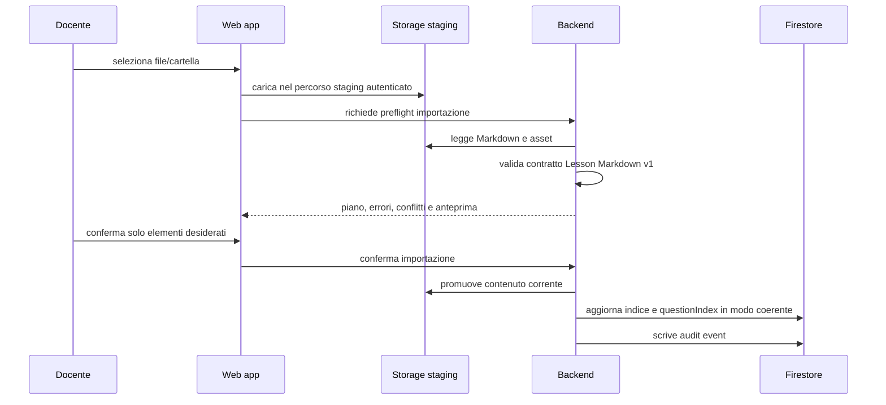

# SchoolForge — Architettura di sistema

**Versione:** 1.0  
**Data:** 22 giugno 2026  
**Stato:** architettura target per l'implementazione  
**Input vincolante:** [Analisi dei requisiti v1.1](analisi-requisiti.md)  
**Destinatario:** team di implementazione e responsabile di esercizio

---

## 1. Obiettivo e perimetro architetturale

Questo documento definisce la soluzione tecnica di SchoolForge. Traduce i requisiti in componenti, confini, dati, flussi e decisioni implementative. È intenzionalmente una soluzione **minimale, modulare e gestita**: un'applicazione web per un solo docente, un backend serverless unico e servizi Google gestiti.

L'architettura non introduce LMS, account studenti, multi-docente, sincronizzazione automatica di Drive, versioni delle lezioni o varianti della stessa verifica. Il sistema conserva il Markdown come conoscenza portabile; conserva invece in modo immutabile il contenuto delle verifiche pubblicate, perché sono entità operative e storiche autonome.

### 1.1 Esito atteso

Al termine dell'implementazione il docente deve poter:

1. accedere con il proprio account Google Workspace for Education;
2. caricare, validare, consultare ed esportare lezioni Markdown con asset;
3. comporre una singola verifica da lezioni/UDA selezionate, senza dipendere dall'AI;
4. pubblicare ed esportare PDF o Google Form;
5. gestire classi e studenti manualmente o tramite importazione Google Education opzionale;
6. archiviare consegne, punteggi, percentuali e link ai PDF caricati manualmente su Drive;
7. aggiungere in seguito AI per generazione e correzione senza alterare i flussi manuali.

## 2. Principi architetturali

| Principio | Decisione concreta |
|---|---|
| Markdown-first | Il file `.md` originale e gli asset sono archiviati come file in Cloud Storage e possono essere esportati in una cartella portabile. Firestore contiene solo indice, stato e dati operativi. |
| Semplicità operativa | Un solo frontend, un solo backend serverless modulare, un solo database documentale e un solo storage a oggetti. Nessun cluster, container da amministrare, broker o microservizio. |
| Un solo docente | Tutte le risorse sono protette da un unico proprietario Google configurato. Non vengono progettati tenant, organizzazioni, ruoli o condivisione. |
| Backend autorevole | Le scritture con regole di business passano dal backend. Il browser non può pubblicare verifiche, scrivere audit, importare risposte o gestire credenziali esterne direttamente. |
| Dati storici autonomi | Una verifica pubblicata contiene le proprie domande, soluzioni, rubriche e punteggi massimi; non legge revisioni di lezioni che non esistono nel modello. |
| AI opzionale | L'AI è un adattatore disabilitato per default. I moduli 1–3 non hanno dipendenze runtime da un provider AI. |
| Integrazioni isolate | Google Forms, roster Google Education e AI sono porte di integrazione dietro servizi applicativi dedicati. Un errore o una revoca non compromette repository, PDF o archivio manuale. |
| Sicurezza per difetto | Accesso del solo docente, token esterni in Secret Manager, audit append-only e minimizzazione dei dati inviati fuori dall'applicazione. |

## 3. Decisioni architetturali

### ADR-01 — Firebase / Google Cloud come piattaforma gestita

**Decisione.** SchoolForge usa Firebase su Google Cloud: Firebase Hosting, Firebase Authentication, Cloud Firestore, Cloud Storage, Cloud Functions di seconda generazione, Secret Manager e Cloud Logging.

**Motivazione.** L'uso obbligatorio di Google Workspace for Education e Google Forms rende naturale l'integrazione con l'ecosistema Google. La piattaforma gestita riduce al minimo gestione di server, aggiornamenti, certificati, database e scalabilità. È adeguata a un solo docente e può crescere senza reingegnerizzazione nelle prime fasi.

**Conseguenza.** Il progetto deve essere TypeScript end-to-end. Non sono previsti Kubernetes, VM permanenti, Cloud SQL, code di messaggi, service mesh o un'infrastruttura multi-account nella V1.

### ADR-02 — Monolite modulare serverless, non microservizi

**Decisione.** Il backend è un unico progetto Cloud Functions con moduli di dominio interni. Ogni funzione pubblica chiama servizi applicativi e repository condivisi, non altri servizi distribuiti.

**Motivazione.** I confini funzionali sono chiari, ma il volume e il numero di utenti non giustificano costi operativi di microservizi. I moduli restano separati nel codice e possono essere estratti soltanto se l'uso reale lo richiederà.

### ADR-03 — Storage separato per conoscenza e metadati

**Decisione.**

- Cloud Storage conserva Markdown originali, asset e file temporanei di importazione.
- Firestore conserva indice, stato, relazioni, verifiche, assegnazioni, consegne, correzioni e audit.
- Google Drive istituzionale del docente resta la destinazione manuale dei PDF archiviabili; SchoolForge conserva solo link/ID Drive e metadati associati.

**Motivazione.** Il Markdown resta scaricabile senza dipendere dal database. Firestore è usato dove è appropriato: query, stati, relazioni e storico operativo. Drive non richiede token o sincronizzazione nella V1.

### ADR-04 — Una sola verifica, snapshot immutabile al momento della pubblicazione

**Decisione.** Non esistono versioni o varianti della verifica né revisioni storiche delle lezioni. Una verifica passa da bozza a pubblicata una sola volta e, in quel passaggio, il backend congela le domande e i materiali necessari alla correzione.

**Motivazione.** La verifica deve rimanere leggibile e correggibile anche se il docente riscrive o elimina una lezione. Conservare il contenuto della verifica è sufficiente; conservare tutte le vecchie lezioni sarebbe complessità non richiesta.

### ADR-05 — Google Education per identità e roster, non per portale studenti

**Decisione.** L'accesso al sistema usa Google Workspace for Education del docente. L'importazione di classi/studenti usa, quando disponibile e autorizzata, un'API Google Education per i roster; rimane sempre disponibile l'inserimento manuale. Gli studenti non accedono a SchoolForge.

**Motivazione.** Si ottengono dati anagrafici e matching delle risposte senza introdurre account, registrazione, reset password o portale studenti.

### ADR-06 — AI dietro un adattatore chiuso

**Decisione.** Ogni chiamata AI passa da `AiGateway`. Il gateway riceve un pacchetto di contesto costruito dal backend, non espone browsing, tool esterni o retrieval e registra la provenienza. Il provider concreto resta non selezionato fino alla decisione C-02.

**Motivazione.** Il vincolo “solo dalle lezioni selezionate” va applicato dal sistema, non affidato a una semplice istruzione testuale del modello.

## 4. Architettura logica



### 4.1 Confini di responsabilità

| Componente | Responsabilità | Non deve fare |
|---|---|---|
| Web app | Interfaccia docente, rendering sicuro, anteprime, richieste al backend, conferme esplicite | Applicare transizioni di stato, memorizzare token Google, pubblicare verifiche, inviare prompt AI direttamente |
| Backend | Autorizzazione, regole di business, transazioni, audit, import/export, PDF, integrazioni | Renderizzare UI, conservare Markdown come unico dato proprietario, esporre dati a studenti |
| Cloud Storage | Originali Markdown, asset e staging temporaneo | Indice relazionale, stati o dati personali delle consegne |
| Firestore | Indice, relazioni, snapshot verifiche, consegne, punteggi, percentuali, audit | Sostituire file Markdown/asset come fonte canonica delle lezioni |
| Google Forms | Canale esterno di erogazione e origine risposte | Gestione dell'intero storico SchoolForge o autorizzazione applicativa |
| Google Drive | Posizione manuale dei PDF archiviabili | Sincronizzazione automatica o storage controllato da SchoolForge nella V1 |
| AiGateway | Generazione/correzione opzionale con contesto chiuso | Browser, RAG web, pubblicazione, cancellazione o decisioni irreversibili |

## 5. Architettura fisica e runtime

### 5.1 Servizi gestiti

| Livello | Servizio | Configurazione minima |
|---|---|---|
| Frontend | Firebase Hosting | SPA statica, HTTPS gestito, cache per asset con hash |
| Identità | Firebase Authentication con Google | Account proprietario/dominio Education consentito, controllo server-side del soggetto Google stabile |
| API e job brevi | Cloud Functions v2, TypeScript | Endpoint autenticati, timeout configurati, nessuna funzione pubblica anonima |
| Metadati | Cloud Firestore | Modalità nativa, indici espliciti per filtri dello storico |
| File | Cloud Storage | Bucket privato, accesso solo al proprietario e al service account backend |
| Segreti | Secret Manager | Token OAuth delle integrazioni e future credenziali AI; mai nel client o in Firestore |
| Osservabilità | Cloud Logging e metriche standard | Errori strutturati, durata operazioni, esclusione di testo delle risposte/log sensibili |

La regione Google Cloud, la politica di backup e i valori RPO/RTO dipendono dalla decisione C-01. Il codice deve leggere questi elementi dalla configurazione di deployment; non deve assumere una regione o una politica di retention nel dominio applicativo.

### 5.2 Ambienti

| Ambiente | Uso | Dati |
|---|---|---|
| `dev` | sviluppo locale e Firebase Emulator Suite | dati sintetici; nessun token o studente reale |
| `test` | test di integrazione e collaudo di Google Forms/roster, se necessario | account e dati di prova separati |
| `prod` | docente reale | solo dati operativi autorizzati |

`dev` e `prod` devono usare progetti Firebase/Google Cloud distinti. È un costo di configurazione minimo che impedisce di mescolare token, Forms e dati didattici reali con test locali.

## 6. Struttura del codice e toolchain

```text
SchoolForge/
├─ apps/
│  └─ web/                       # SPA React + TypeScript (Vite)
├─ functions/
│  └─ src/
│     ├─ api/                    # handler HTTP/callable sottili
│     ├─ domain/                 # programmi, lezioni, verifiche, archivio
│     ├─ integrations/           # Google Forms, roster, Drive-link, AI
│     ├─ services/               # PDF, audit, autorizzazione, import/export
│     └─ repositories/           # Firestore e Storage
├─ packages/
│  └─ lesson-contract/           # parser, validatore e tipi Markdown condivisi
├─ documentazione/
│  ├─ diagrammi/                 # ER model, sequence diagrams, component diagram
│  └─ ...
├─ firestore.rules
├─ storage.rules
├─ firestore.indexes.json
├─ firebase.json
├─ pnpm-workspace.yaml
└─ package.json                  # root workspace
```

### 6.1 Toolchain

| Strumento | Versione | Scopo |
|---|---|---|
| **pnpm workspaces** | 9.x | Gestione monorepo; dipendenze condivise tra app/functions/packages |
| **TypeScript** | 5.x | Linguaggio end-to-end; strict mode abilitato su tutti i package |
| **Vite** | 5.x | Build e dev server della web app; ottimizzazione bundle produzione |
| **ESLint** | 9.x | Linting con `eslint-plugin-security` per controlli statici di sicurezza |
| **Vitest** | 2.x | Test unitari e di integrazione; compatibile con Firebase Emulator Suite |
| **Playwright** | 1.45.x | Test end-to-end; eseguibili in parallelo su browser headless |
| **Firebase Emulator Suite** | ultima stabile | Sviluppo locale senza dipendenza da servizi cloud reali |
| **Zod** | 3.x | Validazione runtime dei payload API e output AI |

### 6.2 Workspace pnpm

```yaml
# pnpm-workspace.yaml
packages:
  - 'apps/*'
  - 'functions'
  - 'packages/*'
```

I package condividono le type definitions di Firebase e TypeScript come `devDependencies` del workspace root. Ogni package ha il proprio `tsconfig.json` che estende un `tsconfig.base.json` di root.

### 6.3 Pacchetto `lesson-contract`

Il pacchetto `lesson-contract` è condiviso tra web e backend. Evita che browser e server interpretino il front matter o i blocchi `schoolforge-question` in modo diverso. Il backend resta l'autorità finale: una lezione è utilizzabile soltanto dopo la sua validazione lato server.

Il pacchetto esporta:
- `parseLessonMarkdown(source: string): ParseResult` — parser e validatore
- Tipi TypeScript (`Lesson`, `Question`, `Rubric`, `ParseError`, ...)
- Fixture di test per i casi validi e invalidi del contratto

## 7. Dati e persistenza

### 7.1 Cloud Storage: conoscenza Markdown corrente

```text
repository/
  current/
    lessons/{lessonId}/source.md
    lessons/{lessonId}/assets/{relative-path}
  exports/{exportId}/schoolforge-repository.zip       # temporaneo e con scadenza
staging/{importId}/...                                # temporaneo e con scadenza
```

Regole:

- `source.md` e gli asset in `repository/current` sono la copia corrente della Lezione.
- una sostituzione aggiorna tale copia corrente; non crea una cartella o una revisione consultabile;
- i file in `staging` non sono visibili come contenuto didattico e vengono rimossi dopo importazione/annullamento/scadenza;
- eventuali oggetti orfani di una sostituzione interrotta vengono eliminati da un job di pulizia; non sono dati storici;
- l'export ricrea una struttura di cartelle con Markdown e asset, senza trasformarli in un formato proprietario.

### 7.2 Firestore: modello dati operativo

Ogni documento applicativo contiene `ownerUid`, `createdAt`, `updatedAt` e, se necessario, `createdBy`. `ownerUid` è sempre lo stesso nella V1, ma rende esplicita la proprietà e semplifica i controlli di sicurezza senza implementare il multi-docente.

| Collezione | Campi principali | Note |
|---|---|---|
| `settings/owner` | `googleSubject`, `allowedEmail`, `allowedDomain`, configurazioni feature | Documento unico configurato al bootstrap. Il soggetto Google stabile è il controllo autoritativo. |
| `programs` | `id`, `title`, `active`, `sortOrder` | Disattivazione, non cancellazione, se referenziato. |
| `udas` | `id`, `programId`, `title`, `active`, `sortOrder` | Relazione con il programma. |
| `lessons` | `id`, `programId`, `udaId`, `title`, `objectives`, `storagePath`, `assetBasePath`, `status`, `validationErrors`, `plainText` | Indice della Lezione corrente; `plainText` è derivato per ricerca locale. |
| `questionIndex` | `id`, `lessonId`, `kind`, `type`, `difficulty`, `prompt`, `availability` | Indice corrente delle sole domande estratte da lezioni valide. Non è fonte canonica. |
| `exams` | `id`, `status`, `sourceLessonIds`, `configuration`, `publishedAt`, `googleForm`, `pdfMetadata` | Metadati della Verifica. Lo stato vincola le scritture. |
| `exams/{examId}/items` | prompt, tipo, opzioni, soluzione, rubrica, punteggio massimo, `sourceLessonId` | Snapshot della Verifica. Immutabile dopo pubblicazione. Una subcollection evita limiti di dimensione di un singolo documento. |
| `classes` | `id`, `name`, `active`, `externalSource` | Creazione manuale o importata. |
| `students` | `id`, nome, cognome, email, `classId`, `googleExternalId`, `active` | L'email è unica fra studenti attivi; nessuna credenziale SchoolForge. |
| `assignments` | `id`, `examId`, destinatari, canale, `formId`, stato, date | Una verifica può essere assegnata a una classe o a un insieme di studenti. |
| `submissions` | `id`, `assignmentId`, `examId`, `studentId`, risposte, origine, `sourceResponseId`, stato | Import idempotente grazie a `sourceResponseId`. Le non mappate vanno in quarantena. |
| `corrections` | `submissionId`, punteggi per item, commenti, provenienza, stato, percentuale | Conserva proposta AI, correzione umana e risultato definitivo distinti. |
| `artifacts` | `examId`/`submissionId`, tipo, hash, `driveUrl`, `driveFileId`, generato il | Registra PDF e link Drive; non copia automaticamente file su Drive. |
| `auditEvents` | attore, azione, oggetto, timestamp, esito, motivazione, dati minimi | Append-only, scritto solo dal backend. |
| `integrationStatus` | tipo, connessa, scope concessi, ultimo esito, ultimo errore non sensibile | Non contiene refresh token o segreti. |

### 7.3 Immutabilità e transazioni

| Evento | Garanzia del backend |
|---|---|
| Pubblicazione verifica | Transazione Firestore che controlla completezza, scrive/chiude gli item della verifica, aggiorna lo stato e crea audit event. |
| Modifica verifica pubblicata | Rifiutata. Il docente crea una nuova verifica. |
| Sostituzione Lezione | Aggiorna solo `lessons` e `questionIndex` correnti; non scrive su `exams/{id}/items`. |
| Import risposta Forms | Usa `formResponseId` come chiave idempotente; una risposta già acquisita non crea doppie consegne. |
| Rettifica punteggio | Conserva valore precedente, nuovo valore e motivazione; ricalcola percentuale. |
| Approvazione AI massiva | Seleziona solo proposte idonee, aggiorna in batch e registra un audit per ogni correzione interessata più un audit di operazione. |

### 7.4 Calcolo di punteggio e percentuale

Il backend è l'unico responsabile del calcolo. Per una Consegna completa:

```text
punteggio ottenuto = somma dei punteggi definitivi assegnati agli item
punteggio massimo  = somma dei punteggi massimi degli item della Verifica
percentuale        = (punteggio ottenuto / punteggio massimo) × 100
```

La percentuale è conservata con precisione numerica e visualizzata arrotondata a due decimali. Se almeno un item non possiede un punteggio definitivo, la percentuale è `non_definitiva`; non esiste conversione automatica in voto. Ogni rettifica passa dal backend, registra il valore precedente e ricalcola il risultato.

## 8. Flussi applicativi principali

### 8.1 Accesso del docente

1. Il docente esegue Google Sign-In nella web app.
2. Firebase Authentication rilascia un token applicativo.
3. Il backend verifica token Firebase, soggetto Google stabile e configurazione `settings/owner`.
4. Se soggetto/account/dominio non sono autorizzati, il backend rifiuta ogni richiesta e non restituisce dati.
5. Il browser può leggere solo dati dell'unico proprietario; tutte le scritture significative usano endpoint backend autenticati.

L'email non è una chiave di identità: serve per visualizzazione e policy di accesso, mentre il soggetto Google stabile gestisce l'eventuale cambio di indirizzo.

### 8.2 Importazione di una lezione o cartella



L'atomicità visibile è ottenuta con un manifesto di importazione: contenuti e asset sono prima completi in staging; solo dopo validazione e conferma il backend aggiorna i documenti Firestore che li rendono correnti. Un file parzialmente caricato non appare mai nel repository.

### 8.3 Rendering e ricerca lezione

Il backend valida ed estrae una rappresentazione strutturata dal Markdown. La web app renderizza esclusivamente:

- front matter ammesso;
- contenuto Markdown sanificato;
- immagini consentite;
- domande `self_check`.

Blocchi `assessment`, soluzioni, chiavi corrette e rubriche non sono inclusi nel modello consegnato alla pagina di fruizione. Il renderer disabilita HTML eseguibile, script, iframe e URL locali.

La ricerca V1 è locale e deterministica: l'indice `plainText`, titolo e obiettivi delle lezioni correnti viene caricato a pagine e filtrato nel browser normalizzando maiuscole/minuscole e accenti. Non viene introdotto un motore di ricerca esterno. Durata e dimensione dell'indice vengono misurate; solo dati reali potranno giustificare un componente dedicato in futuro.

### 8.4 Composizione, pubblicazione ed esportazione di una verifica

1. Il docente seleziona UDA/Lezioni; il backend risolve l'insieme deduplicato di lezioni valide.
2. Il backend legge il `questionIndex` corrente, applica tipo/difficoltà/quantità e segnala fabbisogno non coperto senza AI.
3. Il docente approva e modifica la composizione in bozza.
4. Il backend verifica completezza di soluzioni, rubriche e punteggi massimi.
5. Alla pubblicazione copia le domande approvate in `exams/{examId}/items`, imposta `published` e scrive audit.
6. Il servizio PDF legge solo lo snapshot della verifica e genera prova, soluzione o rubrica come output separati.
7. Il docente scarica il PDF e, se desiderato, lo carica manualmente su Drive; l'app registra il link/ID fornito.

La verifica non legge più il Markdown dopo la pubblicazione. Pertanto sostituire o eliminare una lezione non modifica prova, PDF, rubriche o correzioni esistenti.

### 8.5 Google Forms e importazione risposte

1. Per una verifica `pubblicata`, il backend crea un Form con l'account Google Education connesso.
2. Salva `formId` nell'assegnazione e la mappa tra item SchoolForge e domande Form.
3. Il docente distribuisce il link con canali esterni. SchoolForge non invia inviti e non registra studenti.
4. Il docente avvia l'importazione delle risposte dal pannello dell'assegnazione.
5. Il backend importa risposte nuove in modo idempotente, identifica lo studente tramite email/account raccolto e crea una Consegna.
6. Risposte senza mappatura certa vanno in `quarantena`; nessuna attribuzione automatica è consentita.

Il Form non è modificabile dopo la prima Consegna. Una modifica alla prova richiede una nuova Verifica e un nuovo Form.

### 8.6 Classi e studenti

L'inserimento manuale è il percorso sempre disponibile. Se il docente autorizza l'integrazione roster:

1. il backend usa il token Google conservato in Secret Manager e richiede soltanto gli scope minimi del roster;
2. recupera classi e studenti dal servizio Google Education configurato;
3. calcola un'anteprima di creazioni, aggiornamenti e archiviazioni proposte;
4. applica solo le modifiche confermate dal docente;
5. non cancella mai automaticamente studenti, consegne o storico per assenza da una risposta API.

### 8.7 Correzione AI e approvazione massiva — Fase 4

L'estensione AI della Fase 4 non viene attivata prima delle decisioni C-02 e C-03. La correzione manuale e il calcolo delle percentuali restano il prodotto obbligatorio della fase. Quando l'AI è attiva, il flusso è:

1. il backend costruisce un contesto chiuso per ogni risposta: Lezione fonte selezionata, item della verifica, soluzione, rubrica e risposta dello studente;
2. `AiGateway` invia il contesto al provider, senza browser, strumenti, retrieval o altre lezioni;
3. l'output diventa proposta `ai_proposed`, con fonte, modello, template e hash del contesto registrati;
4. il docente approva/modifica/rifiuta un item oppure usa “approva tutte le proposte idonee” per una verifica o selezione di consegne;
5. il backend esclude proposte bloccate, incomplete, rifiutate o già modificate, mostra il riepilogo e richiede conferma;
6. dopo la conferma aggiorna solo le proposte idonee e registra audit per l'operazione e gli item coinvolti.

La modalità automatica è protetta da feature flag disabilitato e non viene implementata come default nascosto.

## 9. API applicative

La web app usa endpoint HTTPS/callable autenticati. Gli handler devono essere sottili: validano input e token, poi delegano a servizi di dominio. Il contratto usa JSON con errori strutturati `{ code, message, details }` e non espone stack trace.

| Modulo | Operazioni principali |
|---|---|
| Autorizzazione | `getSession`, `getOwnerConfiguration` |
| Repository | `createProgram`, `updateProgram`, `createUda`, `stageImport`, `previewImport`, `commitImport`, `replaceLesson`, `deleteLesson`, `exportRepository` |
| Verifiche | `createExamDraft`, `composeExam`, `updateExamDraft`, `publishExam`, `cancelExam`, `generatePdf` |
| Google Forms | `connectGoogleForms`, `createGoogleForm`, `importFormResponses` |
| Anagrafica | `listClasses`, `saveClass`, `saveStudent`, `previewRosterImport`, `applyRosterImport` |
| Archivio | `createAssignment`, `closeAssignment`, `createManualSubmission`, `resolveQuarantine`, `recordDriveArtifact`, `updateCorrection` |
| AI futuro | `connectAiProvider`, `generateQuestions`, `proposeCorrection`, `approveCorrection`, `bulkApproveCorrections` |

Operazioni che modificano stato (`publishExam`, `commitImport`, `closeAssignment`, `bulkApproveCorrections`, ecc.) devono richiedere un `confirmation` esplicito dal client. Il backend controlla comunque precondizioni e non accetta una conferma come sostituto delle regole di business.

## 10. Sicurezza e autorizzazione

### 10.1 Regole di accesso

| Risorsa | Lettura | Scrittura |
|---|---|---|
| Firestore dati applicativi | Solo token del Docente proprietario | Solo Cloud Functions; il client non scrive dati di dominio direttamente |
| Cloud Storage `repository/current` | Solo Docente proprietario tramite URL autenticati o backend | Solo backend |
| Cloud Storage `staging` | Solo Docente proprietario nell'import corrente | Upload del docente nel prefisso autorizzato; promozione solo backend |
| Secret Manager | Solo service account delle funzioni autorizzate | Solo procedura backend/amministrativa di connessione |
| Google Drive | Gestito fuori da SchoolForge dal docente | Nessun upload/sync automatico nella V1 |

Le Firestore Security Rules e Storage Rules sono un secondo livello di difesa; il controllo principale resta nel backend, che valida identità, ownership, stato e transizioni.

### 10.2 Token e integrazioni Google

- Il token di autenticazione Firebase non è usato come deposito di autorizzazioni permanenti per Forms o roster.
- La connessione a Google Forms/roster richiede consenso separato e scope minimi per la funzione richiesta.
- I refresh token sono conservati esclusivamente in Secret Manager, associati all'unico docente e mai restituiti al browser.
- La revoca di un'integrazione rende indisponibile solo quella funzione; repository, PDF, anagrafica manuale e storico restano operativi.
- La V1 non richiede scope Drive perché il caricamento dei PDF è manuale.

### 10.3 Gestione dati sensibili

- Markdown e lezioni non possono contenere segreti; la validazione segnala file che contengono pattern di chiavi palesi secondo regole configurabili.
- Risposte, punteggi e percentuali non devono essere riportati integralmente nei log applicativi.
- Gli audit registrano identificativi e metadati necessari a ricostruire l'azione, non il testo completo di una risposta dello studente.
- Prima di una chiamata AI con risposte di studenti, il backend verifica consenso operativo/configurazione espressa dal docente.

## 11. Affidabilità, osservabilità e backup

### 11.1 Osservabilità minima

Ogni endpoint e integrazione deve produrre log strutturati con:

- `requestId`, modulo, azione, esito e durata;
- identificativi tecnici dell'oggetto, mai il contenuto completo;
- codice errore normalizzato;
- provider e modello per AI, senza prompt o risposta completa;
- `formId`/stato di importazione per Google Forms, senza elencare risposte nei log.

Dashboard e alert iniziali devono coprire errori import Markdown, fallimenti PDF, errori Google, errori AI, importazioni in quarantena e fallimenti backup. Non vengono introdotti SLO numerici fino a quando non esisteranno dati d'uso; vengono però raccolte metriche per stabilirli.

### 11.2 Backup e ripristino

Il piano tecnico deve comprendere:

1. export/snapshot programmato Firestore;
2. protezione e verifica del bucket Cloud Storage;
3. test di ripristino periodico in ambiente non produttivo;
4. elenco di configurazioni e secret da ricreare senza esportarne il valore;
5. verifica che un export repository produca Markdown e asset leggibili fuori da SchoolForge.

Frequenza, regione di conservazione, RPO, RTO e responsabile operativo sono bloccati dalla decisione C-01. L'implementazione non va in produzione senza questi parametri, ma i moduli applicativi possono essere sviluppati e testati con configurazioni provvisorie.

## 12. Prestazioni e scelte di efficienza

Non esistono obiettivi quantitativi approvati. L'architettura evita comunque sprechi prevedibili:

- Hosting statico e funzioni scale-to-zero: nessun server inattivo da mantenere;
- Markdown e asset serviti da Storage con cache per file con hash;
- indice delle domande derivato al momento dell'import, non estratto a ogni composizione;
- rendering e ricerca lato browser sui dati necessari, senza un motore di ricerca esterno;
- paginazione per storico, consegne, audit e risultati importati;
- query Firestore supportate da indici dichiarati, non da scansioni client di archivi personali;
- PDF generato su richiesta e non precomputato per ogni stato intermedio;
- import Forms idempotente, così da poter ripetere un'operazione dopo un errore senza duplicare dati.

Un servizio aggiuntivo può essere proposto solo con evidenza osservabile: crescita dell'indice, tempi di import, errori di timeout o costo ricorrente non accettabile. La soluzione di partenza non include cache distribuite, database relazionale, motore vettoriale o motore full-text esterno.

## 13. Piano di implementazione in quattro fasi

| Fase | Componenti da completare | Prodotto funzionante e criterio di uscita |
|---|---|---|
| 1. Corsi, UDA e Lezioni | Fondazioni tecniche interne, autenticazione Google Education, Programmi/UDA, Markdown, asset, validazione, rendering, export | Il docente autenticato crea Corsi/Programmi e UDA, carica/gestisce Lezioni Markdown e le esporta senza AI, Forms, studenti o archivi |
| 2. Generazione Verifiche | Corpus selezionato, singola Verifica, soluzioni, rubriche, PDF; Google Forms se configurato | Il docente crea e pubblica una Verifica manualmente. Il contenuto resta immutabile e il percorso PDF funziona senza classi, archivio o AI |
| 3. Archiviazione Verifiche | Classi, studenti, importazione Google Education opzionale, assegnazioni, consegne, quarantena, link PDF Drive e storico `da_correggere` | Il docente archivia prove e risposte attribuibili senza calcolare punteggi o percentuali definitivi |
| 4. Correzione Verifiche | Correzione manuale, punteggi, percentuali, rettifiche/audit; AI assistita, approvazione massiva e automatica soltanto se autorizzate | Il docente corregge manualmente ogni prova e ottiene percentuali affidabili. L'AI estende il prodotto ma non è un prerequisito della correzione manuale |

Ogni fase rilascia un prodotto utilizzabile. Non è ammesso anticipare dipendenze AI, Google Forms o roster nella Fase 1.

## 14. Strategia di test

| Livello | Oggetto | Evidenza richiesta |
|---|---|---|
| Unit | parser Markdown, validatore, calcolo percentuale, transizioni stato, mapping Forms | test TypeScript deterministici |
| Contract | front matter, blocchi domanda, payload API, errori strutturati | fixture valide/non valide e snapshot di output |
| Integration | Firestore/Storage rules, import atomico visibile, publish verifica, idempotenza Forms | Firebase Emulator Suite e test backend |
| End-to-end | login docente, import, rendering senza assessment, verifica/PDF, assegnazione, archivio | Playwright su ambiente test |
| Manuale integrazioni | OAuth Google, Forms, roster, Drive link | checklist con account test Education |
| AI futuro | contesto consentito, assenza web/retrieval, provenienza, approvazione massiva | provider sandbox/mock e log di audit |
| Restore | ripristino Firestore/Storage ed export Markdown | prova documentata secondo C-01 |

I test devono includere almeno questi casi negativi: account non autorizzato, Markdown invalido, asset assente, doppia importazione Form, risposta non mappabile, tentativo di modificare verifica pubblicata, tentativo di esporre blocchi `assessment`, proposta AI incompleta nell'approvazione massiva e token integrazione revocato.

## 15. Tracciabilità requisiti → architettura

| Requisito/decisione | Meccanismo architetturale |
|---|---|
| Markdown indipendente | Cloud Storage degli originali, export ZIP, Firestore come indice/operativo |
| Nessuna revisione lezione/versione verifica | Storage corrente per le lezioni; item immutabili per la verifica pubblicata |
| Google Education docente | Firebase Auth Google + controllo server-side di soggetto/account autorizzato |
| Studenti senza account | Nessun ruolo studente, nessuna route pubblica, anagrafica solo operativa |
| Google Forms | Adattatore Forms, mapping `examId`/item/Form, import idempotente e quarantena |
| Roster opzionale | Adattatore Google Education con anteprima e conferma; fallback manuale |
| Punteggi/percentuali, non voti | servizio di calcolo server-side e storico rettifiche |
| Drive manuale | generazione PDF + artefatto con URL/ID Drive, senza API Drive obbligatoria |
| AI optional e senza web | `AiGateway`, contesto chiuso, feature flag, audit provenienza |
| Approvazione massiva AI | endpoint backend transazionale/batch con filtro idoneità e audit per item |

## 16. Decisioni ancora aperte e limiti deliberati

| ID | Decisione | Impatto architetturale | Owner | Scadenza |
|---|---|---|---|---|
| C-01 | Regione, backup, RPO/RTO e responsabilità operativa | Parametri di progetto Firebase/Google Cloud e piano di restore prima del go-live | Committente / Responsabile operativo | Prima del go-live Fase 1 (gate G1) |
| C-02 | Provider AI, condizioni, residenza e consenso | Implementazione concreta di `AiGateway`; nessun provider viene cablato prima della decisione | Committente | Prima del gate G5-AI |
| C-03 | Regola per correzione automatica | Il flag resta disabilitato; si implementa solo correzione assistita e approvazione massiva | Committente / Docente | Prima del gate G6 |

Ogni decisione aperta produce un verbale nel repository: data, approvatore, opzioni valutate con pro e contro, scelta effettuata e vincoli operativi risultanti. Una decisione aperta non viene "risolta a voce" né incorporata silenziosamente nel codice.

Limitazioni intenzionali della V1:

- nessun editor Markdown nel browser;
- nessuna sincronizzazione bidirezionale con Drive;
- nessun invio automatico di email agli studenti;
- nessun account/portale studente;
- nessuna analitica didattica avanzata;
- nessun supporto multi-docente;
- nessuna versione di lezione o di verifica;
- nessun provider AI obbligatorio.

## 17. Criteri di accettazione dell'architettura

L'implementazione è conforme a questa architettura se dimostra che:

1. il solo docente Google Education autorizzato può leggere o modificare dati SchoolForge;
2. i Markdown e gli asset sono esportabili e leggibili fuori dall'applicazione;
3. le domande di verifica e relative soluzioni non vengono esposte nel rendering della lezione;
4. una verifica pubblicata conserva i propri item e non cambia se la lezione viene sostituita o eliminata;
5. il backend impedisce modifiche a una verifica pubblicata e registra le azioni rilevanti;
6. Google Forms e roster sono opzionali e non bloccano flussi manuali;
7. una risposta Form importata due volte non genera due consegne;
8. punteggio e percentuale sono calcolati nel backend senza logica di voto;
9. il link Drive è registrabile senza che l'app richieda accesso/sincronizzazione Drive;
10. AI, se abilitata in futuro, riceve soltanto il contesto autorizzato, non usa web/retrieval e consente approvazione massiva auditabile;
11. ambiente `dev` non contiene dati o token di produzione;
12. backup, export e restore sono verificabili prima del go-live secondo C-01.

---

## Appendice A — Diagrammi di dettaglio

I seguenti diagrammi sono disponibili nella cartella `documentazione/diagrammi/`:

| File | Contenuto |
|---|---|
| [`er-model.md`](diagrammi/er-model.md) | Modello dati ER completo di Firestore con indici |
| [`sequence-import-lezione.md`](diagrammi/sequence-import-lezione.md) | Sequence diagram: import cartella, preflight, commit atomico, sostituzione singola lezione |
| [`sequence-pubblicazione-verifica.md`](diagrammi/sequence-pubblicazione-verifica.md) | Sequence diagram: composizione → pubblicazione → PDF → link Drive; garanzia di immutabilità |
| [`sequence-correzione-ai.md`](diagrammi/sequence-correzione-ai.md) | Sequence diagram: correzione AI assistita, approvazione massiva, modalità automatica |
| [`component-frontend.md`](diagrammi/component-frontend.md) | Architettura dei componenti React, stato globale e pattern UI trasversali |

---

## Appendice B — Stato della proposta

Questa architettura è pronta per l'avvio dell'implementazione delle Fasi 1–3. Le scelte C-01, C-02 e C-03 restano bloccanti soltanto per i rispettivi aspetti di esercizio e AI; non autorizzano scorciatoie nel modello di sicurezza, nella portabilità Markdown o nella tracciabilità delle verifiche.
