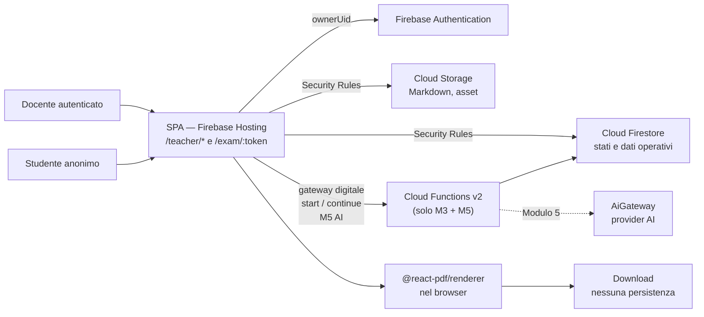
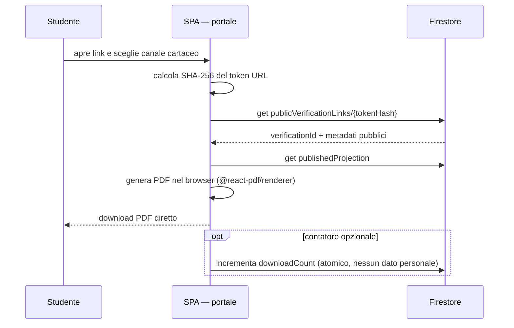
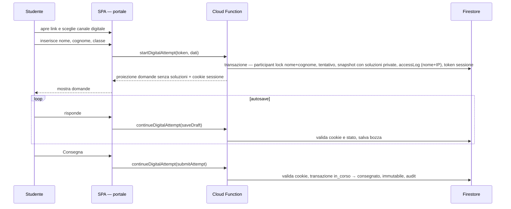

# SchoolForge — Architettura di sistema

**Versione:** 4.1
**Data:** 24 giugno 2026
**Stato:** architettura target, pronta per il piano esecutivo
**Input vincolanti:** `brief.md` e `analisi-requisiti.md`
**Destinatari:** implementazione e Docente responsabile operativo

---

## 1. Scopo e perimetro

SchoolForge è un'applicazione web Firebase-first per un solo docente. È composta da una **singola SPA** con due sezioni distinte:

- **Sezione docente** (`/teacher/*`) — autenticata, desktop-first.
- **Sezione portale** (`/exam/:token`) — pubblica, mobile-first, senza login studente.

Firebase Hosting serve la SPA. Firebase Authentication protegge la sezione docente. Cloud Firestore e Cloud Storage gestiscono dati e file. Il piano Blaze è richiesto per il piccolo gateway Cloud Functions del Portale digitale nel Modulo 3 e per l'AI nel Modulo 5. Hosting, Auth, Firestore e Storage scalano a zero e usano le quote incluse per un singolo docente senza costi fissi significativi.

Il progetto non richiede Google Workspace for Education, Google Drive API, account Google per gli studenti o invio di email.

### 1.1 Localizzazione

Cloud Firestore, Cloud Storage e Cloud Functions v2 sono configurati in Milano `europe-west8`. Firebase Hosting usa una CDN globale; Firebase Authentication ha proprie caratteristiche di localizzazione. L'architettura non dichiara che ogni richiesta avvenga esclusivamente in Italia.

### 1.2 Esito atteso

L'implementazione deve consentire al docente di:

1. accedere con Firebase Authentication senza dipendenza da Google Workspace;
2. caricare, validare, consultare ed esportare Markdown, pool e asset;
3. attivare verifiche con configurazione e contenuti pubblicati immutabili;
4. distribuire PDF della verifica — download diretto per il docente o per lo studente nel canale cartaceo;
5. raccogliere svolgimenti digitali con snapshot sicuro;
6. correggere consegne digitali ed esportarle in PDF, Markdown e CSV;
7. usare facoltativamente l'AI solo per la correzione nel Modulo 5.

---

## 2. Principi architetturali

| Principio | Decisione concreta |
|---|---|
| Markdown-first | Markdown e asset originali vivono in Cloud Storage; Firestore contiene indice, stati e dati operativi. |
| SPA unica | Una sola applicazione con routing `/teacher/*` e `/exam/:token`; nessun deployment separato per il portale. |
| Client docente, gateway digitale server-side | Il docente scrive direttamente entro Security Rules; il Portale digitale passa dal gateway Cloud Functions per ripresa, bozze e consegna autorizzate dal cookie HttpOnly. |
| Single-docente | Un solo `ownerUid` Firebase è autorizzato nella sezione docente; nessun tenant, delega o ruolo aggiuntivo. |
| Studente senza account | Il portale usa un link non enumerabile; lo studente dichiara nome e cognome (non verificati) e ogni accesso è tracciato con nome+IP+timestamp+user-agent. Il tentativo digitale è limitato da un lock per verifica e nome+cognome normalizzati. |
| PDF e documenti effimeri | PDF, export (PDF/Markdown/CSV) e programma svolto sono generati on-demand nel browser con `@react-pdf/renderer` e non scritti su Firestore o Cloud Storage. |
| Snapshot pubblicato e al tentativo | L'attivazione congela configurazione e contenuti della verifica; il tentativo digitale salva inoltre la prova assegnata con soluzioni private. |
| AI opzionale | Disabilitata per default, non genera domande, dipende da Cloud Functions solo nel Modulo 5 (fuori scope V1 / pianificato per V2). |
| Disciplina di costo | Nessuna risorsa sempre attiva; scale-to-zero, quota incluse, avvisi budget. Cloud Functions usate solo dove strettamente necessario. |

---

## 3. Decisioni architetturali

### ADR-01 — Firebase come piattaforma gestita

**Decisione.** SchoolForge usa Firebase come piattaforma applicativa. Il progetto Firebase, il billing e gli accessi amministrativi sono di proprietà del Docente.

**Motivazione.** Per una V1 single-docente Firebase riduce il lavoro di provisioning: hosting HTTPS, autenticazione, database, object storage, funzioni, emulatori e osservabilità sono integrati. Firestore è sufficiente ai flussi previsti, incluso il lock concorrente per nome+cognome del tentativo digitale e il log di accesso nome+IP tramite transazioni.

**Conseguenza.** La portabilità richiesta riguarda Markdown, asset e dati operativi in formato standard; non richiede eseguire SchoolForge su un secondo cloud senza migrazione.

### ADR-02 — SPA unica con routing

**Decisione.** Una sola applicazione React su Firebase Hosting, con routing `/teacher/*` (autenticata) e `/exam/:token` (pubblica). Code splitting per mantenere il bundle del portale leggero.

**Motivazione.** Due app separate richiedono due pipeline CI/CD, due configurazioni Hosting e duplicazione del codice condiviso (es. tipi, componenti UI). Con un singolo deployment il costo operativo è inferiore e la manutenzione è più semplice. La separazione di sicurezza è garantita dalle Security Rules e dal controllo `ownerUid`, non dalla separazione fisica dei deployment.

### ADR-03 — Gateway digitale e AI in Cloud Functions

**Decisione.** Le Cloud Functions sono usate esclusivamente per:
- `startDigitalAttempt` (M3): crea participant lock, tentativo, snapshot con soluzioni private, log accesso e token opaco di sessione.
- `continueDigitalAttempt` (M3): legge/riprende il tentativo e gestisce `saveDraft` e `submitAttempt` autorizzati dal cookie HttpOnly.
- Modulo AI (M5/V2): chiama il provider AI con contesto chiuso e registra l'audit.

Le operazioni docente (import, pubblicazione, correzione, export) usano Firebase SDK direttamente dal client con Security Rules.

**Motivazione.** Un cookie HttpOnly non è disponibile alle Firestore Security Rules: per non esporre scritture anonime, il write path digitale passa dal server. Il resto del prodotto resta client-first, evitando Functions dove non aggiungono integrità o sicurezza.

**Conseguenza.** Il costo Cloud Functions è trascurabile per un singolo docente. Le Security Rules devono essere progettate con cura; i test Emulator Suite sono obbligatori.

### ADR-04 — Firestore operativo, Cloud Storage canonico

**Decisione.** Cloud Storage conserva Markdown originali e asset. Cloud Firestore conserva metadati, indici, configurazioni, tentativi, snapshot digitali, correzioni e audit.

**Motivazione.** I file sono la conoscenza del docente; Firestore serve a rendere disponibili operazioni, ricerca e integrità senza diventare la fonte dei contenuti didattici.

### ADR-05 — Firebase Authentication per il solo docente

**Decisione.** La sezione docente usa Firebase Authentication. Il client verifica che `auth.uid == ownerUid` nelle Security Rules per ogni scrittura sensibile; le Function AI verificano lo stesso vincolo server-side. Il gateway digitale non richiede un account studente: autorizza esclusivamente la sessione opaca emessa all'avvio.

**Motivazione.** L'app deve proteggere un unico proprietario senza imporre il tipo di account di scuola.

### ADR-06 — Portale pubblico e token di sessione

**Decisione.** Il link pubblico contiene un token casuale ad alta entropia associato a una verifica attiva. Lo studente dichiara nome e cognome; `startDigitalAttempt` crea in transazione un participant lock per verifica+nome/cognome normalizzati, il tentativo, lo snapshot e il log di accesso (nome+IP+user-agent+timestamp), poi restituisce un token opaco di ripresa come cookie sicuro.

**Motivazione.** Il token di sessione deve essere firmato server-side per impedire forgery. Il cookie HttpOnly/Secure/SameSite garantisce che il token non sia leggibile da JavaScript. Poiché le Security Rules non possono verificare un cookie, avvio, ripresa, bozza e consegna passano dal piccolo gateway M3.

### ADR-07 — Snapshot pubblicato, equità e immutabilità alla consegna

**Decisione.** L'attivazione crea un `publishedSnapshot` privato con candidati, soluzioni e punteggi, più una proiezione pubblica senza soluzioni per il canale cartaceo. Configurazione, fonti e regole diventano immutabili. All'avvio digitale la Function seleziona dal `publishedSnapshot`, salva la prova assegnata e restituisce al client solo la proiezione senza soluzioni.

**Motivazione.** Una verifica deve restare equa e riproducibile mentre è aperta. Correzione ed export lavorano sullo snapshot dell'istanza svolta; modifiche a lezioni e pool diventano disponibili soltanto in una nuova bozza.

### ADR-08 — PDF e documenti generati nel browser

**Decisione.** Tutti i PDF (verifica docente, verifica studente cartaceo, programma svolto, export verifiche, Registro Correzioni) e gli altri formati di export (Markdown, CSV) sono generati nel browser con `@react-pdf/renderer` o equivalente. Nessun file generato viene scritto su Cloud Storage o Firestore.

**Motivazione.** Eliminare la generazione PDF server-side rimuove la necessità di Cloud Functions per questo scopo, abbatte i costi e semplifica l'architettura. Il browser moderno è in grado di generare PDF di qualità professionale senza infrastruttura server.

### ADR-09 — Secret Manager solo per M5

**Decisione.** Secret Manager non è usato nei Moduli 1–4. Viene introdotto in M5 esclusivamente per la chiave API del provider AI.

**Motivazione.** Senza invio email e senza operazioni server-side che richiedano credenziali esterne nei primi quattro moduli, Secret Manager non ha giustificazione fino all'AI (M5/V2).

### ADR-10 — Export globale da snapshot digitali

**Decisione.** `Esporta verifiche` legge tutte le consegne digitali definitive non annullate o eliminate e i relativi snapshot in Firestore. Il client produce PDF, Markdown o CSV nel browser e lo scarica senza persistenza.

**Motivazione.** L'archivio didattico esportato non dipende da Markdown correnti, pool, lezioni eliminate o Drive API.

### ADR-11 — Visibilità atomica dell'import

**Decisione.** Ogni import usa un nuovo `importId`: file e indici sono preparati in percorsi isolati. Solo al termine una transazione Firestore aggiorna `programs/{programId}.activeImportId` e l'audit. L'applicazione legge esclusivamente l'import puntato.

**Motivazione.** Cloud Storage e Firestore non condividono una transazione. Separando upload e commit di visibilità, un errore lascia in uso il contenuto precedente senza introdurre Functions o costi ricorrenti.

---

## 4. Architettura logica



[→ Componenti frontend](diagrammi/component-frontend.md)

### 4.1 Confini di responsabilità

| Componente | Responsabilità | Non deve fare |
|---|---|---|
| SPA — sezione docente | UI, validazione locale lesson-contract, rendering Markdown sicuro, scritture Firestore/Storage entro le regole, generazione PDF/CSV/Markdown nel browser. | Esporre soluzioni, chiamare AI direttamente, bypassare Security Rules. |
| SPA — sezione portale | Link pubblico, dati dichiarati, chiamate al gateway per avvio/ripresa/bozza/consegna, svolgimento, deterrenza. | Esporre soluzioni, correzioni, dati di altri tentativi o scrivere tentativi direttamente. |
| Cloud Functions | `startDigitalAttempt`: participant lock nome+cognome, tentativo, snapshot con soluzioni private, log accesso, token sessione. `continueDigitalAttempt`: lettura/ripresa, bozza e consegna autorizzate dal cookie. M5/V2: chiamate AI con contesto chiuso e audit. | Generare PDF, inviare email, gestire repository Markdown. |
| Cloud Firestore | Stato operativo, indici, tentativi, snapshot digitali, log accessi, correzioni, audit. | Diventare fonte canonica delle lezioni o archiviare PDF. |
| Cloud Storage | Markdown, asset. | Conservare PDF o export didattici. |
| AiGateway (M5/V2) | Correzione con contesto chiuso e audit. | Generare domande, usare web, eseguire azioni irreversibili. |

---

## 5. Architettura fisica e ambienti

| Livello | Servizio | Configurazione |
|---|---|---|
| Applicazione web | Firebase Hosting | SPA TypeScript, HTTPS, code splitting `/teacher` e `/exam`. |
| Identità docente | Firebase Authentication | Provider configurabile; `ownerUid` verificato nelle Security Rules. |
| Backend (limitato) | Cloud Functions v2 | TypeScript, `europe-west8`, gateway M3 `startDigitalAttempt`/`continueDigitalAttempt` e modulo AI. |
| Dati operativi | Cloud Firestore Native | Database in `europe-west8` (Milano). |
| File | Cloud Storage | Bucket privato in `europe-west8`, versioning per backup. |
| Segreti | Secret Manager | Solo da M5 (V2): chiave API provider AI. |
| Osservabilità | Cloud Logging e Error Reporting | Log strutturati senza risposte o PDF. |

| Ambiente | Progetto Firebase | Dati |
|---|---|---|
| `dev` | Progetto separato + Emulator Suite | Solo fixture sintetiche. |
| `test` | Emulatori controllati | Dati di collaudo isolati. |
| `prod` | Progetto Firebase del Docente | Dati reali, regione Milano, export Firestore manuale disponibile. |

`dev`, `test` e `prod` non condividono utenti, database, bucket o token.

---

## 6. Dati e persistenza

### 6.1 Cloud Storage

```text
repository/imports/{programId}/{importId}/{udaId}/uda-XX-titolo.md
repository/imports/{programId}/{importId}/{udaId}/lezione-XXX-titolo.md
repository/imports/{programId}/{importId}/{udaId}/lezione-XXX-titolo.pool.md
repository/imports/{programId}/{importId}/{udaId}/assets/{relative-path}
```

Non esistono PDF o export temporanei in Cloud Storage. Il client docente carica sotto un nuovo `importId`, separato dal Programma attivo. Una lifecycle policy e il comando docente di scarto eliminano import non attivi; il repository non espone una cronologia di prodotto.

Il `questionIndex` è riallineato esclusivamente tramite re-import tramite l'interfaccia. Modifiche dirette ai file in Cloud Storage senza re-import non sono supportate e lasciano l'indice desincronizzato. In caso di desincronizzazione, re-importare le lezioni interessate.

### 6.2 Cloud Firestore

[→ Diagramma ER](diagrammi/er-model.md)

| Collezione | Dati principali | Regola |
|---|---|---|
| `settings/owner` | `ownerUid`, feature flag, lista classi | Unico proprietario V1. |
| `programs` | identificatori, titoli, `activeImportId`, validazione e ordine | Il puntatore rende visibile un solo import completo. |
| `programs/{id}/imports/{importId}` | metadati, UDA/lezioni e `questionIndex` derivato | Preparato isolatamente prima del commit di visibilità. |
| `verifications` | configurazione bozza o pubblicata, fonti, stato, token pubblico hashato, classi, `downloadCount` | Stati `bozza`, `attiva`, `chiusa`, `archiviata`; immutabile dopo attivazione. |
| `publicVerificationLinks/{publicTokenHash}` | `verificationId`, metadati pubblici, stato link | Creata all'attivazione; il portale può fare solo `get` dell'hash calcolato dal token URL, mai `list`. |
| `verifications/{id}/publishedSnapshot/items` | candidati, soluzioni private, punteggi e origine | Owner e gateway soltanto; creato all'attivazione. |
| `verifications/{id}/publishedProjection/meta` | titolo, stato pubblico, canali e variante | Accessibile al portale solo quando la verifica è attiva. |
| `verifications/{id}/publishedProjection/items` | proiezione senza soluzioni della selezione comune | Accessibile al cartaceo solo quando la verifica è attiva. |
| `verifications/{id}/participantLocks/{participantKeyHash}` | hash di nome+cognome normalizzati, tentativo, timestamp | Un lock per verifica e coppia dichiarata; creato solo dalla Function. |
| `deliveryAttempts` | verifica, dati dichiarati (`declaredName`, `declaredIp`, `userAgent`), stato, timestamp | Solo canale digitale: `in_corso/consegnato/annullato`. Il canale cartaceo non crea tentativi. |
| `deliveryAttempts/{id}/accessLog` | nome dichiarato, IP, user-agent, timestamp | Audit trail dei soli tentativi digitali; scritto via Function, letto dal Report Accessi del docente. |
| `deliveryAttempts/{id}/snapshot/items` | domanda, opzioni, soluzione privata, punteggio massimo, origine | Solo per tentativo digitale; creato dalla Cloud Function. |
| `deliveryAttempts/{id}/answers` | risposta, stato bozza/consegnata, timestamp | Immutabile dopo consegna. |
| `corrections`, `correctionEvents` | punteggi, commenti, percentuale, origine, rettifiche | Eventi append-only. |
| `auditEvents` | attore, azione, oggetto, esito, motivazione, timestamp | Nessuna risposta completa nei log. |

### 6.3 Transazioni obbligatorie

| Evento | Garanzia |
|---|---|
| Commit import | Il client carica e indicizza sotto un nuovo `importId`; una transazione Firestore aggiorna soltanto `activeImportId` e audit. Il Programma precedente resta visibile finché il commit non riesce. |
| Attivazione verifica | Transazione client Firestore SDK: valida configurazione, crea `publishedSnapshot` e proiezione comune, passa `bozza → attiva` e scrive audit. |
| Download cartaceo | Nessun record di tentativo né voce `accessLog`. Opzionale: incremento atomico di `downloadCount` sul documento `verifications`. Nessun lock, nessun dato personale. |
| Avvio digitale | Cloud Function: transazione Firestore — verifica assenza participant lock, crea lock, tentativo, snapshot con soluzioni private, log accesso e token sessione. |
| Salvataggio bozza | `continueDigitalAttempt` valida cookie di sessione e stato `in_corso`, poi salva la risposta; nessuna nuova selezione domande. |
| Consegna | `continueDigitalAttempt` valida cookie e transizione `in_corso → consegnato`; snapshot/risposte diventano immutabili e viene scritto audit. |
| Reset tentativo | Il docente esegue una transazione Firestore su un tentativo `in_corso`: stato `annullato`, invalidazione token, rimozione participant lock e audit con motivazione. |
| Rettifica | Evento append-only con precedente/nuovo valore; percentuale ricalcolata. |
| Eliminazione consegna | Rimuove dati personali, risposte e correzioni; preserva audit non identificativo. |

---

## 7. Flussi applicativi

### 7.1 Import lezioni

[→ Sequenza import lezione](diagrammi/sequence-import-lezione.md)

1. Il docente seleziona file o cartella nella SPA.
2. La SPA esegue il parser `lesson-contract` localmente e mostra errori strutturati prima di scrivere.
3. Il docente conferma: la SPA carica Markdown e asset sotto un `importId` isolato in `repository/imports/{programId}/{importId}` e prepara i relativi indici Firestore.
4. Una transazione Firestore aggiorna solo `programs/{programId}.activeImportId` e l'audit: da quel momento l'import è visibile all'applicazione.
5. In caso di errore prima del commit resta visibile l'import precedente; gli import non attivi sono eliminabili dal docente secondo la policy di lifecycle.

### 7.2 Attivazione verifica

1. Il docente configura fonti, tipi, difficoltà, minimi, varianti, classi mentre la verifica è in bozza.
2. La SPA interroga `questionIndex` e valida disponibilità localmente.
3. La transazione di attivazione crea il `publishedSnapshot` privato (fonti, regole, candidati e soluzioni), la proiezione pubblica senza soluzioni, `publicVerificationLinks/{hash(token)}` e il token; quindi porta la verifica a `attiva` e scrive audit.
4. Una verifica `attiva`, `chiusa` o `archiviata` è immutabile. Per riusarla o modificarla il docente duplica una nuova bozza. Il canale cartaceo è disponibile solo con variante `tutte_uguali`.

### 7.3 Canale cartaceo

[→ Sequenza pubblicazione verifica](diagrammi/sequence-pubblicazione-verifica.md)



Il canale cartaceo è puramente fisico: nessun record di tentativo, nessun log di accesso. Al più un contatore atomico `downloadCount` sul documento della verifica.

### 7.4 Canale digitale e snapshot



### 7.5 Correzione ed export globale

1. Il docente consulta le consegne digitali, filtra per verifica/stato/classe.
2. Assegna punteggi e commenti; la SPA calcola percentuale e scrive in Firestore.
3. Il docente apre il popup `Registro Correzioni`: la SPA mostra la tabella nome/cognome/punteggio/percentuale/data e, su richiesta, ne genera nel browser l'export PDF o CSV senza persistenza.
4. Il docente avvia `Esporta verifiche`: la SPA legge tutte le consegne definitive e i relativi snapshot.
5. La SPA genera nel browser il documento nel formato scelto (PDF, Markdown o CSV) e avvia il download.
6. Il docente carica il file manualmente nel Drive dell'istituto; nessuna chiamata Drive dall'applicazione.

---

## 8. API Firestore e Cloud Function

### 8.1 Scritture client dirette (Security Rules)

| Area | Operazioni client |
|---|---|
| Repository | Carica Markdown e asset in un prefisso `repository/imports/{programId}/{importId}` isolato; prepara gli indici e committa `activeImportId` in transazione. |
| Verifiche | Crea/modifica solo bozze; transazione di attivazione con snapshot pubblicato, chiusura/archiviazione; scrivi `auditEvents`. |
| Canale cartaceo | Nessuna scrittura di tentativo o `accessLog`. Solo, in opzione, incremento atomico di `downloadCount` su `verifications`. |
| Reset digitale | Solo docente proprietario: transazione su un tentativo `in_corso` con conferma e motivazione; annulla il tentativo, invalida la sessione, rilascia il lock e scrive audit. |
| Correzione | Scrivi `corrections`, `correctionEvents`, elimina consegna. |

### 8.2 Cloud Functions

| Funzione | Attore | Scopo |
|---|---|---|
| `startDigitalAttempt` | SPA portale | Transazione Firestore — participant lock nome+cognome, tentativo, snapshot con soluzioni private, accessLog, token sessione. |
| `continueDigitalAttempt` | SPA portale | Con cookie di sessione: legge/riprende il tentativo, salva una bozza o consegna in transazione. |
| `proposeCorrection` (M5/V2) | SPA docente | Invia contesto chiuso ad AiGateway, salva proposta e audit. |
| `approveCorrection` (M5/V2) | SPA docente | Applica proposta al record di correzione. |
| `bulkApproveCorrections` (M5/V2) | SPA docente | Approva batch di proposte con riepilogo esclusioni. |
| `enableAutomaticCorrection` (M5/V2) | SPA docente | Opt-in per verifica, richiede C-03 e conferma. |

[→ Sequenza correzione AI (V2)](diagrammi/sequence-correzione-ai.md)

Tutti gli endpoint AI richiedono Firebase ID token valido. `startDigitalAttempt` accetta il solo token pubblico della verifica; `continueDigitalAttempt` accetta esclusivamente il cookie di sessione emesso dal primo endpoint.

Le Security Rules negano al portale ogni accesso diretto a `deliveryAttempts`, risposte e snapshot. Le soluzioni private, correzioni e audit sono leggibili solo dalla Function o dall'`ownerUid`.

---

## 9. Sicurezza, backup e osservabilità

### 9.1 Controlli essenziali

- `ownerUid` verificato nelle Security Rules per ogni scrittura nella sezione docente.
- Il token pubblico verifica non è enumerabile (UUID v4 hashato).
- Il token di sessione digitale è un cookie `Secure`, `HttpOnly`, `SameSite=Strict`, a vita limitata; il valore in Firestore è solo l'hash.
- Il client portale non può leggere soluzioni, correzioni, audit, log di accesso o dati di altri tentativi (Security Rules).
- Il participant lock del tentativo digitale usa verifica e nome+cognome normalizzati; ogni accesso è registrato con nome dichiarato, IP, user-agent e timestamp (Report Accessi).
- Il renderer Markdown applica sanitizzazione/whitelist; i pool non sono resi visibili nel percorso di fruizione.
- Risposte, punteggi e dati personali non sono inseriti nei log tecnici.
- La chiave API AI (V2) vive in Secret Manager e non raggiunge browser, Firestore, Markdown o repository Git.

### 9.2 Backup

| Oggetto | Protezione |
|---|---|
| Cloud Firestore | Export manuale on-demand avviato dal docente dalla pagina impostazioni; nessuno scheduler o cron. |
| Cloud Storage | Markdown e asset portabili, protetti dalla ridondanza nativa di Storage; nessun job di backup dedicato. |
| Codice | Repository Git; i segreti non sono inclusi. |
| Dati esportabili | Export repository (ZIP), export verifiche (PDF/MD/CSV) disponibili in ogni momento. |

RPO V1: best-effort, export manuale dal docente, RTO non garantito in V1. Il Docente controlla export e billing.

### 9.3 Osservabilità

Ogni Cloud Function registra `requestId`, azione, esito e durata. Error Reporting segnala fallimenti di import, tentativo digitale, consegna e AI. Nessun log contiene testo delle risposte o dati personali non necessari.

---

## 10. Struttura del codice e test

Vedi `toolchain.md` per versioni, comandi di bootstrap e porte emulatori. Struttura del monorepo pnpm:

```text
SchoolForge/
├─ apps/
│  └─ web/                       # SPA unica (React + Vite) — /teacher/* e /exam/:token
│     └─ src/
│        ├─ contracts/lesson.ts  # riesporta gli schemi da packages/lesson-contract
│        ├─ types/               # firestore.ts, functions.ts
│        ├─ components/pdf/       # VerificaPdfRenderer.tsx (mode teacher|student)
│        ├─ features/            # repository, verifiche, portale, correzione, export
│        └─ lib/                 # firebase client
├─ functions/
│  └─ src/
│     ├─ index.ts                # entry point
│     ├─ startDigitalAttempt.ts
│     ├─ continueDigitalAttempt.ts
│     └─ ai/                     # M5/V2: AiGateway e endpoint AI
├─ packages/
│  └─ lesson-contract/           # package interno del workspace (NON pubblicato su npm)
│     └─ src/index.ts            # schemi Zod, parser e validatore pool v1
├─ firestore.rules
├─ storage.rules
├─ firestore.indexes.json
├─ firebase.json
├─ pnpm-workspace.yaml
└─ package.json
```

`lesson-contract` è referenziato da `apps/web` e `functions/` via workspace reference (`workspace:*`); non viene mai pubblicato sul registry npm.

| Livello | Evidenza minima |
|---|---|
| Unit | Parser pool, selezione domande, punteggi, stati, renderer export. |
| Integration | Emulator Suite: Security Rules, gateway digitale con cookie, participant lock, reset, import a visibilità atomica, snapshot pubblicato. |
| End-to-end | Login docente, import, attivazione, download cartaceo, svolgimento digitale, correzione, export. |
| Sicurezza | Soluzioni non esposte al portale, owner diverso rifiutato, cookie scaduto/revocato e lock già occupato rifiutati, Security Rules default-deny. |
| Continuità | Prova documentata di export Firestore manuale e portabilità Markdown/asset secondo C-01. |
| AI (M5/V2) | Contesto chiuso, nessun web, audit, blocco senza feature flag/C-03. |

---

## 11. Tracciabilità e criteri di accettazione

| Requisito | Meccanismo |
|---|---|
| Markdown indipendente | Cloud Storage originali, parser condiviso, export ZIP. |
| Docente senza vincolo Workspace | Firebase Authentication configurabile, `ownerUid` nelle Security Rules. |
| Studenti senza account | Link pubblico, dati dichiarati, token sessione; nessuna registrazione. |
| Lock partecipante e audit | Un solo tentativo digitale per verifica e nome+cognome normalizzati; log nome+IP+user-agent+timestamp nel Report Accessi. |
| PDF non conservato | Generazione browser, nessuna scrittura su Firestore/Storage. |
| Snapshot digitale | Creato dalla Function al tentativo; immutabile alla consegna. |
| Export verifiche | Tutte le consegne definitive dai snapshot, senza dipendenza dal Markdown corrente. |
| AI opzionale (V2) | AiGateway isolato, feature flag; C-02 risolta per la V2. |

L'implementazione è conforme solo se dimostra che:

1. solo il `ownerUid` configurato scrive dati applicativi privati;
2. Firestore, Storage e Functions usano Milano `europe-west8` ove supportato;
3. Markdown e asset restano esportabili e leggibili fuori da SchoolForge;
4. il portale non espone soluzioni e non richiede account studente;
5. il participant lock impedisce un secondo tentativo digitale per la stessa verifica e nome+cognome, e ogni accesso è registrato con nome+IP+timestamp;
6. PDF e documenti di export sono creati senza persistenza;
7. uno snapshot digitale è immutabile dopo la consegna;
8. `Esporta verifiche` include tutte e sole le consegne definitive dai relativi snapshot;
9. l'export manuale Firestore e la portabilità Markdown/asset sono documentati (RPO best-effort);
10. l'AI (V2) non genera domande e resta estranea ai moduli manuali.

---

## Appendice A — Decisioni residue (V2)

C-02 e C-03 riguardano il Modulo 5 (AI), spostato interamente alla V2; non bloccano la V1. Vedi `decisioni.md`.

| ID | Decisione | Stato |
|---|---|---|
| C-02 | Provider AI e modello di default. | Risolta (V2): OpenAI `gpt-4o-mini` o Anthropic Claude `claude-haiku-4-5-20251001`, chiave configurata dal docente. |
| C-03 | Regola didattica per correzione automatica. | Rinviata alla V2. |
