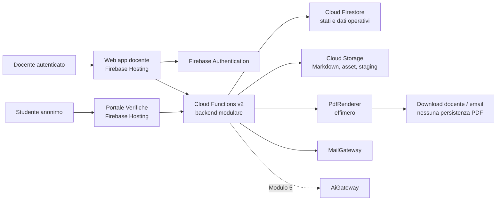
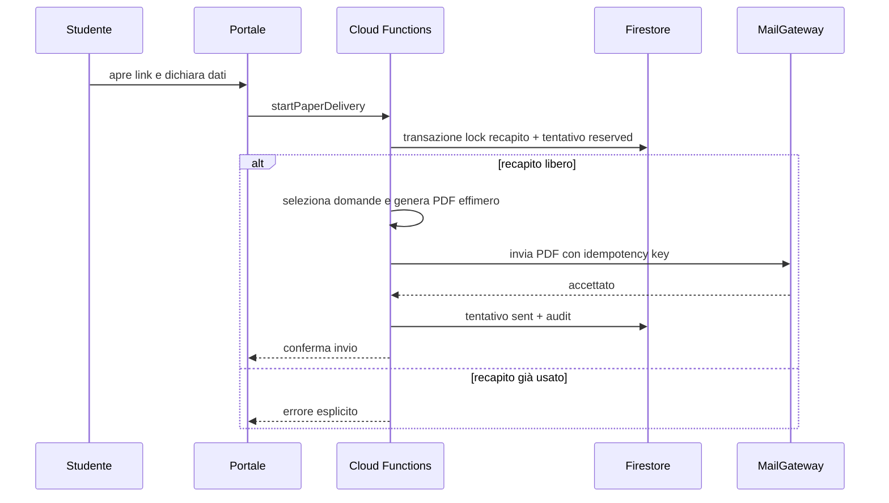

# SchoolForge — Architettura di sistema

**Versione:** 3.1
**Data:** 24 giugno 2026
**Stato:** architettura target Firebase, pronta per il piano esecutivo
**Input vincolanti:** `brief.md` e `analisi-requisiti.md` v3.0
**Destinatari:** implementazione e Docente responsabile operativo

---

## 1. Scopo e perimetro

SchoolForge è un'applicazione web serverless per un solo docente, composta da un pannello docente e da un Portale Verifiche separato. La piattaforma scelta è Firebase, su un progetto di proprietà del Docente.

Firebase è usato per Hosting, Authentication, Cloud Firestore, Cloud Storage e Cloud Functions v2. Cloud Logging e Secret Manager supportano osservabilità e gestione dei segreti. Il piano operativo deve essere Blaze: il prodotto usa funzioni backend, invio email, backup e servizi gestiti che non devono dipendere dai limiti del piano gratuito.

Il piano Blaze non significa progettare una piattaforma costosa: SchoolForge usa solo servizi managed, senza VM, database SQL, container sempre accesi, code dedicate o componenti enterprise. Hosting e funzioni devono scalare a zero; bucket e backup usano lifecycle; il Docente configura budget e avvisi di spesa prima del go-live. Il sistema non promette costo zero, perché backend e invio email possono generare consumo, ma ogni costo aggiuntivo deve essere giustificato da un requisito reale.

Il progetto non richiede Google Workspace for Education, Google Drive API o account Google per gli studenti. Il Drive dell'istituto è una destinazione manuale per gli export scaricati dal docente.

### 1.1 Localizzazione e limite della dichiarazione geografica

Cloud Firestore, Cloud Storage e Cloud Functions v2 devono essere configurati in Milano, `europe-west8`, ove il singolo servizio lo supporta. Questa è la regione dei dati applicativi persistenti, dei file didattici e del runtime di business.

Firebase Hosting usa una CDN gestita e Firebase Authentication ha caratteristiche proprie di trattamento/localizzazione. L'architettura non dichiara quindi che ogni richiesta, controllo di identità o cache tecnica avvenga esclusivamente in Italia. Prima dell'invio di dati studenti a un provider AI resta inoltre obbligatoria C-02.

### 1.2 Esito atteso

L'implementazione deve consentire al docente di:

1. accedere con un provider Firebase Authentication configurato senza vincolo Workspace;
2. caricare, validare, consultare ed esportare Markdown, pool e asset;
3. attivare verifiche con configurazione immutabile;
4. inviare un PDF cartaceo a un recapito dichiarato oppure raccogliere svolgimenti digitali;
5. correggere e rettificare consegne digitali;
6. esportare tutte le consegne digitali definitive dai rispettivi snapshot;
7. usare facoltativamente l'AI solo per la correzione nel Modulo 5.

## 2. Principi architetturali

| Principio | Decisione concreta |
|---|---|
| Markdown-first | Markdown e asset originali vivono in Cloud Storage; Firestore contiene indice, stati e dati operativi. |
| Monolite modulare | Due SPA e un solo backend Cloud Functions con moduli di dominio, non microservizi. |
| Backend autorevole | Solo Cloud Functions applica transizioni, punteggi, invii, audit, export e accessi ai dati privati. |
| Single-docente | Un solo `ownerUid` Firebase è autorizzato nel pannello docente; nessun tenant, delega o ruolo aggiuntivo. |
| Studente senza account | Il Portale usa un link di verifica non enumerabile; l'email è un recapito e non viene usata come autenticazione. |
| PDF effimero | PDF cartacei ed export sono generati on-demand e non scritti in Firestore, Cloud Storage o Drive. |
| Snapshot al tentativo | Configurazione della verifica immutabile all'attivazione; snapshot completo solo quando parte un tentativo digitale. |
| AI opzionale | L'AI è disabilitata per default, non genera domande e non è una dipendenza dei flussi manuali. |
| Dati nella regione scelta | Firestore, Storage e Functions usano `europe-west8` ove supportato; backup ed esercizio seguono C-01 formalizzata. |
| Disciplina di costo | Nessuna risorsa sempre attiva; preferenza per quote incluse, scale-to-zero, lifecycle e avvisi budget. |

## 3. Decisioni architetturali

### ADR-01 — Firebase come piattaforma gestita

**Decisione.** SchoolForge usa Firebase come piattaforma applicativa e Google Cloud come infrastruttura sottostante. Il progetto Firebase, il billing e gli accessi amministrativi sono di proprietà del Docente responsabile operativo.

**Motivazione.** Per una V1 single-docente Firebase riduce il lavoro di provisioning: hosting HTTPS, autenticazione, database, object storage, funzioni, emulatori e osservabilità sono integrati. Firestore è sufficiente ai flussi previsti, inclusa la garanzia di email bruciata tramite transazioni.

**Conseguenza.** Non è prevista una portabilità automatica del runtime. La portabilità richiesta riguarda Markdown, asset, dati operativi ed export; non richiede di eseguire SchoolForge su un secondo cloud senza migrazione.

### ADR-02 — Monolite modulare Cloud Functions v2

**Decisione.** Il backend è un solo progetto TypeScript su Cloud Functions v2, con moduli Repository, Verifiche, Portale, Correzione, Export, Audit, Mail e AI. Le funzioni pubbliche sono endpoint sottili; le regole di business vivono in servizi interni condivisi.

**Motivazione.** Il volume e il numero di utenti non giustificano microservizi, code dedicate o VM permanenti. Il codice resta organizzato per dominio e testabile in Emulator Suite.

### ADR-03 — Firestore operativo, Cloud Storage canonico

**Decisione.** Cloud Storage conserva Markdown originali, asset e staging temporaneo. Cloud Firestore conserva metadati, indici, configurazioni, tentativi, snapshot digitali, correzioni, audit e lock delle email.

**Motivazione.** I file sono la conoscenza del docente; il database serve a rendere disponibili operazioni, ricerca e integrità senza trasformarsi nella fonte dei contenuti didattici.

### ADR-04 — Firebase Authentication per il solo docente

**Decisione.** Il pannello docente usa Firebase Authentication con un provider configurato dal Docente. Il backend confronta `request.auth.uid` con `settings/owner.ownerUid`. Google Sign-In può essere configurato ma non è richiesto; nessun controllo di dominio Workspace è ammesso.

**Motivazione.** L'app deve proteggere un unico proprietario senza imporre il tipo di account di scuola.

### ADR-05 — Portale pubblico e tentativi anonimi

**Decisione.** Il link pubblico contiene un token casuale ad alta entropia associato a una verifica attiva. Lo studente dichiara i dati richiesti; il backend crea un tentativo solo dopo aver applicato la regola email bruciata. Un token opaco di ripresa è consegnato nel browser per le sole bozze digitali.

**Motivazione.** L'email non deve diventare una finta autenticazione. Il token link limita l'enumerazione delle verifiche; il token di ripresa consente refresh nello stesso browser senza creare un secondo tentativo.

### ADR-06 — Immutabilità configurazione, snapshot al tentativo

**Decisione.** L'attivazione congela configurazione, fonti, regole di selezione e stato della verifica, ma non copia tutte le domande. Al primo avvio digitale il backend seleziona dalle fonti correnti e salva lo snapshot delle domande effettivamente assegnate, incluse soluzioni private e punteggi massimi.

**Motivazione.** Una lezione modificata può cambiare le future generazioni, come scelto nel brief. Correzione ed export restano però possibili perché lavorano sullo snapshot dell'istanza svolta.

### ADR-07 — MailGateway e PDF senza persistenza

**Decisione.** Il PDF cartaceo è generato nel backend e passato a un `MailGateway` con chiave di idempotenza del tentativo. Il provider email concreto resta una configurazione tecnica protetta in Secret Manager; nessun PDF viene salvato come oggetto o allegato interno prima/dopo l'invio.

**Motivazione.** L'email bruciata deve evitare doppie emissioni concorrenti, senza creare un archivio PDF in contrasto con il brief.

### ADR-08 — Export globale da snapshot digitali

**Decisione.** `Esporta verifiche` legge tutte le consegne digitali definitive non annullate o eliminate e i relativi snapshot in Firestore. `DocumentRenderer` produce un unico PDF, Markdown o altro formato standard deciso successivamente e lo trasmette al browser del docente senza persisterlo.

**Motivazione.** L'archivio didattico esportato non dipende da Markdown correnti, pool, lezioni eliminate o Drive API.

## 4. Architettura logica



### 4.1 Confini di responsabilità

| Componente | Responsabilità | Non deve fare |
|---|---|---|
| Web app docente | UI, rendering sicuro, import, anteprime, conferme e chiamate autenticate. | Scrivere direttamente Firestore, applicare stati, chiamare AI/email. |
| Portale Verifiche | Link pubblico, dati dichiarati, bozza, svolgimento, consegna e deterrenza. | Esporre soluzioni, correzioni, dati di altri tentativi o configurazioni interne. |
| Cloud Functions | Autorizzazione, dominio, transazioni, import/export, PDF, mail, audit e AI. | Fidarsi di valori calcolati dal browser o mettere segreti nel client. |
| Cloud Firestore | Stato operativo, indici, tentativi, snapshot digitali, correzioni, audit e lock email. | Diventare la fonte canonica delle lezioni o archiviare PDF. |
| Cloud Storage | Markdown, asset e staging temporaneo. | Conservare PDF cartacei o export didattici. |
| MailGateway | Accettare PDF effimero, destinatario e idempotency key. | Decidere domande, autorizzazioni o punteggi. |
| AiGateway | Correzione opzionale con contesto chiuso e audit. | Generare domande, usare web o eseguire azioni irreversibili. |

## 5. Architettura fisica e ambienti

| Livello | Servizio | Configurazione |
|---|---|---|
| Web app docente | Firebase Hosting | SPA TypeScript, HTTPS e cache asset con hash. |
| Portale | Firebase Hosting, seconda app | URL separato, mobile-first, nessuna sessione docente condivisa. |
| Identità docente | Firebase Authentication | Provider configurabile; `ownerUid` autorizzato lato server. |
| Backend | Cloud Functions v2 | TypeScript, `europe-west8` ove supportato, endpoint HTTP/callable. |
| Dati operativi | Cloud Firestore Native | Database in `europe-west8` (Milano). |
| File | Cloud Storage | Bucket privato in `europe-west8`, versioning e lifecycle di backup. |
| Segreti | Secret Manager | Credenziali provider email e AI; mai in Firestore o browser. |
| Osservabilità | Cloud Logging e Error Reporting | Log strutturati senza risposte o PDF. |

| Ambiente | Progetto Firebase | Dati |
|---|---|---|
| `dev` | Progetto separato + Emulator Suite | Solo fixture sintetiche e segreti di sviluppo. |
| `test` | Progetto separato o emulatori controllati | Dati di collaudo isolati. |
| `prod` | Progetto Firebase del Docente | Dati reali, regione Milano e backup attivi. |

`dev`, `test` e `prod` non condividono utenti, database, bucket, credenziali o token.

## 6. Dati e persistenza

### 6.1 Cloud Storage

```text
repository/current/{programId}/{udaId}/uda-XX-titolo.md
repository/current/{programId}/{udaId}/lezione-XXX-titolo.md
repository/current/{programId}/{udaId}/lezione-XXX-titolo.pool.md
repository/current/{programId}/{udaId}/assets/{relative-path}
staging/{importId}/...                       # eliminato dopo commit, annullamento o scadenza
repository-exports/{exportId}.zip            # temporaneo, eliminato dopo download
```

Cloud Storage versioning conserva versioni non correnti soltanto come protezione operativa/backup, non come funzionalità di cronologia visibile del prodotto. Una lifecycle policy elimina staging ed export temporanei e mantiene le versioni necessarie al periodo di backup stabilito.

### 6.2 Cloud Firestore

| Collezione | Dati principali | Regola |
|---|---|---|
| `settings/owner` | `ownerUid`, feature flag e configurazioni | Unico proprietario V1. |
| `programs`, `udas`, `lessons` | identificatori, titoli, percorsi Storage, validazione e ordine | Firestore è indice, non fonte Markdown. |
| `questionIndex` | `lessonId`, `questionRef`, tipo, difficoltà, peso e validità | Derivato dal pool valido. |
| `verifications` | configurazione immutabile, fonti, stato, token pubblico hashato | Stati `draft`, `active`, `closed`, `archived`. |
| `verifications/{id}/recipientLocks/{emailHash}` | hash recapito, canale, stato, tentativo e timestamp | Un documento per recapito normalizzato; creato in transazione. |
| `deliveryAttempts` | verifica, canale, dati dichiarati, stato, timestamp e idempotency key | Cartaceo: `reserved/sent`; digitale: `in_progress/submitted`. |
| `deliveryAttempts/{id}/snapshot/items` | domanda, opzioni, soluzione privata, punteggio massimo, origine | Creato solo per tentativo digitale. |
| `deliveryAttempts/{id}/answers` | risposta, stato bozza/consegnata e timestamp | Immutabile dopo consegna. |
| `corrections`, `correctionEvents` | punteggi, commenti, percentuale, origine e rettifiche | Eventi append-only. |
| `auditEvents` | attore, azione, oggetto, esito, motivazione, timestamp | Nessuna risposta completa nei log tecnici. |

### 6.3 Transazioni obbligatorie

| Evento | Garanzia del backend |
|---|---|
| Attivazione verifica | Transazione: valida configurazione, passa `draft → active`, fissa configurazione e scrive audit. |
| Avvio cartaceo | Transazione Firestore: verifica assenza lock, crea lock e tentativo `reserved`; l'invio idempotente marca `sent` oppure rilascia la riserva se fallisce prima dell'accettazione. |
| Avvio digitale | Transazione: verifica lock, crea tentativo, lock, snapshot e token di ripresa hashato. |
| Salvataggio bozza | Aggiorna solo il tentativo autorizzato dal token di ripresa; non seleziona nuove domande. |
| Consegna | Transazione: `in_progress → submitted`, rende snapshot/risposte immutabili e registra audit. |
| Rettifica | Inserisce evento con precedente/nuovo valore e ricalcola percentuale. |
| Eliminazione consegna | Rimuove dati personali, risposte e correzioni; preserva un audit non identificativo. |

## 7. Flussi applicativi

### 7.1 Accesso e importazione

1. Il docente si autentica tramite Firebase Authentication.
2. Cloud Functions verifica `uid == settings/owner.ownerUid` per ogni operazione privata.
3. Il docente carica file/asset nello staging con accesso temporaneo autorizzato.
4. `RepositoryService` valida il contratto UDA, lezione e pool; mostra errori prima del commit.
5. Dopo conferma, il backend promuove i file in `repository/current`, aggiorna Firestore e scrive audit.

### 7.2 Attivazione verifica

1. Il docente configura fonti, tipi, difficoltà, minimi, numero domande, varianti e canali.
2. `VerificationService` interroga `questionIndex` e valida la disponibilità corrente.
3. L'attivazione crea il token pubblico e congela configurazione/fonti, non le domande.
4. Una modifica successiva alle lezioni riguarda solo tentativi ancora non avviati.

### 7.3 Canale cartaceo



### 7.4 Canale digitale e snapshot

1. Lo studente apre una verifica attiva attraverso il token pubblico e dichiara i dati richiesti.
2. Il backend crea in transazione lock, tentativo, snapshot e token opaco di ripresa, salvato nel Portale in cookie sicuro.
3. Il Portale riceve solo la proiezione studente dello snapshot, senza soluzioni o opzioni corrette.
4. Le risposte sono salvate come bozza. Refresh o breve interruzione nello stesso browser recuperano il medesimo tentativo.
5. Alla consegna, backend e Firestore rendono i dati immutabili e avviano la disponibilità per la correzione.

### 7.5 Correzione ed export globale

1. Il docente assegna punteggi e commenti; `CorrectionService` calcola totale e percentuale.
2. `exportCompletedVerifications` seleziona tutte le consegne `submitted`, non annullate né eliminate.
3. `ExportService` combina dati dichiarati, metadati verifica, snapshot, risposte e correzioni nell'ordine `verifica → data di consegna`.
4. `DocumentRenderer` produce il documento nel formato stabilito in futuro, lo invia al browser del docente e lo elimina al termine della risposta.
5. Il docente carica il file manualmente nel Drive dell'istituto; nessuna chiamata Drive viene eseguita dall'applicazione.

## 8. API logiche e autorizzazione

| Area | Operazioni |
|---|---|
| Sessione | `getSession`, `getOwnerSettings` |
| Repository | `stageImport`, `previewImport`, `commitImport`, `replaceContent`, `deleteContent`, `exportRepository`, `exportProgrammaSvolto` |
| Verifiche | `createVerificationDraft`, `updateVerificationDraft`, `activateVerification`, `closeVerification`, `archiveVerification`, `generateTeacherPdf` |
| Portale | `getPublicVerification`, `startPaperDelivery`, `startDigitalAttempt`, `saveDraft`, `submitAttempt` |
| Correzione | `listSubmissions`, `getSubmission`, `setItemScore`, `rectifyScore`, `deleteSubmission` |
| Export | `exportCompletedVerifications` |
| AI futura | `proposeCorrection`, `approveCorrection`, `bulkApproveCorrections` |

Le API docente richiedono Firebase ID token e verifica server-side dell'`ownerUid`. Le API Portale ricevono token pubblico della verifica e, per una bozza, token opaco del tentativo. Le Security Rules negano l'accesso diretto del client a dati operativi, soluzioni, correzioni e audit; le scritture di dominio passano dalle Cloud Functions.

## 9. Sicurezza, backup e osservabilità

### 9.1 Controlli essenziali

- Il token pubblico non è derivato da titolo, id sequenziale o email.
- Il token di ripresa è `Secure`, `HttpOnly`, con `SameSite` appropriato, a vita limitata e memorizzato lato server solo come hash.
- Gli endpoint pubblici applicano rate limit e validazione del payload; questi controlli non trasformano l'email in autenticazione.
- Il renderer Markdown applica sanitizzazione/whitelist; i pool non sono renderizzati nel percorso di fruizione.
- Risposte, punteggi, email e PDF non sono inseriti nei log tecnici.
- Segreti email e AI vivono in Secret Manager e non raggiungono browser, Firestore, Markdown o repository Git.

### 9.2 Backup formalizzato

| Oggetto | Protezione |
|---|---|
| Cloud Firestore | Backup giornaliero automatizzato, conservazione minima 30 giorni e verifica periodica di restore. |
| Cloud Storage | Versioning degli oggetti e lifecycle coerente con 30 giorni minimi per versioni di backup; staging/export temporanei esclusi dalla conservazione. |
| Codice e configurazione | Repository Git e configurazione Firebase versionata; i segreti non sono inclusi. |
| Dati esportabili | Export repository, export tecnico dei dati e `Esporta verifiche` disponibili indipendentemente dai backup. |

L'RPO è 24 ore. L'RTO è best-effort: non esiste un SLA né una promessa quantitativa di ripristino. Il Docente possiede progetto, billing e credenziali, controlla lo stato dei backup e avvia o delega il ripristino quando necessario.

### 9.3 Osservabilità

Ogni Cloud Function registra `requestId`, modulo, azione, esito e durata. Error Reporting segnala fallimenti di importazione, PDF, invio email, consegna, export e AI. Le dashboard non devono contenere testo delle risposte o contenuti dei PDF.

## 10. Struttura del codice e test

```text
SchoolForge/
├─ apps/
│  ├─ teacher-web/                # SPA docente
│  └─ exam-portal/                # SPA Portale Verifiche
├─ functions/
│  └─ src/
│     ├─ api/                     # endpoint HTTP/callable sottili
│     ├─ modules/                 # repository, verifiche, portale, correzione, export, audit
│     ├─ adapters/                # Firebase Admin, Storage, MailGateway, AiGateway
│     └─ renderers/               # Markdown sicuro e documenti/PDF
├─ packages/
│  └─ lesson-contract/            # parser e validatore Markdown/pool v1
├─ firestore.rules
├─ storage.rules
├─ firestore.indexes.json
├─ firebase.json
└─ package.json
```

| Livello | Evidenza minima |
|---|---|
| Unit | Parser pool, selezione domande, punteggi, stati e renderer export. |
| Integration | Emulator Suite: Security Rules, transazioni lock email, import Storage e snapshot digitale. |
| End-to-end | Login docente, import, attivazione, invio cartaceo, svolgimento digitale, correzione ed export globale. |
| Sicurezza | Soluzioni non esposte, owner diverso rifiutato, token scaduto rifiutato e rate limit applicato. |
| Restore | Prova documentata di recupero Firestore/Storage secondo backup C-01. |
| AI futura | Contesto chiuso, nessun web, audit e blocco della correzione automatica prima di C-03. |

## 11. Tracciabilità e criteri di accettazione

| Requisito | Meccanismo |
|---|---|
| Markdown indipendente | Cloud Storage degli originali, parser condiviso ed export ZIP. |
| Docente senza vincolo Workspace | Firebase Authentication configurabile e `ownerUid` server-side. |
| Studenti senza account | Link pubblico, dati dichiarati e token di ripresa; nessuna registrazione. |
| Email bruciata | Lock Firestore creato in transazione per `verifica + email normalizzata`. |
| PDF non conservato | Renderer effimero, nessuna scrittura su Firestore/Storage/Drive. |
| Modifiche alle lezioni | Configurazione immutabile; snapshot creato solo al tentativo digitale. |
| Correzione | Snapshot privato, risposte immutabili, correzioni e rettifiche tracciate. |
| Esporta verifiche | Query di tutte le consegne definitive e renderizzazione dai loro snapshot. |
| AI opzionale | AiGateway isolato, feature flag e contesto chiuso. |

L'implementazione è conforme solo se dimostra che:

1. solo il `ownerUid` configurato accede ai dati applicativi privati;
2. Firestore, Storage e Functions applicativi usano Milano `europe-west8` ove supportato;
3. Markdown e asset restano esportabili e leggibili fuori da SchoolForge;
4. il Portale non usa account studenti e non espone soluzioni;
5. il lock Firestore impedisce tentativi concorrenti sul medesimo recapito, anche fra canali;
6. PDF cartacei ed export sono creati senza persistenza;
7. una consegna digitale conserva snapshot e risposte immutabili dopo l'invio;
8. `Esporta verifiche` include tutte e sole le consegne definitive non annullate, dai relativi snapshot;
9. backup giornalieri, RPO 24 ore e almeno una prova di restore risultano documentati;
10. AI non genera domande e resta estranea ai moduli manuali.

---

## Appendice A — Decisioni residue

| ID | Decisione | Effetto |
|---|---|---|
| C-02 | Provider AI, condizioni e residenza dati. | Modulo 5 non viene attivato. |
| C-03 | Regola didattica per correzione automatica. | Rimane disponibile solo la modalità assistita. |

Piano di implementazione, contratti API, sicurezza, test, glossario, diagrammi e README devono essere riallineati a questa architettura Firebase prima dell'avvio del codice.
