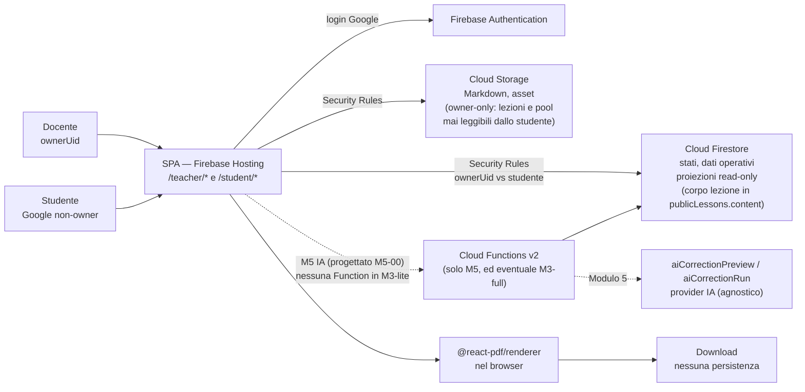
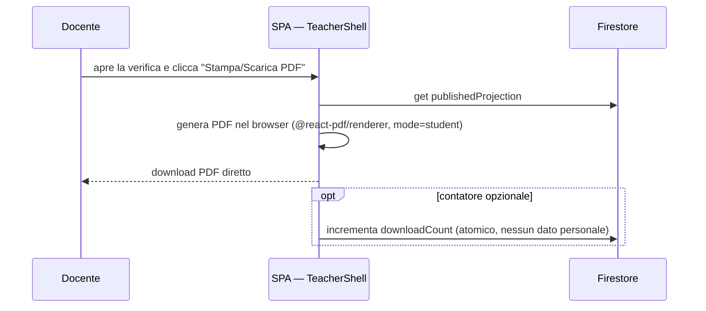
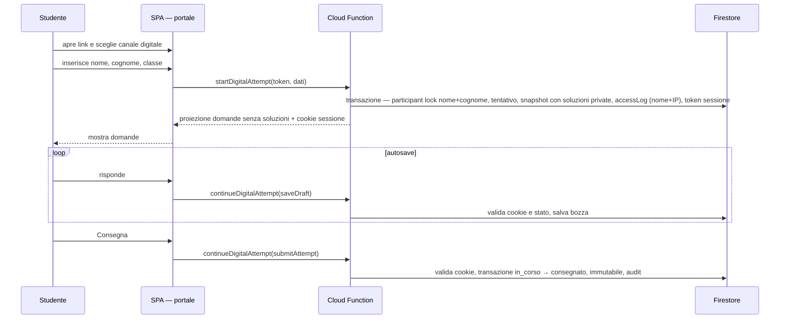

# SchoolForge — Architettura di sistema

**Versione:** 5.0
**Data:** 8 luglio 2026
**Stato:** architettura target, pronta per il piano esecutivo
**Input vincolanti:** `brief.md` e `analisi-requisiti.md`
**Destinatari:** implementazione e Docente responsabile operativo

---

## 1. Scopo e perimetro

SchoolForge è un'applicazione web Firebase-first per un solo docente, con un portale studente autenticato in sola lettura da M3-lite. È composta da una **singola SPA** con due sezioni distinte, entrambe dietro login Firebase Authentication:

- **Sezione docente** (`/teacher/*`, TeacherShell) — autenticata con l'account del Docente proprietario, desktop-first.
- **Sezione studente** (`/student/*`, StudentShell) — autenticata con Google (M3-lite), mobile-first, in sola lettura.

Il precedente `/exam/:token` (portale pubblico anonimo, mai implementato) resta descritto solo come specifica di un eventuale **M3-full** (§3, ADR-06) e non è la modalità di accesso di M3-lite.

Firebase Hosting serve la SPA. Firebase Authentication protegge sia la sezione docente sia la sezione studente. Cloud Firestore e Cloud Storage gestiscono dati e file. M3-lite non richiede il piano Blaze: usa solo Security Rules e letture client. Il piano Blaze resta necessario per l'eventuale gateway Cloud Functions di un M3-full e per l'AI nel Modulo 5. Hosting, Auth, Firestore e Storage scalano a zero e usano le quote incluse per un singolo docente senza costi fissi significativi.

Il progetto non richiede Google Workspace for Education per il Docente né Google Drive API o invio di email. Da M3-lite gli studenti si autenticano con un account Google — personale o Google Workspace for Education, entrambi supportati senza distinzione — ma non hanno un account SchoolForge dedicato.

### 1.1 Localizzazione

La regione target PROD è **`europe-west8` (Milano)**, con Firestore, Storage e Functions co-locati, previa verifica di supporto prima del provisioning. **Stato DEV:** Cloud Storage e Function gateway sono in `us-central1`; Cloud Firestore è in `europe-west8` (tutto verificato — vedi `evidenze/hard-01c-region-matrix.md`). Firebase Hosting usa una CDN globale; Firebase Authentication ha proprie caratteristiche di localizzazione. Nessun dato DEV sarà migrato in PROD. **HARD-F02 è risolto.**

### 1.2 Esito atteso

L'implementazione deve consentire al docente di:

1. accedere con Firebase Authentication senza dipendenza da Google Workspace;
2. caricare, validare, consultare ed esportare Markdown, pool e asset;
3. attivare verifiche con configurazione e contenuti pubblicati immutabili, e pubblicarle/nasconderle allo studente in modo indipendente (`visibility`);
4. distribuire PDF della verifica — download diretto per il docente, per lo studente nel canale cartaceo, o per lo studente autenticato Google nel Portale M3-lite;
5. consentire a ogni studente Google autenticato di consultare in sola lettura le lezioni pubblicate e le verifiche visibili (M3-lite), senza Cloud Function;
6. raccogliere svolgimenti digitali con snapshot sicuro (M3-full, completato — Gate G5 superato);
7. correggere consegne digitali ed esportarle in PDF, Markdown e CSV (M4, dipende da M3-full completato; M4-00 ne definisce il contratto dati, non ancora implementato);
8. usare facoltativamente l'AI solo per la correzione nel Modulo 5.

---

## 2. Principi architetturali

| Principio | Decisione concreta |
|---|---|
| Markdown-first | Markdown e asset originali vivono in Cloud Storage; Firestore contiene indice, stati e dati operativi. |
| SPA unica | Una sola applicazione con routing `/teacher/*` e `/student/*`, entrambe autenticate; nessun deployment separato. Il vecchio `/exam/:token` pubblico anonimo resta solo specifica di un eventuale M3-full. |
| Client docente e client studente, entrambi entro Security Rules | Il docente scrive direttamente entro Security Rules; lo studente (M3-lite) legge in sola lettura entro Security Rules, senza alcuna Cloud Function. Un eventuale gateway Cloud Functions server-side resterebbe confinato a un M3-full con consegna online. |
| Single-docente, ruolo studente implicito | Un solo `ownerUid` Firebase è autorizzato nella sezione docente; ogni altro utente Google autenticato è risolto come studente in sola lettura (M3-lite). Nessun tenant, delega, ruolo docente aggiuntivo o account studente custom. |
| Studente autenticato con Google, senza account custom (M3-lite) | Lo studente accede con Firebase Authentication provider Google (account personale o Google Workspace for Education); nessuna registrazione, nessuna email dal sistema, nessun dato autodichiarato. Il vecchio modello nome+cognome autodichiarato con lock e link pubblico resta solo specifica di un eventuale M3-full. |
| PDF e documenti effimeri | PDF, export (PDF/Markdown/CSV) e programma svolto sono generati on-demand nel browser con `@react-pdf/renderer` e non scritti su Firestore o Cloud Storage, in nessun canale. |
| Visibilità separata dallo stato (M3-lite) | Ogni verifica ha `status` e `visibility` indipendenti; solo `attiva`+`public` è leggibile dallo studente. L'attivazione da sola non pubblica la verifica. |
| Proiezioni read-only per lo studente (M3-lite) | Lo studente non legge mai i documenti tecnici del docente (pool, `questionIndex`, snapshot con soluzioni); legge solo proiezioni pubbliche dedicate. |
| Snapshot pubblicato e al tentativo (M3-full) | L'attivazione congela configurazione e contenuti della verifica; un eventuale tentativo digitale M3-full salverebbe inoltre la prova assegnata con soluzioni private. |
| AI opzionale | Disabilitata per default, non genera domande, dipende da Cloud Functions solo nel Modulo 5 (fuori scope V1 / pianificato per V2). |
| Disciplina di costo | Nessuna risorsa sempre attiva; scale-to-zero, quota incluse, avvisi budget. M3-lite non introduce Cloud Functions; qualunque Function resta riservata a M3-full/M5 e va giustificata. |

---

## 3. Decisioni architetturali

### ADR-01 — Firebase come piattaforma gestita

**Decisione.** SchoolForge usa Firebase come piattaforma applicativa. Il progetto Firebase, il billing e gli accessi amministrativi sono di proprietà del Docente.

**Motivazione.** Per una V1 single-docente Firebase riduce il lavoro di provisioning: hosting HTTPS, autenticazione, database, object storage, funzioni, emulatori e osservabilità sono integrati. Firestore è sufficiente ai flussi previsti, incluse le proiezioni read-only di M3-lite e, se pianificato, il lock concorrente per nome+cognome e il log di accesso nome+IP di un eventuale tentativo digitale M3-full.

**Conseguenza.** La portabilità richiesta riguarda Markdown, asset e dati operativi in formato standard; non richiede eseguire SchoolForge su un secondo cloud senza migrazione.

### ADR-02 — SPA unica con routing

**Decisione.** Una sola applicazione React su Firebase Hosting, con routing `/teacher/*` (TeacherShell, autenticata Docente) e `/student/*` (StudentShell, autenticata Google, M3-lite). Entrambe le sezioni richiedono login; non esiste più una sezione pubblica anonima nella baseline corrente. Code splitting per mantenere il bundle dello studente leggero.

**Motivazione.** Due app separate richiedono due pipeline CI/CD, due configurazioni Hosting e duplicazione del codice condiviso (es. tipi, componenti UI). Con un singolo deployment il costo operativo è inferiore e la manutenzione è più semplice. La separazione di sicurezza è garantita dalle Security Rules e dalla risoluzione del ruolo (`ownerUid` vs. studente autenticato), non dalla separazione fisica dei deployment.

**Nota.** Il precedente routing pubblico `/exam/:token` non è mai stato implementato ed è superato da `/student/*` per M3-lite. Resta solo come possibile riferimento di specifica per un eventuale M3-full, non deciso.

### ADR-03 — Nessuna Cloud Function per M3-lite; gateway ed AI restano in Cloud Functions solo dove necessario

**Decisione.** M3-lite non usa Cloud Functions: la StudentShell legge Firestore e Cloud Storage direttamente dal client, entro Security Rules che distinguono `ownerUid` da qualunque altro utente autenticato. Le Cloud Functions restano riservate a:
- un eventuale gateway M3-full (specifica rinviata): `startDigitalAttempt`/`continueDigitalAttempt` per creare participant lock, tentativo, snapshot con soluzioni private, log accesso e token opaco di sessione, e per gestire ripresa/bozza/consegna autorizzate da un cookie HttpOnly;
- il modulo IA (M5): due Function `onCall` `aiCorrectionPreview`/`aiCorrectionRun` usano un contratto **provider-agnostic** e contesto chiuso. Il percorso reale impone auth/owner → config runtime/kill switch → classificazione e hard ceiling DEV → secret/grader → lease; `settings/aiConfig.model` è l'unica fonte del modello. `aiCorrectionRuns` è server-only e privacy-minimal, con selezione canonica, risultati ordinali ed `expireAt` a 30 giorni. Costi e ledger usano prenotazione crash-safe `reserved → pending`, retry applicativo unico (`SDK maxRetries: 0`) e accounting prudente. L’allowlist runtime accoppia in modo univoco Luna/`v5-2026-07-20-luna-dev` e nano/`v2-2026-07-17-hg-m5`, senza fallback automatico. Dopo benchmark, revisione docente e rollout controllato, Luna è operativo su DEV e **Gate G7 è PASS**; nano resta rollback esplicito.

- la pulizia degli appunti alla cancellazione del corso (**ANNOT-CLEANUP-01**): una Function `onCall` owner-only `cleanupProgramLessonNotes` (region `us-central1`, scale-to-zero) elimina appunti e indici degli studenti via Admin SDK quando il docente elimina un corso. Serve una Function perché il docente non può — e non deve — interrogare via Rules gli indici note di tutti gli studenti: l'Admin SDK bypassa le Rules senza concedere accesso ai contenuti. Strategia indicizzata: **una** collection-group query su `lessonNoteIndexes` per `programId`, supportata dall'indice single-field esplicito `COLLECTION_GROUP` in `firestore.indexes.json`; path note costruiti da `studentUid` + `lessonIds` (i `lessonNotes` non sono mai letti), validazione fail-closed (segmenti Firestore validati senza normalizzazione, input callable realmente chiuso), delete in chunk di 400 (prima le note poi gli indici), idempotente ma non globalmente atomica (un retry completa la pulizia). Invocata da `deleteProgram` prima di qualsiasi operazione distruttiva sul corso: se fallisce, il corso resta integro e riprovabile. Nessun indice composito, nessuno scheduler/polling/TTL. Costo solo alla cancellazione: `S` read indice + `N` delete note + `S` delete indice.

Le operazioni docente (import, pubblicazione, correzione, export) e le letture studente di M3-lite usano Firebase SDK direttamente dal client con Security Rules.

**Motivazione.** M3-lite non ha bisogno di un write path autorizzato lato server perché non scrive nulla: legge soltanto proiezioni pubbliche già congelate dal docente. Un eventuale cookie HttpOnly per M3-full non sarebbe comunque disponibile alle Firestore Security Rules, per cui quel write path (se realizzato) passerebbe dal server. Il resto del prodotto resta client-first, evitando Functions dove non aggiungono integrità o sicurezza.

**Conseguenza.** M3-lite non aggiunge costo Cloud Functions. Se M3-full verrà realizzato, il costo resterà trascurabile per un singolo docente; le Security Rules dovranno comunque essere progettate con cura e i test Emulator Suite restano obbligatori per ogni percorso, incluso M3-lite.

### ADR-04 — Firestore operativo, Cloud Storage canonico

**Decisione.** Cloud Storage conserva Markdown originali e asset. Cloud Firestore conserva metadati, indici, configurazioni, tentativi, snapshot digitali, correzioni e audit.

**Motivazione.** I file sono la conoscenza del docente; Firestore serve a rendere disponibili operazioni, ricerca e integrità senza diventare la fonte dei contenuti didattici.

### ADR-05 — Firebase Authentication per il docente e per lo studente (M3-lite)

**Decisione.** Sia la sezione docente sia la sezione studente usano Firebase Authentication. Per il docente, il client verifica che `auth.uid == ownerUid` nelle Security Rules per ogni scrittura sensibile; le Function AI verificano lo stesso vincolo server-side. Per lo studente (M3-lite), il provider abilitato è Google: qualunque `auth.uid` autenticato e diverso da `ownerUid` è risolto lato client come *ruolo* studente (instradato su StudentShell), ma questo risolve solo il ruolo UI, non l'autorizzazione — vedi ADR-14 per il gate di approvazione che le Security Rules applicano effettivamente prima di concedere qualunque lettura sulle proiezioni pubbliche di ADR-12. Il provider Google supporta sia account Google personali sia account Google Workspace for Education, senza distinzione né requisiti di dominio in questa fase.

**Motivazione.** L'app deve proteggere un unico proprietario senza imporre il tipo di account di scuola, e deve poter riconoscere in modo affidabile "qualunque altro utente scolastico" senza costruire un sistema di account separato: l'identità Google del dispositivo istituzionale o personale dello studente è sufficiente per un portale in sola lettura.

**Conseguenza.** Non esiste più un accesso anonimo alla sezione studente. Un eventuale gateway M3-full (ADR-06) non richiederebbe comunque un account studente: autorizzerebbe una sessione opaca separata dall'identità Google, oppure verrebbe rivalutato per riusare l'identità Google già introdotta da M3-lite — decisione non presa.

### ADR-06 — M3-full: portale pubblico e token di sessione (specifica rinviata)

> Questo ADR descrive la specifica di un eventuale **M3-full**, fase successiva a M3-lite e non pianificata in dettaglio. Non si applica a M3-lite, che non usa link pubblici né dati autodichiarati (vedi ADR-05, ADR-06b).

**Decisione (rinviata).** Il link pubblico conterrebbe un token casuale ad alta entropia associato a una verifica attiva. Lo studente dichiarerebbe nome e cognome; `startDigitalAttempt` creerebbe in transazione un participant lock per verifica+nome/cognome normalizzati, il tentativo, lo snapshot e il log di accesso (nome+IP+user-agent+timestamp), poi restituirebbe un token opaco di ripresa come cookie sicuro.

**Motivazione.** Il token di sessione dovrebbe essere firmato server-side per impedire forgery. Il cookie HttpOnly/Secure/SameSite garantirebbe che il token non sia leggibile da JavaScript. Poiché le Security Rules non possono verificare un cookie, avvio, ripresa, bozza e consegna passerebbero da un gateway server-side dedicato a M3-full.

### ADR-06b — M3-lite: ruolo risolto da Google Auth, nessun link pubblico

**Decisione.** M3-lite non usa token pubblici, link non enumerabili o dati autodichiarati. L'accesso allo studente richiede login Google; il ruolo è risolto lato client e verificato lato Security Rules confrontando `request.auth.uid` con `ownerUid` (letto server-side dalle regole tramite `get()`, senza richiedere che lo studente possa leggere l'intero documento `settings/owner`). Per la sola convenienza di routing UI, un documento pubblico minimo (`settings/ownerPublic`, contenente esclusivamente `ownerUid`) è leggibile da qualunque utente autenticato; l'autorizzazione reale sulle risorse protette resta comunque decisa dalle Security Rules di ciascun percorso, non dal valore letto dal client.

**Motivazione.** Evitare qualunque forma di link segreto o dato autodichiarato per un portale in sola lettura riduce la superficie di attacco (niente enumerazione di token, niente impersonificazione via nome dichiarato) e riusa un meccanismo di identità già gestito da Firebase Authentication.

### ADR-07 — Snapshot pubblicato (M2, attivo) ed equità (M3-full, specifica rinviata)

**Decisione.** L'attivazione di una verifica crea un `publishedSnapshot` privato con candidati, soluzioni e punteggi, più una proiezione pubblica `publishedProjection` senza soluzioni (introdotta in M2 per il canale cartaceo). Configurazione, fonti e regole diventano immutabili all'attivazione. M3-lite riusa `publishedProjection` per il download del PDF studente quando la verifica è anche `visibility = public` (ADR-12); non introduce uno snapshot aggiuntivo.

Un eventuale M3-full (specifica rinviata) selezionerebbe dal `publishedSnapshot` all'avvio digitale, salverebbe la prova assegnata in uno snapshot per tentativo e restituirebbe al client solo la proiezione senza soluzioni.

**Motivazione.** Una verifica deve restare equa e riproducibile mentre è aperta. In M3-lite questo si traduce semplicemente nel non esporre mai `publishedSnapshot` allo studente. In un eventuale M3-full, correzione ed export lavorerebbero sullo snapshot dell'istanza svolta; modifiche a lezioni e pool diventerebbero disponibili soltanto in una nuova bozza.

> **Nota di implementazione (M3-full realizzato).** L'implementazione M3-full effettivamente realizzata non introduce una collezione `publishedSnapshot` separata: il campo owner-only `teacherSnapshot` sul documento `verifications/{id}` gioca lo stesso ruolo (congelato all'attivazione, mai leggibile dallo studente). Fino al fix dello snapshot immutabile, `teacherSnapshot` conservava solo `questionRefs` (puntatori ai pool correnti) — un'incoerenza rispetto al principio di equità/riproducibilità sopra descritto, perché i PDF docente di una verifica già attivata rileggevano i pool *correnti*, non quelli al momento dell'attivazione. `teacherSnapshot.questions` (testo, opzioni e soluzioni congelati) chiude questo gap per ogni nuova attivazione: si veda `VerificationTeacherSnapshot`/`VerificationTeacherQuestionSnapshot` in `api-contract.md`. Le verifiche attivate prima di questo fix restano temporaneamente sul comportamento legacy (fallback ai pool correnti), senza migrazione automatica.

### ADR-08 — PDF e documenti generati nel browser

**Decisione.** Tutti i PDF (verifica docente, verifica studente cartaceo, programma svolto, export verifiche, Registro Correzioni) e gli altri formati di export (Markdown, CSV) sono generati nel browser con `@react-pdf/renderer` o equivalente. Nessun file generato viene scritto su Cloud Storage o Firestore.

**Motivazione.** Eliminare la generazione PDF server-side rimuove la necessità di Cloud Functions per questo scopo, abbatte i costi e semplifica l'architettura. Il browser moderno è in grado di generare PDF di qualità professionale senza infrastruttura server.

### ADR-09 — Secret Manager solo per M5

**Decisione.** Secret Manager non è usato nei Moduli 1–4. Il binding Functions v2 `OPENAI_API_KEY` è associato esclusivamente ad `aiCorrectionRun`; la chiave è letta solo dalla Function e mai da client, repository, Firestore o log.

**Motivazione.** Senza invio email e senza operazioni server-side che richiedano credenziali esterne nei primi quattro moduli, Secret Manager non ha giustificazione fino all'AI (M5/V2).

### ADR-10 — Export globale da snapshot digitali (dipende da M3-full)

**Decisione.** `Esporta verifiche` legge tutte le consegne digitali definitive non annullate o eliminate e i relativi snapshot in Firestore. Il client produce PDF, Markdown o CSV nel browser e lo scarica senza persistenza. Questa funzione richiede le consegne prodotte da un eventuale M3-full; M3-lite non le produce.

**Motivazione.** L'archivio didattico esportato non dipende da Markdown correnti, pool, lezioni eliminate o Drive API.

### ADR-11 — Visibilità atomica dell'import

**Decisione.** Ogni import usa un nuovo `importId`: file e indici sono preparati in percorsi isolati. Solo al termine una transazione Firestore aggiorna `programs/{programId}.activeImportId` e l'audit. L'applicazione legge esclusivamente l'import puntato.

**Motivazione.** Cloud Storage e Firestore non condividono una transazione. Separando upload e commit di visibilità, un errore lascia in uso il contenuto precedente senza introdurre Functions o costi ricorrenti.

### ADR-11b — Append staged di una singola UDA (TWU-04B)

**Decisione.** «Importa UDA» aggiunge **una sola UDA** all'`activeImportId` esistente senza cambiarlo. Il `UdaDoc` è il **commit marker**: lezioni e `questionIndex` sono scritti in staging chunked prima del commit ma restano logicamente invisibili finché la UDA non ha il suo `UdaDoc`; il commit finale crea in **una transazione** `UdaDoc` + tutte le `publicLessons` e aggiorna i metadata. Una **lease singola** sull'import (`udaAppendLease`) esclude append concorrenti e blocca create/reorder/delete UDA finché è valida; i reader ordinari intersecano lezioni e UDA già caricate (`committedUdas.ts`) senza query aggiuntive. Upload esclusivamente via SGW same-origin (concorrenza 3); cleanup pre-commit idempotente limitato al manifest del tentativo, mai ai dati preesistenti.

**Motivazione.** L'append diretto riusa path, editor, cancellazione ed export import-scoped senza riscrivere il corso, mantenendo l'invisibilità atomica per lo studente (nessuna proiezione parziale) e senza nuove Function, Rule o indici. Storage e Firestore restano non-transazionali insieme: la sicurezza deriva dall'assenza del commit marker e dalla cleanup manifest-based, non da un rollback distribuito.

### ADR-12 — Proiezioni read-only dedicate per lo studente (M3-lite)

**Decisione.** Lo studente non riceve mai accesso in lettura ai documenti tecnici del docente: `lessons` (con `poolPath`/`poolStatus`/`poolErrors`), `questionIndex`, `verifications/*/publishedSnapshot`. Per ogni dato che deve essere leggibile dallo studente, il sistema mantiene una proiezione pubblica dedicata, scritta dal client docente nello stesso flusso che scrive il documento tecnico:

- **Lezioni**: `publicLessons/{lessonId}` — `id`, `programId`, `udaId`, `title`, `order`, `contentPath` (percorso Storage del file lezione `.md` canonico, letto solo dal docente e dal backfill owner-only) e, dal M3F-08, `content` (il corpo Markdown stesso, unica fonte di lettura per lo studente — vedi ADR-16 sotto).
- **Verifiche**: riusa `verifications/{id}` (campi non sensibili: titolo, stato, visibilità) e `verifications/{id}/publishedProjection` già introdotti in M2, resi leggibili allo studente solo quando `status == 'attiva' && visibility == 'public'` (ADR-13).

In entrambi i casi, "agli utenti autenticati non-owner" della prima versione di questo ADR è stato sostituito dal gate di approvazione di ADR-14: la discovery Firestore richiede anche `students/{uid}.status == 'approved'` e `settings/studentAccess.studentPortalEnabled == true`. Dal M3F-08 (ADR-16) Storage non concede più alcuna lettura a un non-owner: il client studente non chiama mai Storage, e legge il corpo lezione esclusivamente da `publicLessons.content`.

**Motivazione.** Le Firestore Security Rules autorizzano per documento, non per campo: separare i dati tecnici (pool, indici, soluzioni) dalla proiezione pubblica in documenti diversi permette regole semplici e verificabili, senza dover filtrare campi lato client né introdurre una Cloud Function di proiezione.

**Conseguenza.** Il docente scrive due documenti coerenti per ogni lezione importata (tecnico + proiezione pubblica) nello stesso import isolato descritto in ADR-11; nessuna Cloud Function è necessaria perché la scrittura resta client-side entro le stesse Security Rules.

### ADR-13 — Visibilità della verifica separata dallo stato (M3-lite)

**Decisione.** Il documento `verifications/{id}` guadagna un campo `visibility: 'hidden' | 'public'`, indipendente da `state`. All'attivazione, `visibility` è impostata a `hidden`; il docente la commuta esplicitamente in `public` per renderla visibile allo studente, e può tornare a `hidden` senza perdere lo stato `attiva`. Le Security Rules concedono allo studente la lettura di `verifications/{id}` e della sua `publishedProjection` solo quando `state == 'attiva' && visibility == 'public'`.

**Motivazione.** Attivare una verifica (creare lo snapshot pubblicato, renderla immutabile) e renderla visibile allo studente sono due decisioni distinte del docente: un docente potrebbe voler preparare e congelare una verifica prima di distribuirla, o nasconderla temporaneamente senza chiuderla.

### ADR-14 — Modello di approvazione studente: autenticazione Google non è autorizzazione (M3-lite)

**Decisione.** ADR-05 e ADR-06b (sopra) descrivono la risoluzione del *ruolo* (docente vs. studente) da `auth.uid` rispetto a `ownerUid`: questo distingue il proprietario da chiunque altro, ma non autorizza da solo alcuna discovery. Un utente Google non-owner è un *richiedente/studente potenziale* finché non viene esplicitamente approvato dal docente in `students/{uid}` (`status: "pending" | "approved" | "blocked"`), e finché il portale studente non è globalmente attivo in `settings/studentAccess.studentPortalEnabled`. Ogni discovery studente (`programs`, `publicLessons`, `verifications/*/publishedProjection`) richiede entrambe le condizioni contemporaneamente; l'assenza di uno dei due documenti nega per difetto, non richiede una migrazione o un caso speciale. Dal M3F-08 (ADR-16) questo è anche l'unico gate per il corpo lezione, perché Storage non concede più letture a un non-owner.

**Motivazione.** La prima versione di M3L-A (ADR-05/ADR-12/ADR-13) trattava "autenticato con Google, non-owner" come sufficiente per leggere le proiezioni pubbliche. Una revisione di sicurezza successiva ha stabilito che questo espone il Portale a chiunque possieda un account Google (personale o Workspace), non solo agli studenti effettivi del docente: un dominio Workspace condiviso con altri utenti, o un link della SPA girato per errore, avrebbe concesso lettura senza alcun controllo del docente. Introdurre un passaggio di approvazione esplicito, verificato dalle Firestore Security Rules a ogni discovery (non solo un controllo lato client), chiude questa esposizione senza introdurre Cloud Functions. Una prima implementazione duplicava il controllo anche in Storage tramite letture cross-service; è stata rimossa dopo il deploy DEV perché generava `403` non riproducibili in locale — vedi ADR-16 per come M3F-08 chiude il gap residuo che quella rimozione aveva lasciato.

**Conseguenza.** La UI di gestione studenti (creare/approvare/bloccare uno studente, assegnare una classe) è implementata in M3-lite; il docente non scrive Firestore a mano. Il limite residuo storico (un `contentPath` esatto, conosciuto o indovinato, era leggibile da Storage anche senza superare la discovery Firestore) è chiuso dal M3F-08 — vedi ADR-16 e `sicurezza.md` §3.2a.

### ADR-15 — Filtro per classe di lezioni e verifiche (M3-lite implementato)

> Questa sezione descrive il modello attuale di M3-lite.

**Decisione.** Oltre al gate approved+portale attivo (ADR-14), un programma è visibile a uno studente solo se ha almeno una classe assegnata che include la classe dello studente (`students/{uid}.classId`); una verifica è visibile solo se ha un `classId` assegnato e coincidente. Un programma senza classi assegnate, o una verifica senza `classId`, non sono mai visibili ad alcuno studente, anche se altrimenti pubblici.

**Motivazione.** Un docente con più classi deve poter distribuire contenuti e verifiche diverse a classi diverse, senza dover creare account o portali separati.

### ADR-16 — Proiezione sicura del corpo lezione in Firestore, chiusura dell'accesso studente a Storage (M3F-08)

**Decisione.** `publicLessons/{lessonId}` include ora `content?: string`, il corpo Markdown della lezione destinato allo studente (mai pool, soluzioni, `questionIndex` o metadati tecnici), sincronizzato da ogni percorso che scrive una lezione (import, creazione, modifica del corpo — vedi `api-contract.md`). Il client studente legge il corpo esclusivamente da questo campo: nessuna chiamata a Cloud Storage, nessun fallback su `contentPath`. `storage.rules` smette di concedere qualunque lettura sotto `repository/{ownerUid}/**` a un non-owner — quell'albero (Markdown lezione e pool) diventa owner-only senza eccezioni.

**Motivazione.** ADR-14/ADR-15 (M3L-C) avevano già chiuso la *discovery* Firestore per classe/approvazione, ma Storage restava un secondo hop che non ripeteva quel controllo (per evitare le letture cross-service che in produzione causavano `403` non riproducibili — vedi ADR-14). Questo lasciava un gap accettato ma reale: un `contentPath` esatto, conosciuto o indovinato, bypassava interamente la discovery. La Modalità verifica (M3F-07) rendeva il gap più visibile, perché negava la discovery ma non la lettura diretta. Spostare il corpo lezione dentro Firestore stesso — il servizio su cui tutte le altre Security Rules già operano — elimina la necessità di un secondo hop verso Storage per lo studente, e permette di restringere Storage a owner-only senza introdurre alcuna lettura cross-service.

**Conseguenza.** Storage resta la sorgente canonica del Markdown per il docente in scrittura/editor, import ed export ZIP, e per il backfill owner-only; `publicLessons.content` è sempre una proiezione derivata, mai la fonte di verità. Dal MOB-01C, però, la sola **consultazione** del corpo lezione nel workspace docente (`CourseWorkspace`) legge in via primaria `publicLessons/{lessonId}.content` con un solo `getDoc` deterministico (validato per `ownerUid`/`programId`/`importId`), e usa la lettura Storage `getBytes` solo come **fallback legacy** quando la proiezione è assente/non valida/incoerente: questo elimina il timeout `storage/retry-limit-exceeded` osservato su Brave mobile (Storage `getBytes` non completa il round-trip), mentre creazione, modifica del corpo, export e import continuano a passare da Storage. Un errore Firestore (transitorio o permission-denied) sul `getDoc` non ricade su Storage: mostra l'errore con "Riprova", per non mascherare problemi reali. Un limite dimensionale conservativo (700.000 byte UTF-8, ben sotto il limite Firestore di 1 MiB per documento) è validato a ogni scrittura. I documenti `publicLessons` scritti prima di M3F-08 non hanno `content`: sono validi ma il client li tratta come "proiezione non disponibile", mai come corpo vuoto, e un backfill idempotente owner-only li migra su richiesta esplicita del docente (mai automaticamente). Il rollout (deploy in ordine sicuro, backfill, poi Storage Rules restrittive) è documentato in `m3-full-roadmap.md` ed eseguito in M3F-11, non in questa milestone.

---

### ADR-17 — Repository Storage Gateway same-origin (SGW) — TARGET, non ancora implementato

**Contesto.** MOB-01C ha risolto solo la *consultazione* delle lezioni (via `publicLessons.content`). Tutti gli altri accessi Storage del docente restano **diretti** dal browser (`getBytes`/`uploadBytes`/`deleteObject`/`listAll`): pool, editing Markdown lezioni/UDA, import, export, eliminazioni, backfill, caricamento domande verifiche. Su **Brave mobile** le richieste dirette a `firebasestorage.googleapis.com` falliscono (`storage/retry-limit-exceeded`, HTTP 0, ~120 s), anche in scrittura.

**Decisione (approvata, NON ancora implementata).** Instradare tutti questi accessi attraverso un **gateway HTTPS same-origin**: `web app → /api/repository/* → Hosting rewrite → Cloud Function HTTPS 2ª gen → Admin SDK → Cloud Storage`. Autenticazione con Firebase ID token, accesso **solo al docente owner**, path obbligatoriamente sotto `repository/{ownerUid}/imports/…`, solo Markdown/pool UTF-8, nessun endpoint generico o student-facing. Poiché l'Admin SDK **bypassa le Storage Rules**, il gateway applica autonomamente vincoli equivalenti o più stretti. `minInstances: 0`, `maxInstances` basso, region pinnata al bucket. La consultazione ordinaria della lezione **resta Firestore-first**.

**Stato.** Contratto completo, API, sicurezza, costi, emulatori e roadmap SGW-01/02/03 in [storage-gateway-roadmap.md](storage-gateway-roadmap.md). **SGW-01 è implementato, deployato su DEV e verificato su Brave mobile** (Function `repositoryGateway` in `functions/`, client adapter in `apps/web/.../gateway/`, rewrite `/api/repository/**` in `firebase.json`, migrazione delle operazioni singolo-file: editing lezioni/UDA, pool, fallback lezione). Le operazioni batch/prefix restano accesso Storage diretto fino a **SGW-02**.

### ADR-18 — Contesto didattico della generazione IA dalla memoria del workspace (AIGEN-CONTEXT-01)

**Contesto.** La generazione IA di una lezione produceva contenuto poco delimitato: senza i metadati completi della lezione l'argomento restava vago, e senza alcuna nozione delle altre lezioni della stessa UDA il modello poteva ripetere ciò che precede o anticipare ciò che segue.

**Decisione.** Il payload `kind:'lesson'` trasporta (a) i **metadati completi** della lezione corrente come contratto didattico autorevole — titolo, difficoltà, concetti chiave, obiettivi, titolo UDA obbligatori; sottotitolo facoltativo — e (b) un **indice compatto dell'UDA** (`position` 1-based, `titolo`, `sottotitolo`). L'indice è costruito da un builder **puro** a partire dall'albero `tree.udas`/`tree.lessons` **già caricato** in `CourseWorkspace`: nessuna `getDoc`/`getDocs`, query, lettura Storage, listener, polling, Function o documento aggiuntivo, quindi **costo passivo invariato** e nessuna nuova superficie di accesso ai dati. L'indice delimita, non fornisce contenuto: non trasporta corpo Markdown, pool, domande, soluzioni, concetti/obiettivi delle altre lezioni né dati studente, e nessun ID tecnico — l'incremento di token è perciò limitato ai soli titoli.

**Conseguenze.** La validazione è **fail-closed** sul server (metadati obbligatori, ordine 1-based consecutivo, coerenza di `currentLessonPosition`, cap su numero di voci e dimensione, rifiuto di proprietà extra e ID tecnici); il preflight nel dialog è **solo UX** e serve a non consumare budget quando i metadati mancano. `difficolta` e `udaContext` entrano nell'`inputHash`, quindi partecipano a idempotenza e invalidazione della `requestId` come ogni altro campo. Nel prompt i metadati definiscono il **perimetro** e le indicazioni del docente restano autorevoli solo al suo interno; metadati e indice sono **dati**, mai istruzioni eseguibili. La generazione dei pool non è toccata.

---

## 4. Architettura logica


```mermaid
flowchart LR
    D["Docente\nownerUid"] --> SPA["SPA — Firebase Hosting\n/teacher/* e /student/*"]
    S["Studente\nGoogle non-owner"] --> SPA

    SPA -->|"login Google"| A["Firebase Authentication"]
    SPA -->|"Security Rules\nownerUid vs studente"| F["Cloud Firestore\nstati, dati operativi\nproiezioni read-only\n(corpo lezione in publicLessons.content)"]
    SPA -->|"Security Rules"| CS["Cloud Storage\nMarkdown, asset\n(owner-only: lezioni e pool\nmai leggibili dallo studente)"]
    SPA -.->|"M5 IA (progettato M5-00)\nnessuna Function in M3-lite"| CF["Cloud Functions v2\n(solo M5, ed eventuale M3-full)"]

    CF --> F
    CF -. "Modulo 5" .-> AI["aiCorrectionPreview / aiCorrectionRun\nprovider IA (agnostico)"]

    SPA --> PDF["@react-pdf/renderer\nnel browser"]
    PDF --> DL["Download\nnessuna persistenza"]
```

[→ Componenti frontend](diagrammi/component-frontend.md)

### 4.1 Confini di responsabilità

| Componente | Responsabilità | Non deve fare |
|---|---|---|
| SPA — sezione docente (TeacherShell) | UI, validazione locale lesson-contract, rendering Markdown sicuro, scritture Firestore/Storage entro le regole, generazione PDF/CSV/Markdown nel browser, pubblicazione/occultamento verifiche (`visibility`). | Esporre soluzioni, chiamare AI direttamente, bypassare Security Rules. |
| SPA — sezione studente (StudentShell, M3-lite) | Login Google, lettura read-only di lezioni pubblicate e verifiche `attiva`+`public` **quando approvato e portale attivo** (ADR-14), download PDF studente nel browser. | Scrivere qualunque dato, leggere pool/soluzioni/`questionIndex`/verifiche non pubbliche, chiamare Cloud Functions, presumere lettura dalla sola autenticazione Google. |
| Cloud Functions | Nessuna in M3-lite. M5/V2: chiamate AI con contesto chiuso e audit. Un eventuale M3-full (specifica rinviata) aggiungerebbe `startDigitalAttempt`/`continueDigitalAttempt` per participant lock, tentativo, snapshot con soluzioni private, log accesso, token sessione, ripresa/bozza/consegna. | Generare PDF, inviare email, gestire repository Markdown. |
| Cloud Firestore | Stato operativo, indici, proiezioni pubbliche read-only per lo studente **approvato**, registro approvazione (`students/{uid}`, `settings/studentAccess`), correzioni, audit; tentativi/snapshot digitali solo se M3-full verrà realizzato. | Diventare fonte canonica delle lezioni o archiviare PDF; esporre ai lettori studente documenti tecnici del docente; concedere lettura studente senza verificare approvazione. |
| Cloud Storage | Markdown e asset, sorgente canonica per il docente. Dal M3F-08 (ADR-16), owner-only: nessun non-owner legge alcun file, Markdown lezione incluso — il client studente legge il corpo lezione da `publicLessons.content` (Firestore), mai da Storage. | Conservare PDF o export didattici; concedere lettura di qualunque file allo studente; duplicare in Storage letture cross-service Firestore che in produzione hanno causato 403. |
| AiGateway (M5/V2) | Correzione con contesto chiuso e audit. | Generare domande, usare web, eseguire azioni irreversibili. |

---

## 5. Architettura fisica e ambienti

| Livello | Servizio | Configurazione |
|---|---|---|
| Applicazione web | Firebase Hosting | SPA TypeScript, HTTPS, code splitting `/teacher` e `/exam`. |
| Identità docente | Firebase Authentication | Provider configurabile; `ownerUid` verificato nelle Security Rules. |
| Backend (limitato) | Cloud Functions v2 | TypeScript; target PROD **UE**, ma la Function gateway su DEV è in `us-central1` (co-locata col bucket) — vedi `evidenze/hard-01c-region-matrix.md`. |
| Dati operativi | Cloud Firestore Native | Firestore DEV `europe-west8` verificata; target PROD `europe-west8`, da verificare prima del provisioning. |
| File | Cloud Storage | Bucket privato; su DEV in `us-central1` (verificato); target PROD **UE**. Versioning per backup. |
| Segreti | Secret Manager | Solo da M5 (V2): chiave API provider AI. |
| Osservabilità | Cloud Logging e Error Reporting | Log strutturati senza risposte o PDF. |

| Ambiente | Progetto Firebase | Dati |
|---|---|---|
| `dev` | Progetto separato + Emulator Suite | Solo fixture sintetiche. |
| `test` | Emulatori controllati | Dati di collaudo isolati. |
| `prod` | Progetto Firebase del Docente (`schoolforge-prod`, esistente ma **servizi non ancora provisionati**) | Dati reali; regione target **UE** da decidere prima del provisioning (HARD-F02); nessun dato DEV migrato; export Firestore manuale disponibile. |

`dev`, `test` e `prod` non condividono utenti, database, bucket o token.

---

## 6. Dati e persistenza

### 6.1 Cloud Storage

```text
repository/imports/{programId}/{importId}/{udaId}/uda-XX-titolo.md
repository/imports/{programId}/{importId}/{udaId}/lezione-XXX-titolo.md
repository/imports/{programId}/{importId}/{udaId}/lezione-XXX-titolo.pool.md
repository/imports/{programId}/{importId}/{udaId}/assets/{relative-path}
```

Non esistono PDF o export temporanei in Cloud Storage. Il client docente carica sotto un nuovo `importId`, separato dal Programma attivo. Una lifecycle policy e il comando docente di scarto eliminano import non attivi; il repository non espone una cronologia di prodotto.

Il `questionIndex` è riallineato esclusivamente tramite re-import tramite l'interfaccia. Modifiche dirette ai file in Cloud Storage senza re-import non sono supportate e lasciano l'indice desincronizzato. In caso di desincronizzazione, re-importare le lezioni interessate.

### 6.2 Cloud Firestore

[→ Diagramma ER](diagrammi/er-model.md)

| Collezione | Dati principali | Regola |
|---|---|---|
| `settings/owner` | `ownerUid`, feature flag, lista classi | Lettura e scrittura solo owner. |
| `settings/ownerPublic` | solo `ownerUid` | Lettura per qualunque utente autenticato (usata dal client per instradare TeacherShell/StudentShell); scrittura solo owner. Non sostituisce le Security Rules delle risorse protette. |
| `programs` | identificatori, titoli, `activeImportId`, validazione e ordine | Il puntatore rende visibile un solo import completo. Scrittura solo owner. |
| `programs/{id}/imports/{importId}` | metadati, UDA/lezioni tecniche e `questionIndex` derivato | Preparato isolatamente prima del commit di visibilità. Lettura solo owner: contiene `poolPath`/`poolStatus`/`poolErrors` e non è mai esposto allo studente. |
| `settings/studentAccess` (M3-lite) | `ownerUid`, `studentPortalEnabled`, `newStudentRequestsEnabled` | Interruttori globali del Portale studente (ADR-14). Lettura e scrittura solo owner; letto dalle Security Rules tramite `get()`/`firestore.get()`, mai dal client studente direttamente. Assente = portale considerato disattivato. |
| `students/{uid}` (M3-lite) | `uid`, `ownerUid`, `email`, `displayName` (identità Google verificata da Firebase, non autodichiarata), `status` (`pending`/`approved`/`blocked`), `classId` | Registro di approvazione (ADR-14). Gestito dalla UI docente Studenti; assenza del documento equivale a richiesta non approvata. |
| `publicLessons/{lessonId}` (M3-lite, `content` dal M3F-08) | `programId`, `udaId`, `title`, `order`, `contentPath` (solo file lezione, canonico, letto solo dal docente/backfill), `content?` (corpo Markdown — unica fonte per lo studente), `validationStatus` | Proiezione read-only priva di riferimenti al pool; scritta dal docente nello stesso flusso di import. Lettura solo per uno studente approvato con portale attivo (ADR-14); scrittura solo owner. |
| `verifications` | configurazione bozza o pubblicata, fonti, stato, `visibility` (`hidden`/`public`), classi, `downloadCount` | Stati `bozza`, `attiva`, `chiusa`, `archiviata`; immutabile dopo attivazione. Lettura completa solo owner; il documento padre non è mai leggibile dallo studente, nemmeno se `attiva`+`public` (vedi `publishedProjection` sotto). |
| `verifications/{id}` — `config.verificationDate` / `config.topicOutline` (UI-VERIFICHE-06B) | giorno didattico `YYYY-MM-DD` e perimetro didattico (soli titoli UDA/lezione) | Owner soltanto. La data è obbligatoria per le nuove verifiche e modificabile finché la verifica è in bozza; entrambi viaggiano nella **stessa** scrittura di titolo/classe/domande (nessuna write dedicata, nessun listener). Documenti preesistenti senza questi campi restano validi: nessuna migrazione, nessun fallback. |
| `verifications/{id}/teacherSnapshot` (campo, non sottocollezione) | domande e soluzioni congelate all'attivazione | Owner soltanto; mai leggibile dallo studente. Sostituisce nella pratica il precedente `publishedSnapshot/items` mai implementato — vedi ADR-07. |
| `verifications/{id}/publishedProjection/meta` | titolo, stato pubblico, `visibility`, canali e variante | Accessibile al canale cartaceo e, da M3-lite, allo studente approvato con portale attivo quando `state == 'attiva' && visibility == 'public'` (ADR-14). |
| `verifications/{id}/publishedProjection/items` | proiezione senza soluzioni della selezione comune | Stessa regola di accesso di `publishedProjection/meta`; usata sia dal cartaceo sia dal PDF studente M3-lite. |
| `submissions`, `submissionReceipts` (M3-full, completato) | risposte, stato, eventi attenzione (`submissions`); ricevuta minima post-consegna (`submissionReceipts`) | Path deterministico `${verificationId}_${studentUid}`. Owner legge tutte le submission della propria verifica; lo studente legge/scrive solo la propria finché `draft`, dopo `submitted` legge solo la receipt. Vedi `m3-full-roadmap.md`. |
| `corrections`, `correctionEvents`, `correctionReturns` (M4-00: contratto; M4-01: service+Rules, non ancora implementato) | punteggi per domanda, feedback, stato, totali derivati (`corrections`); rettifiche append-only (`correctionEvents`); proiezione minima restituita allo studente (`correctionReturns`) | `corrections/{submissionId}` (stesso id di `submissions`). Dipendono dalle consegne M3-full (completato); non popolate da M3-lite. |
| `auditEvents` | attore, azione, oggetto, esito, motivazione, timestamp | Nessuna risposta completa nei log. |

### 6.3 Transazioni obbligatorie

| Evento | Garanzia |
|---|---|
| Commit import | Il client carica e indicizza sotto un nuovo `importId`, scrivendo sia i documenti tecnici sia le proiezioni pubbliche (`publicLessons`); una transazione Firestore aggiorna soltanto `activeImportId` e audit. Il Programma precedente resta visibile finché il commit non riesce. |
| Attivazione verifica | Transazione client Firestore SDK: valida configurazione, crea `publishedSnapshot` e proiezione comune, passa `bozza → attiva`, imposta `visibility = hidden` e scrive audit. |
| Pubblica/nascondi verifica (M3-lite) | Transazione client Firestore SDK del docente: aggiorna solo `visibility` (`hidden ↔ public`) su una verifica `attiva`; non tocca configurazione, fonti o snapshot; scrive audit. |
| Download cartaceo | Nessun record di tentativo né voce `accessLog`. Opzionale: incremento atomico di `downloadCount` sul documento `verifications`. Nessun lock, nessun dato personale. |
| Download PDF studente (M3-lite) | Sola lettura di `verifications` (campi pubblici) e `publishedProjection` quando `state == 'attiva' && visibility == 'public'`; genera il PDF nel browser. Nessuna scrittura, nessun record, nessuna Cloud Function. |
| Rettifica (M4-01, non ancora implementato) | Correzione `completed`/`returned` riaperta a `in_progress` (`reopenCount` incrementato); un salvataggio successivo che cambia effettivamente un punteggio o un feedback scrive un evento append-only `correctionEvents` (`type: 'scoreAdjusted'`) con delta minimale per domanda, non l'intera valutazione; totali ricalcolati da `computeCorrectionTotals`. Dipende da consegne M3-full (completato). |
| Eliminazione consegna (fuori scope M4-00/M4-01) | Non implementata. |

> Avvio digitale, salvataggio bozza e consegna sono implementati (M3-full, completato): scritture client dirette su `submissions`/`submissionReceipts` validate da Security Rules, senza gateway Cloud Functions né cookie di sessione — vedi `m3-full-roadmap.md`. Il reset di una submission consegnata non è previsto: la consegna è immutabile per decisione di prodotto (D-M3F-04), non per un limite tecnico.

---

## 7. Flussi applicativi

### 7.1 Import lezioni

[→ Sequenza import lezione](diagrammi/sequence-import-lezione.md)

1. Il docente seleziona file o cartella nella SPA.
2. La SPA esegue il parser `lesson-contract` localmente e mostra errori strutturati prima di scrivere.
3. Il docente conferma: la SPA carica Markdown e asset sotto un `importId` isolato in `repository/imports/{programId}/{importId}` e prepara i relativi indici Firestore.
4. Una transazione Firestore aggiorna solo `programs/{programId}.activeImportId` e l'audit: da quel momento l'import è visibile all'applicazione.
5. In caso di errore prima del commit resta visibile l'import precedente; gli import non attivi sono eliminabili dal docente secondo la policy di lifecycle.

### 7.2 Attivazione verifica

1. Il docente configura fonti, tipi, difficoltà, minimi, varianti, classi mentre la verifica è in bozza.
2. La SPA interroga `questionIndex` e valida disponibilità localmente.
3. La transazione di attivazione crea il `publishedSnapshot` privato (fonti, regole, candidati e soluzioni) e la proiezione pubblica senza soluzioni (`publishedProjection`); imposta `visibility: "hidden"`; quindi porta la verifica a `attiva` e scrive audit.
4. Una verifica `attiva`, `chiusa` o `archiviata` è immutabile nella configurazione. Per riusarla o modificarla il docente duplica una nuova bozza. Il campo `visibility` resta modificabile. Il canale cartaceo e M3-lite sono disponibili solo con variante `tutte_uguali`.

### 7.3 Canale cartaceo

[→ Sequenza pubblicazione verifica](diagrammi/sequence-pubblicazione-verifica.md)

Il canale cartaceo è avviato dal docente dentro TeacherShell (nessun link pubblico anonimo, coerentemente con l'implementazione attuale): il docente legge `publishedProjection` e genera il PDF nel browser per la stampa/distribuzione fisica.


```mermaid
sequenceDiagram
    participant D as Docente
    participant SPA as SPA — TeacherShell
    participant F as Firestore

    D->>SPA: apre la verifica e clicca "Stampa/Scarica PDF"
    SPA->>F: get publishedProjection
    SPA->>SPA: genera PDF nel browser (@react-pdf/renderer, mode=student)
    SPA-->>D: download PDF diretto
    opt contatore opzionale
        SPA->>F: incrementa downloadCount (atomico, nessun dato personale)
    end
```

Il canale cartaceo è puramente fisico: nessun record di tentativo, nessun log di accesso. Al più un contatore atomico `downloadCount` sul documento della verifica. Un eventuale accesso studente diretto (senza passare dal docente) è coperto da M3-lite, che usa Google Auth invece di un link pubblico anonimo — vedi §7.4.

### 7.4 Portale studente — M3-lite (deciso)

1. Lo studente apre l'applicazione ed effettua login Google (account personale o Google Workspace for Education).
2. Il client legge `settings/ownerPublic` per decidere quale shell montare: se `uid == ownerUid` monta TeacherShell, altrimenti StudentShell. La decisione del client è solo di routing; ogni lettura successiva resta comunque vincolata dalle Security Rules.
3. **Lezioni**: la StudentShell legge `publicLessons` (filtrate sull'`activeImportId` corrente) e ne effettua il rendering Markdown sanitizzato, identico al rendering docente ma senza pool né dati tecnici.
4. **Verifiche**: la StudentShell interroga `verifications` filtrando `state == 'attiva' && visibility == 'public'` (query indicizzata) e mostra titolo e azione "Scarica PDF studente".
5. Alla richiesta di download, la SPA legge `publishedProjection` della verifica e genera il PDF nel browser con `VerificaPdfRenderer` `mode="student"` (stesso componente del canale cartaceo). Nessuna scrittura, nessun record, nessuna Cloud Function.

### 7.5 Canale digitale e snapshot — M3-full (specifica rinviata)

> Descrive la specifica di un eventuale M3-full, non pianificata in dettaglio e successiva a M3-lite.


```mermaid
sequenceDiagram
    participant S as Studente
    participant SPA as SPA — portale
    participant CF as Cloud Function
    participant F as Firestore

    S->>SPA: apre link e sceglie canale digitale
    S->>SPA: inserisce nome, cognome, classe
    SPA->>CF: startDigitalAttempt(token, dati)
    CF->>F: transazione — participant lock nome+cognome, tentativo, snapshot con soluzioni private, accessLog (nome+IP), token sessione
    CF-->>SPA: proiezione domande senza soluzioni + cookie sessione
    SPA-->>S: mostra domande

    loop autosave
        S->>SPA: risponde
        SPA->>CF: continueDigitalAttempt(saveDraft)
        CF->>F: valida cookie e stato, salva bozza
    end

    S->>SPA: Consegna
    SPA->>CF: continueDigitalAttempt(submitAttempt)
    CF->>F: valida cookie, transazione in_corso → consegnato, immutabile, audit
```

### 7.6 Correzione ed export globale (M4 — dipende da M3-full, completato; M4-00 definisce solo il contratto dati)

> Il flusso seguente descrive M4 nel suo complesso, come da `m4-correzione-ux-concept.md`. **M4-00 implementa solo i tipi TypeScript e gli helper puri di scoring** (`corrections/{submissionId}`, `correctionEvents/{eventId}`, `correctionReturns/{submissionId}`); nessuno dei passi sotto è ancora eseguibile — il service layer, le Security Rules e la UI sono lo scope di M4-01 (vedi `piano-implementazione.md`).

1. Il docente apre la tabella **Consegne online** già esistente (M3F-05/M3F-09) su una verifica, filtra per stato di correzione (da correggere/in correzione/corrette/restituite).
2. Apre il workspace di correzione per uno studente; se non esiste ancora un documento `corrections/{submissionId}`, la UI lo crea a `status: 'in_progress'` con `evaluations` inizializzate da `publishedProjection.questions` (nessun documento vuoto creato solo per mostrare "Da correggere").
3. Assegna punti `0..maxPoints` e feedback per domanda; la SPA deriva totale, massimo e percentuale (`computeCorrectionTotals`) e scrive in Firestore con salvataggio esplicito, non ad ogni digitazione.
4. Il docente completa la correzione (richiede tutte le domande valutate) e, separatamente, la restituisce allo studente — due azioni distinte, non un'unica transizione.
5. Il docente apre il popup `Registro Correzioni`: la SPA mostra la tabella nome/cognome/punteggio/percentuale/data e, su richiesta, ne genera nel browser l'export PDF o CSV senza persistenza. **Fuori scope M4-00/M4-01.**
6. Il docente avvia `Esporta verifiche`: la SPA legge tutte le consegne definitive e i relativi snapshot (`teacherSnapshot`/`publishedProjection`) e genera nel browser il documento nel formato scelto (PDF, Markdown o CSV). **Fuori scope M4-00/M4-01.**
7. Il docente carica il file manualmente nel Drive dell'istituto; nessuna chiamata Drive dall'applicazione.

---

## 8. API Firestore e Cloud Function

### 8.1 Scritture client dirette (Security Rules)

| Area | Operazioni client |
|---|---|
| Repository | Carica Markdown e asset in un prefisso `repository/imports/{programId}/{importId}` isolato; prepara gli indici, la proiezione `publicLessons` e committa `activeImportId` in transazione. |
| Verifiche | Crea/modifica solo bozze; transazione di attivazione con snapshot pubblicato (`visibility` iniziale `hidden`), chiusura/archiviazione; scrivi `auditEvents`. |
| Verifiche — visibilità (M3-lite) | Il docente aggiorna solo `visibility` (`hidden ↔ public`) su una verifica `attiva`; nessun'altra scrittura consentita da questa operazione. |
| Canale cartaceo | Nessuna scrittura di tentativo o `accessLog`. Solo, in opzione, incremento atomico di `downloadCount` su `verifications`. |
| Portale studente (M3-lite) | Nessuna scrittura: solo lettura di `publicLessons` e di `verifications`/`publishedProjection` quando `attiva`+`public`. |
| Correzione (M4-01, non ancora implementato) | Scrivi `corrections`, `correctionEvents`, `correctionReturns`. Nessuna eliminazione consegna (fuori scope). Dipende da consegne M3-full (completato). |

M3-full (completato) non introduce reset di una submission consegnata: la consegna è immutabile per decisione di prodotto, non riapribile nemmeno dal docente (D-M3F-04).

**FORCE-SUBMIT-02 — chiusura multipla con preavviso (implementato).** La chiusura forzata è
un'azione **massiva** sulle consegne selezionate, con 60 secondi di preavviso allo studente, ed è
divisa in due Function: `scheduleForceCloseSubmissions` (callable owner-only) scrive tre marcatori
server-only sulle sole bozze eleggibili e accoda una Cloud Task per ciascuna;
`runScheduledForceClose` (task queue) esegue alla scadenza riusando il core FORCE-SUBMIT-01. Nessuna
Function resta in attesa, nessun timer del browser è autorevole, e la chiusura avviene anche se
docente e studente chiudono il browser. Lo studente osserva la propria richiesta con **un solo**
listener sul proprio documento — i marcatori sono server-only in scrittura ma leggibili
dall'interessato — e fino alla scadenza continua a salvare e può ancora consegnare normalmente. La
callable per singola consegna di FORCE-SUBMIT-01 è stata rimossa: consentiva di chiudere senza il
preavviso promesso.

**FORCE-SUBMIT-01 — nucleo transazionale della chiusura (implementato).** Il docente può acquisire e
chiudere una verifica online che lo studente ha **iniziato ma non consegnato**. La transizione
`draft → submitted` non è una scrittura client: avviene nella callable transazionale
`forceSubmitSubmission` (Admin SDK). Il nucleo decisionale è puro e testabile
(`functions/src/forceSubmitCore.ts`), il wiring Firestore è sottile
(`functions/src/forceSubmitGateway.ts`) — stesso schema di `assignVerificationVariant`. La
transazione legge verifica, submission e ricevuta e, nel solo caso applicabile, esegue **due
scritture** nello stesso commit; il replay non scrive nulla. La consegna resta immutabile una
volta chiusa (D-M3F-04 invariata): la chiusura forzata **non** riapre nulla, congela l'ultima
versione già salvata senza toccare `lastSavedAt` né i contenuti, e non crea mai una consegna per
uno studente che non ha iniziato. `forcedByTeacher` (letterale `true`, assente sulle consegne
normali) è server-only e distingue la ricevuta nella schermata di conferma dello studente.

### 8.2 Cloud Functions

M3-lite non usa Cloud Functions. Le uniche Cloud Function della baseline corrente appartengono al modulo AI (M5/V2):

| Funzione | Attore | Scopo |
|---|---|---|
| `aiCorrectionPreview` (M5/V2) | SPA docente | Preflight owner-only, eleggibilità e stima; nessun grader, nessun token. |
| `aiCorrectionRun` (M5/V2) | SPA docente | Chiuse deterministiche e aperte tramite `AiGrader`; provider reale solo su DEV dietro config fail-closed e kill switch. |
| `scheduleForceCloseSubmissions` (FORCE-SUBMIT-02) | SPA docente | Programma la chiusura delle consegne selezionate: input chiuso `{ verificationId, studentUids[] }` con cap 60, autorizzazione owner fail-closed, una scrittura di marcatori server-only e una Cloud Task per bozza eleggibile. Contratto in [`api-contract.md`](api-contract.md) §1.2. |
| `runScheduledForceClose` (FORCE-SUBMIT-02) | Cloud Tasks | Esegue la chiusura a +60 s: rilegge lo stato in transazione e riusa il core FORCE-SUBMIT-01 per le due sole scritture. Idempotente e no-op-safe su retry, riprogrammazione o consegna normale sopravvenuta. |

[→ Sequenza correzione AI (V2)](diagrammi/sequence-correzione-ai.md)

Tutti gli endpoint AI richiedono Firebase ID token valido con `ownerUid` verificato server-side.

> Un eventuale M3-full (specifica rinviata) aggiungerebbe `startDigitalAttempt` (participant lock nome+cognome, tentativo, snapshot con soluzioni private, accessLog, token sessione) e `continueDigitalAttempt` (lettura/ripresa, bozza e consegna autorizzate dal cookie). Non fanno parte della baseline corrente.

> **VEX — varianti equivalenti (contratto approvato, NON implementato).** In modalità `equivalent_variants` una callable owner/student-auth assegnerà al primo avvio, in modo atomico e idempotente, una variante (domande comuni + una alternativa per gruppo), persistendo **una sola** scrittura `assignedQuestionOrders` sulla submission e restituendo solo le domande assegnate senza soluzioni; la `publishedProjection` non espone le alternative. `same_questions` resta interamente client-side (shuffle locale già implementato) e non paga la callable. Nessun listener/polling, nessun documento per domanda, nessuna copia del pool. Contratto e scope VEX-01A/01B/02/03 in [`vex-contract.md`](vex-contract.md); prototipo del builder in [`prototipi/vex-builder.html`](prototipi/vex-builder.html).

Le Security Rules negano allo studente ogni accesso diretto ai documenti tecnici del docente (`lessons`, `questionIndex`, `publishedSnapshot`) e a ogni collezione relativa a un eventuale M3-full (`deliveryAttempts`, risposte, snapshot per tentativo). Le soluzioni private, correzioni e audit sono leggibili solo dall'`ownerUid`.

---

## 9. Sicurezza, backup e osservabilità

### 9.1 Controlli essenziali

- `ownerUid` verificato nelle Security Rules per ogni scrittura nella sezione docente e per distinguere docente da studente in lettura.
- Nessun accesso anonimo: sia TeacherShell sia StudentShell richiedono login Firebase Authentication (M3-lite).
- Lo studente autenticato non è mai trattato come docente: le Security Rules negano sempre allo studente la lettura di `lessons` (documento tecnico), `questionIndex`, `publishedSnapshot`, `corrections`, `correctionEvents`, `auditEvents` e `settings/owner` (eccetto `settings/ownerPublic`, limitato a `ownerUid`).
- Lo studente legge solo le proiezioni pubbliche dedicate (`publicLessons`; `verifications`/`publishedProjection` quando `state == 'attiva' && visibility == 'public'`).
- Il renderer Markdown applica sanitizzazione/whitelist; i pool non sono resi visibili nel percorso di fruizione, né docente né studente.
- Risposte, punteggi e dati personali non sono inseriti nei log tecnici.
- La futura chiave API AI può vivere solo in Secret Manager e non raggiunge browser, Firestore, Markdown o repository Git; M5-05C predispone il binding ma non crea né valorizza il secret.
- (M3-full, specifica rinviata) un eventuale token pubblico di verifica non sarebbe enumerabile; il token di sessione digitale sarebbe un cookie `Secure`, `HttpOnly`, `SameSite=Strict`, a vita limitata, con solo l'hash in Firestore; il participant lock userebbe verifica e nome+cognome normalizzati con audit nome/IP/user-agent/timestamp. Nessuno di questi controlli è necessario in M3-lite, che non ha link pubblici né tentativi.

### 9.2 Backup

| Oggetto | Protezione |
|---|---|
| Cloud Firestore | Export manuale on-demand avviato dal docente dalla pagina impostazioni; nessuno scheduler o cron. |
| Cloud Storage | Markdown e asset portabili, protetti dalla ridondanza nativa di Storage; nessun job di backup dedicato. |
| Codice | Repository Git; i segreti non sono inclusi. |
| Dati esportabili | Export repository (ZIP), export verifiche (PDF/MD/CSV) disponibili in ogni momento. |

RPO V1: best-effort, export manuale dal docente, RTO non garantito in V1. Il Docente controlla export e billing.

### 9.3 Osservabilità

Ogni Cloud Function registra `requestId`, azione, esito e durata. Error Reporting segnala fallimenti di import, tentativo digitale, consegna e AI. Nessun log contiene testo delle risposte o dati personali non necessari.

---

## 10. Struttura del codice e test

Vedi `toolchain.md` per versioni, comandi di bootstrap e porte emulatori. Struttura del monorepo pnpm:

```text
SchoolForge/
├─ apps/
│  └─ web/                       # SPA unica (React + Vite) — /teacher/* e /student/*
│     └─ src/
│        ├─ contracts/lesson.ts  # riesporta gli schemi da packages/lesson-contract
│        ├─ types/               # firestore.ts, functions.ts
│        ├─ components/pdf/       # VerificaPdfRenderer.tsx (mode teacher|student)
│        ├─ features/            # repository, verifiche, portale studente (M3-lite), correzione, export
│        └─ lib/                 # firebase client, risoluzione ruolo (ownerUid vs studente)
├─ functions/
│  └─ src/
│     ├─ index.ts                # entry point
│     └─ ai/                     # M5/V2: AiGateway e endpoint AI (M3-lite non ha Cloud Function proprie)
├─ packages/
│  └─ lesson-contract/           # package interno del workspace (NON pubblicato su npm)
│     └─ src/index.ts            # schemi Zod, parser e validatore pool v1
├─ firestore.rules
├─ storage.rules
├─ firestore.indexes.json
├─ firebase.json
├─ pnpm-workspace.yaml
└─ package.json
```

`lesson-contract` è referenziato da `apps/web` e `functions/` via workspace reference (`workspace:*`); non viene mai pubblicato sul registry npm.

| Livello | Evidenza minima |
|---|---|
| Unit | Parser pool, selezione domande, punteggi, stati, renderer export. |
| Integration | Emulator Suite: Security Rules (owner vs studente, `publicLessons`, `visibility`), import a visibilità atomica, snapshot pubblicato. |
| End-to-end | Login docente → TeacherShell, login Google non-owner → StudentShell, import, attivazione + pubblicazione verifica, download cartaceo, lezioni/verifiche read-only e download PDF studente in M3-lite. |
| Sicurezza | Soluzioni/pool/`questionIndex` mai esposti allo studente, owner diverso rifiutato su percorsi docente, verifiche `hidden`/`bozza`/`chiusa`/`archiviata` non lette dallo studente, Security Rules default-deny. |
| Continuità | Prova documentata di export Firestore manuale e portabilità Markdown/asset secondo C-01. |
| AI (M5/V2) | Contesto chiuso, nessun web, audit, blocco senza feature flag/C-03. |
| M3-full (specifica rinviata) | Gateway con cookie, participant lock, reset — solo se e quando M3-full verrà pianificato. |

---

## 11. Tracciabilità e criteri di accettazione

| Requisito | Meccanismo |
|---|---|
| Markdown indipendente | Cloud Storage originali, parser condiviso, export ZIP. |
| Docente senza vincolo Workspace | Firebase Authentication configurabile, `ownerUid` nelle Security Rules. |
| Studenti autenticati Google, senza account custom (M3-lite) | Firebase Authentication provider Google (personale o Workspace for Education); nessuna registrazione, nessuna email, ruolo risolto da `ownerUid`. |
| Proiezioni read-only (M3-lite) | `publicLessons` e `publishedProjection` escludono pool, soluzioni, `questionIndex` e percorsi tecnici. |
| Visibilità indipendente dallo stato (M3-lite) | Campo `visibility` su `verifications`; solo `attiva`+`public` è leggibile dallo studente. |
| PDF non conservato | Generazione browser, nessuna scrittura su Firestore/Storage, in ogni canale. |
| Nessuna Cloud Function in M3-lite | Sole Security Rules e letture client; costo aggiuntivo nullo. |
| Snapshot digitale (M3-full, specifica rinviata) | Creato dalla Function al tentativo; immutabile alla consegna. |
| Export verifiche (dipende da M3-full) | Tutte le consegne definitive dai snapshot, senza dipendenza dal Markdown corrente. |
| AI opzionale (V2) | AiGateway isolato, feature flag; C-02 risolta per la V2. |

L'implementazione è conforme solo se dimostra che:

1. solo il `ownerUid` configurato scrive dati applicativi privati;
2. la regione target PROD per Firestore, Storage e Functions è `europe-west8`, da co-locare e verificare prima del provisioning; su DEV Storage/Function sono in `us-central1` e Firestore è in `europe-west8` (HARD-F02 risolto, `evidenze/hard-01c-region-matrix.md`);
3. Markdown e asset restano esportabili e leggibili fuori da SchoolForge;
4. il ruolo utente è risolto correttamente (docente vs studente) e nessun accesso anonimo è possibile in M3-lite;
5. lo studente legge solo proiezioni pubbliche read-only, mai pool, soluzioni, `questionIndex` o documenti tecnici del docente;
6. solo le verifiche `attiva`+`public` sono lette dallo studente; il PDF scaricato non contiene mai soluzioni;
7. PDF e documenti di export sono creati senza persistenza, in ogni canale;
8. M3-lite non introduce alcuna Cloud Function;
9. (M3-full, specifica rinviata) un eventuale snapshot digitale sarebbe immutabile dopo la consegna e `Esporta verifiche` includerebbe tutte e sole le consegne definitive dai relativi snapshot;
10. l'export manuale Firestore e la portabilità Markdown/asset sono documentati (RPO best-effort);
11. l'AI (V2) non genera domande e resta estranea ai moduli manuali.

---

## Appendice A — Decisioni residue (V2)

C-02/HG-M5-1..4 è stata decisa il 17 luglio 2026; benchmark, rollout DEV e Gate G7 sono poi stati completati con M5-08. C-03/G8 resta futuro e non blocca la V1. Vedi `decisioni.md`.

| ID | Decisione | Stato |
|---|---|---|
| C-02 | Provider AI, modello e soglie di costo/retention. | **Chiusa:** OpenAI Responses API; Luna approvato e operativo su DEV, nano rollback esplicito; ceiling e retention applicati; Gate G7 PASS. |
| C-03 | Regola didattica per correzione automatica. | Rinviata alla V2. |
