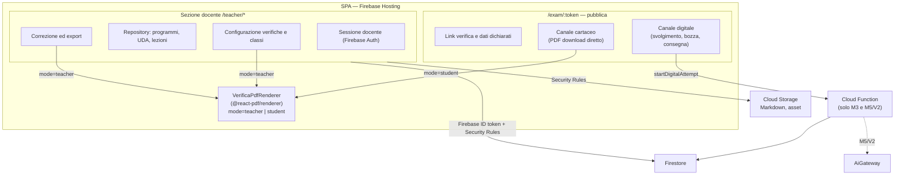

# SchoolForge — Architettura frontend

## Regole

- La SPA è un'unica applicazione con code splitting per le due sezioni.
- La sezione docente usa Firebase Authentication; il Portale non ha login studente.
- La sezione docente scrive direttamente su Firestore e Storage entro le Security Rules; nessuna Cloud Function per import, verifiche, correzione o export.
- `startDigitalAttempt` è l'unica Cloud Function nei Moduli 1–4: crea il participant lock per nome+cognome, genera il token di sessione server-side, registra il log di accesso (nome+IP) e lo snapshot con soluzioni private.
- Esiste un unico componente PDF, `VerificaPdfRenderer`, con prop `mode="teacher" | "student"`: in modalità `student` nasconde le soluzioni. È usato sia dal docente (download e correzione) sia dal canale cartaceo studente.
- I PDF (verifica docente, verifica studente cartaceo, programma svolto, export) sono generati nel browser con `@react-pdf/renderer`; nessun PDF passa per il server.
- Il Portale riceve solo la proiezione dello snapshot senza soluzioni, audit, log accessi o correzioni.
