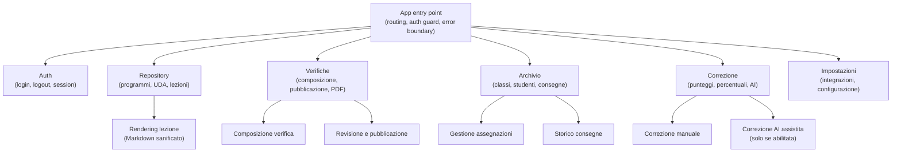
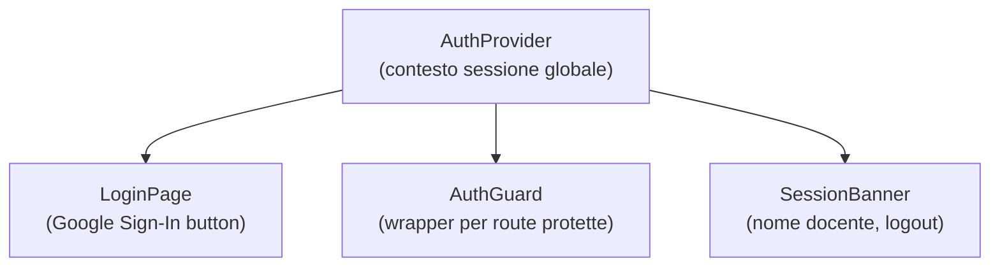
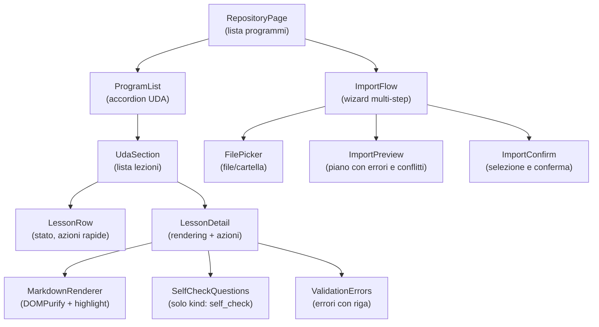
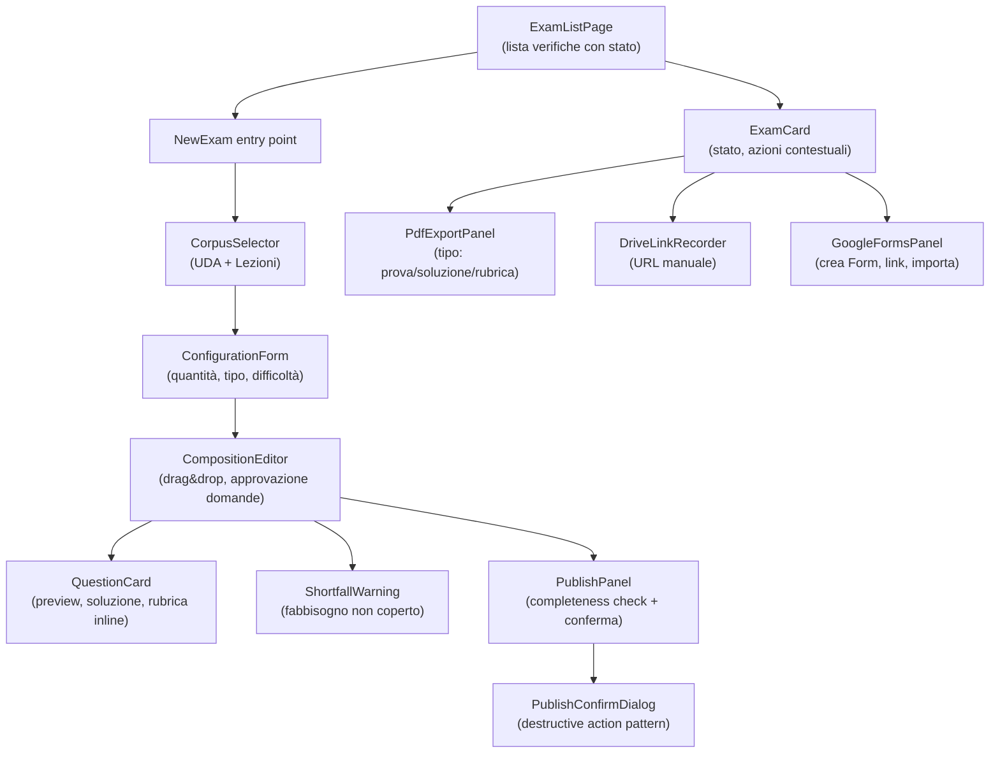
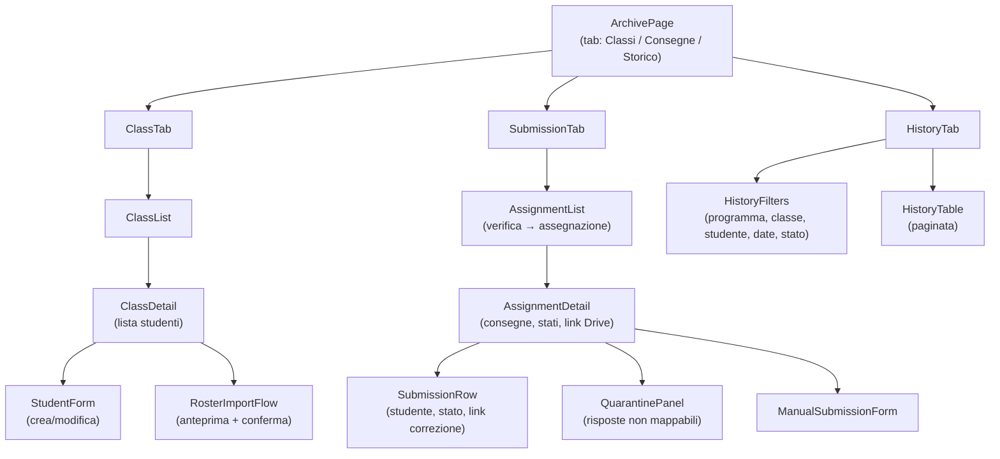
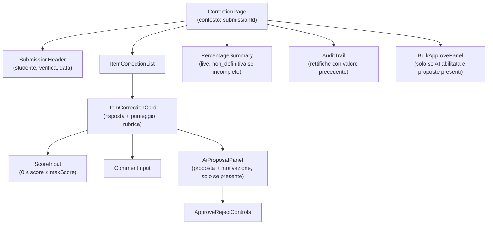
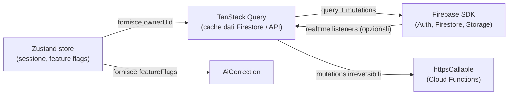

# SchoolForge — Architettura dei componenti frontend

**Versione:** 1.0
**Data:** 22 giugno 2026
**Riferimento:** [Architettura v1.0](../architettura.md), sezioni 4 e 6

---

## Vista macro: aree funzionali della SPA



---

## Struttura dei componenti per area

### Auth



### Repository



**Note sui componenti di rendering:**
- `MarkdownRenderer` è responsabile della sanitizzazione. Non riceve mai dati `assessment` dal backend; la separazione è a livello di modello API, non di CSS.
- `SelfCheckQuestions` renderizza esclusivamente domande con `kind: self_check`. Se il backend restituisce erroneamente un blocco `assessment`, il componente lo ignora per design (filtro esplicito sul campo `kind`).

---

### Verifiche



---

### Archivio



---

### Correzione



---

## Stato globale e comunicazione



**Regole di stato:**
1. Lo stato dell'applicazione è derivato dalla cache di TanStack Query alimentata da Firestore e dalle Cloud Functions. Non viene usato Redux o Context React per dati server.
2. Le mutazioni che modificano stato della Verifica, pubblicazione, correzione e importazione passano sempre attraverso le Cloud Functions (non tramite SDK Firestore direttamente).
3. Le letture di dati non critici (lista programmi, UDA, lezioni, storico) possono usare direttamente l'SDK Firestore con le Security Rules come garanzia.
4. I feature flag vengono letti da `getSession` al login e conservati nello Zustand store per la durata della sessione.

---

## Pattern trasversali UI

### Destructive Action Pattern

Ogni operazione irreversibile (pubblicazione, eliminazione, import conferma, correzione massiva) usa sempre questo pattern:

```
1. Pulsante primario con etichetta chiara dell'azione
2. Dialog di conferma con:
   a. Titolo: "Conferma [azione]"
   b. Corpo: conseguenze specifiche (es. "Il contenuto della verifica diventerà immutabile")
   c. Lista degli oggetti coinvolti (se applicabile)
   d. Pulsante "Annulla" (default focus) e pulsante "Conferma [azione]" (rosso o accent)
3. Loading state durante l'operazione
4. Feedback di successo o errore con messaggio specifico
```

### Error State Pattern

Gli errori seguono sempre la struttura:
- **Cosa è successo** (oggetto e azione)
- **Perché** (causa dal backend `{ code, message }`)
- **Cosa fare** (azione correttiva disponibile)

Nessuno stack trace viene mostrato nell'UI. I codici tecnici compaiono solo nel tooltip "Copia per supporto".

### Empty State Pattern

Le liste vuote mostrano sempre:
- Stato vuoto contestuale (es. "Nessuna lezione in questa UDA")
- Azione primaria disponibile (es. "Importa la prima lezione")
- Link alla documentazione (se applicabile)
