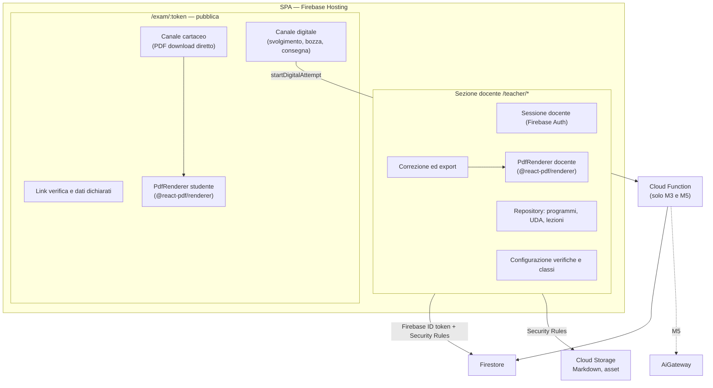

# SchoolForge — Architettura frontend

## Regole

- La SPA è un'unica applicazione con code splitting per le due sezioni.
- La sezione docente usa Firebase Authentication; il Portale non ha login studente.
- La sezione docente scrive direttamente su Firestore e Storage entro le Security Rules; nessuna Cloud Function per import, verifiche, correzione o export.
- `startDigitalAttempt` è l'unica Cloud Function nei Moduli 1–4: genera il token di sessione server-side e lo snapshot con soluzioni private.
- I PDF (docente, studente cartaceo, programma svolto, export) sono generati nel browser con `@react-pdf/renderer`; nessun PDF passa per il server.
- Il Portale riceve solo la proiezione dello snapshot senza soluzioni, audit o correzioni.
