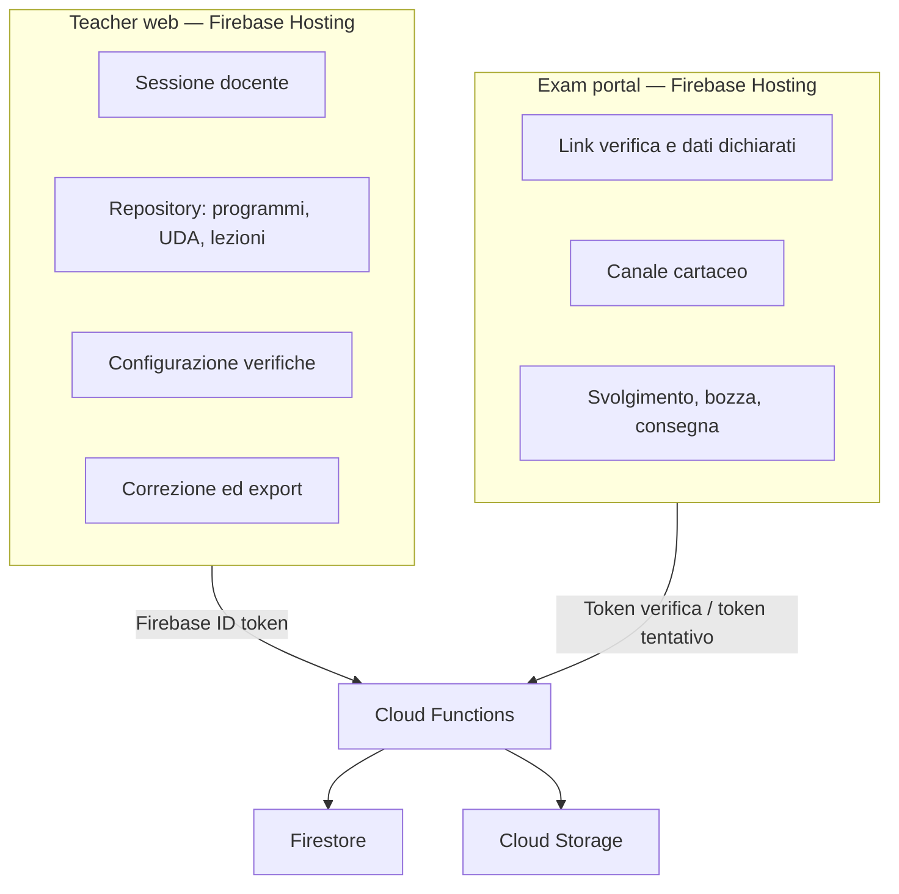

# SchoolForge — Confini frontend

## Regole

- Il Teacher web usa Firebase Authentication; il Portale non ha login studente.
- Entrambe le app chiamano il backend per dati di dominio: niente scritture Firestore dirette dal client.
- Il Portale riceve soltanto una proiezione dello snapshot senza soluzioni, audit o correzioni.
- Tema, responsività e accessibilità appartengono a entrambe le app; fullscreen e deterrenza appartengono solo al Portale.
