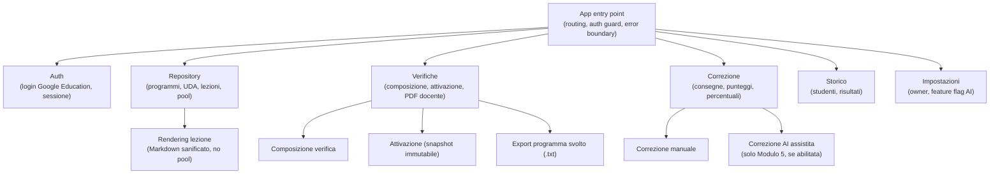
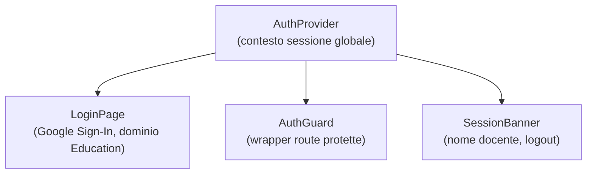
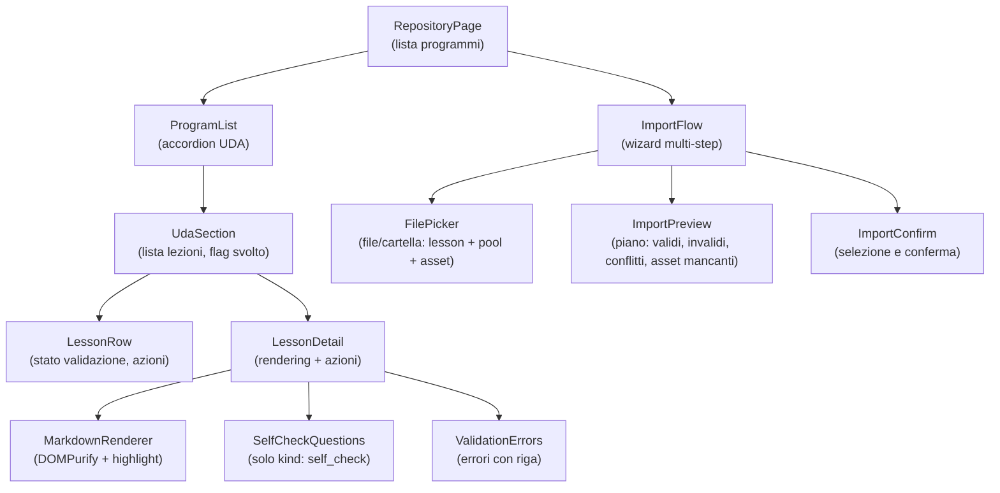
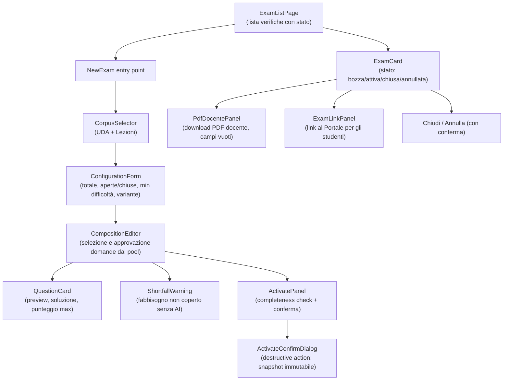
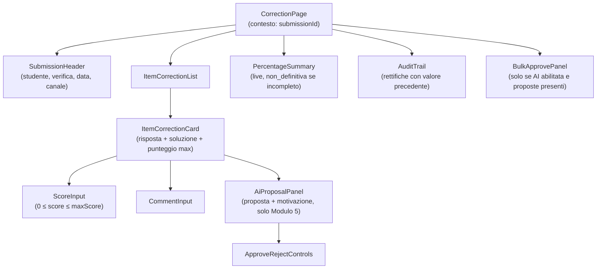
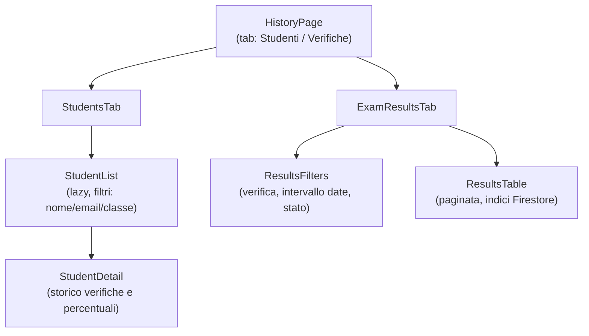
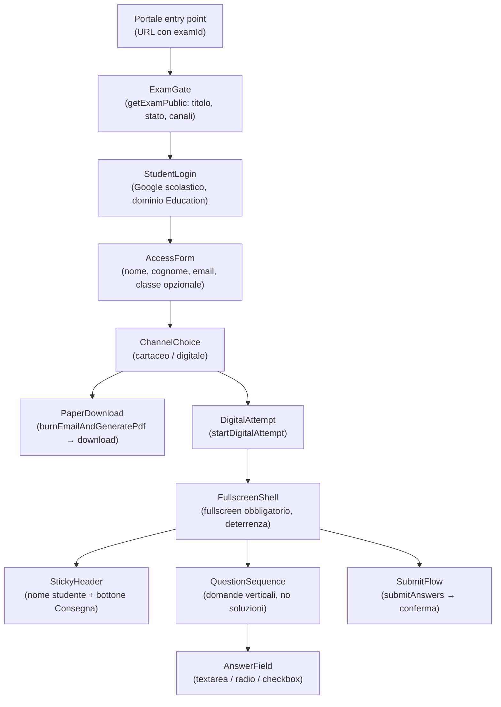
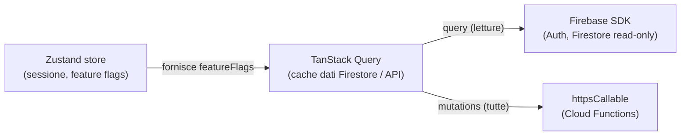

# SchoolForge — Architettura dei componenti frontend

**Versione:** 2.0
**Data:** 24 giugno 2026
**Riferimento:** [Architettura v2.0](../architettura.md), sezioni 4, 5 e 6

In v2.0 esistono **due applicazioni frontend separate**, deployate su URL distinti:

- **Web app docente** (`apps/web`) — desktop-first, autenticazione Google Workspace for Education.
- **Portale Verifiche** (`apps/portale`) — mobile-first, autenticazione Google scolastica studente, nessuna route o stato condiviso con la web app.

Non esistono aree Archivio/Classi/roster, integrazioni Google Forms/Drive o pannelli rubrica: sono fuori perimetro v2.

---

## Web app docente — vista macro

---

## Web app docente — componenti per area

### Auth

### Repository

**Note sui componenti di rendering:**
- `MarkdownRenderer` riceve dal backend (`getLessonForRendering`) un modello già privo di domande del pool, soluzioni e opzioni corrette: la separazione è a livello di modello API, non di CSS.
- `SelfCheckQuestions` renderizza esclusivamente domande con `kind: self_check`. Le domande del pool (`.pool.md`) non arrivano mai al client di fruizione.

### Verifiche

### Correzione

### Storico

---

## Portale Verifiche (studente) — componenti

**Note Portale:**
- Il payload di `startDigitalAttempt` non contiene mai `solution` né `correct_option_ids`.
- `FullscreenShell` rileva l'uscita dal tab e mostra un avviso prominente; il copia-incolla è disabilitato nella UI. Sono misure di **deterrenza**, non garanzie di sicurezza (BR-POR-02).
- Un secondo accesso con la stessa email è bloccato (email bruciata, errore 409) sia sul canale cartaceo sia su quello digitale.

---

## Stato globale e comunicazione (web docente)

**Regole di stato:**
1. Lo stato server è derivato dalla cache di TanStack Query, alimentata da letture Firestore e da Cloud Functions. Niente Redux per dati server.
2. **Tutte** le mutazioni (creazione, attivazione verifica, correzione, importazione) passano da Cloud Functions, mai da scrittura diretta Firestore: le Security Rules negano scritture client.
3. Le letture non critiche (programmi, UDA, lezioni, storico) usano l'SDK Firestore con le Security Rules come garanzia.
4. I feature flag sono letti da `getSession` al login e conservati per la durata della sessione.

Il Portale non condivide questo store: ha uno stato locale minimale legato al singolo attempt.

---

## Pattern trasversali UI

### Destructive Action Pattern
Ogni operazione irreversibile (attivazione, eliminazione, conferma import, annullamento, approvazione massiva) usa: pulsante con etichetta chiara → dialog di conferma con conseguenze specifiche e oggetti coinvolti → loading state → feedback di esito.

### Error State Pattern
Gli errori mostrano: **cosa** è successo (oggetto e azione), **perché** (`{ code, message }` dal backend), **cosa fare** (azione correttiva). Nessuno stack trace nell'UI; i codici tecnici solo nel tooltip "Copia per supporto". Il codice `EMAIL_BURNED` produce nel Portale un messaggio esplicito di download già effettuato.

### Empty State Pattern
Le liste vuote mostrano: stato vuoto contestuale, azione primaria disponibile, link alla documentazione se applicabile.
