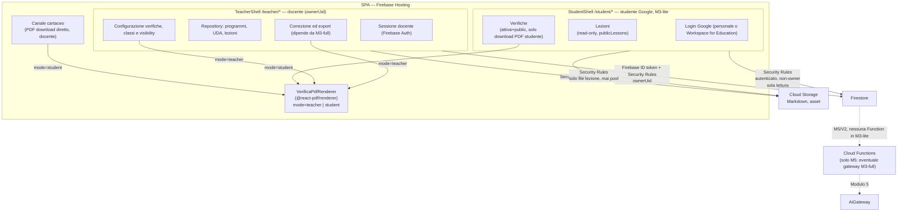

# SchoolForge — Architettura frontend

```mermaid
flowchart TB
    subgraph SPA["SPA — Firebase Hosting"]
      subgraph T["TeacherShell /teacher/* — docente (ownerUid)"]
        Login["Sessione docente (Firebase Auth)"]
        Repo["Repository: programmi, UDA, lezioni"]
        Verify["Configurazione verifiche, classi e visibility"]
        Correct["Correzione ed export (dipende da M3-full)"]
      end
      subgraph S["StudentShell /student/* — studente Google, M3-lite"]
        SLogin["Login Google (personale o Workspace for Education)"]
        SLessons["Lezioni\n(read-only, publicLessons)"]
        SExams["Verifiche\n(attiva+public, solo download PDF studente)"]
      end
      Paper["Canale cartaceo\n(PDF download diretto, docente)"]
      Pdf["VerificaPdfRenderer\n(@react-pdf/renderer)\nmode=teacher | student"]
    end

    T -->|"Firebase ID token + Security Rules\nownerUid"| FS["Firestore"]
    T -->|"Security Rules"| CS["Cloud Storage\nMarkdown, asset"]
    S -->|"Security Rules\nautenticato, non-owner\nsola lettura"| FS
    S -->|"Security Rules\nsolo file lezione, mai pool"| CS
    FS -. "M5/V2, nessuna Function in M3-lite" .-> CF["Cloud Functions\n(solo M5; eventuale gateway M3-full)"]
    CF -. "Modulo 5" .-> AI["AiGateway"]
    Paper -->|"mode=student"| Pdf
    SExams -->|"mode=student"| Pdf
    Verify -->|"mode=teacher"| Pdf
    Correct -->|"mode=teacher"| Pdf
```

## Regole

- La SPA è un'unica applicazione con code splitting tra TeacherShell e StudentShell.
- Sia la sezione docente sia la sezione studente (M3-lite) richiedono login Firebase Authentication; non esiste accesso anonimo. Il vecchio routing pubblico `/exam/:token` non è mai stato implementato ed è superato da `/student/*`.
- Il ruolo è risolto confrontando `uid` con `ownerUid`: coincide → TeacherShell; altrimenti → StudentShell, in sola lettura.
- La sezione docente scrive direttamente su Firestore e Storage entro le Security Rules; import, pubblicazione, correzione ed export non richiedono Cloud Function. La sezione studente non scrive mai: legge solo `publicLessons` e `verifications`/`publishedProjection` quando `attiva`+`public`.
- M3-lite non usa Cloud Functions. Le Cloud Functions restano riservate al modulo AI (M5/V2) e a un eventuale gateway M3-full (specifica rinviata: `startDigitalAttempt`/`continueDigitalAttempt`, participant lock, token di sessione).
- Esiste un unico componente PDF, `VerificaPdfRenderer`, con prop `mode="teacher" | "student"`: in modalità `student` nasconde le soluzioni. È usato dal docente (download e correzione), dal canale cartaceo e dal Portale studente M3-lite.
- I PDF (verifica docente, verifica studente cartaceo, verifica studente M3-lite, programma svolto, export) sono generati nel browser con `@react-pdf/renderer`; nessun PDF passa per il server.
- Lo StudentShell non riceve mai pool, soluzioni, `questionIndex`, `publishedSnapshot`, audit, log accessi o correzioni.
