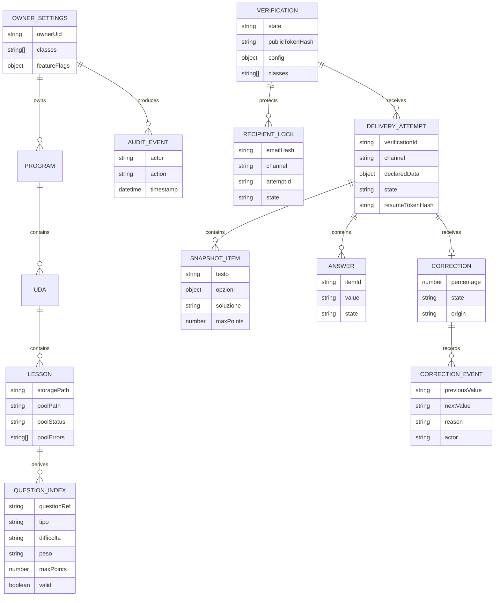

# SchoolForge — Modello dati Firestore

## Vincoli

- `questionIndex` è derivato dai pool; Markdown in Cloud Storage resta la fonte canonica.
- `recipientLocks/{emailHash}` è unico per verifica e blocca entrambi i canali: lo stesso hash non può avere due lock distinti.
- `snapshot/items` esiste solo per tentativi digitali, è creato dalla Cloud Function `startDigitalAttempt` e diventa immutabile alla consegna. Il campo `soluzione` non è mai esposto al client portale.
- PDF, export didattici e programma svolto non sono entità Firestore o Cloud Storage.
- `OWNER_SETTINGS.classes` è la lista di classi configurata dal docente; usata in `VERIFICATION.config.classes` e come menu nel portale.
