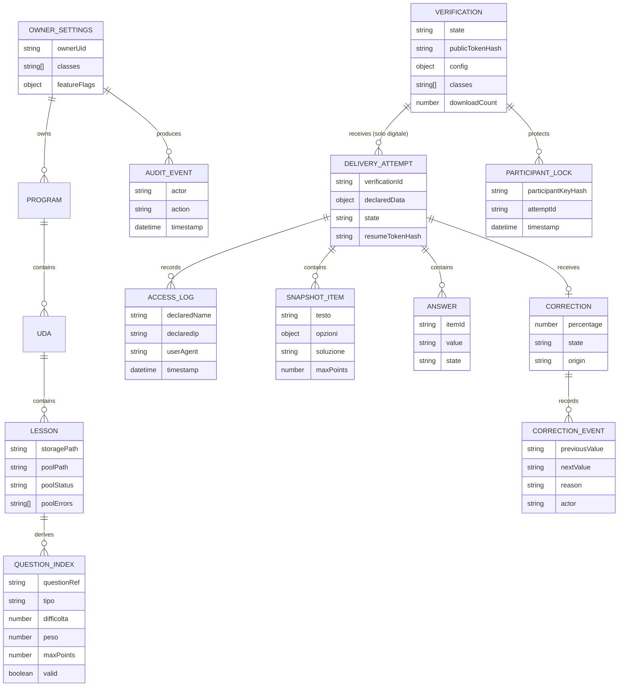

# SchoolForge — Modello dati Firestore

## Vincoli

- `questionIndex` è derivato dai pool; Markdown in Cloud Storage resta la fonte canonica. `difficolta` e `peso` sono valori `1`/`2`/`3` e `maxPoints` = `difficolta × peso` (1–9).
- `questionIndex` è riallineato esclusivamente tramite re-import dall'interfaccia: modifiche dirette ai file in Storage senza re-import lasciano l'indice desincronizzato.
- `deliveryAttempt` esiste solo per il canale digitale. Il canale cartaceo è puramente fisico e non crea record di tentativo né voci di `accessLog`; al più incrementa il contatore atomico `VERIFICATION.downloadCount`.
- Il tentativo digitale è protetto da un participant lock per verifica e nome+cognome normalizzati; non esiste alcun lock basato su email.
- `accessLog` registra ogni tentativo di accesso digitale (`declaredName` nel formato `Cognome Nome`, `declaredIp`, `userAgent`, `timestamp`) e alimenta il Report Accessi del docente. È un log di audit, non una prova d'identità.
- `snapshot/items` esiste solo per tentativi digitali, è creato dalla Cloud Function `startDigitalAttempt` ed è immutabile dal momento dell'avvio. La configurazione della verifica resta invece sempre modificabile dal docente. Il campo `soluzione` non è mai esposto al client portale.
- PDF, export didattici e programma svolto non sono entità Firestore o Cloud Storage.
- `OWNER_SETTINGS.classes` è la lista di classi configurata dal docente; usata in `VERIFICATION.config.classes` e come menu nel portale.
