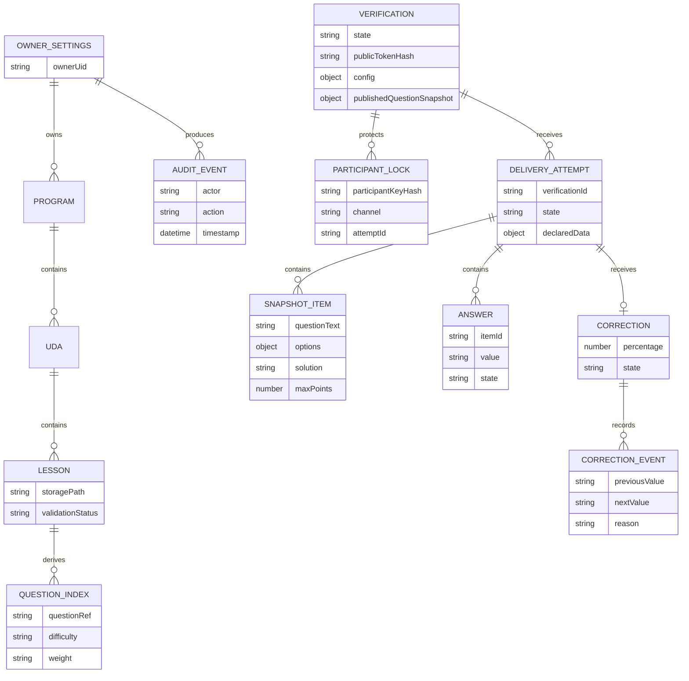

# SchoolForge — Modello dati Firestore

## Vincoli

- `questionIndex` è derivato dai pool; Markdown in Cloud Storage resta la fonte canonica.
- `participantLocks/{participantKeyHash}` è unico per verifica e collega entrambi i canali; contiene HMAC di nome/cognome normalizzati, non email.
- Il `publishedQuestionSnapshot` è creato all'attivazione e rende stabile una verifica anche se le lezioni correnti cambiano.
- Gli item snapshot esistono solo per tentativi digitali e diventano immutabili alla consegna.
- PDF ed export non sono entità Firestore o Cloud Storage.
