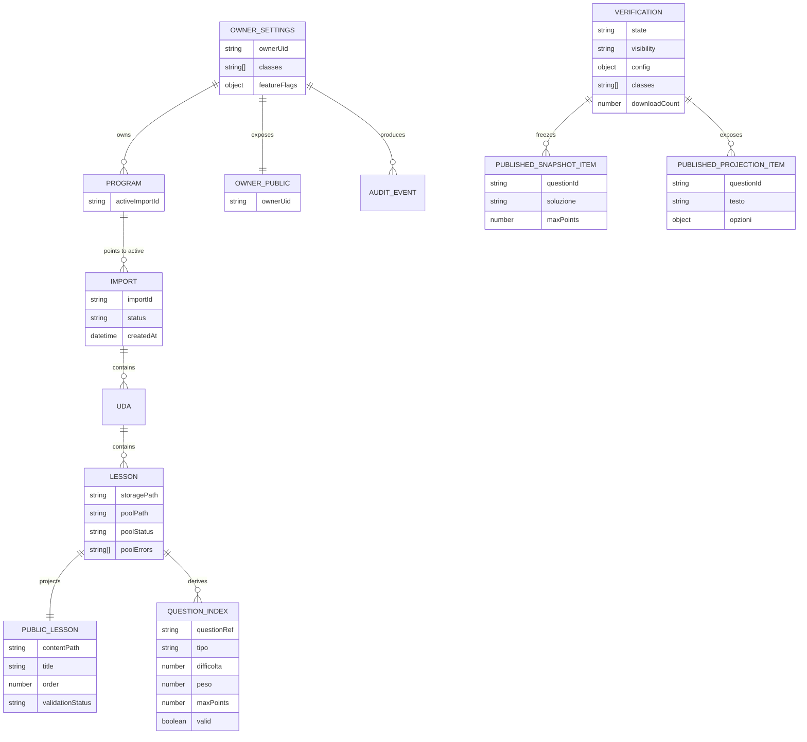
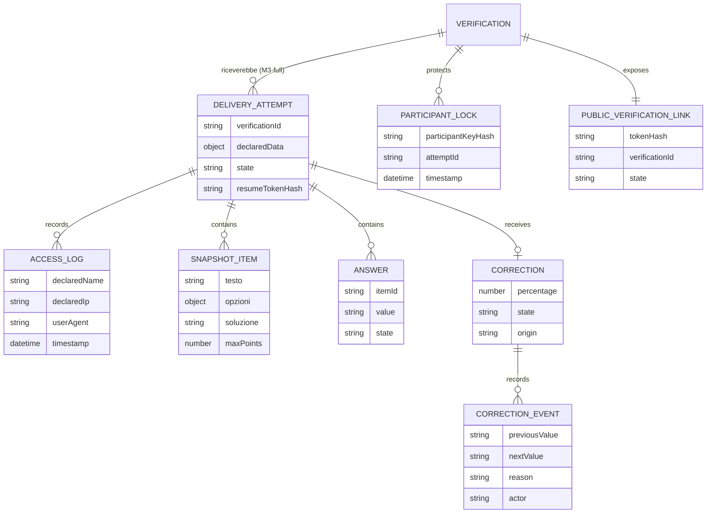

# SchoolForge — Modello dati Firestore

```mermaid
erDiagram
    OWNER_SETTINGS ||--o{ PROGRAM : owns
    OWNER_SETTINGS ||--|| OWNER_PUBLIC : exposes
    PROGRAM ||--o{ IMPORT : "points to active"
    IMPORT ||--o{ UDA : contains
    UDA ||--o{ LESSON : contains
    LESSON ||--|| PUBLIC_LESSON : projects
    LESSON ||--o{ QUESTION_INDEX : derives
    VERIFICATION ||--o{ PUBLISHED_SNAPSHOT_ITEM : freezes
    VERIFICATION ||--o{ PUBLISHED_PROJECTION_ITEM : exposes
    OWNER_SETTINGS ||--o{ AUDIT_EVENT : produces

    OWNER_SETTINGS {
        string ownerUid
        string[] classes
        object featureFlags
    }
    OWNER_PUBLIC {
        string ownerUid
    }
    PROGRAM {
        string activeImportId
    }
    IMPORT {
        string importId
        string status
        datetime createdAt
    }
    LESSON {
        string storagePath
        string poolPath
        string poolStatus
        string[] poolErrors
    }
    PUBLIC_LESSON {
        string contentPath
        string title
        number order
        string validationStatus
    }
    QUESTION_INDEX {
        string questionRef
        string tipo
        number difficolta
        number peso
        number maxPoints
        boolean valid
    }
    VERIFICATION {
        string state
        string visibility
        object config
        string[] classes
        number downloadCount
    }
    PUBLISHED_SNAPSHOT_ITEM {
        string questionId
        string soluzione
        number maxPoints
    }
    PUBLISHED_PROJECTION_ITEM {
        string questionId
        string testo
        object opzioni
    }
```

## Vincoli (baseline corrente: M1 + M2 + M3-lite)

- `questionIndex` è derivato dai pool; Markdown in Cloud Storage resta la fonte canonica. `difficolta` e `peso` sono valori `1`/`2`/`3` e `maxPoints` = `difficolta × peso` (1–9). `QUESTION_INDEX` non è mai leggibile dallo studente.
- `questionIndex` è riallineato esclusivamente tramite re-import dall'interfaccia. Un import viene preparato sotto `importId`; solo la transazione che cambia `PROGRAM.activeImportId` lo rende visibile, insieme alla proiezione `PUBLIC_LESSON` corrispondente.
- `PUBLIC_LESSON` è la proiezione read-only di `LESSON` per lo studente (M3-lite): contiene solo titolo, ordine, percorso Storage del file lezione (mai del pool) e stato di validazione. Scritta dal docente nello stesso flusso che scrive `LESSON`.
- `OWNER_PUBLIC` contiene solo `ownerUid` ed è leggibile da qualunque utente autenticato; serve solo al client per instradare TeacherShell/StudentShell, non sostituisce le Security Rules.
- `VERIFICATION.visibility` (`hidden`/`public`) è indipendente da `VERIFICATION.state`. Solo `state == "attiva" && visibility == "public"` è leggibile dallo studente. Il canale cartaceo è puramente fisico e non crea alcun record; al più incrementa il contatore atomico `VERIFICATION.downloadCount`.
- `PUBLISHED_SNAPSHOT_ITEM` congela fonti, regole, candidati e soluzioni all'attivazione. La configurazione è modificabile solo in bozza; per cambiare una verifica pubblicata si crea una nuova bozza. Non è mai esposto allo studente.
- `PUBLISHED_PROJECTION_ITEM` non contiene soluzioni; è letto dal canale cartaceo (M2) e, quando `visibility == "public"`, dal Portale studente M3-lite per il download del PDF studente.
- PDF, export didattici e programma svolto non sono entità Firestore o Cloud Storage.
- `OWNER_SETTINGS.classes` è la lista di classi configurata dal docente; usata in `VERIFICATION.config.classes` e come menu nel portale.

## Entità di un eventuale M3-full (specifica rinviata)

Le entità seguenti (`DELIVERY_ATTEMPT`, `PARTICIPANT_LOCK`, `PUBLIC_VERIFICATION_LINK`, `ACCESS_LOG`, `SNAPSHOT_ITEM`, `ANSWER`, `CORRECTION`, `CORRECTION_EVENT`) descrivono la specifica di un'eventuale fase successiva a M3-lite (consegna online con tentativi) e non fanno parte della baseline corrente:

```mermaid
erDiagram
    VERIFICATION ||--o{ DELIVERY_ATTEMPT : "riceverebbe (M3-full)"
    VERIFICATION ||--o{ PARTICIPANT_LOCK : protects
    VERIFICATION ||--|| PUBLIC_VERIFICATION_LINK : exposes
    DELIVERY_ATTEMPT ||--o{ ACCESS_LOG : records
    DELIVERY_ATTEMPT ||--o{ SNAPSHOT_ITEM : contains
    DELIVERY_ATTEMPT ||--o{ ANSWER : contains
    DELIVERY_ATTEMPT ||--o| CORRECTION : receives
    CORRECTION ||--o{ CORRECTION_EVENT : records

    PUBLIC_VERIFICATION_LINK {
        string tokenHash
        string verificationId
        string state
    }
    PARTICIPANT_LOCK {
        string participantKeyHash
        string attemptId
        datetime timestamp
    }
    DELIVERY_ATTEMPT {
        string verificationId
        object declaredData
        string state
        string resumeTokenHash
    }
    ACCESS_LOG {
        string declaredName
        string declaredIp
        string userAgent
        datetime timestamp
    }
    SNAPSHOT_ITEM {
        string testo
        object opzioni
        string soluzione
        number maxPoints
    }
    ANSWER {
        string itemId
        string value
        string state
    }
    CORRECTION {
        number percentage
        string state
        string origin
    }
    CORRECTION_EVENT {
        string previousValue
        string nextValue
        string reason
        string actor
    }
```

Se M3-full verrà realizzato: `DELIVERY_ATTEMPT` esisterebbe solo per il canale digitale; il tentativo sarebbe protetto da un `PARTICIPANT_LOCK` per verifica e nome+cognome normalizzati (non un lock basato su email); `PUBLIC_VERIFICATION_LINK` sarebbe indicizzato dall'hash del token URL e consentirebbe solo il lookup puntuale; `ACCESS_LOG` registrerebbe nome dichiarato, IP, user-agent e timestamp come audit trail, non come prova d'identità; `SNAPSHOT_ITEM` sarebbe creato dalla Cloud Function ed immutabile dal momento dell'avvio, con `soluzione` mai esposta al client.
