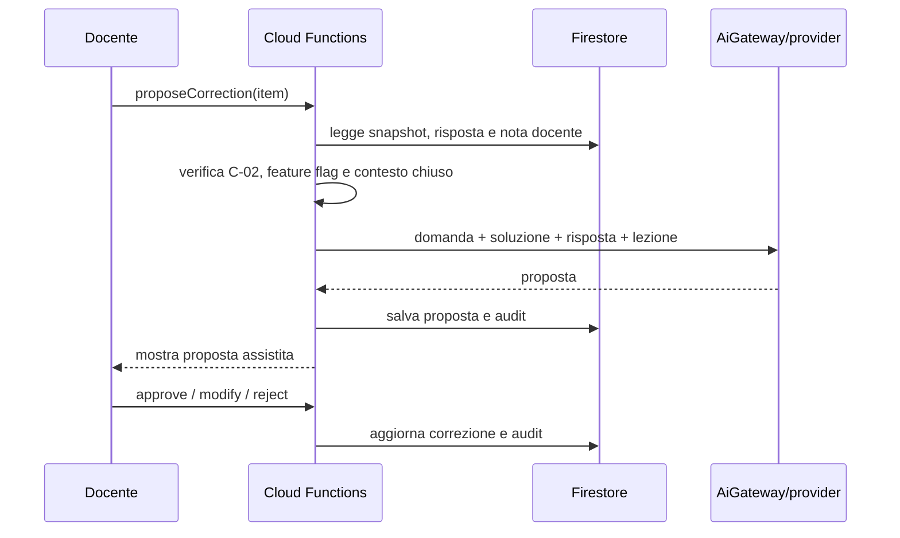

# SchoolForge — Sequenza correzione AI

La modalità automatica è un flusso separato: richiede C-03, opt-in della verifica e conserva gli stessi dati di audit. AiGateway non riceve web, retrieval, tool o permessi di modifica su verifiche e contenuti.
