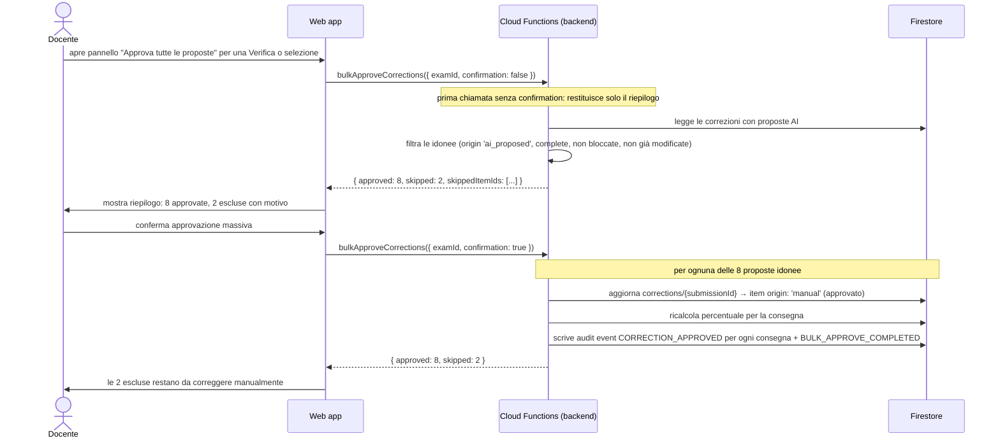

# SchoolForge — Sequence: Correzione AI assistita e approvazione massiva

**Versione:** 2.0
**Data:** 24 giugno 2026
**Riferimento:** [Architettura v2.0](../architettura.md), sezione 9.8

La correzione AI è il Modulo 5, attivabile solo dopo la decisione C-02 (provider) e, per la modalità automatica, C-03. Usa un contesto chiuso (lezione + domanda + soluzione + risposta) senza web né retrieval. Non esistono rubriche: il vincolo numerico è il punteggio massimo dell'item (`coeff_difficoltà × coeff_peso`).

---

## Flusso principale: correzione AI assistita per una consegna

```mermaid
sequenceDiagram
    actor D as Docente
    participant W as Web app
    participant CF as Cloud Functions (backend)
    participant GW as AiGateway
    participant AI as Provider AI (esterno)
    participant FS as Firestore

    note over D: Prerequisiti: C-02 risolto, AI configurata, G5-AI superato

    D->>W: apre una consegna da correggere e richiede proposta AI
    W->>D: mostra i dati che verranno inviati al provider AI
    note over W,D: lezione fonte, domanda, soluzione, risposta (senza dati anagrafici)

    D->>W: conferma consenso esplicito (o usa consenso persistente configurato)
    W->>CF: proposeCorrection({ submissionId, consentGiven: true })

    CF->>FS: legge submissions/{id} → risposte dello studente
    CF->>FS: legge exams/{examId}/items → domande, soluzioni, punteggio max
    CF->>FS: legge lessons/{lessonId} → storagePath della lezione fonte

    loop per ogni item della consegna
        CF->>GW: buildContext({ lessonContent, question, solution, studentResponse })
        note over GW: verifica dimensione contesto; applica template di sistema versionato
        GW->>AI: invia contesto chiuso (senza browser, tool, retrieval)
        AI-->>GW: risposta strutturata { proposedScore, reasoning }
        GW->>GW: valida (Zod): proposedScore ≤ punteggio max dell'item
        GW-->>CF: proposta validata + AiProvenance (provider, model, templateVersion, contextHash)
    end

    CF->>FS: scrive proposte in corrections/{submissionId}.items con origin: 'ai_proposed'
    CF->>FS: scrive audit event AI_CORRECTION_PROPOSED (hash contesto, provider, modello)
    CF-->>W: { proposals, styleAnomalies? }

    W->>D: mostra proposte affiancate alla risposta; punteggio e motivazione per item

    loop per ogni item
        alt Docente approva
            D->>W: approva proposta item N
            W->>CF: updateItemScore({ submissionId, itemScores: [{ examItemId, score }] })
            CF->>FS: aggiorna item → origin: 'manual' (approvato), ricalcola percentuale
        else Docente modifica
            D->>W: modifica punteggio o commento dell'item N
            W->>CF: updateItemScore({ submissionId, itemScores: [{ examItemId, score, reason }] })
            CF->>FS: aggiorna item, salva valore precedente nell'audit (rettifica tracciata)
        end
    end

    CF->>FS: ricalcola percentuale finale quando tutti gli item hanno punteggio
```

---

## Flusso approvazione massiva



---

## Flusso: modalità automatica (solo se G6 superato e feature flag abilitato)

```mermaid
sequenceDiagram
    actor D as Docente
    participant W as Web app
    participant CF as Cloud Functions (backend)
    participant GW as AiGateway
    participant AI as Provider AI
    participant FS as Firestore

    note over D: La modalità automatica è abilitata esplicitamente per questa Verifica (C-03)

    D->>W: attiva correzione automatica per la Verifica X
    W->>D: avviso: "La correzione sarà applicata automaticamente; resterà modificabile"
    D->>W: conferma esplicita

    W->>CF: proposeCorrection({ submissionId, consentGiven: true, autoApprove: true })
    CF->>GW: (stesso flusso di generazione contesto della modalità assistita)
    GW->>AI: invia contesto
    AI-->>GW: risposta
    GW-->>CF: proposta validata (≤ punteggio max)

    CF->>FS: scrive la correzione con origin: 'automatic'
    CF->>FS: ricalcola percentuale
    CF->>FS: scrive audit event AI_AUTO_CORRECTION (automatic: true)
    CF-->>W: { percentage, correctionStatus: 'definitiva' }
    W->>D: consegna corretta automaticamente; modificabile in qualsiasi momento

    note over D: Ogni modifica successiva crea un audit con valore precedente e nuovo valore
```

---

## Garanzie del AiGateway

| Garanzia | Meccanismo |
|---|---|
| Solo le lezioni selezionate nel contesto | Il backend costruisce il contesto; il gateway rifiuta lessonIds non selezionati |
| Nessun browsing o retrieval | Il gateway non ha tool esterni; il system prompt lo vieta esplicitamente |
| Punteggio ≤ massimo dell'item | Validazione Zod del gateway; proposta rifiutata se viola il vincolo |
| Item non correggibile → bloccato | Se mancano domanda/soluzione/risposta/lezione, la proposta è `blocked` e richiede correzione manuale |
| Provenienza tracciata | Ogni proposta include provider, modelId, templateVersion, contextHash (SHA-256) |
| Consenso verificato | Il backend verifica il consenso prima di qualsiasi invocazione AI |
| Proposta ≠ decisione | Nessuna proposta diventa definitiva senza approvazione docente, salvo modalità automatica esplicitamente abilitata |
