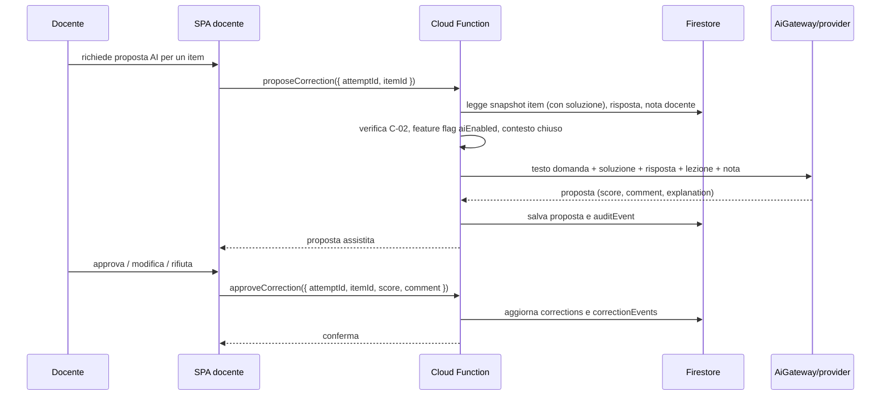

# SchoolForge — Sequenza correzione AI (Modulo 5 — fuori scope V1 / pianificato per V2)

## Note

- La modalità automatica è un flusso separato: richiede C-03, opt-in della verifica e conserva gli stessi dati di audit.
- AiGateway non riceve web, retrieval, tool esterni o permessi di modifica su verifiche e contenuti.
- Secret Manager fornisce la chiave API al runtime della Cloud Function; non raggiunge mai il client.
- `proposeCorrection` richiede Firebase ID token con `ownerUid` verificato server-side.
