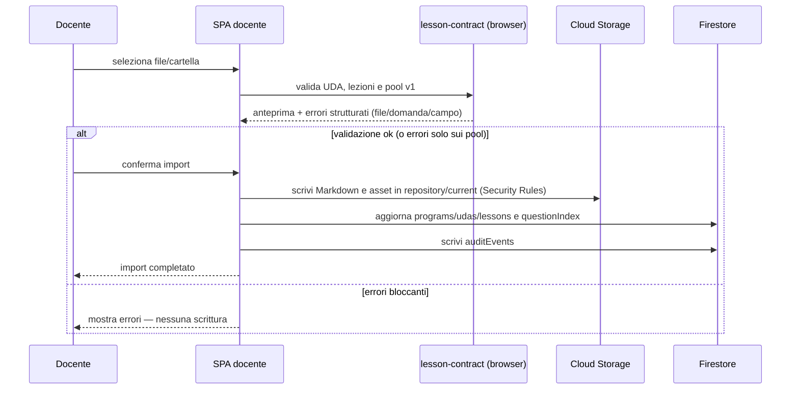

# SchoolForge — Sequenza importazione didattica

## Note

- La validazione avviene interamente nel browser tramite il package `lesson-contract`; nessuna Cloud Function è coinvolta nell'import.
- Un pool invalido blocca solo il pool: la lezione resta consultabile e importabile.
- Le Security Rules Firestore e Storage garantiscono che solo l'`ownerUid` possa scrivere in `repository/current`.
- Se un file su Storage o Firestore fallisce a metà import, lo stato Firestore non viene aggiornato finché tutti i file non sono scritti correttamente (gestione transazionale nel client).
