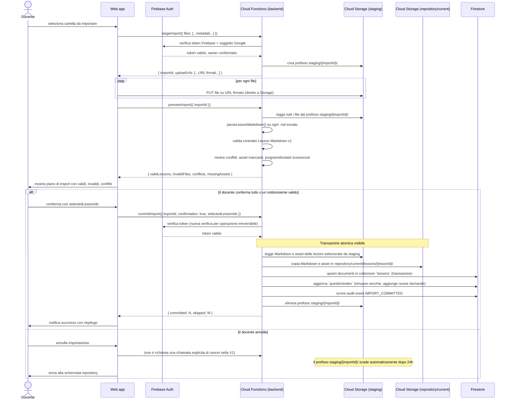
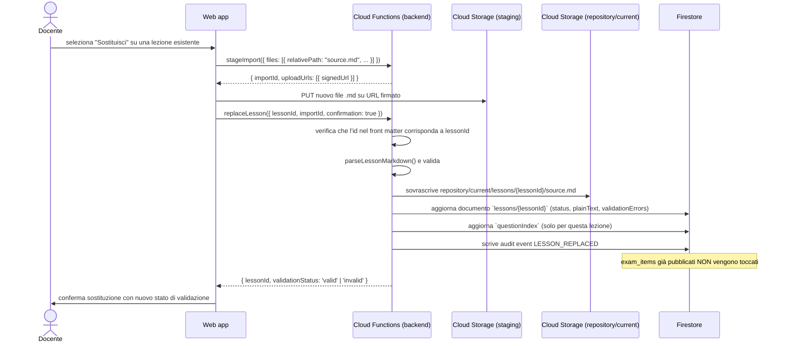

# SchoolForge — Sequence: Importazione lezione o cartella

**Versione:** 1.0
**Data:** 22 giugno 2026
**Riferimento:** [Architettura v1.0](../architettura.md), sezione 8.2

---

## Flusso principale (import cartella con conferma parziale)



---

## Flusso alternativo: file con errori bloccanti

```mermaid
sequenceDiagram
    actor D as Docente
    participant W as Web app
    participant CF as Cloud Functions (backend)

    W->>CF: previewImport({ importId })
    CF-->>W: { validLessons: [], invalidFiles: [{ path, errors: [{line, message}] }], ... }
    W->>D: mostra errori per file e riga; nessuna lezione importabile

    note over W,D: Il docente corregge i file Markdown localmente e ripete l'import
```

---

## Flusso alternativo: sostituzione singola lezione



---

## Garanzie di atomicità

| Scenario di errore | Comportamento |
|---|---|
| Caricamento interrotto a metà (Storage) | I file non ancora caricati non sono in staging; `commitImport` fallisce perché il manifesto non è completo. Nessuna modifica al repository. |
| Errore durante la copia da staging a repository | La transazione Firestore non viene completata; i file già copiati in Storage vengono rimossi da un job di cleanup. Nessuna Lezione diventa visibile. |
| Errore durante l'aggiornamento Firestore | Rollback della transazione; i file già copiati in Storage vengono rimossi. Stato del repository invariato. |
| Timeout della funzione | L'importazione rimane in `staging` e scade dopo 24 ore. Il Docente deve ripetere l'operazione. |
