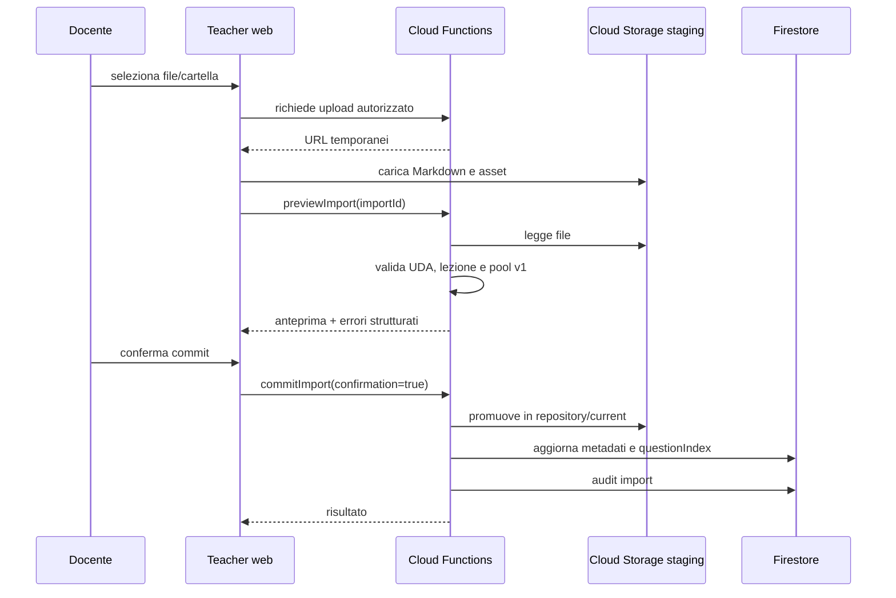

# SchoolForge — Sequenza importazione didattica

```mermaid
sequenceDiagram
    participant D as Docente
    participant W as Teacher web
    participant B as Cloud Functions
    participant S as Cloud Storage staging
    participant F as Firestore

    D->>W: seleziona file/cartella
    W->>B: richiede upload autorizzato
    B-->>W: URL temporanei
    W->>S: carica Markdown e asset
    W->>B: previewImport(importId)
    B->>S: legge file
    B->>B: valida UDA, lezione e pool v1
    B-->>W: anteprima + errori strutturati
    D->>W: conferma commit
    W->>B: commitImport(confirmation=true)
    B->>S: promuove in repository/current
    B->>F: aggiorna metadati e questionIndex
    B->>F: audit import
    B-->>W: risultato
```

Un pool invalido blocca solo il pool: la lezione resta consultabile. Un fallimento prima del commit non rende visibile alcun contenuto parziale.
