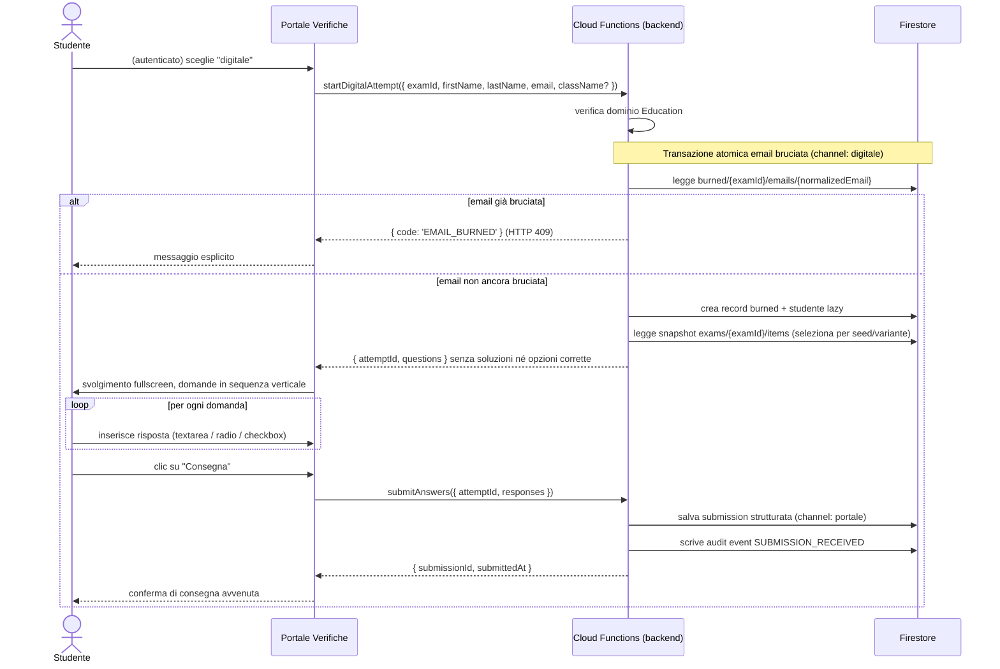

# SchoolForge — Sequence: Portale Verifiche (accesso studente, email bruciata, consegna)

**Versione:** 2.0
**Data:** 24 giugno 2026
**Riferimento:** [Architettura v2.0](../architettura.md), sezione 9.5

Il Portale Verifiche è un'app separata. Lo studente accede tramite link, si autentica con email Google scolastica e sceglie il canale: cartaceo (download PDF) o digitale (svolgimento online). In entrambi i casi l'email è **bruciata** atomicamente: un accesso per email per verifica.

---

## Canale cartaceo: accesso → email bruciata → download PDF

```mermaid
sequenceDiagram
    actor S as Studente
    participant P as Portale Verifiche
    participant A as Firebase Auth (Google)
    participant CF as Cloud Functions (backend)
    participant FS as Firestore

    S->>P: apre link verifica
    P->>CF: getExamPublic({ examId })
    CF->>FS: legge stato verifica
    CF-->>P: { title, status, acceptsAccess, channels }
    alt verifica non attiva
        P-->>S: avviso: verifica non disponibile
    else verifica attiva
        S->>P: accede con Google (email scolastica)
        P->>A: Google Sign-In
        A-->>P: token Firebase
        S->>P: inserisce nome, cognome, classe (opzionale); sceglie "cartaceo"
        P->>CF: burnEmailAndGeneratePdf({ examId, firstName, lastName, email, className? })
        CF->>CF: verifica dominio Education dell'email

        note over CF,FS: Transazione atomica email bruciata
        CF->>FS: legge burned/{examId}/emails/{normalizedEmail}
        alt email non ancora bruciata
            CF->>FS: crea record burned (channel: cartaceo) atomicamente
            CF->>FS: crea/aggiorna studente lazy (email = chiave)
            CF->>CF: genera PDF on-demand (dati precompilati, data del giorno)
            CF-->>P: stream PDF (filename con nome+cognome)
            note over CF: nessuna scrittura su Storage
            P-->>S: download avviato
        else email già bruciata
            CF-->>P: { code: 'EMAIL_BURNED' } (HTTP 409)
            P-->>S: messaggio esplicito: download già effettuato
        end
    end
```

---

## Canale digitale: svolgimento online → consegna



---

## Garanzie del Portale

| Garanzia | Meccanismo |
|---|---|
| Un accesso per email per verifica | Transazione atomica su `burned/{examId}/emails/{email}` |
| Nessuna soluzione esposta allo studente | Il payload di svolgimento omette `solution` e `correct_option_ids` (controllo backend) |
| Solo email del dominio Education | Verifica server-side del dominio prima di bruciare l'email |
| PDF mai conservato | Generazione on-demand e stream HTTP; nessuna scrittura su Storage |
| Consegna immutabile nel dato sorgente | Un secondo `submitAnswers` per lo stesso attempt è rifiutato |
| Deterrenza ≠ sicurezza | Fullscreen e blocco copia-incolla sono deterrenza UI; il docente è l'anti-cheat reale (BR-POR-02) |
| Studente senza account | Record creato lazy con la sola email; nessuna pre-registrazione |
