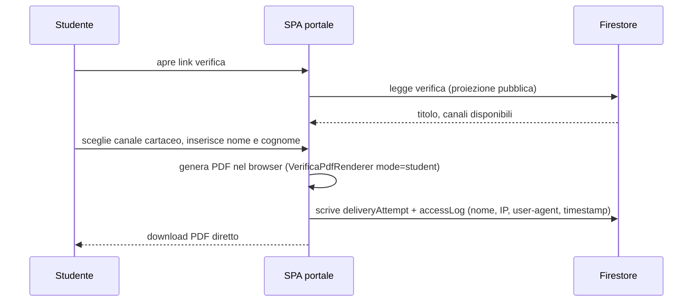
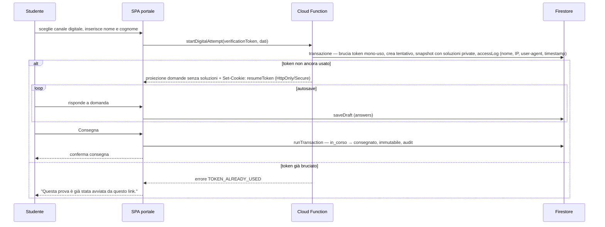

# SchoolForge — Sequenza canale cartaceo e canale digitale

## Canale cartaceo

Il canale cartaceo non usa lock né email: lo studente scarica il PDF e l'accesso viene registrato a fini di audit. Più download sono ammessi.

## Canale digitale

## Note

- Nel canale cartaceo il PDF è generato interamente nel browser; il server non è coinvolto nella produzione del documento.
- Non esiste più alcun lock email: l'unicità della consegna digitale è garantita dal token mono-uso del tentativo, bruciato alla prima chiamata `startDigitalAttempt`.
- Ogni accesso (cartaceo e digitale) registra nome dichiarato, IP, user-agent e timestamp in `accessLog`; il docente li consulta nel Report Accessi. Sono dati auto-dichiarati, non prove d'identità.
- Lo snapshot digitale con soluzioni private è creato dalla Cloud Function e mai esposto al client portale.
