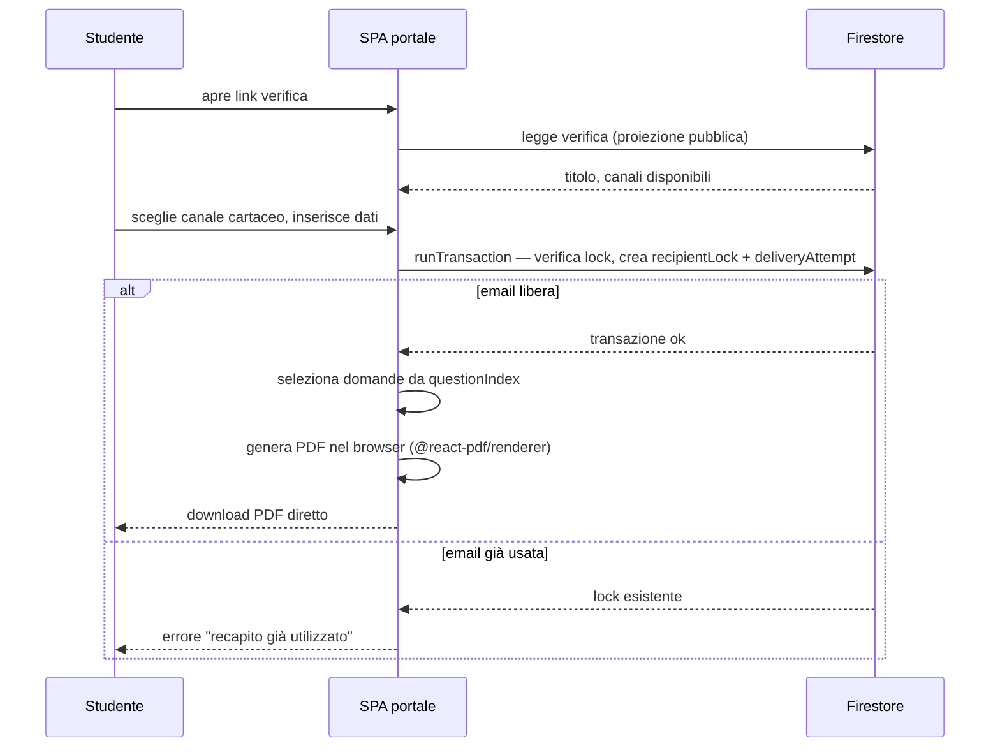
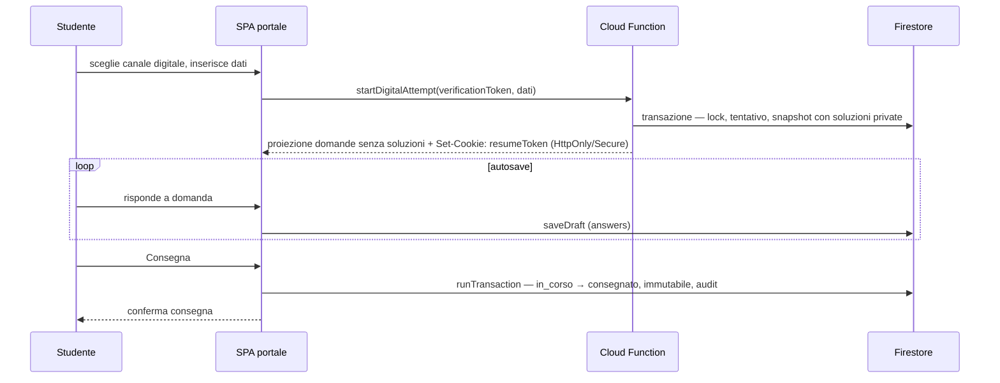

# SchoolForge — Sequenza canale cartaceo e canale digitale

## Canale cartaceo

## Canale digitale

## Note

- Nel canale cartaceo il PDF è generato interamente nel browser; il server non è coinvolto nella produzione del documento.
- Il lock `recipientLocks/{emailHash}` è unico per verifica: cartaceo e digitale condividono la stessa regola di email bruciata.
- Lo snapshot digitale con soluzioni private è creato dalla Cloud Function e mai esposto al client portale.
