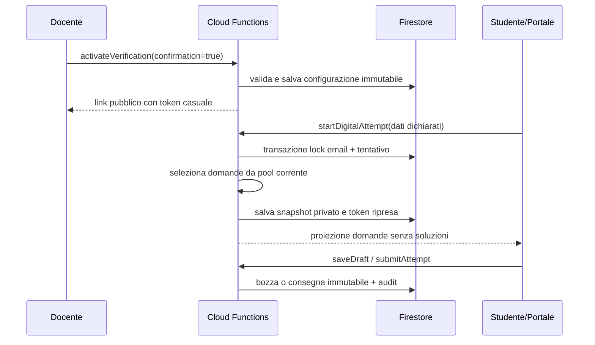

# SchoolForge — Sequenza verifica, tentativo e snapshot

L'attivazione non crea uno snapshot globale della verifica. Il solo tentativo digitale salva le domande effettivamente svolte; modifiche future alle lezioni non alterano correzione o export di quel tentativo.
