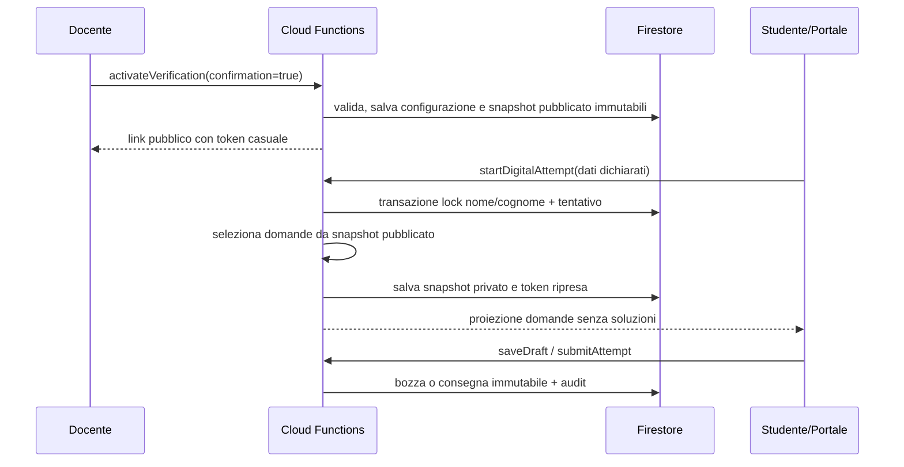

# SchoolForge — Sequenza verifica, tentativo e snapshot

L'attivazione crea uno snapshot pubblicato delle domande eleggibili; il solo tentativo digitale salva inoltre le domande effettivamente svolte. Modifiche future alle lezioni non alterano generazione, correzione o export della verifica già attiva.
