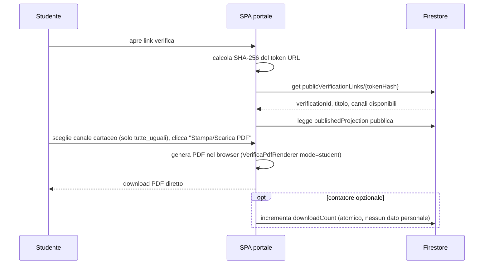

# SchoolForge — Sequenza canale cartaceo e canale digitale

## Canale cartaceo



Il canale cartaceo è puramente fisico: nessun record di tentativo (`deliveryAttempt`) e nessun log di accesso. Non usa lock né email; più download sono ammessi. Al più viene incrementato il contatore atomico `downloadCount` sul documento della verifica.

## Canale digitale

```mermaid
sequenceDiagram
    participant S as Studente
    participant SPA as SPA portale
    participant CF as Cloud Function
    participant F as Firestore

    S->>SPA: sceglie canale digitale, inserisce nome e cognome
    SPA->>CF: startDigitalAttempt(verificationToken, dati)
    CF->>F: transazione — crea participant lock nome+cognome, tentativo, snapshot con soluzioni private, accessLog (nome, IP, user-agent, timestamp)
    alt nome e cognome non ancora usati
        CF-->>SPA: proiezione domande senza soluzioni + Set-Cookie: resumeToken (HttpOnly/Secure)
        loop autosave
            S->>SPA: risponde a domanda
            SPA->>CF: continueDigitalAttempt(saveDraft)
            CF->>F: verifica cookie e stato, salva answers
        end
        S->>SPA: Consegna
        SPA->>CF: continueDigitalAttempt(submitAttempt)
        CF->>F: verifica cookie; transazione in_corso → consegnato, immutabile, audit
        SPA-->>S: conferma consegna
    else nome e cognome già usati
        CF-->>SPA: errore PARTICIPANT_ALREADY_USED
        SPA-->>S: "Questa prova risulta già avviata con questi dati."
    end
```

## Note

- Nel canale cartaceo il PDF è generato interamente nel browser; il server non è coinvolto nella produzione del documento. Il canale cartaceo non crea record di tentativo né voci di `accessLog`.
- Non esiste alcun lock email: l'unicità della consegna digitale è garantita dal participant lock per verifica e nome+cognome normalizzati, creato alla prima chiamata `startDigitalAttempt`.
- Solo l'accesso digitale registra nome dichiarato, IP, user-agent e timestamp in `accessLog`; il docente li consulta nel Report Accessi. Sono dati auto-dichiarati, non prove d'identità.
- Lo snapshot digitale con soluzioni private è creato dalla Cloud Function e mai esposto al client portale. Ripresa, bozza e consegna passano sempre da `continueDigitalAttempt`: il cookie HttpOnly non è leggibile da JavaScript né verificabile dalle Security Rules.
