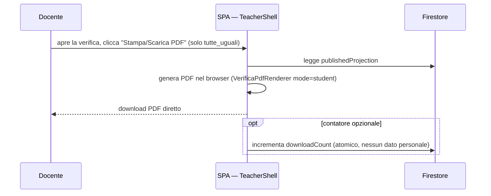

# SchoolForge — Sequenza canale cartaceo, Portale studente (M3-lite) e canale digitale (M3-full)

## Canale cartaceo (M2, implementato)

Il canale cartaceo è avviato dal docente dentro TeacherShell: nessun link pubblico, nessun token, nessuna sezione studente coinvolta.

```mermaid
sequenceDiagram
    participant D as Docente
    participant SPA as SPA — TeacherShell
    participant F as Firestore

    D->>SPA: apre la verifica, clicca "Stampa/Scarica PDF" (solo tutte_uguali)
    SPA->>F: legge publishedProjection
    SPA->>SPA: genera PDF nel browser (VerificaPdfRenderer mode=student)
    SPA-->>D: download PDF diretto
    opt contatore opzionale
        SPA->>F: incrementa downloadCount (atomico, nessun dato personale)
    end
```

Il canale cartaceo è puramente fisico: nessun record di tentativo (`deliveryAttempt`) e nessun log di accesso. Non usa lock né email; più download sono ammessi. Al più viene incrementato il contatore atomico `downloadCount` sul documento della verifica.

## Portale studente — M3-lite (deciso, read-only)

```mermaid
sequenceDiagram
    participant S as Studente
    participant SPA as SPA — StudentShell
    participant F as Firestore

    S->>SPA: login Google (personale o Workspace for Education)
    SPA->>F: get settings/ownerPublic
    F-->>SPA: ownerUid (solo per routing; uid ≠ ownerUid → StudentShell)

    S->>SPA: apre sezione Lezioni
    SPA->>F: query publicLessons (activeImportId corrente)
    F-->>SPA: lezioni pubblicate, senza pool né dati tecnici
    SPA-->>S: rendering read-only

    S->>SPA: apre sezione Verifiche
    SPA->>F: query verifications (state == "attiva" AND visibility == "public")
    F-->>SPA: elenco verifiche visibili
    S->>SPA: clicca "Scarica PDF studente"
    SPA->>F: get publishedProjection
    SPA->>SPA: genera PDF nel browser (VerificaPdfRenderer mode=student)
    SPA-->>S: download PDF diretto, nessuna soluzione
```

Nessuna scrittura, nessun record, nessuna Cloud Function. Le Security Rules negano allo studente ogni lettura di `lessons`, `questionIndex`, `publishedSnapshot` e di verifiche `bozza`/`chiusa`/`archiviata`/`attiva`+`hidden`.

## Canale digitale — M3-full (specifica rinviata)

> Descrive la specifica di un'eventuale fase successiva a M3-lite, non pianificata in dettaglio.

```mermaid
sequenceDiagram
    participant S as Studente
    participant SPA as SPA portale
    participant CF as Cloud Function
    participant F as Firestore

    S->>SPA: sceglie canale digitale, inserisce nome e cognome
    SPA->>CF: startDigitalAttempt(verificationToken, dati)
    CF->>F: transazione — crea participant lock nome+cognome, tentativo, snapshot con soluzioni private, accessLog (nome, IP, user-agent, timestamp)
    alt nome e cognome non ancora usati
        CF-->>SPA: proiezione domande senza soluzioni + Set-Cookie: resumeToken (HttpOnly/Secure)
        loop autosave
            S->>SPA: risponde a domanda
            SPA->>CF: continueDigitalAttempt(saveDraft)
            CF->>F: verifica cookie e stato, salva answers
        end
        S->>SPA: Consegna
        SPA->>CF: continueDigitalAttempt(submitAttempt)
        CF->>F: verifica cookie; transazione in_corso → consegnato, immutabile, audit
        SPA-->>S: conferma consegna
    else nome e cognome già usati
        CF-->>SPA: errore PARTICIPANT_ALREADY_USED
        SPA-->>S: "Questa prova risulta già avviata con questi dati."
    end
```

## Note

- Nel canale cartaceo il PDF è generato interamente nel browser; il server non è coinvolto nella produzione del documento. Il canale cartaceo non crea record di tentativo né voci di `accessLog`.
- M3-lite non usa link pubblici, token o dati autodichiarati: l'accesso è risolto da Firebase Authentication (Google) e dalle Security Rules che distinguono `ownerUid` da qualunque altro utente autenticato.
- (M3-full, specifica rinviata) non esisterebbe alcun lock email: l'unicità della consegna digitale sarebbe garantita dal participant lock per verifica e nome+cognome normalizzati, creato alla prima chiamata `startDigitalAttempt`. Solo l'accesso digitale registrerebbe nome dichiarato, IP, user-agent e timestamp in `accessLog`; il docente li consulterebbe nel Report Accessi. Lo snapshot digitale con soluzioni private sarebbe creato dalla Cloud Function e mai esposto al client portale; ripresa, bozza e consegna passerebbero sempre da `continueDigitalAttempt`, perché il cookie HttpOnly non è leggibile da JavaScript né verificabile dalle Security Rules.
