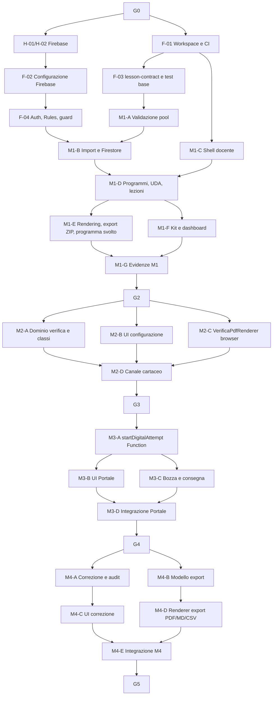

# SchoolForge — Piano di implementazione

**Versione:** 4.1
**Data:** 24 giugno 2026
**Stato:** piano esecutivo per agenti di coding
**Input vincolanti:** `brief.md`, `analisi-requisiti.md`, `architettura.md`, `api-contract.md`
**Regola di precedenza:** requisiti e architettura prevalgono su questo piano in caso di conflitto

---

## 1. Scopo del piano

Il piano trasforma la baseline in pacchetti di lavoro eseguibili da agenti di coding. Ogni pacchetto produce un risultato osservabile, ha un solo responsabile tecnico, dichiara dipendenze e include la verifica necessaria.

### 1.1 Sequenza dei moduli

| Modulo | Capacità rilasciata | Può fermarsi qui? |
|---|---|---|
| M1 — Repository didattico | Programmi, UDA, Markdown/pool, import validato, rendering, export ZIP, programma svolto (PDF + Markdown). | Sì |
| M2 — Verifiche e cartaceo | Configurazione, classi, selezione da pool, PDF browser, download docente, canale cartaceo fisico senza record (al più `downloadCount`). | Sì |
| M3 — Portale digitale | Tentativi anonimi, snapshot via Cloud Function, lock nome+cognome, token sessione, log nome+IP, bozze, consegna, deterrenza. | Sì |
| M4 — Correzione ed export | Punteggi, percentuali, rettifiche, eliminazione e `Esporta verifiche` in PDF/Markdown/CSV. | Sì |

**M5 — Correzione AI** è fuori scope V1 ed è pianificato per la V2. Vedi la sezione "V2 — Roadmap futura" in fondo. M5 non fa parte del perimetro né delle dipendenze della V1.

---

## 2. Ruoli, autorità e azioni umane

| Ruolo | Responsabilità |
|---|---|
| Docente / owner | Proprietario Firebase, billing, backup, restore e decisioni C-02/C-03. Approva i gate. |
| Agente di coding | Implementa il pacchetto assegnato, esegue test, aggiorna documentazione strettamente collegata. |
| Revisore tecnico | Verifica DoD, confini del pacchetto, test, sicurezza e coerenza con la baseline. |

### 2.1 Attività che richiedono il Docente

| ID | Azione umana | Quando | Un agente può farla? |
|---|---|---|---|
| H-01 | Creare progetti Firebase `dev` e `prod`, attivare billing Blaze, mantenere la proprietà. | Prima del provisioning reale. | Solo dopo accesso CLI autorizzato e approvazione esplicita. |
| H-02 | Creare Firestore e bucket nella regione Milano `europe-west8`. | Prima del primo deploy dati. | Può eseguire la configurazione tecnica se H-01 è completata. |
| H-03 | Configurare budget e avvisi di spesa; verificare l'export Firestore manuale dalle impostazioni. | Prima di dati reali, gate G1. | Può assistere con accesso autorizzato; il Docente verifica l'esito. |
| H-04 | Scegliere il formato iniziale di `Esporta verifiche`: PDF, Markdown o CSV come default. | Prima del pacchetto M4-D. | Il renderer è implementabile dall'agente dopo la scelta. |
| H-05 (V2) | Confermare provider AI e modello (C-02 risolta: OpenAI `gpt-4o-mini` o Anthropic Claude `claude-haiku-4-5-20251001`) e condizioni d'uso. | V2, prima di M5-A. | No, è C-02. |
| H-06 (V2) | Decidere regola didattica della correzione automatica. | V2, prima di M5-D. | No, è C-03. |

---

## 3. Regole del workflow per agenti

### 3.1 Definition of Ready (DoR)

Un pacchetto può partire solo se:

1. le sue dipendenze sono `completate` e le evidenze sono disponibili;
2. eventuali gate umani applicabili sono approvati;
3. input, file modificabili e criteri di accettazione sono dichiarati;
4. non esiste un altro pacchetto attivo sugli stessi file;
5. l'agente può eseguire verifiche senza dati reali o segreti di produzione.

### 3.2 Workflow obbligatorio

1. Leggere brief, requisiti, architettura, api-contract e questo piano.
2. Verificare il DoR e dichiarare subito un blocco reale.
3. Implementare solo lo scope assegnato.
4. Eseguire i test dichiarati e aggiungere test per regressioni introdotte.
5. Confrontare il diff con i vincoli: no account studenti, no email, no PDF persistenti, no AI in V1 (M5 è V2), no ampliamento LMS, nessuna Cloud Function aggiuntiva oltre `startDigitalAttempt`; il limite digitale usa verifica più nome/cognome normalizzati.
6. Consegnare handoff con file, test, evidenze, rischi e dipendenze sbloccate.

### 3.3 Definition of Done (DoD)

Un pacchetto è `completato` solo se:

- funziona nel percorso previsto e gestisce il fallimento principale;
- typecheck, lint, test unitari e test di integrazione sono verdi;
- non introduce segreti, dati reali o scritture client dirette a percorsi Firestore proibiti;
- documentazione, tipi e test interessati sono aggiornati;
- il revisore verifica il diff e il criterio di accettazione;
- il branch è integrabile senza modifiche non correlate.

### 3.4 Regole di dimensionamento

Un pacchetto è abbastanza piccolo da essere verificato in una review e abbastanza completo da produrre una capacità riconoscibile. Non si combinano backend, UI, migrazioni e deploy in un singolo pacchetto senza motivazione.

### 3.5 Workflow Git

`main` contiene solo lavoro revisionato. Ogni pacchetto usa `feat/<id>-<slug>` o `fix/<id>-<slug>`. Il merge richiede pipeline verde e review. Il deploy `prod` richiede gate del modulo e azione manuale del Docente.

---

## 4. Gate e stato del delivery

| Gate | Condizione di ingresso | Evidenza richiesta | Autorizza |
|---|---|---|---|
| G0 — Baseline | Brief, requisiti, architettura e piano coerenti. | Review documentale e C-01 formalizzata. | Bootstrap del repository. |
| G1 — Fondazioni Firebase | H-01/H-02/H-03 completate; CI ed Emulator Suite disponibili. | Progetti separati, budget, export Firestore manuale disponibile, Security Rules default-deny. | M1 con dati sintetici. |
| G2 — Repository didattico | M1 integrato. | Import valido/invalido, rendering senza pool, ZIP e programma svolto. | M2. |
| G3 — Verifiche e cartaceo | M2 integrato. | PDF browser, canale cartaceo senza record di tentativo né accessLog (al più `downloadCount`), nessun PDF persistito. | M3. |
| G4 — Portale digitale | M3 integrato. | Lock nome+cognome concorrente, log nome+IP, snapshot, bozza/ripresa, consegna immutabile, nessuna soluzione esposta. | M4. |
| G5 — Correzione ed export | M4 integrato e H-04 completata. | Punteggi, rettifiche, eliminazione, export PDF/Markdown/CSV da snapshot. | Uso manuale completo — fine V1. |
| G6 — AI assistita (V2) | M5-A..C integrati e H-05 completata. | Contesto chiuso, audit, proposte assistite per risposta, approvazione massiva. | AI assistita. |
| G7 — AI automatica (V2) | G6 e H-06 completati. | Opt-in per verifica, audit e rollback. | Correzione automatica. |

C-02 e C-03 riguardano la V2 e non bloccano M1–M4.

---

## 5. Dipendenze e parallelismo

I rami paralleli possono partire insieme solo dopo aver fissato i contratti TypeScript. Due agenti non modificano contemporaneamente lo stesso file di Security Rules, tipi condivisi o struttura Firestore.

---

## 6. Pacchetti preparatori

| ID | Outcome e scope | Dipende da | Parallelo | Evidenza DoD |
|---|---|---|---|---|
| F-01 | Monorepo TypeScript: workspace, build, lint, test, formattazione, convenzioni branch e CI senza deploy. | G0 | H-01/H-02 | Pipeline esegue build, lint, unit test su fixture. |
| F-02 | Configurare Firebase `dev`/`test`, CLI, Emulator Suite, variabili non segrete. Non creare risorse `prod` senza H-01/H-02. | H-01/H-02 | F-01 | Emulatori avviabili e configurazioni separate. |
| F-03 | Package `lesson-contract`: tipi dominio, parser pool v1, fixture e test contratto. | F-01 | F-02 | Parser accetta/rifiuta i casi di `analisi-requisiti.md`. |
| F-04 | Firebase Auth docente, `ownerUid` nelle Security Rules, Security Rules default-deny, audit base. | F-01/F-02 | F-03 | Owner autorizzato; soggetto diverso rifiutato da test Emulator. |

---

## 7. M1 — Repository didattico

| ID | Outcome e scope | Dipende da | Parallelo | Evidenza DoD |
|---|---|---|---|---|
| M1-A | Validazione client-side di UDA, lezioni e pool con `lesson-contract`; errori strutturati file/domanda/campo. | F-03/F-04 | M1-C | Pool invalido non invalida la lezione; fixture complete. |
| M1-B | Import diretto su Cloud Storage e Firestore (Security Rules); update `questionIndex`. | M1-A/F-04 | M1-C | Import valido visibile; fallimento non lascia contenuti parziali. |
| M1-C | Shell docente: sessione Auth, layout responsive, tema chiaro/scuro, errori e conferme comuni. | F-01/F-04 | M1-A/M1-B | Owner accede; non-owner non entra; test accessibilità base. |
| M1-D | CRUD Programmi/UDA/Lezioni, navigazione struttura didattica, flag "svolto" per programma svolto. | M1-B/M1-C | — | Struttura navigabile e operazioni auditabili. |
| M1-E | Rendering Markdown sanitizzato, asset, esclusione pool; export ZIP; programma svolto in PDF e Markdown generati nel browser. | M1-D | — | ZIP portabile, rendering senza soluzioni, programma svolto corretto in entrambi i formati. |
| M1-F | Kit template Programma/UDA/Lezione/Pool e dashboard di prontezza, senza editor o generazione contenuti. | M1-D | M1-E | Template conforme e dashboard con validità, pool assente/invalido e domande eleggibili. |
| M1-G | Test E2E M1, review sicurezza import, evidenze G2. | M1-E/M1-F | — | G2 approvabile. |

---

## 8. M2 — Verifiche e canale cartaceo

| ID | Outcome e scope | Dipende da | Parallelo | Evidenza DoD |
|---|---|---|---|---|
| M2-A | Dominio verifica: stati, configurazione (sempre modificabile dal docente), classi, validazione fonti, minimi, varianti. Transazioni Firestore client-side per attivazione/chiusura. | G2 | M2-B/M2-C | Attivazione invalida rifiutata; configurazione modificabile anche dopo l'attivazione; classi persistite. |
| M2-B | UI docente: crea/modifica/attiva verifiche, gestione classi nelle impostazioni, messaggi di blocco comprensibili. | G2, contratto M2-A | M2-A/M2-C | Il docente non può superare vincoli da UI. |
| M2-C | `VerificaPdfRenderer` browser unico (`mode="teacher" \| "student"`) con `@react-pdf/renderer`: PDF docente (intestazione vuota) e PDF studente (dati precompilati, soluzioni nascoste). | G2 | M2-A/M2-B | PDF conforme ai campi del brief; mode student senza soluzioni; nessun file in Storage. |
| M2-D | Canale cartaceo: link pubblico, generazione PDF nel browser, download diretto. Nessun record di tentativo né accessLog; al più incremento atomico di `downloadCount`. | M2-A/M2-B/M2-C | — | Nessun record di tentativo o accesso creato; nessun lock; nessun PDF persistito. |
| M2-E | Test integrazione/E2E M2, evidenze G3. | M2-D | — | PDF browser verificato; canale cartaceo senza record. |

---

## 9. M3 — Portale digitale

| ID | Outcome e scope | Dipende da | Parallelo | Evidenza DoD |
|---|---|---|---|---|
| M3-A | Cloud Function `startDigitalAttempt`: transazione Firestore (participant lock verifica+nome/cognome, tentativo, snapshot con soluzioni private), token sessione cookie HttpOnly/Secure. | G3 | — | Lock concorrente creato; snapshot creato; refresh non seleziona nuove domande; soluzioni non nel response body. |
| M3-B | UI Portale mobile-first: raccolta dati, scelta canale, sequenza domande, proiezione senza soluzioni. | M3-A, contratto endpoint | M3-C | Nessun menu/dato interno; uso da tastiera e mobile verificato. |
| M3-C | Bozze, autosave, consegna immutabile, fullscreen/tab warning/copia-incolla UI. | M3-A | M3-B | Risposte riprendono nello stesso browser; consegna non modificabile. |
| M3-D | E2E e test negativi: lock nome+cognome, rate limit, soluzioni non accessibili. | M3-B/M3-C | — | Evidenze G4; nessuna soluzione ottenibile dal client. |

---

## 10. M4 — Correzione ed export

| ID | Outcome e scope | Dipende da | Parallelo | Evidenza DoD |
|---|---|---|---|---|
| M4-A | Servizio correzione client: punteggi 0..massimo, percentuale, stato non definitivo, rettifiche append-only, eliminazione dati. | G4 | M4-B | Percentuale e storico rettifiche corretti; eliminazione preserva solo audit. |
| M4-B | Modello canonico export: leggi tutte le consegne definitive e snapshot, ordina per verifica/data, escludi bozze/annullate. | G4 | M4-A | Ordine corretto; indipendenza dal Markdown corrente. |
| M4-C | UI correzione: lista filtri (classe inclusa), dettaglio, punteggi, commenti, rettifiche, popup `Registro Correzioni` (tabella nome/cognome/punteggio/percentuale/data con export PDF/CSV opzionale). | M4-A | M4-B | Correzione manuale completa senza voto elettronico; Registro Correzioni consultabile ed esportabile. |
| M4-D | Renderer export nel browser: genera PDF, Markdown e CSV dal modello canonico; download on-demand. Attende H-04 per il formato di default. | M4-B/H-04 | M4-C | Documento contiene tutte e sole le consegne richieste nei tre formati; nessuna persistenza. |
| M4-E | Integrazione M4, E2E correzione/export, test su snapshot dopo modifica lezione, evidenze G5. | M4-C/M4-D | — | Ciclo digitale manuale completo. |

---

> **M5 — Correzione AI** è spostato interamente alla V2. I pacchetti M5-A..E non fanno parte della V1: sono dettagliati nella sezione "V2 — Roadmap futura" in fondo a questo documento.

---

## 12. Qualità, CI/CD e costi

### 12.1 Pipeline minima

| Stage | Trigger | Blocca | Contenuto |
|---|---|---|---|
| Verifica | Ogni push/PR | Merge | Format, lint, typecheck, unit test e build. |
| Integrazione | PR verso `main` | Merge | Firebase Emulator Suite: Auth, Firestore, Storage e Functions (solo M3+). |
| E2E | Prima dei gate G2–G7 | Gate | Browser test sui flussi del modulo e casi negativi. |
| Deploy `dev` | Merge su `main` | — | Deploy controllato senza dati reali. |
| Deploy `prod` | Gate approvato + azione manuale Docente | Go-live | Backup verificato, release notes e smoke test. |

### 12.2 Regole di costo

- Sviluppo e test usano Emulator Suite e fixture sintetiche.
- Nessuna VM, Cloud SQL, container sempre acceso, coda dedicata o servizio enterprise senza decisione documentata.
- L'unica Cloud Function nella V1 è `startDigitalAttempt`; qualsiasi Function aggiuntiva proposta da un agente deve essere giustificata e approvata.
- PDF e documenti generati nel browser, mai su server.
- Il Docente controlla budget/avvisi prima del primo deploy `prod`.
- In V2, ogni pacchetto che aggiunge una chiamata a provider esterno (AI) dichiara volume atteso e costo variabile.

### 12.3 Regole di rilascio e rollback

1. Le modifiche Firestore devono essere compatibili con la versione applicativa precedente durante il deploy.
2. Le funzionalità incomplete sono invisibili o disabilitate tramite flag server-side.
3. Il rollback del codice non cancella Markdown, snapshot digitali, consegne o audit.
4. Un errore import non scrive su Firestore; un errore di avvio digitale non crea un participant lock parziale.
5. Un incidente dati attiva C-01: fermare le scritture interessate, valutare l'ultimo export Firestore manuale, ripristinare e documentare.

---

## 13. Handoff, dashboard e criteri finali

### 13.1 Handoff obbligatorio

Ogni pacchetto concluso produce:

- ID e risultato conseguito;
- file modificati e confini rispettati;
- comandi di test eseguiti ed esito;
- evidenze per il gate interessato;
- debito tecnico o rischio residuo reale;
- dipendenze sbloccate e prossima azione concreta.

### 13.2 Dashboard di avanzamento

| Campo | Valore |
|---|---|
| Pacchetto | ID e titolo. |
| Stato | `non_avviato`, `in_corso`, `bloccato`, `in_review`, `completato`. |
| Dipendenze | ID e stato; descrivere il blocco effettivo. |
| Branch/PR | Riferimento. |
| Test | Comandi, evidenza e risultato. |
| Gate | Gate coinvolto e decisione umana richiesta. |
| Rischi | Solo rischi nuovi o modificati. |
| Prossima azione | Una singola azione verificabile. |

### 13.3 Criteri di successo

1. Ogni modulo rilascia una capacità usabile senza anticipare AI o scope LMS.
2. Nessun agente lavora su un pacchetto senza DoR o ignora un gate umano.
3. Verifiche e consegne digitali rispettano il lock nome+cognome, il log nome+IP, lo snapshot e l'assenza di PDF persistenti.
4. `Esporta verifiche` è costruito da tutte le consegne definitive e non dalle lezioni correnti.
5. Test automatici, E2E e review crescono insieme al prodotto.
6. Firebase resta configurato con costo minimo; nessuna Cloud Function aggiuntiva senza approvazione.
7. Il progetto può fermarsi dopo G2, G3, G4 o G5 mantenendo un prodotto utile.

---

## Appendice A — Primo pacchetto da assegnare

Il primo pacchetto assegnabile è **F-01 — Workspace e CI**. Il provisioning Firebase reale non parte finché il Docente non ha completato H-01 e H-02. Dopo F-01, F-02 e F-03 possono avanzare in parallelo; F-04 richiede sia il workspace sia l'ambiente Firebase `dev`.

---

## Appendice B — Schede pacchetti dettagliate

Ogni scheda standardizza prerequisiti, file e verifica. I percorsi seguono il monorepo descritto in `toolchain.md`.

### F-01 — Workspace e CI

| Campo | Valore |
|---|---|
| Prerequisiti | G0 |
| File da creare | `package.json`, `pnpm-workspace.yaml`, `apps/web/`, `packages/lesson-contract/`, `functions/`, config lint/format, workflow CI |
| File da modificare | — |
| Test minimi | Pipeline esegue build, lint, typecheck e unit test su una fixture banale |
| Evidenza richiesta | Log CI verde con i quattro step; albero del workspace |

### F-02 — Configurazione Firebase

| Campo | Valore |
|---|---|
| Prerequisiti | H-01/H-02 |
| File da creare | `firebase.json`, `.firebaserc`, `firestore.indexes.json`, config emulatori |
| File da modificare | `package.json` (script emulatori) |
| Test minimi | Avvio Emulator Suite (Auth/Firestore/Storage/Functions) sulle porte di `toolchain.md` |
| Evidenza richiesta | Output `firebase emulators:start`; alias `dev`/`test` separati |

### F-03 — lesson-contract e test base

| Campo | Valore |
|---|---|
| Prerequisiti | F-01 |
| File da creare | `packages/lesson-contract/src/index.ts`, fixture pool valide/invalide, `*.contract.test.ts` |
| File da modificare | `apps/web/src/contracts/lesson.ts` (riesporta dal package) |
| Test minimi | Il parser accetta/rifiuta i casi di `analisi-requisiti.md` con errori file/domanda/campo |
| Evidenza richiesta | Report Vitest contract; elenco casi coperti |

### F-04 — Auth, Rules, guard

| Campo | Valore |
|---|---|
| Prerequisiti | F-01/F-02 |
| File da creare | `firestore.rules`, `storage.rules`, test Emulator delle regole, guard auth SPA |
| File da modificare | `apps/web/src/lib/firebase.ts` |
| Test minimi | Owner autorizzato; soggetto diverso rifiutato; default-deny |
| Evidenza richiesta | Test Emulator regole verdi; matrice percorsi/ruoli |

### M1 — Repository didattico

#### M1-A — Validazione pool

| Campo | Valore |
|---|---|
| Prerequisiti | F-03/F-04 |
| File da creare | `apps/web/src/features/repository/validate*.ts`, `*.test.ts` |
| File da modificare | `apps/web/src/contracts/lesson.ts` (se servono helper) |
| Test minimi | Pool invalido non invalida la lezione; errori strutturati per file/domanda/campo |
| Evidenza richiesta | Fixture complete e report test |

#### M1-B — Import e Firestore

| Campo | Valore |
|---|---|
| Prerequisiti | M1-A/F-04 |
| File da creare | `apps/web/src/features/repository/import*.ts`, `src/types/firestore.ts` |
| File da modificare | `firestore.rules` (lessons/udas/questionIndex) |
| Test minimi | Import valido visibile; fallimento non lascia contenuti parziali |
| Evidenza richiesta | Test integrazione Emulator import atomico |

#### M1-C — Shell docente

| Campo | Valore |
|---|---|
| Prerequisiti | F-01/F-04 |
| File da creare | `apps/web/src/routes/teacher/`, layout, tema chiaro/scuro |
| File da modificare | router SPA |
| Test minimi | Owner accede; non-owner non entra; accessibilità base |
| Evidenza richiesta | E2E login; check a11y |

#### M1-D — Programmi, UDA, lezioni

| Campo | Valore |
|---|---|
| Prerequisiti | M1-B/M1-C |
| File da creare | feature CRUD struttura, flag "svolto" |
| File da modificare | `src/types/firestore.ts` |
| Test minimi | Struttura navigabile; operazioni auditabili |
| Evidenza richiesta | E2E navigazione; auditEvents prodotti |

#### M1-E — Rendering, export ZIP, programma svolto

| Campo | Valore |
|---|---|
| Prerequisiti | M1-D |
| File da creare | renderer Markdown sanitizzato, export ZIP, programma svolto PDF+MD |
| File da modificare | `apps/web/src/components/pdf/` |
| Test minimi | ZIP portabile; rendering senza pool; programma svolto nei due formati |
| Evidenza richiesta | ZIP esportato; rendering senza soluzioni |

#### M1-F — Kit e dashboard di prontezza

| Campo | Valore |
|---|---|
| Prerequisiti | M1-D |
| File da creare | `apps/web/src/features/repository/templates/`, `readiness*.ts` |
| File da modificare | router docente e contratti repository |
| Test minimi | Template conformi; dashboard con validità, pool assente/invalido e domande eleggibili |
| Evidenza richiesta | Download template e stato dashboard verificati |

#### M1-G — Integrazione M1

| Campo | Valore |
|---|---|
| Prerequisiti | M1-E/M1-F |
| File da creare | `*.e2e.ts` M1 |
| File da modificare | — |
| Test minimi | E2E M1 completo; review sicurezza import |
| Evidenza richiesta | Evidenze G2 |

### M2 — Verifiche e canale cartaceo

#### M2-A — Dominio verifica e classi

| Campo | Valore |
|---|---|
| Prerequisiti | G2 |
| File da creare | dominio verifica, transazioni attivazione/chiusura, gestione classi |
| File da modificare | `src/types/firestore.ts`, `firestore.rules` |
| Test minimi | Attivazione invalida rifiutata; config attiva immutabile; classi persistite |
| Evidenza richiesta | Test integrazione transazioni |

#### M2-B — UI configurazione

| Campo | Valore |
|---|---|
| Prerequisiti | G2, contratto M2-A |
| File da creare | UI crea/modifica/attiva verifiche, impostazioni classi |
| File da modificare | router teacher |
| Test minimi | Il docente non può superare vincoli da UI |
| Evidenza richiesta | E2E configurazione |

#### M2-C — VerificaPdfRenderer

| Campo | Valore |
|---|---|
| Prerequisiti | G2 |
| File da creare | `apps/web/src/components/pdf/VerificaPdfRenderer.tsx` (mode teacher\|student) |
| File da modificare | — |
| Test minimi | PDF docente (intestazione vuota) e studente (precompilato) conformi al brief; mode student nasconde soluzioni; nessun file in Storage |
| Evidenza richiesta | PDF generati nei due mode |

#### M2-D — Canale cartaceo

| Campo | Valore |
|---|---|
| Prerequisiti | M2-A/M2-B/M2-C |
| File da creare | link pubblico, download PDF browser, incremento atomico opzionale di `downloadCount` |
| File da modificare | `firestore.rules` (incremento `downloadCount` su `verifications`) |
| Test minimi | Nessun record di tentativo né voce accessLog; nessun lock; più download ammessi; nessun PDF persistito |
| Evidenza richiesta | Nessun `deliveryAttempt`/accessLog creato; PDF non in Storage |

#### M2-E — Integrazione M2

| Campo | Valore |
|---|---|
| Prerequisiti | M2-D |
| File da creare | `*.e2e.ts` M2 |
| File da modificare | — |
| Test minimi | PDF browser e log accessi verificati |
| Evidenza richiesta | Evidenze G3 |

### M3 — Portale digitale

#### M3-A — startDigitalAttempt Function

| Campo | Valore |
|---|---|
| Prerequisiti | G3 |
| File da creare | `functions/src/startDigitalAttempt.ts`, `functions/src/index.ts`, `src/types/functions.ts` |
| File da modificare | `firestore.rules` (snapshot/accessLog) |
| Test minimi | Participant lock creato; snapshot creato; refresh non seleziona nuove domande; soluzioni assenti dal body; secondo avvio con stesso nome/cognome → `PARTICIPANT_ALREADY_USED` |
| Evidenza richiesta | Test integrazione Function; log accesso registrato |

#### M3-B — UI Portale

| Campo | Valore |
|---|---|
| Prerequisiti | M3-A, contratto endpoint |
| File da creare | `apps/web/src/routes/exam/`, UI mobile-first |
| File da modificare | router SPA |
| Test minimi | Nessun menu/dato interno; uso da tastiera e mobile |
| Evidenza richiesta | E2E mobile; nessuna soluzione nel client |

#### M3-C — Bozza e consegna

| Campo | Valore |
|---|---|
| Prerequisiti | M3-A |
| File da creare | autosave, consegna immutabile, fullscreen/tab warning |
| File da modificare | `firestore.rules` (answers) |
| Test minimi | Risposte riprendono nello stesso browser; consegna non modificabile |
| Evidenza richiesta | E2E ripresa e consegna |

#### M3-D — Integrazione Portale

| Campo | Valore |
|---|---|
| Prerequisiti | M3-B/M3-C |
| File da creare | `*.e2e.ts` M3, test negativi |
| File da modificare | — |
| Test minimi | Participant lock, rate limit, soluzioni non accessibili, secondo avvio rifiutato |
| Evidenza richiesta | Evidenze G4 |

### M4 — Correzione ed export

#### M4-A — Correzione e audit

| Campo | Valore |
|---|---|
| Prerequisiti | G4 |
| File da creare | servizio correzione, rettifiche append-only, eliminazione dati |
| File da modificare | `src/types/firestore.ts`, `firestore.rules` |
| Test minimi | Percentuale e storico corretti; eliminazione preserva solo audit |
| Evidenza richiesta | Test correzione/rettifica |

#### M4-B — Modello export

| Campo | Valore |
|---|---|
| Prerequisiti | G4 |
| File da creare | modello canonico export da snapshot |
| File da modificare | — |
| Test minimi | Ordine per verifica/data; indipendenza dal Markdown corrente; esclude bozze/annullate |
| Evidenza richiesta | Test modello su fixture miste |

#### M4-C — UI correzione

| Campo | Valore |
|---|---|
| Prerequisiti | M4-A |
| File da creare | UI lista/filtri (classe inclusa), dettaglio, punteggi, rettifiche, popup `Registro Correzioni` con export PDF/CSV nel browser |
| File da modificare | router teacher, `apps/web/src/components/pdf/` (renderer Registro Correzioni) |
| Test minimi | Correzione manuale completa senza voto elettronico; Registro Correzioni elenca nome/cognome/punteggio/percentuale/data ed esporta in PDF/CSV senza persistenza |
| Evidenza richiesta | E2E correzione; popup Registro Correzioni ed export |

#### M4-D — Renderer export PDF/MD/CSV

| Campo | Valore |
|---|---|
| Prerequisiti | M4-B/H-04 |
| File da creare | renderer export tre formati nel browser |
| File da modificare | `apps/web/src/components/pdf/` |
| Test minimi | Documento contiene tutte e sole le consegne richieste nei tre formati; nessuna persistenza |
| Evidenza richiesta | Export nei tre formati |

#### M4-E — Integrazione M4

| Campo | Valore |
|---|---|
| Prerequisiti | M4-C/M4-D |
| File da creare | `*.e2e.ts` M4 |
| File da modificare | — |
| Test minimi | Ciclo digitale manuale completo; snapshot dopo modifica lezione |
| Evidenza richiesta | Evidenze G5 |

---

## Appendice C — V2 — Roadmap futura

La V2 introduce il **Modulo 5 — Correzione AI**, fuori dal perimetro V1. Dipende da M4 completato e dalle decisioni C-02 (risolta) e C-03.

**C-02 risolta:** il provider AI è OpenAI API (modello di default `gpt-4o-mini`) oppure Anthropic Claude API (modello di default `claude-haiku-4-5-20251001`); il Docente configura la chiave API nelle impostazioni. La chiave vive in Secret Manager / Firebase Functions config.

Pacchetti previsti (dettaglio di specifica, non in V1):

| ID | Outcome e scope | Dipende da | Evidenza DoD |
|---|---|---|---|
| M5-A | `AiGateway`, feature flag, Secret Manager, policy C-02, audit e mock provider. | G5/H-05 | Nessun invio AI senza feature flag e chiave valida. |
| M5-B | Proposte assistite per item con contesto chiuso. | M5-A | Proposte non alterano correzioni definitive. |
| M5-C | UI assistita: proposta, approva/modifica/rifiuta, bulk approval con riepilogo. | M5-B | Audit completo; bulk non applica item incompleti. |
| M5-D | Modalità automatica con opt-in per verifica, regole configurabili, audit e rollback. Richiede C-03 e H-06. | M5-C/H-06 | Non attiva per default; reversibile. |
| M5-E | Test sicurezza, qualità e costi AI; evidenze G6/G7. | M5-C/M5-D | Nessun web/retrieval; costi osservabili; gate rispettati. |

I gate G6 (AI assistita) e G7 (AI automatica) appartengono alla V2.

### Altre funzionalità rinviate alla V2

Oltre al Modulo 5, sono rinviate alla V2 le seguenti funzionalità, fuori dal perimetro V1:

- **Editor integrato lezioni e domande:** modifica dei file Markdown delle lezioni e dei pool direttamente dal sistema. In V1 i file sono prodotti esternamente (strumenti AI come Claude o GPT, o manualmente) e SchoolForge si limita a importarli e validarli.
- **Specchietto consegne:** popup sulla verifica attiva che mostra in tempo reale chi ha consegnato e chi non ha ancora consegnato.
- **Sommario curricolare PDF:** generazione automatica di un sommario curricolare (curriculum vitae della classe) in PDF dai programmi svolti. In V1 resta disponibile l'export del programma svolto in Markdown e PDF descritto in M1; è solo la generazione di questo ulteriore sommario curricolare in PDF a essere rinviata alla V2.
