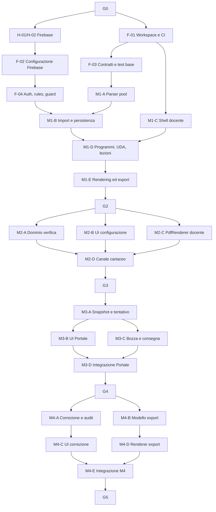

# SchoolForge — Piano di implementazione e workflow di delivery

**Versione:** 3.1
**Data:** 24 giugno 2026
**Stato:** piano esecutivo per agenti di coding
**Input vincolanti:** `brief.md`, `analisi-requisiti.md`, `architettura.md`
**Regola di precedenza:** requisiti e architettura prevalgono su questo piano in caso di conflitto

---

## 1. Scopo del piano

Il piano trasforma la baseline in pacchetti di lavoro eseguibili da agenti di coding. Non assegna funzionalità enormi a un singolo agente e non spezza il lavoro in micro-task privi di valore autonomo.

Ogni pacchetto deve produrre un risultato osservabile, avere un solo responsabile tecnico, dichiarare dipendenze e includere la verifica necessaria. Un agente non amplia per inferenza perimetro, ruoli, provider, dati raccolti o funzionalità AI.

### 1.1 Sequenza dei moduli prodotto

| Modulo | Capacità rilasciata | Può fermarsi qui? |
|---|---|---|
| M1 — Repository didattico | Programmi, UDA, Markdown/pool, import validato, rendering, export ZIP e programma svolto. | Sì: è già un repository didattico utile. |
| M2 — Verifiche cartacee | Configurazione, selezione, PDF docente, canale cartaceo via email e email bruciata. | Sì: il docente può distribuire prove cartacee. |
| M3 — Portale digitale | Tentativi anonimi, snapshot, bozze, consegna e deterrenza di base. | Sì: il Portale raccoglie consegne strutturate. |
| M4 — Correzione ed export | Punteggi, percentuali, rettifiche, eliminazione e `Esporta verifiche`. | Sì: ciclo digitale manuale completo. |
| M5 — Correzione AI | Proposte assistite, anomalie consultive e, solo con gate, automatica. | Sì, ma è opzionale. |

M5 non è autorizzato a ritardare o modificare M1–M4.

## 2. Ruoli, autorità e azioni umane

| Ruolo | Responsabilità |
|---|---|
| Docente / owner | Proprietario del progetto Firebase, billing, account amministrativi, budget, backup, restore e decisioni C-02/C-03. Approva i gate. |
| Agente di coding | Implementa esclusivamente il pacchetto assegnato, esegue test locali/emulatori, aggiorna documentazione strettamente collegata e consegna evidenza. |
| Revisore tecnico | Verifica il DoD, i confini del pacchetto, test, sicurezza e compatibilità con la baseline prima del merge. |

### 2.1 Attività che richiedono il Docente

| ID | Azione umana | Quando | Un agente può farla? |
|---|---|---|---|
| H-01 | Creare i progetti Firebase `dev` e `prod`, attivare billing Blaze e mantenere la proprietà sul proprio account. | Prima del provisioning reale. | Solo dopo accesso CLI autorizzato e approvazione esplicita; non può assumere billing o ownership. |
| H-02 | Creare Firestore e bucket nella regione Milano `europe-west8`, dove supportata. | Prima del primo deploy dati. | Può eseguire la configurazione tecnica se H-01 è completata. |
| H-03 | Configurare budget e avvisi di spesa, backup giornaliero, conservazione 30 giorni e primo restore test. | Prima di dati reali, gate G1. | Può assistere/configurare con accesso autorizzato; il Docente verifica l'esito. |
| H-04 | Scegliere e verificare mittente/fornitore email per l'invio dei PDF cartacei. | Prima del canale cartaceo M2. | No: implica dominio, account e costi esterni del Docente. |
| H-05 | Scegliere il formato iniziale di `Esporta verifiche`: PDF unico oppure Markdown. | Prima del pacchetto M4-E. | Il renderer è implementabile dall'agente dopo la scelta. |
| H-06 | Decidere provider AI, condizioni e residenza dati. | Prima di M5-A. | No, è C-02. |
| H-07 | Decidere regola didattica della correzione automatica. | Prima di M5-E. | No, è C-03. |

## 3. Regole del workflow per agenti

### 3.1 Definition of Ready (DoR)

Un pacchetto può partire solo se:

1. le sue dipendenze sono `completate` e le evidenze sono disponibili;
2. eventuali gate umani applicabili sono approvati;
3. input, file modificabili e criteri di accettazione sono dichiarati;
4. non esiste un altro pacchetto attivo sugli stessi file o lo split è esplicito;
5. l'agente può eseguire verifiche senza usare dati reali o segreti di produzione.

### 3.2 Workflow obbligatorio di un pacchetto

1. Leggere brief, requisiti, architettura, questo piano e i file del pacchetto.
2. Verificare il DoR e dichiarare subito un blocco reale.
3. Implementare solo lo scope assegnato.
4. Eseguire i test dichiarati e aggiungere test per regressioni introdotte.
5. Confrontare il diff con i vincoli: no account studenti, no PDF persistenti, no AI fuori M5, no ampliamento LMS.
6. Consegnare handoff con file, test, evidenze, rischi e dipendenze sbloccate.

### 3.3 Definition of Done (DoD)

Un pacchetto è `completato` solo se:

- il risultato funziona nel percorso previsto e gestisce almeno il fallimento principale;
- typecheck, lint, test unitari e test di integrazione pertinenti sono verdi;
- non introduce segreti, dati reali o scritture client dirette su Firestore;
- documentazione/API/test interessati sono aggiornati o il disallineamento è dichiarato;
- il revisore verifica il diff e il criterio di accettazione del pacchetto;
- il branch è integrabile senza modifiche non correlate.

### 3.4 Regole di dimensionamento

Un pacchetto deve essere abbastanza piccolo da essere verificato integralmente in una review e abbastanza completo da produrre una capacità riconoscibile. Non sono ammessi pacchetti che combinano, senza motivo, backend, UI, migrazioni, deploy e AI. Se una modifica tocca più di un modulo, il pacchetto deve limitarsi al contratto condiviso e sbloccare i pacchetti successivi.

### 3.5 Workflow Git

`main` contiene solo lavoro revisionato e verificato. Ogni pacchetto usa un branch `feat/<id>-<slug>` oppure `fix/<id>-<slug>` e apre una PR limitata al suo scope. Il merge richiede pipeline verde e review; deploy di produzione richiede inoltre il gate del modulo e l'azione manuale del Docente. Un agente non unisce, forza push o modifica la configurazione di billing senza autorizzazione esplicita.

## 4. Gate e stato del delivery

| Gate | Condizione di ingresso | Evidenza richiesta | Autorizza |
|---|---|---|---|
| G0 — Baseline | Brief, requisiti, architettura e piano coerenti. | Review documentale e C-01 formalizzata. | Bootstrap del repository. |
| G1 — Fondazioni Firebase | H-01/H-02/H-03 completate; CI ed Emulator Suite disponibili. | Progetti separati, budget, backup, restore test, Security Rules di default-deny. | M1 con dati sintetici. |
| G2 — Repository didattico | M1 integrato. | Import valido/invalido, rendering senza pool, ZIP e programma svolto. | M2. |
| G3 — Verifiche cartacee | M2 integrato e H-04 completata. | PDF docente, invio email idempotente, lock email concorrente, nessun PDF persistito. | M3. |
| G4 — Portale digitale | M3 integrato. | Snapshot, bozza/ripresa, consegna immutabile, nessuna soluzione esposta. | M4. |
| G5 — Correzione ed export | M4 integrato e H-05 completata. | Punteggi, rettifiche, eliminazione, export globale da snapshot. | Uso manuale completo. |
| G6 — AI assistita | M5-A..D integrati e H-06 completata. | Contesto chiuso, audit, proposte assistite, anomalie consultive. | AI assistita. |
| G7 — AI automatica | G6 e H-07 completati. | Opt-in per verifica, limiti punteggio, audit e rollback. | Correzione automatica. |

Un gate blocca solo il proprio ambito: C-02 e C-03 non bloccano M1–M4.

## 5. Dipendenze e parallelismo

I rami indicati come paralleli possono partire insieme solo dopo avere fissato i contratti TypeScript/API. Due agenti non modificano contemporaneamente lo stesso file di schema, Security Rules o endpoint.

## 6. Pacchetti preparatori

| ID | Outcome e scope | Dipende da | Può procedere in parallelo | Evidenza DoD |
|---|---|---|---|---|
| F-01 | Creare monorepo TypeScript: workspace, build, lint, test, formattazione, convenzioni branch e CI senza deploy. | G0 | H-01/H-02 | Pipeline esegue build, lint, unit test su fixture. |
| F-02 | Configurare Firebase `dev`/`test`, CLI, Emulator Suite, progetti e variabili non segrete. Non creare risorse `prod` senza H-01/H-02. | H-01, H-02 | F-01 | Emulatori avviabili e configurazioni separate. |
| F-03 | Creare package condiviso `lesson-contract`, tipi di dominio minimi, fixture e test del contratto pool v1. | F-01 | F-02 | Parser accetta/rifiuta i casi di `analisi-requisiti.md`. |
| F-04 | Implementare Firebase Auth docente, `ownerUid`, Security Rules default-deny, guard Cloud Functions, accesso Secret Manager e audit base. | F-01, F-02 | F-03 | Owner autorizzato; soggetto diverso e client diretto rifiutati da test emulatori. |

## 7. M1 — Repository didattico

| ID | Outcome e scope | Dipende da | Parallelo consentito | Evidenza DoD |
|---|---|---|---|---|
| M1-A | Validazione server-side di UDA, lezioni e pool; errori strutturati file/domanda/campo. | F-03, F-04 | M1-C | Pool invalido non rende invalida la lezione; fixture complete. |
| M1-B | Staging Cloud Storage, preflight import, commit atomico, indice Firestore e cleanup. | M1-A, F-04 | M1-C | Import valido visibile; fallimento non lascia contenuti parziali. |
| M1-C | Shell docente: sessione, layout responsive, tema chiaro/scuro, errori e conferme comuni. | F-01, F-04 | M1-A/M1-B | Owner accede; non-owner non entra; test accessibilità base. |
| M1-D | CRUD Programmi/UDA/Lezioni e collegamento alla UI, senza editor Markdown. | M1-B, M1-C | — | Struttura didattica navigabile e operazioni auditabili. |
| M1-E | Rendering Markdown sanitizzato, asset, esclusione pool, export ZIP e programma svolto `.txt`. | M1-D | — | ZIP portabile, rendering senza soluzioni, programma svolto corretto. |
| M1-F | Test E2E M1, review sicurezza/import e preparazione evidenze G2. | M1-E | — | G2 approvabile senza funzionalità M2. |

## 8. M2 — Verifiche cartacee

| ID | Outcome e scope | Dipende da | Parallelo consentito | Evidenza DoD |
|---|---|---|---|---|
| M2-A | Dominio verifica: bozza/attiva/chiusa/archiviata, validazione fonti, minimi, varianti e selezione da pool corrente. | G2 | M2-B/M2-C | Attivazione invalida rifiutata; configurazione attiva immutabile. |
| M2-B | UI docente per creare, controllare e attivare verifiche; messaggi di blocco comprensibili. | G2, contratto M2-A iniziale | M2-A/M2-C | Il docente non può superare vincoli da UI o API. |
| M2-C | `PdfRenderer` per PDF docente, intestazione e punteggi, generazione stream senza persistenza. | G2 | M2-A/M2-B | PDF docente conforme e nessun oggetto PDF in Storage. |
| M2-D | Link pubblico, lock Firestore `verifica + email`, MailGateway idempotente e canale cartaceo. | M2-A/M2-B/M2-C, H-04 | — | Due richieste concorrenti producono un solo invio; errore email non brucia indebitamente il recapito. |
| M2-E | Test integrazione/E2E M2, costo e sicurezza del canale email, evidenze G3. | M2-D | — | PDF docente e invio studente verificati; nessun PDF persistito. |

## 9. M3 — Portale digitale

| ID | Outcome e scope | Dipende da | Parallelo consentito | Evidenza DoD |
|---|---|---|---|---|
| M3-A | Servizio tentativo digitale: token pubblico, lock email, snapshot al tentativo, cookie di ripresa e stati. | G3 | — | Nuovo tentativo crea snapshot; refresh non seleziona nuove domande. |
| M3-B | UI Portale mobile-first: raccolta dati, sequenza domande e proiezione senza soluzioni. | M3-A, contratto endpoint | M3-C | Nessun menu/dato interno; uso da tastiera e mobile verificato. |
| M3-C | Bozze, autosave, consegna immutabile, fullscreen/tab warning/copia-incolla UI. | M3-A | M3-B | Risposte riprendono nello stesso browser; consegna non è modificabile. |
| M3-D | E2E e test negativi del Portale: token, rate limit, accesso a soluzioni, lock inter-canale. | M3-B, M3-C | — | Evidenze G4 e nessuna soluzione ottenibile dal client. |

## 10. M4 — Correzione ed export

| ID | Outcome e scope | Dipende da | Parallelo consentito | Evidenza DoD |
|---|---|---|---|---|
| M4-A | Servizio correzione: punteggi 0..massimo, percentuale, stato non definitivo, rettifiche append-only ed eliminazione dati. | G4 | M4-B | Percentuale e storico rettifiche corretti; eliminazione preserva solo audit non identificativo. |
| M4-B | Costruire il modello canonico di `Esporta verifiche` da tutte le consegne definitive e snapshot, senza renderer finale. | G4 | M4-A | Ordine verifica/data, esclusione bozze/annullate, indipendenza dal Markdown corrente. |
| M4-C | UI correzione: lista, filtri, dettaglio, punteggi, commenti e rettifiche. | M4-A | M4-B | Correzione manuale completa senza voto elettronico. |
| M4-D | Implementare il renderer dell'export globale nel formato approvato da H-05 e il download on-demand. | M4-B, H-05 | M4-C | Un documento contiene tutte e sole le consegne richieste; nessuna persistenza. |
| M4-E | Integrazione M4, E2E correzione/export, test su snapshot dopo modifica lezione ed evidenze G5. | M4-C, M4-D | — | Ciclo digitale manuale completo e approvabile. |

## 11. M5 — Correzione AI opzionale

| ID | Outcome e scope | Dipende da | Parallelo consentito | Evidenza DoD |
|---|---|---|---|---|
| M5-A | Configurare `AiGateway`, feature flag, segreti, policy C-02, audit e mock provider. | G5, H-06 | — | Nessun invio AI senza feature flag e configurazione valida. |
| M5-B | Proposte assistite per item con contesto chiuso: lezione, domanda snapshot, soluzione, risposta e nota docente. | M5-A | — | Proposte non alterano correzioni definitive. |
| M5-C | UI assistita: proposta, approva/modifica/rifiuta, bulk approval con riepilogo ed esclusioni. | M5-B | M5-D | Audit completo; bulk non applica item incompleti. |
| M5-D | Rapporto anomalie stilistiche solo consultivo; `riferimenti insufficienti` quando non esiste evidenza. | M5-B | M5-C | Nessuna penalizzazione o modifica automatica. |
| M5-E | Modalità automatica con opt-in per verifica, limiti punteggio, audit e rollback. | M5-C, H-07 | — | Non attiva per default e reversibile tramite rettifica. |
| M5-F | Test di sicurezza, qualità e costi AI; evidenze G6/G7. | M5-C/M5-D/M5-E secondo gate | — | Nessun web/retrieval, costi osservabili, gate rispettati. |

## 12. Qualità, CI/CD e costi

### 12.1 Pipeline minima

| Stage | Trigger | Blocca | Contenuto |
|---|---|---|---|
| Verifica | Ogni push/PR | Merge | Format, lint, typecheck, unit test e build. |
| Integrazione | PR verso `main` | Merge | Firebase Emulator Suite: Auth, Firestore, Storage e Functions. |
| E2E | Prima dei gate G2–G7 | Gate | Browser test sui flussi del modulo e casi negativi. |
| Deploy `dev` | Merge su `main` dopo test | — | Deploy controllato senza dati reali. |
| Deploy `prod` | Gate approvato e azione manuale del Docente | Go-live | Backup verificato, release notes e smoke test. |

### 12.2 Regole di costo

- Sviluppo e test usano Emulator Suite e dati sintetici.
- Non si introduce una VM, Cloud SQL, container sempre acceso, coda dedicata o servizio enterprise senza una decisione documentata.
- Funzioni e Hosting devono scalare a zero; Storage usa lifecycle per staging, export temporanei e versioni non correnti.
- Il Docente controlla budget/avvisi prima del primo deploy `prod`; un agente non modifica soglie o billing senza autorizzazione.
- Ogni pacchetto che aggiunge una chiamata a provider esterno (email o AI) dichiara volume atteso, fallback ed eventuale costo variabile.

### 12.3 Regole di rilascio e rollback

1. Le modifiche Firestore devono essere compatibili con la versione applicativa precedente durante il deploy.
2. Le funzionalità incomplete sono invisibili o disabilitate tramite flag server-side.
3. Il rollback del codice non cancella Markdown, snapshot digitali, consegne o audit.
4. Un errore import annulla la promozione da staging; un errore mail mantiene o rilascia il lock secondo lo stato idempotente documentato; un errore AI disabilita il flag.
5. Un incidente dati attiva il runbook C-01: fermare le scritture interessate, valutare l'ultimo backup, ripristinare e documentare l'evento.

## 13. Handoff, dashboard e criteri finali

### 13.1 Handoff obbligatorio dell'agente

Ogni pacchetto concluso produce un breve handoff con:

- ID e risultato conseguito;
- file modificati e confini rispettati;
- comandi di test eseguiti ed esito;
- evidenze per il gate interessato;
- debito tecnico o rischio residuo reale;
- dipendenze sbloccate e prossima azione concreta.

### 13.2 Dashboard di avanzamento

| Campo | Valore |
|---|---|
| Pacchetto | ID e titolo del piano. |
| Stato | `non_avviato`, `in_corso`, `bloccato`, `in_review`, `completato`. |
| Dipendenze | ID e stato; descrivere il blocker effettivo. |
| Branch/PR | Riferimento del lavoro. |
| Test | Comandi, evidenza e risultato. |
| Gate | Gate coinvolto e decisione umana eventualmente richiesta. |
| Rischi | Solo rischi nuovi o modificati. |
| Prossima azione | Una singola azione verificabile. |

### 13.3 Criteri di successo del piano

Il delivery è corretto se:

1. ogni modulo rilascia una capacità usabile senza anticipare AI o scope LMS;
2. nessun agente lavora su un pacchetto senza DoR o ignora un gate umano;
3. verifiche e consegne digitali rispettano lock email, snapshot e assenza di PDF persistenti;
4. `Esporta verifiche` è costruito da tutte le consegne definitive e non dalle lezioni correnti;
5. test automatici, e2e e review crescono insieme al prodotto;
6. Firebase resta configurato con costo minimo controllato e senza componenti sempre accesi;
7. il progetto può fermarsi dopo G2, G3, G4 o G5 mantenendo un prodotto coerente e utile.

---

## Appendice A — Primo pacchetto da assegnare

Il primo pacchetto assegnabile è **F-01 — Workspace e CI**, ma il provisioning Firebase reale non parte finché il Docente non ha completato H-01 e H-02. Dopo F-01, F-02 e F-03 possono avanzare in parallelo; F-04 richiede sia il workspace sia l'ambiente Firebase `dev`.
