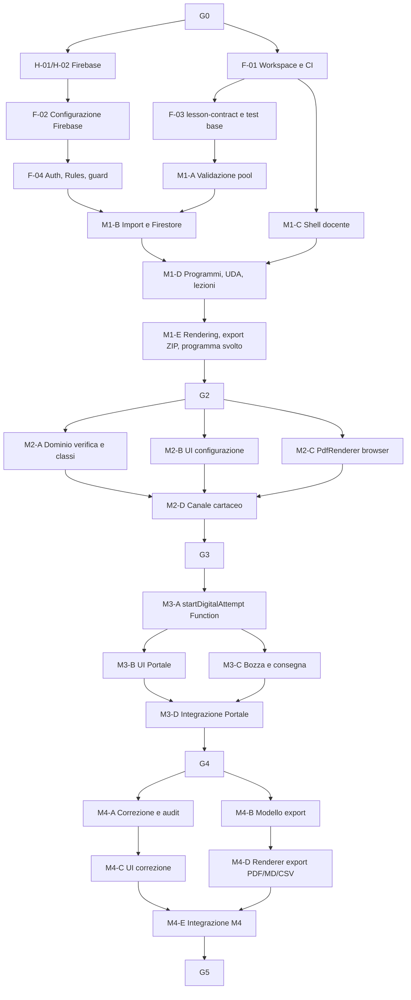

# SchoolForge — Piano di implementazione

**Versione:** 4.0
**Data:** 24 giugno 2026
**Stato:** piano esecutivo per agenti di coding
**Input vincolanti:** `brief.md`, `analisi-requisiti.md`, `architettura.md`, `api-contract.md`
**Regola di precedenza:** requisiti e architettura prevalgono su questo piano in caso di conflitto

---

## 1. Scopo del piano

Il piano trasforma la baseline in pacchetti di lavoro eseguibili da agenti di coding. Ogni pacchetto produce un risultato osservabile, ha un solo responsabile tecnico, dichiara dipendenze e include la verifica necessaria.

### 1.1 Sequenza dei moduli

| Modulo | Capacità rilasciata | Può fermarsi qui? |
|---|---|---|
| M1 — Repository didattico | Programmi, UDA, Markdown/pool, import validato, rendering, export ZIP, programma svolto (PDF + Markdown). | Sì |
| M2 — Verifiche e cartaceo | Configurazione, classi, selezione da pool, PDF browser, download docente, canale cartaceo con lock email. | Sì |
| M3 — Portale digitale | Tentativi anonimi, snapshot via Cloud Function, token sessione, bozze, consegna, deterrenza. | Sì |
| M4 — Correzione ed export | Punteggi, percentuali, rettifiche, eliminazione e `Esporta verifiche` in PDF/Markdown/CSV. | Sì |
| M5 — Correzione AI | Proposte assistite, anomalie consultive e, solo con gate, automatica. | Sì, opzionale |

M5 non è autorizzato a ritardare o modificare M1–M4.

---

## 2. Ruoli, autorità e azioni umane

| Ruolo | Responsabilità |
|---|---|
| Docente / owner | Proprietario Firebase, billing, backup, restore e decisioni C-02/C-03. Approva i gate. |
| Agente di coding | Implementa il pacchetto assegnato, esegue test, aggiorna documentazione strettamente collegata. |
| Revisore tecnico | Verifica DoD, confini del pacchetto, test, sicurezza e coerenza con la baseline. |

### 2.1 Attività che richiedono il Docente

| ID | Azione umana | Quando | Un agente può farla? |
|---|---|---|---|
| H-01 | Creare progetti Firebase `dev` e `prod`, attivare billing Blaze, mantenere la proprietà. | Prima del provisioning reale. | Solo dopo accesso CLI autorizzato e approvazione esplicita. |
| H-02 | Creare Firestore e bucket nella regione Milano `europe-west8`. | Prima del primo deploy dati. | Può eseguire la configurazione tecnica se H-01 è completata. |
| H-03 | Configurare budget e avvisi di spesa, backup giornaliero, conservazione 30 giorni e primo restore test. | Prima di dati reali, gate G1. | Può assistere con accesso autorizzato; il Docente verifica l'esito. |
| H-04 | Scegliere il formato iniziale di `Esporta verifiche`: PDF, Markdown o CSV come default. | Prima del pacchetto M4-D. | Il renderer è implementabile dall'agente dopo la scelta. |
| H-05 | Decidere provider AI, condizioni e residenza dati. | Prima di M5-A. | No, è C-02. |
| H-06 | Decidere regola didattica della correzione automatica. | Prima di M5-E. | No, è C-03. |

---

## 3. Regole del workflow per agenti

### 3.1 Definition of Ready (DoR)

Un pacchetto può partire solo se:

1. le sue dipendenze sono `completate` e le evidenze sono disponibili;
2. eventuali gate umani applicabili sono approvati;
3. input, file modificabili e criteri di accettazione sono dichiarati;
4. non esiste un altro pacchetto attivo sugli stessi file;
5. l'agente può eseguire verifiche senza dati reali o segreti di produzione.

### 3.2 Workflow obbligatorio

1. Leggere brief, requisiti, architettura, api-contract e questo piano.
2. Verificare il DoR e dichiarare subito un blocco reale.
3. Implementare solo lo scope assegnato.
4. Eseguire i test dichiarati e aggiungere test per regressioni introdotte.
5. Confrontare il diff con i vincoli: no account studenti, no PDF persistenti, no AI fuori M5, no ampliamento LMS, nessuna Cloud Function aggiuntiva oltre `startDigitalAttempt` e AI.
6. Consegnare handoff con file, test, evidenze, rischi e dipendenze sbloccate.

### 3.3 Definition of Done (DoD)

Un pacchetto è `completato` solo se:

- funziona nel percorso previsto e gestisce il fallimento principale;
- typecheck, lint, test unitari e test di integrazione sono verdi;
- non introduce segreti, dati reali o scritture client dirette a percorsi Firestore proibiti;
- documentazione, tipi e test interessati sono aggiornati;
- il revisore verifica il diff e il criterio di accettazione;
- il branch è integrabile senza modifiche non correlate.

### 3.4 Regole di dimensionamento

Un pacchetto è abbastanza piccolo da essere verificato in una review e abbastanza completo da produrre una capacità riconoscibile. Non si combinano backend, UI, migrazioni e deploy in un singolo pacchetto senza motivazione.

### 3.5 Workflow Git

`main` contiene solo lavoro revisionato. Ogni pacchetto usa `feat/<id>-<slug>` o `fix/<id>-<slug>`. Il merge richiede pipeline verde e review. Il deploy `prod` richiede gate del modulo e azione manuale del Docente.

---

## 4. Gate e stato del delivery

| Gate | Condizione di ingresso | Evidenza richiesta | Autorizza |
|---|---|---|---|
| G0 — Baseline | Brief, requisiti, architettura e piano coerenti. | Review documentale e C-01 formalizzata. | Bootstrap del repository. |
| G1 — Fondazioni Firebase | H-01/H-02/H-03 completate; CI ed Emulator Suite disponibili. | Progetti separati, budget, backup, restore test, Security Rules default-deny. | M1 con dati sintetici. |
| G2 — Repository didattico | M1 integrato. | Import valido/invalido, rendering senza pool, ZIP e programma svolto. | M2. |
| G3 — Verifiche e cartaceo | M2 integrato. | PDF browser, lock email concorrente, nessun PDF persistito. | M3. |
| G4 — Portale digitale | M3 integrato. | Snapshot, bozza/ripresa, consegna immutabile, nessuna soluzione esposta. | M4. |
| G5 — Correzione ed export | M4 integrato e H-04 completata. | Punteggi, rettifiche, eliminazione, export PDF/Markdown/CSV da snapshot. | Uso manuale completo. |
| G6 — AI assistita | M5-A..D integrati e H-05 completata. | Contesto chiuso, audit, proposte assistite, anomalie consultive. | AI assistita. |
| G7 — AI automatica | G6 e H-06 completati. | Opt-in per verifica, audit e rollback. | Correzione automatica. |

C-02 e C-03 non bloccano M1–M4.

---

## 5. Dipendenze e parallelismo

I rami paralleli possono partire insieme solo dopo aver fissato i contratti TypeScript. Due agenti non modificano contemporaneamente lo stesso file di Security Rules, tipi condivisi o struttura Firestore.

---

## 6. Pacchetti preparatori

| ID | Outcome e scope | Dipende da | Parallelo | Evidenza DoD |
|---|---|---|---|---|
| F-01 | Monorepo TypeScript: workspace, build, lint, test, formattazione, convenzioni branch e CI senza deploy. | G0 | H-01/H-02 | Pipeline esegue build, lint, unit test su fixture. |
| F-02 | Configurare Firebase `dev`/`test`, CLI, Emulator Suite, variabili non segrete. Non creare risorse `prod` senza H-01/H-02. | H-01/H-02 | F-01 | Emulatori avviabili e configurazioni separate. |
| F-03 | Package `lesson-contract`: tipi dominio, parser pool v1, fixture e test contratto. | F-01 | F-02 | Parser accetta/rifiuta i casi di `analisi-requisiti.md`. |
| F-04 | Firebase Auth docente, `ownerUid` nelle Security Rules, Security Rules default-deny, audit base. | F-01/F-02 | F-03 | Owner autorizzato; soggetto diverso rifiutato da test Emulator. |

---

## 7. M1 — Repository didattico

| ID | Outcome e scope | Dipende da | Parallelo | Evidenza DoD |
|---|---|---|---|---|
| M1-A | Validazione client-side di UDA, lezioni e pool con `lesson-contract`; errori strutturati file/domanda/campo. | F-03/F-04 | M1-C | Pool invalido non invalida la lezione; fixture complete. |
| M1-B | Import diretto su Cloud Storage e Firestore (Security Rules); update `questionIndex`. | M1-A/F-04 | M1-C | Import valido visibile; fallimento non lascia contenuti parziali. |
| M1-C | Shell docente: sessione Auth, layout responsive, tema chiaro/scuro, errori e conferme comuni. | F-01/F-04 | M1-A/M1-B | Owner accede; non-owner non entra; test accessibilità base. |
| M1-D | CRUD Programmi/UDA/Lezioni, navigazione struttura didattica, flag "svolto" per programma svolto. | M1-B/M1-C | — | Struttura navigabile e operazioni auditabili. |
| M1-E | Rendering Markdown sanitizzato, asset, esclusione pool; export ZIP; programma svolto in PDF e Markdown generati nel browser. | M1-D | — | ZIP portabile, rendering senza soluzioni, programma svolto corretto in entrambi i formati. |
| M1-F | Test E2E M1, review sicurezza import, evidenze G2. | M1-E | — | G2 approvabile. |

---

## 8. M2 — Verifiche e canale cartaceo

| ID | Outcome e scope | Dipende da | Parallelo | Evidenza DoD |
|---|---|---|---|---|
| M2-A | Dominio verifica: stati, configurazione, classi, validazione fonti, minimi, varianti. Transazioni Firestore client-side per attivazione/chiusura. | G2 | M2-B/M2-C | Attivazione invalida rifiutata; configurazione attiva immutabile; classi persistite. |
| M2-B | UI docente: crea/modifica/attiva verifiche, gestione classi nelle impostazioni, messaggi di blocco comprensibili. | G2, contratto M2-A | M2-A/M2-C | Il docente non può superare vincoli da UI. |
| M2-C | `PdfRenderer` browser con `@react-pdf/renderer`: PDF docente (intestazione vuota) e PDF studente (dati precompilati). | G2 | M2-A/M2-B | PDF conforme ai campi del brief; nessun file in Storage. |
| M2-D | Canale cartaceo: link pubblico, lock email (transazione Firestore client), generazione PDF nel browser, download diretto. | M2-A/M2-B/M2-C | — | Due richieste concorrenti producono un solo download; second lock rifiutato; nessun PDF persistito. |
| M2-E | Test integrazione/E2E M2, lock concorrente, evidenze G3. | M2-D | — | PDF browser e lock studente verificati. |

---

## 9. M3 — Portale digitale

| ID | Outcome e scope | Dipende da | Parallelo | Evidenza DoD |
|---|---|---|---|---|
| M3-A | Cloud Function `startDigitalAttempt`: transazione Firestore (lock, tentativo, snapshot con soluzioni private), token sessione cookie HttpOnly/Secure. | G3 | — | Snapshot creato; refresh non seleziona nuove domande; soluzioni non nel response body. |
| M3-B | UI Portale mobile-first: raccolta dati, scelta canale, sequenza domande, proiezione senza soluzioni. | M3-A, contratto endpoint | M3-C | Nessun menu/dato interno; uso da tastiera e mobile verificato. |
| M3-C | Bozze, autosave, consegna immutabile, fullscreen/tab warning/copia-incolla UI. | M3-A | M3-B | Risposte riprendono nello stesso browser; consegna non modificabile. |
| M3-D | E2E e test negativi: token, rate limit, soluzioni non accessibili, lock inter-canale. | M3-B/M3-C | — | Evidenze G4; nessuna soluzione ottenibile dal client. |

---

## 10. M4 — Correzione ed export

| ID | Outcome e scope | Dipende da | Parallelo | Evidenza DoD |
|---|---|---|---|---|
| M4-A | Servizio correzione client: punteggi 0..massimo, percentuale, stato non definitivo, rettifiche append-only, eliminazione dati. | G4 | M4-B | Percentuale e storico rettifiche corretti; eliminazione preserva solo audit. |
| M4-B | Modello canonico export: leggi tutte le consegne definitive e snapshot, ordina per verifica/data, escludi bozze/annullate. | G4 | M4-A | Ordine corretto; indipendenza dal Markdown corrente. |
| M4-C | UI correzione: lista filtri (classe inclusa), dettaglio, punteggi, commenti, rettifiche. | M4-A | M4-B | Correzione manuale completa senza voto elettronico. |
| M4-D | Renderer export nel browser: genera PDF, Markdown e CSV dal modello canonico; download on-demand. Attende H-04 per il formato di default. | M4-B/H-04 | M4-C | Documento contiene tutte e sole le consegne richieste nei tre formati; nessuna persistenza. |
| M4-E | Integrazione M4, E2E correzione/export, test su snapshot dopo modifica lezione, evidenze G5. | M4-C/M4-D | — | Ciclo digitale manuale completo. |

---

## 11. M5 — Correzione AI opzionale

| ID | Outcome e scope | Dipende da | Parallelo | Evidenza DoD |
|---|---|---|---|---|
| M5-A | `AiGateway`, feature flag, Secret Manager, policy C-02, audit e mock provider. | G5/H-05 | — | Nessun invio AI senza feature flag e C-02 valida. |
| M5-B | Proposte assistite per item con contesto chiuso. | M5-A | — | Proposte non alterano correzioni definitive. |
| M5-C | UI assistita: proposta, approva/modifica/rifiuta, bulk approval con riepilogo. | M5-B | M5-D | Audit completo; bulk non applica item incompleti. |
| M5-D | Rapporto anomalie stilistiche solo consultivo; `riferimenti insufficienti` senza evidenza sufficiente. | M5-B | M5-C | Nessuna penalizzazione automatica. |
| M5-E | Modalità automatica con opt-in per verifica, audit e rollback. Richiede C-03 e H-06. | M5-C/H-06 | — | Non attiva per default; reversibile tramite rettifica. |
| M5-F | Test sicurezza, qualità e costi AI; evidenze G6/G7. | M5-C/M5-D/M5-E | — | Nessun web/retrieval; costi osservabili; gate rispettati. |

---

## 12. Qualità, CI/CD e costi

### 12.1 Pipeline minima

| Stage | Trigger | Blocca | Contenuto |
|---|---|---|---|
| Verifica | Ogni push/PR | Merge | Format, lint, typecheck, unit test e build. |
| Integrazione | PR verso `main` | Merge | Firebase Emulator Suite: Auth, Firestore, Storage e Functions (solo M3+). |
| E2E | Prima dei gate G2–G7 | Gate | Browser test sui flussi del modulo e casi negativi. |
| Deploy `dev` | Merge su `main` | — | Deploy controllato senza dati reali. |
| Deploy `prod` | Gate approvato + azione manuale Docente | Go-live | Backup verificato, release notes e smoke test. |

### 12.2 Regole di costo

- Sviluppo e test usano Emulator Suite e fixture sintetiche.
- Nessuna VM, Cloud SQL, container sempre acceso, coda dedicata o servizio enterprise senza decisione documentata.
- L'unica Cloud Function nei Moduli 1–4 è `startDigitalAttempt`; qualsiasi Function aggiuntiva proposta da un agente deve essere giustificata e approvata.
- PDF e documenti generati nel browser, mai su server.
- Il Docente controlla budget/avvisi prima del primo deploy `prod`.
- Ogni pacchetto che aggiunge una chiamata a provider esterno (AI) dichiara volume atteso e costo variabile.

### 12.3 Regole di rilascio e rollback

1. Le modifiche Firestore devono essere compatibili con la versione applicativa precedente durante il deploy.
2. Le funzionalità incomplete sono invisibili o disabilitate tramite flag server-side.
3. Il rollback del codice non cancella Markdown, snapshot digitali, consegne o audit.
4. Un errore import non scrive su Firestore; un errore di lock cartaceo non genera il PDF.
5. Un incidente dati attiva C-01: fermare le scritture interessate, valutare l'ultimo backup, ripristinare e documentare.

---

## 13. Handoff, dashboard e criteri finali

### 13.1 Handoff obbligatorio

Ogni pacchetto concluso produce:

- ID e risultato conseguito;
- file modificati e confini rispettati;
- comandi di test eseguiti ed esito;
- evidenze per il gate interessato;
- debito tecnico o rischio residuo reale;
- dipendenze sbloccate e prossima azione concreta.

### 13.2 Dashboard di avanzamento

| Campo | Valore |
|---|---|
| Pacchetto | ID e titolo. |
| Stato | `non_avviato`, `in_corso`, `bloccato`, `in_review`, `completato`. |
| Dipendenze | ID e stato; descrivere il blocco effettivo. |
| Branch/PR | Riferimento. |
| Test | Comandi, evidenza e risultato. |
| Gate | Gate coinvolto e decisione umana richiesta. |
| Rischi | Solo rischi nuovi o modificati. |
| Prossima azione | Una singola azione verificabile. |

### 13.3 Criteri di successo

1. Ogni modulo rilascia una capacità usabile senza anticipare AI o scope LMS.
2. Nessun agente lavora su un pacchetto senza DoR o ignora un gate umano.
3. Verifiche e consegne digitali rispettano lock email, snapshot e assenza di PDF persistenti.
4. `Esporta verifiche` è costruito da tutte le consegne definitive e non dalle lezioni correnti.
5. Test automatici, E2E e review crescono insieme al prodotto.
6. Firebase resta configurato con costo minimo; nessuna Cloud Function aggiuntiva senza approvazione.
7. Il progetto può fermarsi dopo G2, G3, G4 o G5 mantenendo un prodotto utile.

---

## Appendice A — Primo pacchetto da assegnare

Il primo pacchetto assegnabile è **F-01 — Workspace e CI**. Il provisioning Firebase reale non parte finché il Docente non ha completato H-01 e H-02. Dopo F-01, F-02 e F-03 possono avanzare in parallelo; F-04 richiede sia il workspace sia l'ambiente Firebase `dev`.
