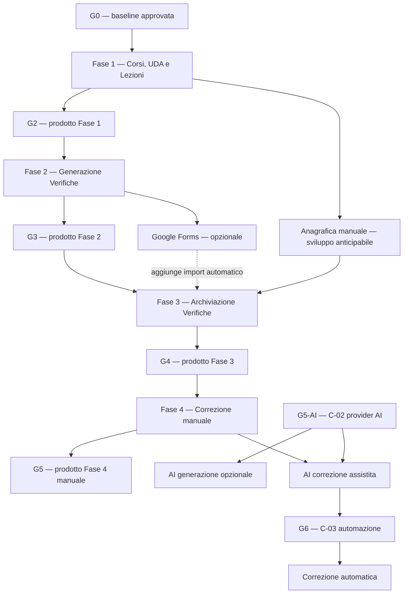

# SchoolForge — Piano di implementazione e workflow di delivery

**Versione:** 1.0  
**Data:** 22 giugno 2026  
**Stato:** piano esecutivo proposto  
**Input vincolante:** [Architettura di sistema v1.0](architettura.md) e [Analisi dei requisiti v1.1](analisi-requisiti.md)  
**Destinatari:** committente, responsabile tecnico, sviluppatore/i, QA

---

## 1. Scopo del piano

Questo documento trasforma l'architettura target in un workflow eseguibile. Definisce:

- cosa implementare e in quale ordine;
- cosa può procedere in parallelo e quali dipendenze lo vietano;
- i gate umani e tecnici che bloccano il passaggio di fase;
- gli artefatti, le prove e i criteri di uscita di ogni modulo;
- il percorso minimo per ottenere valore prima delle integrazioni Google opzionali e dell'AI.

Il piano privilegia incrementi piccoli e completi. Non si sviluppano componenti “per il futuro” se non abilitano un requisito immediato o una dipendenza esplicita. In particolare, non si costruiscono microservizi, sincronizzazione Drive, portale studenti, motore vettoriale o funzionalità AI prima che il nucleo manuale sia utilizzabile.

### 1.1 Le quattro fasi prodotto

Le uniche fasi di delivery sono le seguenti. Ogni fase termina con un prodotto funzionante e utilizzabile dal docente; le fondazioni tecniche non sono una fase a sé, ma il primo blocco di lavoro della Fase 1.

| Fase | Prodotto funzionante al termine | Non dipende da |
|---|---|---|
| 1. Corsi, UDA e Lezioni | Il docente autenticato può creare Corsi/Programmi e UDA, caricare e gestire Lezioni Markdown, consultarle in sicurezza ed esportarle con gli asset. | Google Forms, classi/studenti, archiviazione, AI |
| 2. Generazione Verifiche | Il docente seleziona lezioni/UDA, compone, approva, pubblica ed esporta una Verifica immutabile in PDF con soluzione e rubrica. Google Forms è un'estensione non bloccante. | Classi/studenti, archivio, correzione, AI |
| 3. Archiviazione Verifiche | Il docente gestisce classi/studenti, assegna verifiche, registra/importa consegne, conserva link ai PDF Drive e consulta uno storico di prove **da correggere**. | Correzione manuale o AI |
| 4. Correzione Verifiche | Il docente corregge le consegne, assegna punteggi, ottiene percentuali, rettifica con audit e, solo dopo le decisioni previste, usa correzione AI assistita/automatica. | Nessuna nuova macro-area; AI dipende da C-02/C-03 |

La Fase 3 archivia risposte e prove senza attribuire punteggi definitivi. Il passaggio da “da correggere” a “corretta” e il calcolo della percentuale appartengono alla Fase 4.

Google Forms e importazione roster sono estensioni della Fase 3: possono essere consegnati nella stessa fase o dopo G4, ma la loro assenza non può bloccare il prodotto manuale di archiviazione.

## 2. Assunzioni operative e modalità di pianificazione

### 2.1 Capacità di riferimento

La sequenza è valida con un solo sviluppatore full-stack e un committente/docente disponibile per le verifiche funzionali. Le attività marcate **parallele** possono essere affidate a persone diverse; con un solo sviluppatore sono preparabili o alternate, ma non riducono automaticamente la durata di calendario.

Le tempistiche sono espresse in **iterazioni relative di due settimane**. Non sono una promessa di data: prima dell'avvio devono essere calibrate su disponibilità effettiva, competenze, accesso all'account Google Education e decisione C-01.

### 2.2 Regole di esecuzione

1. Una fase non inizia se il suo gate di ingresso non è superato.
2. Un'attività è “completata” solo con codice, test, documentazione breve e prova di accettazione; non è sufficiente che compili.
3. Le modifiche ai requisiti aggiornano prima `analisi-requisiti.md`, poi `architettura.md`, poi questo piano. Non si corregge lo scope solo nel codice.
4. Le integrazioni Google e AI sono feature flag disabilitati finché non sono state collaudate con account e dati di test.
5. Ogni rilascio deve mantenere utilizzabile il percorso manuale già rilasciato.
6. Nessuna azione distruttiva o irreversibile viene resa disponibile senza conferma esplicita e audit.

## 3. Governance, branch e qualità di delivery

### 3.1 Workflow Git

| Elemento | Regola |
|---|---|
| Branch principale | `main` contiene soltanto incrementi integrati e verificati. |
| Branch di lavoro | `feature/<modulo>-<descrizione>` oppure `fix/<descrizione>`. Un branch copre una unità verticale piccola. |
| Pull request | Obbligatoria per ogni incremento. Descrive requisito coperto, test svolti, rischi e modifiche dati. |
| Merge | Consentito solo con CI verde, review tecnica e gate funzionale della fase quando previsto. |
| Commit | Piccoli e intenzionali; non mescolare refactor, cambio schema e funzionalità non correlate. |
| Migrazioni dati | Versionate nel repository, ripetibili in ambiente test e mai eseguite prima del backup previsto. |

### 3.2 Definition of Ready (DoR)

Un work package può iniziare solo se possiede:

- requisito e criterio di accettazione riferibili ai documenti di input;
- dipendenze tecniche disponibili oppure mock approvato;
- contratto di input/output definito;
- dati sintetici o fixture per test;
- responsabile e gate di accettazione identificati.

### 3.3 Definition of Done (DoD)

Un work package è concluso soltanto quando:

- il comportamento richiesto è implementato dietro controllo di autorizzazione;
- test unitari e di integrazione pertinenti sono verdi;
- gli errori attesi sono spiegati in UI/API senza stack trace;
- i log/audit richiesti sono prodotti senza esporre contenuti sensibili;
- documentazione tecnica e checklist di test sono aggiornate;
- il committente ha verificato il criterio di accettazione quando il package conclude una milestone.

## 4. Gate decisionali e di rilascio

| Gate | Quando | Decisione/prova richiesta | Blocco se non superato |
|---|---|---|---|
| G0 — Baseline | Prima di scrivere codice applicativo | Approvazione di requisiti, architettura e questo piano | Tutto il delivery |
| G1 — Setup operativo | Prima di ambiente `prod` | C-01: progetto/area Google Cloud, backup, RPO/RTO, responsabile operativo | Provisioning e go-live `prod`; non blocca sviluppo `dev` |
| G2 — Fase 1 | Dopo Corsi, UDA e Lezioni | Import, rendering, export Markdown/asset e sicurezza verificati dal docente | Fase 2 e uso di contenuti reali |
| G3 — Fase 2 | Dopo Generazione Verifiche | Pubblicazione immutabile, PDF e percorso manuale completi | Fase 3 e assegnazioni in produzione |
| G4 — Fase 3 | Dopo Archiviazione Verifiche | Matching, quarantena, link Drive e storico di prove da correggere verificati | Fase 4 e go-live dell'archivio |
| G5 — Fase 4 manuale | Dopo Correzione manuale | Punteggi, percentuali, rettifiche e audit verificati | Correzione operativa completa |
| G5-AI — Provider AI | Prima di qualsiasi chiamata AI reale | C-02: provider, contratto, residenza, consenso operativo | Correzione/generazione AI reale |
| G6 — Correzione automatica | Prima di abilitare automazione | C-03: regola didattica, ambito e revisione umana | Modalità automatica; non blocca AI assistita |

Ogni gate produce un breve verbale nel repository: data, approvatore, elementi verificati, decisione e limitazioni note. Un gate non viene “superato a voce”.

## 5. Dipendenze e parallelismo

### 5.1 Regole di parallelismo

| Insieme | Attività | Condizione per lavorare in parallelo | Punto di sincronizzazione |
|---|---|---|---|
| P1 | Infrastruttura Firebase, parser Markdown, web shell, fixture di test | G0 superato; contratti condivisi fissati entro la prima iterazione | Fase 1 pronta per import reale |
| P2 | Rendering lezione e pipeline import/validazione | Parser e modello Lesson Contract comuni; nessuno cambia il contratto unilateralmente | Test import → rendering |
| P3 | PDF e composizione verifica | Il PDF può usare fixture di snapshot; la pubblicazione reale aspetta il modello verifica definitivo | Pubblicazione immutabile |
| P4 | Anagrafica manuale e Fase 2 | L'anagrafica può usare `examId` fittizi in test; assegnazioni reali aspettano G3 | Integrazione Fase 3 |
| P5 | Roster Google Education e archivio manuale | Roster opzionale; il percorso manuale non attende token/API Google | G4 con fallback manuale funzionante |
| P6 | Test automatici e sviluppo funzionale | Ogni package fornisce fixture e test nello stesso branch | Pull request del package |
| P7 | Documentazione/runbook e sviluppo | Le API e le decisioni sono aggiornate durante il package, non alla fine del progetto | Gate della fase |

### 5.2 Attività non parallelizzabili

| Predecessore | Successore bloccato | Motivo |
|---|---|---|
| Parser/validatore Lesson Contract | Import definitivo, question index, rendering di produzione | Il contratto Markdown deve essere unico e stabile. |
| Autorizzazione backend e regole Firestore/Storage | Caricamento reale, dati personali, integrazioni | Non è ammesso introdurre dati reali con autorizzazioni provvisorie. |
| Snapshot e stati della Verifica | Assegnazioni, PDF definitivo, Google Forms, consegne | Tutti dipendono da un `examId` e contenuto immutabile affidabili. |
| Assegnazioni | Import risposte Google Forms | Il matching richiede destinatari, verifica e Form collegati. |
| Correzione manuale e calcolo percentuali | Correzione AI assistita | L'AI deve proporre nel medesimo modello di punteggio già verificato manualmente. |
| C-02 | Provider AI reale | Non sono consentite chiamate AI con dati didattici/studenti senza decisione formale. |
| C-03 | Correzione automatica | L'automazione modifica lo stato senza approvazione item per item. |

## 6. Roadmap relativa

La roadmap seguente assume iterazioni di due settimane e un singolo sviluppatore. Se è disponibile un secondo sviluppatore, i gruppi P1–P7 possono ridurre il calendario ma non rimuovono le dipendenze di cui sopra.

| Iterazione | Obiettivo primario | Lavoro parallelo consentito | Gate/output |
|---|---|---|---|
| 0 | G0, backlog eseguibile, fixture e setup accessi | Preparazione Firebase `dev`, definizione owner Google | Baseline approvata e ambiente `dev` accessibile |
| 1 | Fase 1A: fondazioni interne, login docente, Corsi/UDA | Parser Lesson Contract; web shell; fixture | Login solo docente e gestione Corsi/UDA |
| 2 | Fase 1B: staging, validazione, rendering e asset | Tema, test parser, hardening regole | Import preflight con errori riga/file |
| 3 | Fase 1C: promozione corrente, ricerca ed export | Test E2E repository | G2 — Corsi, UDA e Lezioni accettati |
| 4 | Fase 2A: indice domande, bozza, snapshot e stati | Template PDF su fixture; anagrafica manuale anticipabile | Verifica pubblicata immutabile |
| 5 | Fase 2B: PDF e Google Forms opzionale | Test mapping Forms in sandbox; documentazione operativa | G3 — Generazione Verifiche accettata |
| 6 | Fase 3A: classi/studenti, assegnazioni, consegne e link Drive | Roster import opzionale; UI storico | Archivio manuale di prove da correggere |
| 7 | Fase 3B: import Forms, quarantena, storico e monitoraggio | Backup/restore drill | G4 — Archiviazione Verifiche accettata |
| 8 | Fase 4A: correzione manuale, punteggi, percentuali e rettifiche | Mock AI e test di provenienza senza provider | G5 — Correzione manuale accettata |
| 9+ | Fase 4B: AI assistita dopo G5-AI; automatica dopo G6 | AiGateway e provider sandbox | Estensione AI della Fase 4, se approvata |

Il primo prodotto utile è G2. G3 aggiunge la generazione di verifiche, G4 l'archiviazione delle prove e G5 la correzione manuale completa. L'AI è un'estensione della Fase 4 e non è una condizione per i quattro prodotti manuali.

## 7. Work breakdown structure dettagliata

### 7.1 Fase 1 — Corsi, UDA e Lezioni

Le attività F-01–F-07 sono fondazioni interne della Fase 1. Non costituiscono un rilascio autonomo: il prodotto della fase esiste solo dopo R-01–R-07 e G2.

| ID | Attività | Dipende da | Può essere parallela con | Deliverable ed evidenza |
|---|---|---|---|---|
| F-01 | Inizializzare monorepo TypeScript, lint, test, build e CI | G0 | F-02, F-03 | Pipeline eseguibile con build/test/lint su PR |
| F-02 | Configurare Firebase `dev`, Emulator Suite e variabili non sensibili | G0 | F-01, F-04 | Progetto `dev`, configurazione locale e checklist setup |
| F-03 | Definire schema Firestore, indici, Security Rules e Storage Rules iniziali | F-02 | F-04, F-05 | Test emulatori: account non autorizzato rifiutato; backend autorizzato |
| F-04 | Implementare `lesson-contract`: parser, validatore, tipi e fixture | G0 | F-01, F-02 | Fixture valide/non valide; errori con file/riga/motivo |
| F-05 | Implementare identità Google Education, bootstrap owner e middleware autorizzazione | F-02, F-03 | F-04, F-06 | Login owner riuscito; account non autorizzato rifiutato lato backend |
| F-06 | Creare web shell, navigazione, tema chiaro/scuro, gestione errori e conferme | F-01 | F-04, F-05 | UI accessibile con stati loading/error/empty coerenti |
| F-07 | Creare audit service e formato errori API | F-03, F-05 | F-04, F-06 | Endpoint di test registra audit senza dati sensibili |

**Uscita blocco fondazioni.** Un solo docente autorizzato usa la web app di sviluppo; test locali validano parser, regole e autorizzazioni. Questo abilita il lavoro repository, ma non è ancora il prodotto della Fase 1.

#### Completamento prodotto Fase 1

| ID | Attività | Dipende da | Parallelo | Deliverable ed evidenza |
|---|---|---|---|---|
| R-01 | CRUD Programmi/UDA, ordinamento e disattivazione | F-03, F-05, F-06 | R-02, R-04 | UI e API con audit; impossibile eliminare Programma/UDA referenziato |
| R-02 | Upload staging di file/cartella e preflight import | F-02, F-04, F-05 | R-01, R-04 | Piano import con validi, invalidi, conflitti e asset mancanti |
| R-03 | Commit atomico visibile, promozione Storage e `lessonIndex`/`questionIndex` | R-02, F-03, F-07 | R-04 | Nessun contenuto parziale visibile; rollback/cleanup documentati |
| R-04 | Rendering Markdown sanificato, asset, autoverifica, temi | F-04, F-06 | R-01, R-02 | Domande `assessment`, soluzioni e rubriche non sono nel modello di visualizzazione |
| R-05 | Sostituzione/eliminazione Lezione corrente e pulizia oggetti orfani | R-03 | R-06 | Verifica esistente invariata; Lezione corrente aggiornata/eliminata con conferma |
| R-06 | Ricerca locale, download sorgente ed export ZIP repository | R-03, R-04 | R-05 | ZIP apribile fuori SchoolForge con Markdown e asset corretti |
| R-07 | E2E Repository, hardening regole e guida operativa import | R-01–R-06 | — | Checklist G2 e test automatizzati verdi |

**G2 — prova obbligatoria.** Il docente importa una cartella reale di prova, visualizza una Lezione con immagine e autoverifica, conferma che i blocchi di verifica non siano esposti e scarica un export apribile senza SchoolForge.

### 7.2 Fase 2 — Generazione Verifiche

| ID | Attività | Dipende da | Parallelo | Deliverable ed evidenza |
|---|---|---|---|---|
| V-01 | Risoluzione corpus da UDA/Lezioni e indice domande corrente | R-03, R-04 | V-04 | Deduplicazione corretta; Lezioni invalide escluse |
| V-02 | Bozza Verifica: configurazione quantità/tipo/difficoltà e composizione manuale | V-01, F-06 | V-04 | Blocco esplicito se il corpus non copre il fabbisogno senza AI |
| V-03 | Stato Verifica, validazione soluzioni/rubriche e snapshot immutabile | V-02, F-07 | V-04 | Pubblicazione transazionale; modifica successiva rifiutata |
| V-04 | Servizio PDF e template prova/soluzione/rubrica | F-01, F-06 | V-01–V-03 con fixture | PDF separati, leggibili e identificati da `examId` |
| V-05 | UI pubblicazione, annullamento, download e audit | V-03, V-04 | V-06 | Conferme esplicite e storico di stato consultabile |
| V-06 | Connettore Google Forms, mappa `examId`/item/Form e sandbox OAuth | V-03, account Google Education test autorizzato | V-04, V-05 | Form creato da verifica pubblicata; incompatibilità spiegata |
| V-07 | Test regressione: Lezione sostituita/eliminata dopo pubblicazione | V-03, R-05 | V-04–V-06 | Verifica/PDF restano immutati e consultabili |

**G3 — prova obbligatoria.** Il docente crea una verifica senza AI, pubblica, esporta prova/soluzione/rubrica, poi modifica una Lezione fonte e verifica che il contenuto pubblicato sia invariato. Google Forms è un'estensione: il mancato completamento di V-06 non blocca il rilascio PDF/manuale.

### 7.3 Fase 3 — Archiviazione Verifiche

| ID | Attività | Dipende da | Parallelo | Deliverable ed evidenza |
|---|---|---|---|---|
| A-01 | Gestione manuale Classi/Studenti, vincoli email e storico cambio email | F-03, F-05, F-06 | V-04–V-06 | Nessun account studente; dati validati e auditati |
| A-02 | Anteprima/import roster Google Education opzionale | A-01, token Google autorizzato | A-03, A-04 | Crea/aggiorna solo elementi confermati; non cancella storico |
| A-03 | Assegnazioni per classe/studenti, stati e collegamento verifica | V-03, A-01 | A-02 | Solo verifica pubblicata assegnabile; destinatari e canale registrati |
| A-04 | Consegne manuali e allegati/link PDF Drive | A-03, V-04 | A-02, A-05 | Link Drive registrato senza upload/sync automatico |
| A-05 | Import risposte Google Forms e quarantena | A-03, V-06 | A-04, A-06 | Import idempotente; risposta non mappata non entra nello storico |
| A-06 | Stato di correzione iniziale `da_correggere` e storico per classe/studente/verifica/intervallo/stato | A-03, A-04 | A-05, A-07 | Filtri indicizzati e paginati; nessun punteggio definitivo in Fase 3 |
| A-07 | Monitoraggio, runbook archiviazione e test restore | A-04, A-06, G1 | A-05, A-06 | Checklist G4, test import ripetuto e restore documentato |

**G4 — prova obbligatoria.** Il docente assegna una verifica, inserisce o importa una consegna, registra il link del PDF su Drive e consulta lo storico delle prove `da_correggere`. Una risposta senza email/mapping certo resta in quarantena. Il percorso manuale deve funzionare anche senza roster API e Google Forms.

### 7.4 Fase 4 — Correzione Verifiche

La correzione manuale è il prodotto obbligatorio della Fase 4. L'AI assistita è una capacità aggiuntiva della stessa fase, attivabile soltanto dopo G5-AI; non crea una quinta fase.

| ID | Attività | Dipende da | Parallelo | Deliverable ed evidenza |
|---|---|---|---|---|
| CR-01 | Modello di correzione manuale, punteggi per item e calcolo percentuale | A-04, V-03 | CR-02 | Formula corretta; percentuale `non_definitiva` finché mancano item |
| CR-02 | UI di correzione, commenti, rettifiche e audit valori precedenti | CR-01, F-06 | A-05 | Docente corregge una consegna e visualizza traccia della rettifica |
| CR-03 | Aggiornamento stati consegna/correzione e storico delle prove corrette | CR-02, A-06 | CR-04 | Transizione `da_correggere` → `corretta` solo con punteggi definitivi |
| CR-04 | Test E2E correzione manuale e verifica G5 | CR-01–CR-03 | — | Checklist G5 e percentuali verificabili su casi noti |

**G5 — prova obbligatoria.** Il docente corregge una consegna archiviata, assegna punteggi, verifica la percentuale, rettifica un item e consulta valore precedente, nuovo valore, motivazione e audit. Nessuna funzionalità AI è necessaria per superare G5.

#### Estensione AI della Fase 4

| ID | Attività | Dipende da | Parallelo | Deliverable ed evidenza |
|---|---|---|---|---|
| I-00 | Risolvere decisione C-02 e registrare provider, consenso e ambiente sandbox | G4 | Preparazione mock/test | Verbale G5-AI e configurazione secret separata per ambiente |
| I-01 | Implementare `AiGateway`, contesto chiuso, mock provider e audit provenienza | I-00, V-03 | I-02 | Test dimostra assenza di browsing/retrieval e fonti non selezionate |
| I-02 | Generazione facoltativa domande/soluzioni/rubriche per Modulo 2 | I-01, V-02 | I-03 | Output sempre proposta; approvazione docente obbligatoria |
| I-03 | Proposte correzione assistita sul modello di correzione manuale | I-01, CR-01 | I-02 | Punteggio entro massimo, criteri rubricati, proposta separata |
| I-04 | Approvazione/rifiuto/modifica individuale e massiva | I-03 | — | Esclusione automatica item non idonei e audit per item/operazione |
| I-05 | Modalità automatica dietro feature flag | I-04, G6 | — | Non attiva di default; test e piano di rollback approvati |

L'AI di generazione può essere rilasciata dopo G5-AI senza attendere la correzione AI. La correzione assistita richiede invece CR-01 perché deve riusare punteggio, percentuale, audit e modello di correzione manuale già affidabili.

## 8. Backlog tecnico trasversale

Queste attività non sono una fase separata: vengono portate avanti dentro ogni modulo.

| Area | Regola operativa | Evidenza a ogni milestone |
|---|---|---|
| Sicurezza | Test regole Firebase, controllo owner server-side, segreti solo Secret Manager | Test di accesso negato e revisione scope Google |
| Accessibilità | Tastiera, struttura semantica, contrasto nei due temi, messaggi d'errore comprensibili | Smoke test manuale e checklist UI |
| Audit | Ogni transizione importante scrive evento minimizzato | Query audit per import, publish, assignment, correzione |
| Osservabilità | Log strutturati, tempi e errori senza contenuti sensibili | Dashboard/error report con dati sintetici |
| Performance | Paginazione, indici Firestore, misurazione di import/render/search | Metriche raccolte, nessun SLO inventato |
| Backup | Export Firestore/Storage, verifica restore, export Markdown | Evidenza G1/G4 secondo piano C-01 |
| Documentazione | Aggiornamento API, schema, runbook e decisioni | PR contiene link alla documentazione aggiornata |

## 9. Piano di test per milestone

| Milestone | Test automatici minimi | Test umano obbligatorio | Non procedere se |
|---|---|---|---|
| Fase 1 | parser, Auth middleware, Security Rules, API errors, import e rendering | login owner/non-owner e import lezione | una scrittura client aggira il backend o il prodotto Fase 1 non è esportabile |
| G2 | parser, import, rendering sanitizzato, Storage Rules, export | cartella lezione reale di prova | assessment/soluzioni compaiono nel rendering o export è incompleto |
| G3 | composizione, stati, snapshot, PDF, regressione sostituzione Lezione | creazione verifica manuale completa | una verifica pubblicata è modificabile o dipende dalla Lezione corrente |
| G4 | consegna manuale, link Drive, quarantena e storico `da_correggere`; idempotenza Forms solo se V-06 è attiva | archivio end-to-end con una classe test | una risposta incerta viene attribuita automaticamente o entra nello storico definitivo |
| G5 | correzione manuale, formula percentuale, rettifica e audit | correzione completa di una consegna test | una percentuale è errata o un valore precedente viene perso |
| G5-AI/I-04 | contesto AI, fonte, assenza web, idoneità bulk approval, audit | revisione proposte AI su dati consentiti | provider invocabile senza consenso o item non idonei approvati in massa |
| G6 | flag, limiti punteggio, rollback, audit automatico | verifica didattica della regola automatica | la modalità automatica è attiva per default |

## 10. Sequenza di rilascio e rollback

### 10.1 Regole di rilascio

1. Ogni rilascio applicativo passa prima in `dev`, poi in `test`, infine in `prod` dopo il gate previsto.
2. Le modifiche Firestore sono backward-compatible durante il rilascio: prima si distribuisce codice che legge vecchio/nuovo schema, poi la migrazione, infine la rimozione del vecchio percorso in una release successiva.
3. Le feature non complete sono protette da flag server-side e invisibili o chiaramente disabilitate nella UI.
4. Google Forms, roster e AI sono attivati per ambiente solo dopo test con account dedicato.
5. Il deployment registra versione applicativa, commit e data nel log di rilascio.

### 10.2 Rollback

| Caso | Risposta |
|---|---|
| Regressione frontend/backend | Rollback al deployment precedente; i dati immutabili già pubblicati non vengono riscritti. |
| Errore import Markdown | Nessuna promozione visibile; cleanup staging e correzione del file sorgente. |
| Errore Google Forms/roster | Disabilitare l'integrazione; mantenere manuale import/anagrafica; non eliminare mapping o consegne. |
| Errore AI | Disabilitare provider/feature flag; conservare proposte già auditabili; nessuna pubblicazione automatica. |
| Errore dati o migrazione | Fermare write path interessato, ripristinare secondo C-01, documentare incidente e aggiornare test di regressione. |

## 11. Rischi e azioni preventive

| Rischio | Probabilità/Impatto | Prevenzione | Trigger di escalation |
|---|---|---|---|
| Account Google Education senza scope Forms/roster | Media / Alta | Verifica sandbox in Iterazione 0; manual fallback | Impossibile creare Form o leggere roster test |
| Contratto Markdown modificato tardi | Media / Alta | Parser condiviso, fixture, G2 prima della Fase 2 | Cambio a front matter/domande dopo dati reali |
| Ambiguità nel matching studenti | Media / Alta | Quarantena obbligatoria, email univoca, no auto-match incerto | Risposta senza identificativo stabile |
| Snapshot verifica troppo grande o incoerente | Bassa / Alta | Item in subcollection, transazioni e test publication | Limiti Firestore o item mancanti dopo publish |
| Scope creep verso LMS/portale studenti | Media / Media | Registro change request e vincoli fuori scope in PR | Nuova richiesta di login studente/chat/compiti |
| Provider AI non conforme ai vincoli | Media / Alta | G5-AI, mock gateway, feature flag | Necessità di browser/RAG o invio dati senza consenso |
| Backup non testato | Media / Alta | C-01 e restore drill prima di prod | Impossibilità di ricostruire Markdown, storage o Firestore |

## 12. Dashboard di avanzamento

Lo stato del progetto deve essere aggiornato alla chiusura di ogni work package. Il formato minimo è:

| Campo | Valore richiesto |
|---|---|
| Work package | ID e titolo |
| Stato | `non_avviato`, `in_corso`, `bloccato`, `in_review`, `completato` |
| Dipendenze | ID, stato e blocker reale |
| Branch/PR | Link o riferimento commit |
| Test | Comandi/prove e esito |
| Gate | Gate interessato e decisione richiesta |
| Rischi | Nuovi rischi o modifiche alle assunzioni |
| Prossima azione | Una sola azione concreta e verificabile |

Un work package `bloccato` deve indicare una causa esterna precisa. “Serve ancora lavoro” non è uno stato bloccato: rimane `in_corso` con la prossima azione definita.

## 13. Criteri di successo del piano

Il piano è applicato correttamente se:

1. il Repository Didattico viene rilasciato e validato prima di qualsiasi dipendenza AI o Forms;
2. ogni verifica pubblicata è immutabile e indipendente dalle lezioni correnti prima di creare assegnazioni;
3. l'archivio manuale è completo prima di rendere indispensabili Google Forms o roster;
4. le attività parallele condividono contratti e hanno un punto di sincronizzazione esplicito;
5. ogni rilascio produce una prova di accettazione del docente, non soltanto una demo tecnica;
6. C-01 viene risolta prima del go-live e C-02/C-03 prima delle relative funzionalità AI;
7. un rollback non elimina Markdown, snapshot di verifiche, consegne o audit;
8. il progetto può fermarsi a G2, G3, G4 o G5 mantenendo un prodotto utile e coerente.

---

## Appendice A — Primo backlog eseguibile

L'ordine operativo immediato, dopo G0, è:

1. F-01 — monorepo, CI, build e test;
2. F-02 — Firebase `dev` ed Emulator Suite;
3. F-04 — parser/validatore `lesson-contract` con fixture;
4. F-03 — schema/regole Firestore e Storage;
5. F-05 — autenticazione e autorizzazione docente;
6. F-06/F-07 — web shell, errori e audit;
7. R-01/R-02 — Programmi/UDA e preflight import Markdown.

Non va avviato il connettore AI. Google Forms e roster possono essere preparati come mock o sandbox, ma non devono ritardare la chiusura di G2.
