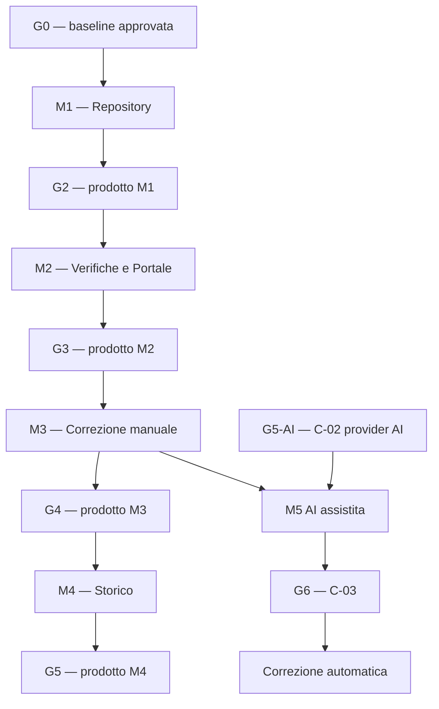

# SchoolForge — Piano di implementazione e workflow di delivery

**Versione:** 2.0
**Data:** 24 giugno 2026
**Stato:** piano esecutivo proposto
**Input vincolante:** [Architettura di sistema v2.0](architettura.md) e [Analisi dei requisiti v2.0](analisi-requisiti.md)
**Destinatari:** committente, responsabile tecnico, sviluppatore/i, QA

---

## 1. Scopo del piano

Questo documento trasforma l'architettura target in un workflow eseguibile. Definisce:

- cosa implementare e in quale ordine;
- cosa può procedere in parallelo e quali dipendenze lo vietano;
- i gate umani e tecnici che bloccano il passaggio di modulo;
- gli artefatti, le prove e i criteri di uscita di ogni modulo;
- il percorso minimo per ottenere valore prima dell'AI.

Il piano privilegia incrementi piccoli e completi. Non si sviluppano componenti "per il futuro" se non abilitano un requisito immediato o una dipendenza esplicita. Non si costruiscono microservizi, sincronizzazione Drive, Google Forms, portale pesante o funzionalità AI prima che il nucleo manuale sia utilizzabile.

### 1.1 I cinque moduli prodotto

| Modulo | Prodotto funzionante al termine | Non dipende da |
|---|---|---|
| M1 — Repository | Il docente carica lezioni con pool di domande, consulta il rendering (senza soluzioni), esporta il repository in ZIP | Portale, AI |
| M2 — Verifiche e Portale | Il docente pubblica una verifica, scarica il PDF docente; lo studente accede al Portale e scarica il PDF una sola volta (email bruciata); export programma svolto | Correzione, AI |
| M3 — Correzione manuale | Il docente corregge consegne digitali o cartacee, assegna punteggi, ottiene percentuali definitive, rettifica con audit | AI |
| M4 — Storico | Il docente consulta lo storico studenti e risultati per verifica/studente con filtri | AI |
| M5 — AI | L'AI propone correzioni; il docente approva con un clic (feature-flaggata) | — |

Ogni modulo rilascia un prodotto utilizzabile. Non è ammesso anticipare AI nella M1 o M2.

## 2. Assunzioni operative e modalità di pianificazione

### 2.1 Capacità di riferimento

La sequenza è valida con un solo sviluppatore full-stack e un committente/docente disponibile per le verifiche funzionali. Le attività marcate **parallele** possono essere affidate a persone diverse; con un solo sviluppatore sono preparabili o alternate, ma non riducono automaticamente la durata di calendario.

Le tempistiche sono espresse in **iterazioni relative di due settimane**. Prima dell'avvio devono essere calibrate su disponibilità effettiva, competenze, accesso all'account Google Education e decisione C-01.

### 2.2 Regole di esecuzione

1. Un modulo non inizia se il suo gate di ingresso non è superato.
2. Un'attività è "completata" solo con codice, test, documentazione breve e prova di accettazione.
3. Le modifiche ai requisiti aggiornano prima `analisi-requisiti.md`, poi `architettura.md`, poi questo piano.
4. Le integrazioni AI sono feature flag disabilitati finché non collaudate con account e dati di test.
5. Ogni rilascio deve mantenere utilizzabile il percorso manuale già rilasciato.
6. Nessuna azione distruttiva o irreversibile è disponibile senza conferma esplicita e audit.

## 3. Governance, branch e qualità di delivery

### 3.1 Workflow Git

| Elemento | Regola |
|---|---|
| Branch principale | `main` contiene soltanto incrementi integrati e verificati. |
| Branch di lavoro | `feature/<modulo>-<descrizione>` oppure `fix/<descrizione>`. |
| Pull request | Obbligatoria per ogni incremento. Descrive requisito coperto, test svolti, rischi e modifiche dati. |
| Merge | Consentito solo con CI verde e gate funzionale della fase quando previsto. |
| Commit | Piccoli e intenzionali; non mescolare refactor, cambio schema e funzionalità non correlate. |
| Migrazioni dati | Versionate nel repository, ripetibili in ambiente test, mai eseguite prima del backup previsto. |

### 3.2 Definition of Ready (DoR)

Un work package può iniziare solo se possiede:

- requisito e criterio di accettazione riferibili ai documenti di input;
- dipendenze tecniche disponibili oppure mock approvato;
- contratto di input/output definito;
- dati sintetici o fixture per test;
- responsabile e gate di accettazione identificati.

### 3.3 Definition of Done (DoD)

Un work package è concluso soltanto quando:

- il comportamento richiesto è implementato dietro controllo di autorizzazione;
- test unitari e di integrazione pertinenti sono verdi;
- gli errori attesi sono spiegati in UI/API senza stack trace;
- i log/audit richiesti sono prodotti senza esporre contenuti sensibili;
- documentazione tecnica e checklist di test sono aggiornate;
- il committente ha verificato il criterio di accettazione quando il package conclude una milestone.

## 4. Gate decisionali e di rilascio

| Gate | Quando | Decisione/prova richiesta | Blocco se non superato |
|---|---|---|---|
| G0 — Baseline | Prima di scrivere codice applicativo | Approvazione di requisiti, architettura e questo piano | Tutto il delivery |
| G1 — Setup operativo | Prima di ambiente `prod` | C-01: progetto Firebase, backup, RPO/RTO, responsabile | Provisioning prod; non blocca sviluppo `dev` |
| G2 — M1 completo | Dopo Repository | Import, rendering, export Markdown/asset e sicurezza verificati dal docente | M2 e uso di contenuti reali |
| G3 — M2 completo | Dopo Verifiche e Portale | Attivazione immutabile, PDF docente, email bruciata, programma svolto completi | M3 e uso operativo |
| G4 — M3 completo | Dopo Correzione manuale | Punteggi, percentuali, rettifiche e audit verificati | M4 e go-live correzione |
| G5 — M4 completo | Dopo Storico | Storico studenti e risultati filtrabile verificati | M5 |
| G5-AI — Provider AI | Prima di qualsiasi chiamata AI reale | C-02: provider, contratto, residenza, consenso | Correzione/generazione AI reale |
| G6 — Correzione automatica | Prima di abilitare automazione | C-03: regola didattica, ambito, revisione umana | Modalità automatica; non blocca AI assistita |

Ogni gate produce un breve verbale nel repository: data, approvatore, elementi verificati, decisione e limitazioni note.

## 5. Dipendenze e parallelismo



### 5.1 Regole di parallelismo

| Insieme | Attività | Condizione | Punto di sincronizzazione |
|---|---|---|---|
| P1 | Infrastruttura Firebase, parser Markdown, web shell | G0; contratti fissati entro prima iterazione | M1 pronto per import reale |
| P2 | Rendering lezione e pipeline import/validazione | Parser e Lesson Contract comuni | Test import → rendering |
| P3 | PDF e composizione verifica | PDF può usare fixture snapshot; attivazione reale aspetta modello verifica | Attivazione immutabile |
| P4 | Portale studenti e email bruciata | Portale può usare mock backend; attivazione reale aspetta G2 | Email bruciata verificata |
| P5 | Correzione manuale e storico | Correzione usa fixture; storico reale aspetta G3 | Percentuale affidabile |
| P6 | Test automatici e sviluppo funzionale | Ogni package fornisce fixture e test nel medesimo branch | Pull request del package |
| P7 | Documentazione e sviluppo | API e decisioni aggiornate durante il package, non alla fine | Gate della fase |

### 5.2 Attività non parallelizzabili

| Predecessore | Successore bloccato | Motivo |
|---|---|---|
| Parser/validatore Lesson Contract (lesson + pool + uda) | Import definitivo, questionIndex, rendering | Il contratto Markdown deve essere unico e stabile. |
| Autorizzazione backend e regole Firestore/Storage | Caricamento reale, dati personali | Non si introducono dati reali con autorizzazioni provvisorie. |
| Attivazione verifica e snapshot immutabile | PDF docente, portale, consegne | Tutti dipendono da `examId` e contenuto immutabile affidabili. |
| Correzione manuale e calcolo percentuali | Correzione AI assistita | L'AI propone nel medesimo modello già verificato manualmente. |
| C-02 | Provider AI reale | Non si fanno chiamate AI con dati didattici/studenti senza decisione formale. |

## 6. Roadmap relativa

| Iterazione | Obiettivo primario | Lavoro parallelo consentito | Gate/output |
|---|---|---|---|
| 0 | G0, backlog eseguibile, fixture e setup accessi | Preparazione Firebase `dev`, definizione owner Google | Baseline approvata e `dev` accessibile |
| 1 | M1A: fondazioni interne, login docente, Programmi/UDA | Parser Lesson Contract (lesson + pool + uda); web shell; fixture | Login solo docente; CRUD Programmi/UDA |
| 2 | M1B: staging, validazione pool e lesson, rendering | Tema, test parser, hardening regole | Import preflight con errori riga/file |
| 3 | M1C: promozione corrente, questionIndex, ricerca, export | Test E2E repository | G2 — Repository accettato |
| 4 | M2A: composizione verifica, attivazione, snapshot, PDF docente | Template PDF su fixture; export programma svolto | Verifica attivata immutabile; PDF docente |
| 5 | M2B: Portale Verifiche (app separata), email bruciata, download PDF studente | Test portale in sandbox | G3 — Verifiche e Portale accettati |
| 6 | M3A: consegne digitali e cartacee, punteggi per item, percentuali | Mock AI e test provenienza senza provider | Correzione manuale funzionante |
| 7 | M3B: rettifiche con audit, stati correzione, UI definitiva | — | G4 — Correzione manuale accettata |
| 8 | M4A: creazione lazy studenti, storico risultati, filtri e paginazione | Backup/restore drill | G5 — Storico accettato |
| 9+ | M5: AI assistita dopo G5-AI; automatica dopo G6 | AiGateway e provider sandbox | Estensione AI, se approvata |

## 7. Work breakdown structure dettagliata

### 7.1 M1 — Repository didattico

Le attività F-01–F-07 sono fondazioni interne. Non costituiscono un rilascio autonomo: il prodotto esiste solo dopo R-01–R-07 e G2.

| ID | Attività | Dipende da | Parallelo con | Deliverable |
|---|---|---|---|---|
| F-01 | Inizializzare monorepo TypeScript, lint, test, build, CI | G0 | F-02, F-03 | Pipeline eseguibile su PR |
| F-02 | Configurare Firebase `dev`, Emulator Suite | G0 | F-01, F-04 | Progetto `dev` e checklist setup |
| F-03 | Schema Firestore, indici, Security Rules e Storage Rules iniziali | F-02 | F-04, F-05 | Test emulatori: account non autorizzato rifiutato |
| F-04 | `lesson-contract`: parser UDA.md, lesson.md, pool.md, tipi e fixture | G0 | F-01, F-02 | Fixture valide/invalide; errori con file/riga/motivo |
| F-05 | Identità Google Education, bootstrap owner, middleware autorizzazione | F-02, F-03 | F-04, F-06 | Login owner riuscito; non-owner rifiutato lato backend |
| F-06 | Web shell docente, navigazione, tema, errori e conferme | F-01 | F-04, F-05 | UI con stati loading/error/empty coerenti |
| F-07 | Audit service e formato errori API | F-03, F-05 | F-04, F-06 | Endpoint test registra audit senza dati sensibili |

#### Completamento prodotto M1

| ID | Attività | Dipende da | Parallelo | Deliverable |
|---|---|---|---|---|
| R-01 | CRUD Programmi/UDA, ordinamento, flag svolto, disattivazione | F-03, F-05, F-06 | R-02, R-04 | UI e API con audit; impossibile eliminare entità referenziata |
| R-02 | Upload staging file/cartella e preflight import (lesson + pool + uda) | F-02, F-04, F-05 | R-01, R-04 | Piano import con validi, invalidi, conflitti, asset mancanti |
| R-03 | Commit atomico visibile, promozione Storage, aggiornamento `questionIndex` | R-02, F-03, F-07 | R-04 | Nessun contenuto parziale visibile; rollback/cleanup documentati |
| R-04 | Rendering Markdown sanificato: contenuto lezione, asset, domande self_check | F-04, F-06 | R-01, R-02 | Soluzioni e domande del pool non compaiono nel rendering |
| R-05 | Sostituzione/eliminazione lezione corrente e pulizia oggetti orfani | R-03 | R-06 | Verifica esistente invariata; lezione corrente aggiornata/eliminata con conferma |
| R-06 | Ricerca locale, download sorgente, export ZIP repository | R-03, R-04 | R-05 | ZIP apribile fuori SchoolForge con Markdown e asset corretti |
| R-07 | E2E Repository, hardening regole, guida operativa import | R-01–R-06 | — | Checklist G2 e test verdi |

**G2 — prova obbligatoria.** Il docente importa una cartella reale con lesson.md, pool.md e UDA.md, consulta il rendering (senza soluzioni), verifica che le domande del pool non siano esposte e scarica un export ZIP apribile senza SchoolForge.

---

### 7.2 M2 — Verifiche e Portale Verifiche

| ID | Attività | Dipende da | Parallelo | Deliverable |
|---|---|---|---|---|
| V-01 | Risoluzione corpus da UDA/Lezioni e questionIndex corrente | R-03, R-04 | V-04 | Deduplicazione corretta; lezioni invalide escluse |
| V-02 | Bozza verifica: filtri tipo/difficoltà/peso/quantità, composizione manuale | V-01, F-06 | V-04 | Blocco esplicito se corpus non copre il fabbisogno senza AI |
| V-03 | Attivazione verifica, snapshot immutabile `exams/{id}/items`, stati | V-02, F-07 | V-04 | Attivazione transazionale; modifica successiva rifiutata |
| V-04 | Servizio PDF on-demand: versione docente (campi vuoti compilabili) | F-01, F-06 | V-01–V-03 con fixture | PDF generato dallo snapshot; non scritto su Storage |
| V-05 | Export programma svolto (txt on-demand da flag svolto su UDA/lezioni) | R-01, V-03 | V-06 | File .txt strutturato scaricabile; non conservato |
| V-06 | UI attivazione, chiusura, annullamento, download PDF docente, audit | V-03, V-04 | V-07 | Conferme esplicite; storico di stato consultabile |
| V-07 | App Portale Verifiche (URL separato), shell, tema mobile-first | F-01, F-06 | V-03–V-05 con mock | App distinta deployabile su Firebase Hosting |
| V-08 | Autenticazione Google studente nel portale, validazione dominio Education | V-07, F-05 | — | Studenti con email non Education rifiutati |
| V-09 | Email bruciata: transazione Firestore atomica, download PDF studente | V-03, V-04, V-08 | — | Secondo download rifiutato (409); record `burned` creato atomicamente |
| V-10 | PDF studente con campi precompilati (nome, cognome, email, data) | V-04, V-09 | — | PDF studente distinto da PDF docente |
| V-11 | Test regressione: lezione modificata/eliminata dopo attivazione | V-03, R-05 | V-04–V-10 | Verifica/PDF restano immutati |

**G3 — prova obbligatoria.** Il docente crea una verifica senza AI, la attiva, scarica il PDF docente (campi vuoti compilabili). Uno studente apre il portale, autentica con email Google scolastica, scarica il PDF una volta. Un secondo tentativo di download è rifiutato. Il docente esporta il programma svolto come file .txt. Il docente modifica una lezione e verifica che lo snapshot sia invariato.

---

### 7.3 M3 — Correzione manuale

La correzione manuale è il prodotto obbligatorio. Non richiede AI.

| ID | Attività | Dipende da | Parallelo | Deliverable |
|---|---|---|---|---|
| CR-01 | Modello consegna (digitale portale / cartacea manuale), struttura item | V-03 | CR-03 | Consegna collegata a verifica attiva; studente creato lazy da email |
| CR-02 | Punteggi per item, validazione (0 ≤ p ≤ punteggio_max_item), calcolo percentuale | CR-01 | CR-03 | Formula corretta; percentuale `non_definitiva` finché mancano item |
| CR-03 | UI correzione: lista consegne, editor punteggi, commenti, stato | CR-01, CR-02, F-06 | — | Docente corregge, salva, vede percentuale |
| CR-04 | Rettifiche con audit (valore precedente, nuovo valore, motivazione) | CR-02, CR-03 | — | Traccia rettifica consultabile; ricalcolo automatico percentuale |
| CR-05 | Transizioni stato consegna/correzione: `da_correggere` → `definitiva` | CR-03, CR-04 | — | Transizione solo con tutti gli item definitivi |
| CR-06 | Test E2E correzione manuale e verifica G4 | CR-01–CR-05 | — | Checklist G4; percentuali verificabili su casi noti |

**G4 — prova obbligatoria.** Il docente inserisce una consegna manuale per una verifica attiva, assegna punteggi a tutti gli item, verifica la percentuale definitiva, rettifica un item e consulta valore precedente, nuovo valore, motivazione e audit.

---

### 7.4 M4 — Storico e consultazione

| ID | Attività | Dipende da | Parallelo | Deliverable |
|---|---|---|---|---|
| S-01 | Creazione lazy studente al primo accesso portale o prima consegna manuale | V-08, CR-01 | S-02 | Record studente creato automaticamente; email = chiave univoca |
| S-02 | Lista studenti con filtri (nome, email, classe opzionale) | S-01, F-03 | S-03 | Lista paginata; aggiornamento manuale nome/cognome/classe opzionale |
| S-03 | Storico risultati per studente (verifiche, percentuali, stati) | CR-05, S-01 | S-04 | Vista studente con storico consegne e percentuali |
| S-04 | Storico risultati per verifica (lista consegne e percentuali) | CR-05 | S-03 | Vista verifica con tutte le consegne corrette |
| S-05 | Filtri e paginazione storico (per verifica, studente, intervallo, stato) | S-03, S-04 | — | Query indicizzate in Firestore; nessuna scansione client |
| S-06 | Test storico e verifica G5 | S-01–S-05 | — | Checklist G5; storico filtrabile verificato |

**G5 — prova obbligatoria.** Il docente consulta lo storico di uno studente (creato lazily), filtra per verifica, vede percentuali definitive. Uno studente senza nome/cognome compare comunque con la sua email.

---

### 7.5 M5 — Correzione AI (dipende da C-02 e C-03)

| ID | Attività | Dipende da | Parallelo | Deliverable |
|---|---|---|---|---|
| I-00 | Risolvere C-02; registrare provider, consenso, sandbox | G5 | Prep mock/test | Verbale G5-AI; secret separato per ambiente |
| I-01 | `AiGateway`: contesto chiuso, mock provider, audit provenienza | I-00, V-03 | I-02 | Test dimostra assenza browsing/retrieval e fonti non selezionate |
| I-02 | Proposte correzione sul modello CR-02 (punteggio entro max, origine tracciata) | I-01, CR-02 | — | Proposta `ai_proposed`; mai definitiva senza approvazione docente |
| I-03 | Approvazione/rifiuto/modifica individuale e approvazione massiva | I-02 | — | Esclusione automatica item non idonei; audit per item e operazione |
| I-04 | Anomaly detection stilistica (consultiva, non bloccante) | I-01 | I-03 | Flag visibile in UI; non impedisce approvazione |
| I-05 | Modalità automatica dietro feature flag (C-03) | I-03, G6 | — | Non attiva per default; test e piano di rollback approvati |

---

## 7.6 Pipeline CI/CD

La pipeline è obbligatoria dall'iterazione 0.

### Stage 1 — Verifica (ogni PR e push su branch)

```yaml
jobs:
  verify:
    runs-on: ubuntu-latest
    steps:
      - uses: actions/checkout@v4
      - uses: pnpm/action-setup@v4
        with: { version: 9 }
      - uses: actions/setup-node@v4
        with: { node-version: '20', cache: 'pnpm' }
      - run: pnpm install --frozen-lockfile
      - run: pnpm run typecheck
      - run: pnpm run lint
      - uses: gitleaks/gitleaks-action@v2
      - run: pnpm audit --audit-level=moderate
      - run: pnpm run test:unit
      - run: pnpm run test:coverage
```

### Stage 2 — Integrazione (ogni PR verso main)

```yaml
  integration:
    needs: verify
    runs-on: ubuntu-latest
    steps:
      - uses: actions/checkout@v4
      - uses: pnpm/action-setup@v4
      - uses: actions/setup-node@v4
        with: { node-version: '20', cache: 'pnpm' }
      - run: pnpm install --frozen-lockfile
      - run: npm install -g firebase-tools
      - uses: actions/setup-java@v4
        with: { distribution: temurin, java-version: '17' }
      - uses: actions/cache@v4
        with:
          path: ~/.cache/firebase/emulators
          key: firebase-emulators-${{ runner.os }}
      - run: firebase emulators:exec --only firestore,storage,auth,functions "pnpm run test:integration"
        env:
          FIREBASE_TOKEN: ${{ secrets.FIREBASE_TOKEN_CI }}
          FIREBASE_PROJECT_ID: schoolforge-test-ci
```

### Stage 3 — E2E (obbligatorio prima dei gate G2, G3, G4, G5)

```yaml
  e2e:
    needs: integration
    if: github.base_ref == 'main'
    runs-on: ubuntu-latest
    steps:
      - uses: actions/checkout@v4
      - uses: pnpm/action-setup@v4
      - uses: actions/setup-node@v4
        with: { node-version: '20', cache: 'pnpm' }
      - run: pnpm install --frozen-lockfile
      - run: pnpm exec playwright install --with-deps chromium
      - run: pnpm run test:e2e
        env:
          TEST_APP_URL: ${{ secrets.TEST_APP_URL }}
          TEST_PORTALE_URL: ${{ secrets.TEST_PORTALE_URL }}
```

### Stage 4 — Deploy su dev (merge su main)

```yaml
  deploy-dev:
    needs: [verify, integration]
    if: github.ref == 'refs/heads/main'
    runs-on: ubuntu-latest
    steps:
      - uses: actions/checkout@v4
      - uses: pnpm/action-setup@v4
      - uses: actions/setup-node@v4
        with: { node-version: '20', cache: 'pnpm' }
      - run: pnpm install --frozen-lockfile && pnpm run build
      - run: firebase deploy --project schoolforge-dev --only hosting,functions,firestore,storage
        env:
          FIREBASE_TOKEN: ${{ secrets.FIREBASE_TOKEN_CI }}
```

### Stage 5 — Deploy su produzione (solo con gate e approvazione manuale)

```yaml
  deploy-prod:
    needs: deploy-dev
    environment: production
    if: startsWith(github.ref, 'refs/tags/gate-')
    runs-on: ubuntu-latest
    steps:
      - uses: actions/checkout@v4
      - uses: pnpm/action-setup@v4
      - uses: actions/setup-node@v4
        with: { node-version: '20', cache: 'pnpm' }
      - run: pnpm install --frozen-lockfile && pnpm run build
      - run: firebase deploy --project schoolforge-prod --only hosting,functions,firestore,storage
        env:
          FIREBASE_TOKEN: ${{ secrets.FIREBASE_TOKEN_PROD }}
```

### Regole operative della pipeline

| Regola | Dettaglio |
|---|---|
| PR bloccata senza Stage 1 verde | Nessuna eccezione |
| Stage 2 verde richiesto per merge su main | Test integrazione con emulatori obbligatori |
| Stage 3 E2E richiesto prima di ogni gate di fase | Non sufficiente passare Stage 1 e 2 |
| Variabili `PROD` non disponibili nelle PR | Disponibili solo nel job `deploy-prod` |
| Deploy registra versione, commit e timestamp | Audit event nel progetto Firebase |
| Rollback usa deployment precedente di Firebase Hosting | Nessun nuovo deploy del codice precedente |

## 8. Backlog tecnico trasversale

| Area | Regola | Evidenza a ogni milestone |
|---|---|---|
| Sicurezza | Test regole Firebase, controllo owner server-side, segreti solo Secret Manager | Test accesso negato; revisione scope Google |
| Accessibilità | Tastiera, semantica, contrasto nei due temi, errori comprensibili | Smoke test manuale e checklist UI |
| Audit | Ogni transizione importante scrive evento minimizzato | Query audit per import, attivazione, correzione |
| Osservabilità | Log strutturati, tempi, errori senza contenuti sensibili | Dashboard/error report con dati sintetici |
| Performance | Paginazione, indici Firestore, misurazione import/render/search | Metriche raccolte; nessun SLO inventato |
| Backup | Export Firestore/Storage, verifica restore, export Markdown | Evidenza G1/G4 secondo piano C-01 |
| Documentazione | Aggiornamento API, schema, runbook, decisioni | PR contiene link alla documentazione aggiornata |

## 9. Piano di test per milestone

| Milestone | Test automatici minimi | Test umano obbligatorio | Non procedere se |
|---|---|---|---|
| G2 | Parser lesson/pool/uda, import, rendering sanificato, Storage Rules, export | Cartella lezione reale; soluzioni non compaiono nel rendering | Domande del pool/soluzioni esposte o export incompleto |
| G3 | Attivazione, stati, snapshot, PDF docente, email bruciata (doppio tentativo), programma svolto | Creazione verifica manuale; portale studente con doppio download | Verifica modificabile dopo attivazione; secondo download non rifiutato |
| G4 | Consegna manuale, punteggi per item, percentuale, rettifica, audit | Correzione completa di una consegna test | Percentuale errata o valore precedente perso |
| G5 | Creazione lazy studente, storico per studente e verifica, filtri paginati | Storico filtrabile con dati reali | Storico incompleto o studente senza email tracciabile |
| G5-AI/I-03 | Contesto AI chiuso, assenza web, idoneità bulk approval, audit | Revisione proposte AI su dati consentiti | Provider invocabile senza consenso o item non idonei approvati |
| G6 | Flag automatico, limiti punteggio, rollback, audit | Verifica didattica della regola automatica | Modalità automatica attiva per default |

## 10. Sequenza di rilascio e rollback

### 10.1 Regole di rilascio

1. Ogni rilascio applicativo passa prima in `dev`, poi in `test`, infine in `prod` dopo il gate previsto.
2. Le modifiche Firestore sono backward-compatible durante il rilascio.
3. Le feature non complete sono protette da flag server-side e invisibili nella UI.
4. Il deployment registra versione, commit e data nel log di rilascio.

### 10.2 Rollback

| Caso | Risposta |
|---|---|
| Regressione frontend/backend | Rollback al deployment precedente; dati immutabili già attivati non vengono riscritti. |
| Errore import Markdown | Nessuna promozione visibile; cleanup staging e correzione del file sorgente. |
| Email bruciata erronea | Il docente può invalidare manualmente un record `burned` tramite funzione amministrativa auditata. |
| Errore AI | Disabilitare provider/feature flag; conservare proposte già auditabili; nessuna pubblicazione automatica. |
| Errore dati o migrazione | Fermare write path interessato, ripristinare secondo C-01, documentare incidente. |

## 11. Rischi e azioni preventive

| Rischio | Probabilità/Impatto | Prevenzione | Trigger di escalation |
|---|---|---|---|
| Contratto Markdown modificato tardi | Media / Alta | Parser condiviso, fixture, G2 prima di M2 | Cambio a front matter/pool dopo dati reali |
| Email bruciata con race condition | Bassa / Alta | Transazione Firestore atomica con test concorrenza | Due download dello stesso PDF dallo stesso email |
| Portale studenti: doppio account Google | Bassa / Media | Validazione dominio Education; email come chiave | Studente con più account Google scolastici |
| Snapshot verifica troppo grande | Bassa / Alta | Item in subcollection, transazioni e test publish | Limiti Firestore o item mancanti dopo attivazione |
| Scope creep verso LMS/Forms | Media / Media | Registro change request e vincoli fuori scope in PR | Richiesta di Forms, Drive o portale pesante |
| Provider AI non conforme | Media / Alta | G5-AI, mock gateway, feature flag | Necessità di browser/RAG o dati senza consenso |
| Backup non testato | Media / Alta | C-01 e restore drill prima di prod | Impossibilità di ricostruire Markdown o Firestore |

## 12. Dashboard di avanzamento

| Campo | Valore richiesto |
|---|---|
| Work package | ID e titolo |
| Stato | `non_avviato` / `in_corso` / `bloccato` / `in_review` / `completato` |
| Dipendenze | ID, stato e blocker reale |
| Branch/PR | Link o riferimento commit |
| Test | Comandi/prove e esito |
| Gate | Gate interessato e decisione richiesta |
| Rischi | Nuovi rischi o modifiche alle assunzioni |
| Prossima azione | Una sola azione concreta e verificabile |

## 13. Criteri di successo del piano

Il piano è applicato correttamente se:

1. il Repository didattico è rilasciato e validato prima di dipendenze AI;
2. ogni verifica attivata è immutabile e indipendente dalle lezioni correnti;
3. il PDF non è mai scritto su nessuno storage; il download studente è atomicamente protetto da email bruciata;
4. la correzione manuale è completa e affidabile prima di qualsiasi dipendenza AI;
5. ogni rilascio produce una prova di accettazione del docente, non soltanto una demo tecnica;
6. C-01 viene risolta prima del go-live; C-02/C-03 prima delle relative funzionalità AI;
7. un rollback non elimina Markdown, snapshot di verifiche, consegne o audit;
8. il progetto può fermarsi a G2, G3, G4 o G5 mantenendo un prodotto utile e coerente.

---

## Appendice A — Primo backlog eseguibile

L'ordine operativo immediato, dopo G0:

1. F-01 — monorepo, CI, build e test;
2. F-02 — Firebase `dev` ed Emulator Suite;
3. F-04 — parser/validatore `lesson-contract` con fixture (lesson.md + pool.md + UDA.md);
4. F-03 — schema/regole Firestore e Storage;
5. F-05 — autenticazione e autorizzazione docente;
6. F-06/F-07 — web shell docente, errori e audit;
7. R-01/R-02 — Programmi/UDA e preflight import Markdown.

Non va avviato il connettore AI. Il portale studenti può essere preparato come shell vuota, ma non deve ritardare la chiusura di G2.
