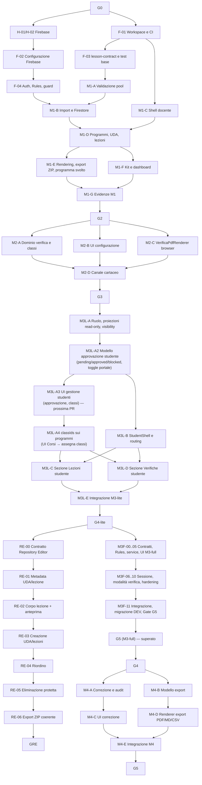

# SchoolForge — Piano di implementazione

**Versione:** 4.1
**Data:** 24 giugno 2026
**Stato:** piano esecutivo per agenti di coding
**Input vincolanti:** `brief.md`, `analisi-requisiti.md`, `architettura.md`, `api-contract.md`
**Regola di precedenza:** requisiti e architettura prevalgono su questo piano in caso di conflitto

---

## 1. Scopo del piano

Il piano trasforma la baseline in pacchetti di lavoro eseguibili da agenti di coding. Ogni pacchetto produce un risultato osservabile, ha un solo responsabile tecnico, dichiara dipendenze e include la verifica necessaria.

### 1.1 Sequenza dei moduli

| Modulo | Capacità rilasciata | Può fermarsi qui? |
|---|---|---|
| M1 — Repository didattico | Programmi, UDA, Markdown/pool, import validato, rendering, export ZIP, programma svolto (PDF + Markdown). | Sì |
| M2 — Verifiche e cartaceo | Configurazione, classi, selezione da pool, PDF browser, download docente, canale cartaceo fisico senza record (al più `downloadCount`). | Sì |
| M3-lite — Portale studente (Google, read-only) | Login Google, risoluzione ruolo docente/studente, StudentShell con Lezioni e Verifiche in sola lettura, download PDF studente per verifiche `attiva`+`public`. Nessuna Cloud Function. | Sì |
| RE — Repository Editor | Editor minimale per creare, modificare, eliminare e riordinare UDA/lezioni, inclusi front matter e corpo Markdown. Nessuna AI, nessuna Cloud Function. | Sì |
| QE — Question Editor | Editor pool domande Markdown-first (`.pool.md`): crea/modifica/elimina domande dal portale, aggiorna `questionIndex` su Firestore senza reimport ZIP. Nessuna AI, nessuna Cloud Function. Specifica in `question-editor-roadmap.md`. | Sì |
| M3-full — Verifiche online e consegne studenti ✅ | Avvio online, salvataggio bozza, consegna immutabile, codice consegna, modalità verifica (deterrenza leggera), monitor consegne docente. Nessuna Cloud Function. Completato — Gate G5 superato, vedi `m3-full-roadmap.md` e `documentazione/evidenze/g5-m3-full-checklist-finale.md`. | Sì |
| M4 — Correzione ed export | Punteggi, percentuali, rettifiche, eliminazione e `Esporta verifiche` in PDF/Markdown/CSV. Dipende da M3-full. | Sì |
| STRUCTURE-IMPORT — Scheletri didattici | Append massivo e validato di UDA e lezioni con soli metadati YAML; nessun contenuto, pool o chiamata IA durante l'import. Specifica in `structure-metadata-import-roadmap.md`. | Sì |

**M5 — Correzione assistita da IA**: la progettazione **M5-00** è completata (contratto, UX batch, sicurezza, cost model — [m5-ai-assisted-roadmap.md](m5-ai-assisted-roadmap.md)); l'implementazione (M5-01→M5-05, Gate G7) non è ancora avviata. Vedi l'Appendice C in fondo. M5 non fa parte del perimetro della V1.

Il Modulo 3 (Portale digitale) è diviso in **M3-lite** e **M3-full**, entrambi completati; Gate G5 superato per M3-full. Dopo M3-lite sono stati completati **RE — Repository Editor** (RE-00 → RE-07) e **QE — Question Editor** (QE-00 → QE-05). **M4 — Correzione ed export è completato**: correzione, restituzione, ciclo di vita, Registro Correzioni, CSV ed export PDF (M4-00→M4-04) sono completati (Markdown rinviato per assenza di caso d'uso); **Gate G6 superato** — vedi `documentazione/evidenze/g6-m4-checklist-finale.md`.

**STRUCTURE-IMPORT: 01, 02A, 02B e 03 sono implementati; il Gate GSTRUCT resta
aperto.** La sequenza autorizzata era 01 parser/planner puri → 02A import UDA →
02B import lezioni → 03 contesto UDA per la generazione IA → Gate GSTRUCT.
I due modelli YAML canonici sono inoltre consultabili, copiabili e scaricabili
dalla sezione docente **Template**, senza duplicare lo schema nel codice UI.
Nessuna fase successiva può dichiarare implementata la precedente senza le
evidenze previste nel contratto.

---

## 2. Ruoli, autorità e azioni umane

| Ruolo | Responsabilità |
|---|---|
| Docente / owner | Proprietario Firebase, billing, backup, restore e decisioni C-02/C-03. Approva i gate. |
| Agente di coding | Implementa il pacchetto assegnato, esegue test, aggiorna documentazione strettamente collegata. |
| Revisore tecnico | Verifica DoD, confini del pacchetto, test, sicurezza e coerenza con la baseline. |

### 2.1 Attività che richiedono il Docente

| ID | Azione umana | Quando | Un agente può farla? |
|---|---|---|---|
| H-01 | Creare progetti Firebase `dev` e `prod`, attivare billing Blaze, mantenere la proprietà. | Prima del provisioning reale. | Solo dopo accesso CLI autorizzato e approvazione esplicita. |
| H-02 | Creare Firestore e bucket PROD nella regione **UE** scelta (target Milano `europe-west8` ove supportato), co-locando Firestore/Storage/Functions. **Nota:** DEV è finito in `us-central1`; la scelta regione PROD è decisione HARD-F02 (`evidenze/hard-01c-human-gate.md`). | Prima del primo deploy dati PROD. | Può eseguire la configurazione tecnica se H-01 è completata. |
| H-03 | Configurare budget e avvisi di spesa; verificare l'export Firestore manuale dalle impostazioni. | Prima di dati reali, gate G1. | Può assistere con accesso autorizzato; il Docente verifica l'esito. |
| H-04 | Formati `Esporta verifiche` — **risolta**: **CSV** = formato principale per elaborare i dati (M4-03A); **PDF** = formato per consultazione e stampa (M4-03B); **Markdown** rinviato e non necessario per Gate G6, salvo una futura esigenza esplicita. | Risolta con M4-03A/M4-03B. | Renderer CSV e PDF implementati; Markdown non implementato per assenza di caso d'uso. |
| H-05 (M5) | **CHIUSA.** HG-M5-1/2/3/4 approvati; benchmark Luna, revisione docente e rollout DEV completati; Gate G7 PASS. Vedi [checklist finale](evidenze/g7-m5-checklist-finale.md). | — | No, è C-02 + soglie di spesa. |
| H-06 (rinviata) | Decidere regola didattica della **correzione automatica** (C-03). Fuori dalla linea M5-00→M5-05 (Gate G8). | Rinviata, prima di un eventuale G8. | No, è C-03. |

---

## 3. Regole del workflow per agenti

### 3.1 Definition of Ready (DoR)

Un pacchetto può partire solo se:

1. le sue dipendenze sono `completate` e le evidenze sono disponibili;
2. eventuali gate umani applicabili sono approvati;
3. input, file modificabili e criteri di accettazione sono dichiarati;
4. non esiste un altro pacchetto attivo sugli stessi file;
5. l'agente può eseguire verifiche senza dati reali o segreti di produzione.

### 3.2 Workflow obbligatorio

1. Leggere brief, requisiti, architettura, api-contract e questo piano.
2. Verificare il DoR e dichiarare subito un blocco reale.
3. Implementare solo lo scope assegnato.
4. Eseguire i test dichiarati e aggiungere test per regressioni introdotte.
5. Confrontare il diff con i vincoli: no account studente custom, no email, no PDF persistenti, no AI in V1 (M5 è V2), no ampliamento LMS, nessuna Cloud Function in M3-lite o nella specifica M3-full corrente; eventuali Cloud Functions fuori M5 richiedono nuova decisione esplicita.
6. Consegnare handoff con file, test, evidenze, rischi e dipendenze sbloccate.

### 3.3 Definition of Done (DoD)

Un pacchetto è `completato` solo se:

- funziona nel percorso previsto e gestisce il fallimento principale;
- typecheck, lint, test unitari e test di integrazione sono verdi;
- non introduce segreti, dati reali o scritture client dirette a percorsi Firestore proibiti;
- documentazione, tipi e test interessati sono aggiornati;
- il revisore verifica il diff e il criterio di accettazione;
- il branch è integrabile senza modifiche non correlate.

### 3.4 Regole di dimensionamento

Un pacchetto è abbastanza piccolo da essere verificato in una review e abbastanza completo da produrre una capacità riconoscibile. Non si combinano backend, UI, migrazioni e deploy in un singolo pacchetto senza motivazione.

### 3.5 Workflow Git

`main` contiene solo lavoro revisionato. Ogni pacchetto usa `feat/<id>-<slug>` o `fix/<id>-<slug>`. Il merge richiede pipeline verde e review. Il deploy `prod` richiede gate del modulo e azione manuale del Docente.

---

## 4. Gate e stato del delivery

| Gate | Condizione di ingresso | Evidenza richiesta | Autorizza |
|---|---|---|---|
| G0 — Baseline | Brief, requisiti, architettura e piano coerenti. | Review documentale e C-01 formalizzata. | Bootstrap del repository. |
| G1 — Fondazioni Firebase | H-01/H-02/H-03 completate; CI ed Emulator Suite disponibili. | Progetti separati, budget, export Firestore manuale disponibile, Security Rules default-deny. | M1 con dati sintetici. |
| G2 — Repository didattico | M1 integrato. | Import valido/invalido, rendering senza pool, ZIP e programma svolto. | M2. |
| G3 — Verifiche e cartaceo | M2 integrato. | PDF browser, canale cartaceo senza record di tentativo né accessLog (al più `downloadCount`), nessun PDF persistito. | M3-lite. |
| G4-lite — Portale studente (M3-lite) | M3-lite integrato. | Login Google risolve TeacherShell/StudentShell; un Google-autenticato non-owner scopre lezioni pubblicate e verifiche `attiva`+`public` solo se `students/{uid}.status == "approved"` e `settings/studentAccess.studentPortalEnabled == true` (mai per la sola autenticazione); PDF studente senza soluzioni; nessuna Cloud Function introdotta. | RE, M3-full (completato), o uso operativo stabile. |
| GRE — Repository Editor | RE integrato. | Il docente crea/modifica/elimina/riordina UDA e lezioni, modifica front matter e corpo Markdown, vede anteprima, export ZIP resta portabile, publicLessons resta coerente, eliminazioni bloccate se ci sono verifiche collegate. | QE, M3-full, polish ulteriore o uso operativo stabile. |
| GQE — Question Editor | QE integrato (QE-01→QE-05). | Il docente crea/modifica/elimina domande nel pool, `questionIndex` aggiornato atomicamente, picker verifiche riflette le modifiche, export ZIP include il pool aggiornato, nessuna regressione sui pool esistenti. | M3-full, polish ulteriore o uso operativo stabile. |
| G5 — Portale digitale (M3-full) ✅ | G4-lite e GRE superati; M3-full integrato. | Flusso avvio→bozza→consegna; immutabilità post-consegna; unicità submission; verifica chiusa blocca bozze; monitor docente real-time; modalità verifica attiva. **Superato** — vedi gate G5 in `m3-full-roadmap.md §8` e checklist finale in `documentazione/evidenze/g5-m3-full-checklist-finale.md`. | M4. |
| G6 — Correzione ed export ✅ | M4 integrato, G5 (M3-full) superato e H-04 completata. | Punteggi, rettifiche, eliminazione, export PDF/CSV da snapshot (Markdown rinviato). | **Superato** — vedi `documentazione/evidenze/g6-m4-checklist-finale.md`. Fine V1 lato correzione. |
| G7 — IA assistita (M5) | M5-01..05 integrati e H-05 completata. | Contesto chiuso, audit minimale, batch «Correggi con IA» che scrive bozze nelle `evaluations`, chiuse deterministiche, validazione punteggi server-side. | IA assistita (nessuna correzione/restituzione automatica). |
| G8 — IA automatica (rinviata) | G7 e H-06 completati. | Opt-in per verifica, audit e rollback. | Correzione automatica. **Fuori dalla linea M5-00→M5-05.** |

> **Numerazione gate (univoca).** `G6` identifica **esclusivamente** il gate finale di M4 (Correzione ed export). I gate AI della V2 sono `G7` (AI assistita) e `G8` (AI automatica): rinumerati da una precedente stesura che riusava `G6`/`G7` anche per l'AI, senza alcuna modifica al loro scope.

C-02 e C-03 riguardano la V2 e non bloccano M1–M4. M3-full è completato (Gate G5 superato); M4 (Correzione ed export) può quindi essere pianificato. Il progetto resta comunque in grado di fermarsi a ogni gate superato mantenendo un prodotto utile.

---

## 5. Dipendenze e parallelismo

```mermaid
flowchart TD
    G0 --> F1["F-01 Workspace e CI"]
    G0 --> H1["H-01/H-02 Firebase"]
    H1 --> F2["F-02 Configurazione Firebase"]
    F1 --> F3["F-03 lesson-contract e test base"]
    F2 --> F4["F-04 Auth, Rules, guard"]
    F3 --> M1A["M1-A Validazione pool"]
    F4 --> M1B["M1-B Import e Firestore"]
    M1A --> M1B
    F1 --> M1C["M1-C Shell docente"]
    M1B --> M1D["M1-D Programmi, UDA, lezioni"]
    M1C --> M1D
    M1D --> M1E["M1-E Rendering, export ZIP, programma svolto"]
    M1D --> M1F["M1-F Kit e dashboard"]
    M1E --> M1G["M1-G Evidenze M1"]
    M1F --> M1G
    M1G --> G2
    G2 --> M2A["M2-A Dominio verifica e classi"]
    G2 --> M2B["M2-B UI configurazione"]
    G2 --> M2C["M2-C VerificaPdfRenderer browser"]
    M2A --> M2D["M2-D Canale cartaceo"]
    M2B --> M2D
    M2C --> M2D
    M2D --> G3
    G3 --> M3LA["M3L-A Ruolo, proiezioni read-only, visibility"]
    M3LA --> M3LA2["M3L-A2 Modello approvazione studente\n(pending/approved/blocked, toggle portale)"]
    M3LA2 --> M3LA3["M3L-A3 UI gestione studenti\n(approvazione, classi) — prossima PR"]
    M3LA2 --> M3LB["M3L-B StudentShell e routing"]
    M3LA3 --> M3LA4["M3L-A4 classIds sui programmi\n(UI Corsi → assegna classi)"]
    M3LA4 --> M3LC["M3L-C Sezione Lezioni studente"]
    M3LB --> M3LC
    M3LA4 --> M3LD["M3L-D Sezione Verifiche studente"]
    M3LB --> M3LD
    M3LC --> M3LE["M3L-E Integrazione M3-lite"]
    M3LD --> M3LE
    M3LE --> G4LITE["G4-lite"]
    G4LITE --> RE0["RE-00 Contratto Repository Editor"]
    RE0 --> RE1["RE-01 Metadata UDA/lezione"]
    RE1 --> RE2["RE-02 Corpo lezione + anteprima"]
    RE2 --> RE3["RE-03 Creazione UDA/lezioni"]
    RE3 --> RE4["RE-04 Riordino"]
    RE4 --> RE5["RE-05 Eliminazione protetta"]
    RE5 --> RE6["RE-06 Export ZIP coerente"]
    RE6 --> REG["GRE"]
    G4LITE --> M3FA["M3F-00..05 Contratti, Rules, service, UI M3-full"]
    M3FA --> M3FB["M3F-06..10 Sessione, modalità verifica, hardening"]
    M3FB --> M3FD["M3F-11 Integrazione, migrazione DEV, Gate G5"]
    M3FD --> G5FULL["G5 (M3-full) — superato"]
    G5FULL --> G4
    G4 --> M4A["M4-A Correzione e audit"]
    G4 --> M4B["M4-B Modello export"]
    M4A --> M4C["M4-C UI correzione"]
    M4B --> M4D["M4-D Renderer export PDF/MD/CSV"]
    M4C --> M4E["M4-E Integrazione M4"]
    M4D --> M4E
    M4E --> G5
```

I rami paralleli possono partire insieme solo dopo aver fissato i contratti TypeScript. Due agenti non modificano contemporaneamente lo stesso file di Security Rules, tipi condivisi o struttura Firestore.

---

## 6. Pacchetti preparatori

| ID | Outcome e scope | Dipende da | Parallelo | Evidenza DoD |
|---|---|---|---|---|
| F-01 | Monorepo TypeScript: workspace, build, lint, test, formattazione, convenzioni branch e CI senza deploy. | G0 | H-01/H-02 | Pipeline esegue build, lint, unit test su fixture. |
| F-02 | Configurare Firebase `dev`/`test`, CLI, Emulator Suite, variabili non segrete. Non creare risorse `prod` senza H-01/H-02. | H-01/H-02 | F-01 | Emulatori avviabili e configurazioni separate. |
| F-03 | Package `lesson-contract`: tipi dominio, parser pool v1, fixture e test contratto. | F-01 | F-02 | Parser accetta/rifiuta i casi di `analisi-requisiti.md`. |
| F-04 | Firebase Auth docente, `ownerUid` nelle Security Rules, Security Rules default-deny, audit base. | F-01/F-02 | F-03 | Owner autorizzato; soggetto diverso rifiutato da test Emulator. |

---

## 7. M1 — Repository didattico

| ID | Outcome e scope | Dipende da | Parallelo | Evidenza DoD |
|---|---|---|---|---|
| M1-A | Validazione client-side di UDA, lezioni e pool con `lesson-contract`; errori strutturati file/domanda/campo. | F-03/F-04 | M1-C | Pool invalido non invalida la lezione; fixture complete. |
| M1-B | Import isolato su Cloud Storage e Firestore (Security Rules), commit `activeImportId`, indice per import e cleanup. | M1-A/F-04 | M1-C | Import valido visibile; fallimento non altera il Programma corrente. |
| M1-C | Shell docente: sessione Auth, layout responsive, tema chiaro/scuro, errori e conferme comuni. | F-01/F-04 | M1-A/M1-B | Owner accede; non-owner non entra; test accessibilità base. |
| M1-D | CRUD Programmi/UDA/Lezioni, navigazione struttura didattica, flag "svolto" per programma svolto. | M1-B/M1-C | — | Struttura navigabile e operazioni auditabili. |
| M1-E | Rendering Markdown sanitizzato, asset, esclusione pool; export ZIP; programma svolto in PDF e Markdown generati nel browser. | M1-D | — | ZIP portabile, rendering senza soluzioni, programma svolto corretto in entrambi i formati. |
| M1-F | Kit template Programma/UDA/Lezione/Pool e dashboard di prontezza, senza editor o generazione contenuti. | M1-D | M1-E | Template conforme e dashboard con validità, pool assente/invalido e domande eleggibili. |
| M1-G | Test E2E M1, review sicurezza import, evidenze G2. | M1-E/M1-F | — | G2 approvabile. |

---

## 8. M2 — Verifiche e canale cartaceo

| ID | Outcome e scope | Dipende da | Parallelo | Evidenza DoD |
|---|---|---|---|---|
| M2-A | Dominio verifica: stati, bozza modificabile, `publishedSnapshot` immutabile all'attivazione, classi, minimi e varianti. Transazioni Firestore client-side per attivazione/chiusura. | G2 | M2-B/M2-C | Attivazione invalida rifiutata; configurazione attiva immutabile; classi persistite. |
| M2-B | UI docente: crea/modifica/attiva verifiche, gestione classi nelle impostazioni, messaggi di blocco comprensibili. | G2, contratto M2-A | M2-A/M2-C | Il docente non può superare vincoli da UI. |
| M2-C | `VerificaPdfRenderer` browser unico (`mode="teacher" \| "student"`) con `@react-pdf/renderer`: PDF docente (intestazione vuota) e PDF studente (dati precompilati, soluzioni nascoste). | G2 | M2-A/M2-B | PDF conforme ai campi del brief; mode student senza soluzioni; nessun file in Storage. |
| M2-D | Canale cartaceo: link pubblico, PDF dal `publishedProjection` nel browser e download diretto, solo variante `tutte_uguali`. Nessun record di tentativo né accessLog; al più incremento atomico di `downloadCount`. | M2-A/M2-B/M2-C | — | Nessun record di tentativo o accesso creato; nessun lock; nessun PDF persistito. |
| M2-E | Test integrazione/E2E M2, evidenze G3. | M2-D | — | PDF browser verificato; canale cartaceo senza record. |

---

## 9. M3-lite — Portale studente (Google, read-only)

| ID | Outcome e scope | Dipende da | Parallelo | Evidenza DoD |
|---|---|---|---|---|
| M3L-A | Modello dati e Security Rules: campo `visibility` su `verifications`, proiezione `publicLessons` scritta nello stesso flusso di import, documento `settings/ownerPublic` per il routing. Nessuna Cloud Function. | G3 | — | Owner mantiene accesso completo; test Emulator sulle regole owner/proiezioni. Nota: la prima versione trattava "Google autenticato non-owner" come sufficiente per leggere le proiezioni; corretto in M3L-A2. |
| M3L-A2 | Modello di approvazione studente: `settings/studentAccess` (`studentPortalEnabled`, `newStudentRequestsEnabled`), `students/{uid}` (`status: pending/approved/blocked`, `classId`), Security Rules Firestore che negano ogni discovery studente finché non è `approved` + portale attivo. Nessuna Cloud Function. Storage non ripete il gate Firestore e serve solo Markdown autenticati su path già scoperti. | M3L-A | — | Google non-owner senza `students/{uid}`, `pending` o `blocked` non scopre `publicLessons`/`publishedProjection`; `approved` scopre contenuti solo se `studentPortalEnabled == true`; owner non impattato; test Emulator per ogni combinazione. |
| M3L-A3 | UI docente di gestione studenti: creare/approvare/bloccare `students/{uid}`, assegnare `classId`. | M3L-A2 | — | Il docente approva uno studente dall'interfaccia senza scrivere Firestore a mano; audit dell'approvazione. |
| M3L-A4 | `classIds` sui programmi (`programs/{id}.classIds: string[]`) e UI Corsi per assegnare un programma a zero, una o più classi. Le UDA e lezioni ereditano la visibilità dal programma (nessun campo classi proprio). | M3L-A3 | — | Programmi legacy senza `classIds` normalizzati a `[]` in lettura (nessuna migrazione distruttiva); `setProgramClassIds` deduplica; un programma senza classi non è visibile a nessuno studente; Security Rules invariate (owner-write già sufficiente). |
| M3L-B | StudentShell: routing `/student/*`, login Google, risoluzione ruolo (`uid == ownerUid` → TeacherShell, altrimenti StudentShell), layout mobile-first. | M3L-A2 | M3L-C/M3L-D | Docente va a TeacherShell; utente Google non-owner va a StudentShell (il routing del ruolo non richiede l'approvazione: solo le letture di contenuto la richiedono); nessun accesso anonimo. |
| M3L-C | Sezione Lezioni studente: elenco ad albero Programma→UDA→Lezioni e rendering read-only da `publicLessons`, filtrato per `classId` dello studente, riuso del renderer Markdown sanitizzato del docente. | M3L-B, M3L-A4 | M3L-D | Lo studente approvato vede le lezioni pubblicate dei soli programmi la cui `classIds` include la propria classe; nessun pool, soluzione, percorso tecnico o `questionIndex` raggiungibile; uno studente non approvato, senza classe, o con classe incompatibile non vede nulla; Security Rules estese con lettura studente su `programs`/`publicLessons` gated per classe. |
| M3L-D | Sezione Verifiche studente: elenco filtrato `active`+`public`+classe compatibile via `collectionGroup` su `publishedProjection`, azione "Scarica PDF" con `downloadStudentPdfFromProjection` (riuso del layout esistente). | M3L-B, M3L-A4, M3L-C | M3L-C | Solo verifiche `active`+`public` con `classId` coincidente sono visibili a uno studente approvato; una verifica senza `classId` non è mai visibile; nessuna consegna o risposta online; PDF senza soluzioni; Security Rules estese con `classId`/`visibility` duplicati sulla proiezione (necessario per la validazione della `collectionGroup` `list`, non solo comodità). |
| M3L-E light | Verifica minima di integrazione M3-lite: audit dei test già esistenti (StudentShell, StudentLessonsView/service, StudentVerificationsView/service, RoleGate, rules `m3l-*`) contro la checklist G4-lite, chiusura dell'unico gap trovato (StudentShell non esercitava mai il ramo dati reali di `loadStudentLessons`/`loadStudentVerifications`), checklist manuale G4-lite. Nessuna Cloud Function, nessuna feature nuova, nessun E2E Playwright. | M3L-C/M3L-D | — | Checklist G4-lite in `documentazione/evidenze/`; 2 test di integrazione aggiunti a `StudentShell.test.tsx`; nessuna soluzione o dato tecnico ottenibile dal client studente; nessuna lettura concessa a uno studente non approvato. E2E Playwright e review di sicurezza estesa restano fuori scope (M3L-E completo, se servirà). |

---

## 10. RE — Repository Editor

> Fase prodotto completata dopo M3-lite (RE-00 → RE-07, tutte implementate e mergiate su `main`). Non sostituisce M3-full e non anticipa correzione o AI: estende il Modulo 1 rendendo modificabile da portale il repository didattico già importato. La roadmap dettagliata è in `repository-editor-roadmap.md`; la checklist manuale DEV di RE-07 è in `documentazione/evidenze/repository-editor-checklist-manuale.md`.

| ID | Outcome e scope | Dipende da | Parallelo | Evidenza DoD |
|---|---|---|---|---|
| RE-00 | Contratto Repository Editor: tipi, campi `order`, metadata modificabili, responsabilità di aggiornamento Storage/Firestore/`publicLessons`, regole di blocco eliminazione. Nessuna UI completa. | G4-lite | — | Contratti aggiornati; test minimi se cambia codice; piano RE-01 chiaro. |
| RE-01 | Editor metadata UDA/lezione: modifica front matter UDA e lezione senza ancora editare il corpo Markdown. | RE-00 | — | Metadata persistiti e mostrati correttamente in docente/studente dove applicabile. |
| RE-02 | Editor corpo lezione con anteprima Markdown sanitizzata. | RE-01 | — | Storage aggiornato; rendering docente e studente leggono il nuovo contenuto; errore salvataggio gestito. |
| RE-03 | Creazione UDA e lezioni da UI, con front matter minimo valido e filename tecnico stabile generato automaticamente. | RE-02 | — | Nuove UDA/lezioni visibili nel docente; se il programma è assegnato a classi, `publicLessons` è coerente. |
| RE-04 | Riordino UDA e lezioni tramite `order`, senza rinominare file solo per cambiare ordine. | RE-03 | — | Ordine persistito, stabile su refresh, mobile-friendly. |
| RE-05 | Eliminazione protetta di UDA/lezioni. Blocca se esistono verifiche collegate; mostra elenco verifiche bloccanti. | RE-04 | — | Eliminazione sicura; nessuna verifica resta con riferimenti rotti. |
| RE-06 | Export ZIP coerente con modifiche da editor. | RE-05 | — | ZIP esportato resta Markdown-first e leggibile fuori da SchoolForge. |
| RE-07 | Hardening RE: test integrazione, checklist manuale DEV, aggiornamento documentazione operativa. | RE-06 | — | GRE approvabile; nessuna regressione su import, lezioni studente, verifiche cartacee. |

**RE-00 → RE-07 implementate.** Gate GRE (§4) considerato superato: il docente crea/modifica/elimina/riordina UDA e lezioni, l'eliminazione è bloccata se esistono verifiche collegate, l'export ZIP resta portabile e coerente con l'`order` corrente. Checklist manuale DEV in `documentazione/evidenze/repository-editor-checklist-manuale.md`.

### 10.1 Vincoli RE

- Non implementare editor WYSIWYG avanzato.
- Non implementare editor pool nella prima iterazione.
- Non introdurre AI o Cloud Functions.
- Non usare rinomina file come meccanismo primario di ordinamento.
- Non eliminare UDA/lezioni se esistono verifiche collegate.
- Mantenere export ZIP e Markdown portabili.

---

## 10b. QE — Question Editor (QE-00 → QE-05 completati)

> Fase prodotto successiva a RE, specifica completa in `question-editor-roadmap.md`. Rende editabili i pool domande dal portale senza reimport ZIP. Non dipende da M3-full e non introduce Cloud Functions o AI.

| ID | Outcome e scope | Dipende da | Parallelo | Evidenza DoD |
|---|---|---|---|---|
| QE-00 | Specifica e roadmap Question Editor: obiettivo, fuori scope, modello dati, formato pool, relazione `questionIndex`/verifiche, UX alto livello, rischi, costi, roadmap QE-01→QE-05. Solo documentazione. | GRE | — | Questo documento. Completato. |
| QE-01 | Serializzatore pool: `poolSerializer.ts` che converte `ParsedPool` → YAML front matter valido da riscrivere nel file `.pool.md`. Test unitari round-trip (parse→serialize→reparse). Nessuna UI, nessuna scrittura Firebase. | QE-00 | — | Round-trip senza perdita per i tre tipi di domanda; formato identico a quello prodotto dall'import. |
| QE-02 | Service layer Domande: `poolEditorService.ts` con `loadPool` (legge `.pool.md` da Storage e parsifica), `savePool` (serialize→upload Storage→update `questionIndex`+`lessons/{id}`), `deletePool`. Guard per conflitti bozze prima di eliminare. Test integrazione con Emulator. | QE-01 | — | Scrittura atomica Storage-poi-Firestore; `questionIndex` coerente; `lessons.poolStatus`/`questionCount` aggiornati; errore distinto su fallimento Firestore post-Storage. |
| QE-03 | UI sezione Domande: voce "Domande" nel menu docente; `DomandeView.tsx` con sidebar Corso→UDA→Lezione (indicatore pool presente/assente + conteggio); pannello lista domande con editMode; form crea/modifica domanda inline; eliminazione domanda/pool con conferma; messaggi blocco per conflitti bozze. | QE-02 | — | Il docente crea/modifica/elimina domande dal portale; studente non impattato; nessuna regressione su lezioni/verifiche. |
| QE-04 | Integrazione picker verifiche e contatori: verifica che `listQuestionIndex` rifletta domande create/modificate dall'editor; contatori `questionCount`/`poolStatus` nella dashboard di prontezza aggiornati; test di regressione pick→activate. | QE-03 | — | Nuova domanda da editor appare nel picker; verifica attiva con vecchio snapshot non è modificata; dashboard prontezza corretta. |
| QE-05 | Hardening QE: test E2E crea domanda→picker→attiva verifica→modifica domanda→verifica attiva invariata→chiudi; checklist manuale DEV; documentazione operativa aggiornata. | QE-04 | — | GQE approvabile; nessuna regressione su import ZIP, lezioni studente, verifiche cartacee/online. |

---

## 11. M3-full — Portale digitale (completato — Gate G5 superato)

> Specifica completa in `m3-full-roadmap.md`. Tutti i pacchetti M3F-00 → M3F-11C sono completati; il Gate G5 è superato (checklist finale in `documentazione/evidenze/g5-m3-full-checklist-finale.md`). Il vecchio modello gateway Cloud Functions descritto nella prima stesura della specifica non è mai stato il perimetro implementato.

| ID | Outcome e scope | Dipende da | Parallelo | Evidenza DoD |
|---|---|---|---|---|
| M3F-00 | Specifica M3-full: modello dati, stati, Security Rules desiderate, UX docente/studente, modalità verifica, gate G5. Solo documentazione. | G4-lite/GRE | — | `m3-full-roadmap.md` approvato. Completato. |
| M3F-01 | Tipi Firestore e indici per `submissions`/`submissionReceipts`, più `onlineEnabled` retrocompatibile. | M3F-00 | — | Typecheck/build verdi; indici JSON presenti. Completato. |
| M3F-02 | Service layer submission client-only: avvio bozza, salvataggio, consegna atomica con receipt, codice consegna. | M3F-01 | — | Test unitari service verdi; nessuna Cloud Function. Completato. |
| M3F-03 | Security Rules per submission/receipt con test Emulator Suite: unicità path deterministico, immutabilità, gate active+onlineEnabled, receipt post-consegna. | M3F-02 | — | Test rules positivi/negativi verdi. Completato. |
| M3F-04 | UI studente OnlineExamView + ConfirmationView + modalità verifica deterrente. | M3F-03 | — | Flusso avvio→bozza→consegna→receipt. Completato. |
| M3F-05 | UI docente: toggle onlineEnabled, pubblicazione online, monitor consegne. | M3F-03 | M3F-04 | Monitor stati/consegne/eventi attenzione. Completato. |
| M3F-06 | Sessione obbligatoria e UX prova: ripresa bozza, shell senza navigazione, navigatore domande, risposta singola cancellabile, uscita fullscreen solo dopo consegna riuscita. | M3F-04/M3F-05 | — | Refresh/login riporta nella prova; nessuna uscita applicativa prima della consegna; test mirati verdi. Completato. |
| M3F-07 | Modalità verifica globale/per classe in Studenti, audit e listener studente. | M3F-06 | M3F-09 | Controllo owner-only; default per classe; blocco globale confermato. Completato — reso effettivo end-to-end da M3F-08. |
| M3F-08 | Proiezione sicura corpo lezioni in `publicLessons`, sincronizzazione import/editor, migrazione e Rules. | M3F-07 | M3F-09 | Una chiamata diretta non legge lezioni durante il blocco; Storage resta canonico; backfill pronto e idempotente (dati DEV **non** migrati in questa PR — rimandato a M3F-11). Completato. |
| M3F-09 | Rifiniture docente: permesso download PDF, monitor sempre visibile sulla verifica selezionata, dettaglio eventi, tabella stabile. | M3F-05 | M3F-07/M3F-08 | Toggle PDF indipendente; un solo listener; popup eventi senza risposte; nessun layout shift. Completato. |
| M3F-10 | Hardening costi e concorrenza: autosave dirty-only introdotto a 60s e poi portato a 120s in M3F-11B; mutex sincrono save/consegna, attesa della write pendente, blocco definitivo dopo `submitted`, audit lifecycle listener/timer. | M3F-06/M3F-09 | — | Nessuna write su bozza invariata o post-consegna; revision guard preservata; consegna fallita riabilita editing/autosave; test race e cleanup verdi. Completato. |
| M3F-11 ✅ | Integrazione, migrazione DEV, smoke manuale del docente, checklist G5. | M3F-06→M3F-10 | — | Gate G5 superato; nessun accesso lezioni durante blocco; checklist finale in `documentazione/evidenze/g5-m3-full-checklist-finale.md`. Completato. |

---

## 12. M4 — Correzione ed export

Il concept UX approvato per accesso dalla tabella **Consegne online**, workspace di correzione, stati e restituzione studente è fissato in [`m4-correzione-ux-concept.md`](m4-correzione-ux-concept.md). La numerazione dei pacchetti segue la stessa convenzione di M3F-00→11C/RE-00→07/QE-00→05 (M4-00 → M4-04), sostituendo la numerazione precedente M4-A→E.

| ID | Outcome e scope | Dipende da | Parallelo | Evidenza DoD |
|---|---|---|---|---|
| M4-00 ✅ | Contratto tecnico minimo della correzione: tipi `CorrectionDoc`/`QuestionEvaluation`/`CorrectionEventDoc`/`CorrectionReturnDoc` (`src/types/firestore.ts`), helper puri di scoring/transizione (`correctionContract.ts`). Nessun service layer, nessuna Security Rule, nessuna UI. | G5 (M3-full, superato) | — | Typecheck/lint/build verdi; test unitari mirati sugli helper verdi; nessuna modifica a Rules/indici/dipendenze. Completato. |
| M4-01 ✅ | Service layer client + Security Rules per `corrections`/`correctionEvents`/`correctionReturns`, test Emulator Suite. Nessuna UI. | M4-00 | — | Vedi scheda dettagliata sotto: transizioni di stato, unicità/immutabilità, letture owner-only e proiezione studente coperte da test Rules positivi/negativi. Completato. |
| M4-02 ✅ | UI correzione: apertura dalla tabella **Consegne online** esistente, workspace per domanda, salvataggio esplicito, completa/restituisci/riapri. | M4-01 | — | Correzione manuale completa senza voto elettronico; nessuna regressione sul monitor consegne esistente. Completato. |
| M4-02B ✅ | Lettura studente della correzione restituita: sola query `correctionReturns` (`studentUid`+`visibleToStudent`), sezioni distinte in Verifiche studente, workspace read-only. | M4-02 | — | Vedi scheda dettagliata sotto: nessuna scrittura studente, nessun realtime, nessuna modifica a Rules. Completato. |
| M4-LIFE-01 ✅ | Ciclo di vita pubblico: verifiche `closed+public` consultabili/PDF ma mai svolgibili; stato correzione Consegnata/In correzione/Corretta/Restituita mirrorato atomicamente su submission+receipt e mostrato nelle UI. | M4-02B | — | Nessuna nuova query/listener; mirror scritto solo ai cambi di fase; legacy normalizzati; Rules Emulator complete verdi. |
| M4-LIFE-02 ✅ | Eliminazione sicura e completa di una consegna digitale (`deleteSubmissionData`: eventi/return/correction prima, receipt+submission per ultimi, idempotente, chunk ≤400, audit non identificativo `submission.deleted` con solo ownerUid/verificationId/timestamp) e guard applicativo che blocca `deleteVerification` finché esiste almeno una submission collegata (`where verificationId==limit(1)`). Delete owner-only aggiunto alle Rules per submissions/receipts/corrections/correctionReturns/correctionEvents; UI icon-only in Consegne online solo su verifica chiusa con conferma. | M4-LIFE-01 | — | Client-only, nessuna Cloud Function/listener; una lettura mirata per il guard; Rules Emulator (owner/studente/cross-owner) verdi. |
| M5-06B ✅ | Ripristino e hardening dell'eliminazione consegna: cancellabile **solo prima della prima restituzione**. Preflight autorevole in `deleteSubmissionData` che blocca prima di ogni scrittura se return esistente (anche nascosto), `corrections.status == 'returned'` o mirror pubblico `correctionStatus == 'returned'` (nessuna cancellazione parziale); `correctionReturns` non più eliminata dal flusso. Rules: `corrections` non eliminabile se `returned`, `correctionReturns` non eliminabile (`if false`). UI: cestino icon-only ripristinato su verifica `active` **e** `closed`, mostrato solo per consegne non restituite (restituita → cestino disabilitato con spiegazione) senza letture aggiuntive per riga; dialog con copy distinto active (rifacibile finché disponibile) / closed (resta chiusa); post-successo aggiorna monitor, progressi e selezione senza reload né listener. | M4-LIFE-02 | — | Nessuna modifica al motore IA; nessuna Cloud Function/listener; limite cross-document delle Rules documentato in sicurezza.md; test service/UI e Rules Emulator verdi. |
| M4-LIFE-03 ✅ | La protezione dura soltanto finché la correzione è **attualmente restituita**. Una vera riapertura (`returned → in_progress`, return invisibile e mirror coerenti) riporta modifica, azzeramento e cancellazione; una semplice hide non lo fa. La cancellazione della grafo riaperto include return nascosta/correction/receipt/submission e i relativi eventi; Rules e preflight fail-closed richiedono lo stesso batch coerente. | M5-06B | — | Nessuna modifica a IA, provider, costi o budget; test service/UI e Rules Emulator richiesti. |
| M4-MON-01 ✅ | Monitor consegne docente: riepilogo owner-only `correctionSummary` sulla submission, colonne Punteggio/Percentuale, rimozione di Ultimo salvataggio e ordinamento client-side stabile sulle intestazioni utili. | M4-LIFE-02 | — | Nessuna nuova query o listener; un solo aggiornamento submission per salvataggio reale, combinato con il mirror di stato quando necessario; receipt studente priva di punteggio; Rules Emulator e test UI/service verdi. |
| M4-03A ✅ | La tabella Consegne online esistente è il Registro Correzioni; modello canonico minimale ed export CSV UTF-8/BOM compatibile con Excel italiano, generato nel browser dalle righe già caricate e nell'ordine corrente. | M4-MON-01 | — | Nessuna popup/tabella duplicata, persistenza, query, lettura, scrittura o listener aggiuntivo; dati tecnici, risposte, soluzioni, feedback ed eventi esclusi. Completato. |
| M4-03B ✅ | Export **PDF** stampabile del Riepilogo consegne e correzioni (A4 landscape, jsPDF via import dinamico) dallo **stesso** modello canonico e dalle stesse righe già caricate e ordinate del CSV; intestazione con conteggi, tabella multipagina con intestazioni ripetute e footer di pagina. Markdown **non implementato**: duplicativo e senza caso d'uso concreto (CSV per elaborare i dati, PDF per consultare/stampare), rinviato salvo esigenza esplicita. | M4-03A/H-04 | — | Nessuna query/lettura/scrittura/listener/Storage aggiuntivo; nessuna dipendenza nuova (jsPDF già presente); nessuna persistenza; nessun dato tecnico/risposta/soluzione/feedback/UID esportato. |
| M4-04 ✅ | Integrazione finale M4: audit read-first dell'intero flusso, verifica che ogni punto abbia evidenza automatica, checklist finale del gate. Nessuna nuova feature, nessun E2E fragile aggiunto. | M4-02/M4-02B/M4-03B | — | **Gate G6 superato** — evidenze in `documentazione/evidenze/g6-m4-checklist-finale.md`; 320 test M4 verdi. M4 completato. |

#### M4-00 — Contratto tecnico minimo della correzione (Completato)

| Campo | Valore |
|---|---|
| Prerequisiti | G5 (M3-full, superato) |
| File creati | `apps/web/src/features/repository/corrections/correctionContract.ts` (helper puri: `isValidQuestionPoints`/`assertValidQuestionPoints`, `isQuestionEvaluated`/`isCorrectionComplete`, `computeCorrectionTotals`, `isValidCorrectionStatusTransition`/`assertValidCorrectionStatusTransition`, `deriveCorrectionUiStatus`, `isReopenedCorrection`, `computeQuestionEvaluationDeltas`, `computeGeneralFeedbackDelta`), `apps/web/src/features/repository/corrections/__tests__/correctionContract.test.ts` |
| File modificati | `apps/web/src/types/firestore.ts` (`CorrectionStatus`, `QuestionEvaluation`, `CorrectionDoc`, `QuestionEvaluationDelta`, `CorrectionEventType`, `CorrectionEventDoc`, `CorrectionReturnQuestionView`, `CorrectionReturnDoc`), `documentazione/m4-correzione-ux-concept.md`, `documentazione/api-contract.md`, `documentazione/architettura.md`, `documentazione/sicurezza.md` |
| Decisioni formalizzate | Path deterministico `corrections/{submissionId}` (== id di `submissions`); nessuna copia di `answers`/`teacherSnapshot`/`publishedProjection` dentro `corrections`; `maxPoints` per domanda congelato da `publishedProjection.questions[order]` alla creazione (mai da `teacherSnapshot.questions`, assente sulle verifiche legacy pre-SEC-02); range punteggio `[0, maxPoints]` con `maxPoints` anch'esso validato (finito, non negativo) e rifiuto esplicito fuori range; percentuale `round(totalPoints/maxPoints*100)`, `null` solo se `maxPoints == 0`; completezza = mappa non vuota **e** ogni domanda con `points !== null`; transizioni ammesse `in_progress→completed`, `completed→returned`, `completed→in_progress`, `returned→in_progress`; nessuna transizione diretta `returned→completed` né `in_progress→returned`; "Da correggere" derivato lato UI dall'assenza del documento, mai un documento placeholder; `reopenCount` su `CorrectionDoc` (0 alla creazione, incrementato a ogni riapertura, mai azzerato) come unico segnale persistente che distingue il primo giro di compilazione (nessun evento su salvataggio) da un salvataggio dopo riapertura (evento `scoreAdjusted` con delta minimale se qualcosa è cambiato); `correctionEvents` senza il tipo `'hidden'` (comportamento non formalizzato, rimandato a M4-01); `correctionReturns` ridefinito come proiezione **autosufficiente** (testo/opzioni/risposta consegnata copiati, non un riferimento a `submissions`/`publishedProjection` che potrebbero non essere più leggibili), con `points` sempre `number` (mai `null`) per domanda e due toggle indipendenti `visibleToStudent`/`solutionsVisible` che appartengono alla singola restituzione, non a `VerificationDoc`. |
| Test minimi | Helper `correctionContract.ts` (23 test): range punteggio (incl. NaN/Infinity/decimali, `maxPoints` negativo/NaN/Infinity), completezza (incl. `0` vs `null`, mappa vuota → non completa), somma/arrotondamento percentuale (incl. `maxPoints` 0, arrotondamenti non esatti), transizioni valide/non valide, derivazione stato UI senza documento, `isReopenedCorrection` alla soglia, `computeQuestionEvaluationDeltas` (nessun delta se invariato, solo domande cambiate, domanda assente dallo snapshot precedente trattata come non valutata, mai l'oggetto valutazione completo), `computeGeneralFeedbackDelta` (invariato vs cambiato). |
| Evidenza richiesta | `pnpm format:check`, `pnpm lint`, `pnpm typecheck`, test mirati (`correctionContract.test.ts`), `pnpm build` verdi. Nessun `pnpm test:rules` (Rules non modificate). Nessun deploy. |

#### M4-01 — Service layer e Security Rules correzione (Completato)

| Campo | Valore |
|---|---|
| Prerequisiti | M4-00 |
| File creati | `apps/web/src/features/repository/corrections/correctionsService.ts` (`openOrLoadCorrection`, `saveCorrection`, `completeCorrection`, `returnCorrection`, `reopenCorrection`, `setReturnVisibleToStudent`, `setSolutionsVisible`), `apps/web/src/features/repository/corrections/correctionReturnSize.ts` (limite dimensionale conservativo), `apps/web/src/features/repository/corrections/__tests__/correctionsService.test.ts` (30 test), `apps/web/src/rules/m4-01-corrections.rules.test.ts` (test Emulator dedicati) |
| File modificati | `firestore.rules` (helper `submissionData`/`correctionData`/`isValidCorrectionTransition`, blocchi `corrections`/`correctionEvents`/`correctionReturns`), `apps/web/src/types/firestore.ts` (`CorrectionReturnDoc.updatedAt`, bookkeeping tecnico non UX), `documentazione/piano-implementazione.md`, `documentazione/api-contract.md`, `documentazione/sicurezza.md` |
| Scope service layer | `openOrLoadCorrection(submissionId, ownerUid, db)`: legge `corrections/{submissionId}`; se presente lo restituisce senza riscriverlo; se assente valida la submission (`status == 'submitted'`, `ownerUid` combaciante) e crea la correction dentro un `runTransaction` che ri-verifica l'esistenza (idempotente/resistente a due aperture ravvicinate), con `evaluations` inizializzate da `publishedProjection.questions` (`order`, `maxPoints`, `points: null`) e `reopenCount: 0`. `saveCorrection(...)`: rifiuta un set di domande diverso da quello congelato, valida ogni punteggio con `assertValidQuestionPoints`, non scrive nulla se il salvataggio è identico allo stato corrente; a `reopenCount === 0` una sola `updateDoc` senza evento; a `reopenCount > 0` un `writeBatch` con update + evento `scoreAdjusted` (delta minimale) solo se qualcosa è davvero cambiato. `completeCorrection(...)`: richiede `isCorrectionComplete`. `returnCorrection(...)`: costruisce `correctionReturns` autosufficiente da submission+`teacherSnapshot` immutabile+correction, con restituzione e soluzioni visibili per default; VEX usa soltanto la variante assegnata, snapshot/soluzione malformata fallisce prima delle write. Verifica il limite sul documento completo e scrive update+projection+evento `returned` nello stesso `writeBatch` storico. `reopenCorrection(...)`: incrementa `reopenCount` di 1, azzera i timestamp, se proveniva da `returned` nasconde `correctionReturns` (`visibleToStudent: false`) nello stesso batch dell'evento `reopened`. `setReturnVisibleToStudent`/`setSolutionsVisible`: no-op se il valore richiesto è già quello attuale; `setSolutionsVisible(true)` legge `teacherSnapshot.questions` (mai il pool corrente) e rifiuta esplicitamente snapshot senza soluzioni; `setSolutionsVisible(false)` rimuove fisicamente `correctAnswer` da ogni domanda. |
| Limite dimensionale | `CORRECTION_RETURN_MAX_BYTES = 700_000` byte (`correctionReturnSize.ts`), stessa soglia/margine di `TEACHER_SNAPSHOT_QUESTIONS_MAX_BYTES` — verificato prima della scrittura in `returnCorrection` e di nuovo in `setSolutionsVisible(true)`; nessun troncamento automatico, errore esplicito. |
| Scope Security Rules | `corrections`: create solo owner su submission `submitted` propria, identità pinnata, stato iniziale fisso; update con identità/`createdAt` immutabili, solo transizioni della matrice `isValidCorrectionTransition`, `reopenCount` incrementato di esattamente 1 solo sulla transizione verso `in_progress`; nessuna delete. `correctionEvents`: create solo owner collegata a una correction propria esistente, tipo in `['reopened','scoreAdjusted','returned']`; sola lettura/creazione, mai update/delete. `correctionReturns`: create/update solo owner con identità pinnata a una correction propria; lettura owner sempre, lettura studente solo propria e solo se `visibleToStudent == true`; nessuna delete. Confine esplicito (documentato nel codice): le Rules validano ownership, identità, forma di primo livello e la matrice di transizione — mai il contenuto dettagliato di `evaluations`/`questionDeltas` (range punteggi, coerenza dei delta), che resta responsabilità del service owner-only (`correctionContract.ts`), come già avviene altrove in questo codebase per `teacherSnapshot`/`config`. |
| Test minimi | Service: creazione idempotente; submission assente/non `submitted`/altro owner rifiutata; inizializzazione da snapshot congelato; save con calcolo corretto; punteggio invalido e set domande incoerente rifiutati; save identico senza scrittura; primo ciclo senza evento; save post-riapertura con delta minimale ed evento atomico; complete su mappa incompleta/vuota rifiutata; return atomica con soluzioni congelate e filtro VEX; snapshot/soluzione malformata senza write; reopen incrementa di 1 e nasconde la proiezione; `setSolutionsVisible` true inserisce/false rimuove fisicamente; limite dimensionale sul documento completo. Rules (`m4-01-corrections.rules.test.ts`): casi owner positivi su create/update/read per le tre collezioni; isolamento tra owner diversi; studente mai lettore/scrittore di `corrections`/`correctionEvents`; append-only (`correctionEvents` mai aggiornabile/eliminabile); transizioni invalide negate (`returned→completed`, `in_progress→returned`, incrementi di `reopenCount` errati); identità immutabili; studente legge solo la propria `correctionReturns` quando `visibleToStudent == true` (negata quando `false` o di un altro studente); nessuna delete in nessuna delle tre collezioni. |
| Evidenza richiesta | `pnpm format:check`, `pnpm lint`, `pnpm typecheck`, test service mirati (30/30), `pnpm test:rules` completo verde (12 file, 352 test totali incluso il nuovo `m4-01-corrections.rules.test.ts` — eseguito perché `firestore.rules` è stato modificato), `pnpm build` verdi. Nessun deploy. |
| Esplicitamente fuori scope M4-01 | UI (M4-02); Registro Correzioni ed export (M4-03); eliminazione submission/correzione; voto elettronico; AI; azioni batch su più correzioni (`visibleToStudent`/`solutionsVisible` restano per-studente). |

**Fix post-review (stessa PR)**: la review ha trovato che `setReturnVisibleToStudent`/`setSolutionsVisible` controllavano solo l'esistenza di `correctionReturns`, non lo stato canonico della correction — dopo una riapertura (`reopenCorrection` nasconde la proiezione ma non la elimina) i due toggle potevano riportarla visibile o farla crescere con le soluzioni mentre una rettifica era in corso. Corretto:
- **Service**: entrambi i toggle ora leggono anche `corrections/{submissionId}` e procedono solo se `status == 'returned'`; correction assente o in altro stato → errore leggibile, nessuna scrittura (`assertCorrectionCurrentlyReturned`).
- **Rules**: nuovo helper `correctionDataAfter(submissionId)` (`getAfter()`). Create/update di `correctionReturns` richiede `correctionDataAfter(submissionId).status == 'returned'`, con un'unica eccezione strettamente delimitata per l'hide atomico di `reopenCorrection` (transizione `returned → in_progress` nello stesso batch, e la scrittura su `correctionReturns` tocca solo `visibleToStudent`+`updatedAt`, con `visibleToStudent == false`). Questo continua a consentire `returnCorrection()` (correction e proiezione aggiornate nello stesso batch) e nega ogni altro update mentre la correction è `in_progress`/`completed`.
- **Integrità minima eventi**: `correctionEvents` ora richiede `timestamp == request.time` e una combinazione coerente `type`/`previousStatus`/`nextStatus` (`reopened`: completed|returned→in_progress; `returned`: completed→returned; `scoreAdjusted`: in_progress→in_progress), con `nextStatus` verificato contro `correctionDataAfter(correctionId).status` — senza validare in profondità `questionDeltas`.
- Test aggiunti: 6 test service (toggle negati dopo riapertura/su `completed`, nessuna scrittura), 21 test Rules (`m4-01-corrections.rules.test.ts` ora 68 test totali) su batch di return/reopen-hide atomici, update stale negati, timestamp arbitrario negato, combinazioni type/status incoerenti negate. `pnpm test:rules` completo: 12 file, 366 test.

#### M4-02 — Workspace docente di correzione manuale (Completato)

| Campo | Valore |
|---|---|
| Prerequisiti | M4-01 |
| File creati | `apps/web/src/features/teacher/CorrectionWorkspace.tsx` (+ `.module.css`) — workspace di correzione, riprende il linguaggio visivo di `OnlineExamView` (pannello sticky, navigatore domande, card domanda) adattato con un pannello riepilogo laterale; `apps/web/src/features/repository/corrections/correctionWorkspaceLoader.ts` — piccolo loader composito (`loadCorrectionWorkspace`) che assembla submission+verifica (`teacherSnapshot`)+correction (via `openOrLoadCorrection`)+`correctionReturn` in una singola chiamata, riusato sia per l'apertura sia per il refresh dopo ogni azione; test dedicati (`CorrectionWorkspace.test.tsx`, 17 test; `correctionWorkspaceLoader.test.ts`, 6 test) |
| File modificati | `apps/web/src/features/teacher/VerificationsView.tsx` (nuova colonna "Correzione" nella tabella Consegne online con azione ✏️ "Apri correzione" solo per submission `status == 'submitted'`; `correctionTarget` come stato locale che sostituisce l'intero render della vista, stesso pattern di `selectedVer` — nessun nuovo router), `apps/web/src/features/teacher/__tests__/VerificationsView.test.tsx` (4 nuovi test mirati all'azione) |
| Flusso | Click su ✏️ nella riga di uno studente con submission `submitted` → `CorrectionWorkspace` prende il posto dell'intera vista → un solo caricamento (`loadCorrectionWorkspace`, nessun listener realtime) → editing locale di punteggi/feedback → **Salva correzione** esplicito (mai per battuta) → azioni per stato (`in_progress`: Salva/Completa con conferma; `completed`: Riapri/Restituisci; `returned`: Riapri con avviso + toggle `Visibile allo studente`/`Mostra soluzioni`) → ogni azione richiama esclusivamente una funzione di `correctionsService.ts` e poi ricarica lo stato (`refresh`), mai una stima locale del nuovo stato. |
| Gestione dirty state | Confronto `JSON.stringify` tra lo stato editabile corrente e il baseline caricato dall'ultimo `refresh`; badge "Modifiche non salvate" quando `dirty`; il pulsante "← Torna alle consegne" chiede conferma solo se `dirty` (dialog "Esci senza salvare"/"Annulla"), altrimenti chiude subito. "Completa correzione" resta disabilitato se `dirty` (obbliga a salvare prima) o se una domanda non è ancora valutata. |
| Validazione punteggio | `0` è un punteggio valido e distinto da "non valutata" (campo vuoto → `points: null`); un valore fuori `[0, maxPoints]` mostra un errore inline immediato (`isValidQuestionPoints` da `correctionContract.ts`, riuso diretto, nessuna duplicazione) e disabilita "Salva correzione" finché non è corretto. |
| Vincoli rispettati | Submission mai riscritta (letta solo in lettura dal loader); nessuna soluzione esposta allo studente finché `solutionsVisible` non è attivato dal docente (il toggle chiama `setSolutionsVisible`, non tocca la UI studente); nessun listener realtime, nessun autosave — un solo `busy` state impedisce più operazioni contemporanee, ogni pulsante è disabilitato durante un'operazione in corso; icone coerenti con `iconBtn`/emoji già usate altrove in `VerificationsView` (es. 📄/👁️); nessun refactor generale di `VerificationsView` (solo import, una colonna di tabella, un early-return). |
| Test minimi | Azione visibile solo su submission `submitted` (non su draft/assente); apertura con dati domanda/risposta/soluzione corretti; punteggio `0` valido; range invalido mostra errore e blocca il salvataggio; dirty state e conferma di uscita (annulla resta aperto, conferma chiama `onClose` senza salvare, nessuna conferma se non dirty); salvataggio esplicito (mai automatico, invia esattamente i valori modificati, poi ricarica); completamento disabilitato se incompleto o `dirty`, abilitato altrimenti, sempre dietro conferma; completa/riapri/restituisci chiamano le rispettive funzioni di `correctionsService.ts` e aggiornano la vista dal ricaricamento; toggle restituzione/soluzioni chiamano `setReturnVisibleToStudent`/`setSolutionsVisible`; avviso esplicito che riaprire nasconde subito la restituzione; stato di errore leggibile se il caricamento fallisce; il loader non viene richiamato più di una volta per apertura (nessuna lettura automatica). |
| Evidenza richiesta | `pnpm format:check`, `pnpm lint`, `pnpm typecheck`, test mirati (`CorrectionWorkspace.test.tsx` 17, `correctionWorkspaceLoader.test.ts` 6, `VerificationsView.test.tsx` 80 incl. i 4 nuovi), `pnpm build` verdi. Nessun `pnpm test:rules` (Rules non modificate in questa PR). Nessun deploy. |
| Esplicitamente fuori scope M4-02 | Registro Correzioni (M4-03); export aggregati (M4-03); eliminazione submission/correzione; voto elettronico; AI; azioni batch su più correzioni; nuova UI studente (la restituzione resta letta da `correctionReturns`, non ancora renderizzata lato studente). |

#### M4-02B — Lettura studente della correzione restituita (Completato)

| Campo | Valore |
|---|---|
| Prerequisiti | M4-02 |
| File creati | `apps/web/src/features/student/studentCorrectionReturnsService.ts` — `loadStudentCorrectionReturns` (query `correctionReturns` filtrata `studentUid == uid` + `visibleToStudent == true`, **senza `orderBy` sulla query** — l'ordinamento per `returnedAt` decrescente, con legacy/malformato sempre in fondo e mai escluso, è fatto interamente in JS — un'unica lettura server-side) e `loadStudentCorrectionReturn` (singolo `getDoc` per il pulsante "Ricarica"; `null` solo per "non esiste" o `permission-denied`, ogni altro errore viene rilanciato); `apps/web/src/features/student/StudentCorrectionView.tsx` (+ `.module.css`) — workspace read-only, riprende il linguaggio visivo di `OnlineExamView`/`CorrectionWorkspace` (pannello sticky, navigatore domande) letto esclusivamente da `correctionReturns` (mai `corrections`, `correctionEvents`, la submission consegnata o `teacherSnapshot`); test dedicati (`studentCorrectionReturnsService.test.ts`, 11 test; `StudentCorrectionView.test.tsx`, 13 test) |
| File modificati | `apps/web/src/features/student/StudentVerificationsView.tsx` (nuovo stato `correctionReturns` caricato una volta insieme alla lista; sezione "Correzioni restituite" costruita direttamente da `Object.values(correctionReturns)` — indipendente da `verifications`, quindi raggiungibile anche quando la verifica sottostante è chiusa/nascosta/non più nella lista pubblica — con card compatta dedicata basata solo sui dati autosufficienti della proiezione; le altre due sezioni escludono per `submissionId` ogni restituzione già mostrata, mai un duplicato; pulsante "Vedi correzione" mostrato solo quando esiste una restituzione visibile caricata; nuovo `view.mode === 'correction'`), `.module.css` (stili gruppo/pulsante), `apps/web/src/rules/m4-01-corrections.rules.test.ts` (+5 test mirati sulla query, aggiornati per la query senza `orderBy`; nessuna modifica a `firestore.rules`) |
| Flusso | Al caricamento della lista, `loadStudentCorrectionReturns` gira in parallelo ai controlli di stato online esistenti → ogni restituzione visibile appare nella sezione "Correzioni restituite" (indipendentemente dal fatto che la verifica sia ancora nella lista pubblica) con pulsante "Vedi correzione" → click apre `StudentCorrectionView` con i dati già caricati (nessuna lettura aggiuntiva all'apertura) → navigazione tra domande in sola lettura, punteggio/feedback per domanda, soluzione solo se `solutionsVisible == true` **e** `correctAnswer` è presente su quella domanda → "Ricarica" manuale rilegge il singolo documento: un errore di rete mostra un messaggio leggibile mantenendo i dati correnti, mentre "non esiste"/"lettura negata" (`permission-denied`) passa allo stato "non più disponibile" → "Torna alle verifiche" chiude senza ricaricare l'intera lista. |
| Sicurezza | Nessuna modifica a `firestore.rules`: la regola `allow read` di `correctionReturns` già introdotta in M4-01 (`studentUid == request.auth.uid && visibleToStudent == true`) autorizza sia il `getDoc` singolo sia la query `list`, verificato con Emulator (`m4-01-corrections.rules.test.ts`, +5 test: query con entrambi i filtri ammessa; query priva di un filtro negata, incluso il caso "solo `studentUid`" che esporrebbe anche le restituzioni nascoste; nessuna fuga di dati di un altro studente). **Nessun indice composito**: due soli filtri di uguaglianza sono coperti dagli indici a campo singolo automatici di Firestore, e la rimozione dell'`orderBy` (fix post-review, vedi sotto) ha reso superfluo l'indice inizialmente aggiunto a `firestore.indexes.json` — rimosso. |
| Vincoli rispettati | Nessuna scrittura studente in questo pacchetto; nessun listener realtime/polling (un solo caricamento più "Ricarica" esplicito); nessun voto automatico, nessuna AI, nessun export; nessuna lettura di `corrections`/`correctionEvents`/submission/`teacherSnapshot` dal lato studente — solo la proiezione autosufficiente `correctionReturns`; mobile senza overflow orizzontale (stessi pattern CSS del workspace docente, testi lunghi a capo); un fallimento nel caricamento delle restituzioni non blocca il resto della lista (non-fatale, gestito con `catch`). |
| Test minimi | Query con i soli due filtri, senza `orderBy`; un solo `getDocs`, mai un `getDoc` per verifica; normalizzazione con `submissionId` come id documento; ordinamento per `returnedAt` decrescente fatto in JS, con un documento legacy/malformato tenuto nel risultato (mai escluso) e ordinato in fondo; `loadStudentCorrectionReturn` per singolo id: `null` su "non esiste" e su `permission-denied`, rilancio per ogni altro errore (rete/nessun codice); componente: header (titolo/classe/date/totale/percentuale/feedback generale), navigatore domande, contenuto per domanda (testo/opzioni/risposta consegnata/punteggio/feedback docente), nessun colore che suggerisca correttezza sulle opzioni, soluzione assente per default e presente solo quando `solutionsVisible` e `correctAnswer` coesistono, "Ricarica" che aggiorna i dati su successo, mostra un errore leggibile mantenendo i dati correnti su fallimento transitorio, e passa allo stato "non più disponibile" solo su `null`; vista lista: badge "Vedi correzione" solo per restituzioni caricate e visibili, sezione "Correzioni restituite" popolata anche per una verifica assente dalla lista pubblica, nessun duplicato quando la verifica è ancora presente, sezioni distinte, apertura/chiusura del workspace, tolleranza a un fallimento del caricamento delle restituzioni. |
| Evidenza richiesta | `pnpm format:check`, `pnpm lint`, `pnpm --filter web exec tsc --noEmit`, test mirati (`studentCorrectionReturnsService.test.ts` 11, `StudentCorrectionView.test.tsx` 13, `StudentVerificationsView.test.tsx` 34 incl. i 9 nuovi, `studentVerificationsService.test.ts` 11 come sanity check) e `m4-01-corrections.rules.test.ts` (73 test, solo il caso query aggiornato) verdi via Emulator; `pnpm build` verde. Nessun `pnpm test:rules` completo (nessuna modifica a `firestore.rules`). Nessun deploy. |
| Esplicitamente fuori scope M4-02B | Registro Correzioni (M4-03); export aggregati (M4-03); scrittura studente di qualunque tipo; voto elettronico; AI; azioni batch. |

---

> **M5 — Correzione assistita da IA** è fuori dal perimetro V1. La roadmap **M5-00→M5-05** (che supera la vecchia sequenza M5-A..E) è nell'Appendice C in fondo a questo documento; il contratto completo è in [m5-ai-assisted-roadmap.md](m5-ai-assisted-roadmap.md). Solo **M5-00** (progettazione) è completato.

---

## 12b. Didattica — Roadmap UX (DUX)

Redesign UX approvato che unifica le attuali sezioni Corsi, Lezioni e Domande in un unico workspace docente "Didattica", con Classi assorbita in Studenti come tab. Specifica completa, decisioni UX, invarianti di sicurezza/costo e prototipo statico standalone sono in [`didattica-ux-roadmap.md`](didattica-ux-roadmap.md). Riusa esclusivamente i service/dati già esistenti di RE/QE — nessuna nuova Cloud Function, nessuna Security Rule più permissiva, nessun nuovo documento Firestore di statistiche.

**Stato: DUX-00→10A completati.** Didattica ha sostituito Corsi/Lezioni/Domande dopo il Gate di parità; Classi è stata assorbita in Studenti, Verifiche è uniformata e la shell finale applica header unico, Template restaurato e aurora sobria. Il polish responsive e l'editing metadata corso sono completati; **Gate GDUX superato (PASS)** — vedi [`evidenze/gdux-checklist-finale.md`](evidenze/gdux-checklist-finale.md).

| ID | Outcome e scope | Dipende da | Evidenza DoD |
|---|---|---|---|
| DUX-00 ✅ | Specifica UX completa e prototipo statico standalone (`documentazione/prototipi/didattica-workspace.html`). Nessun codice applicativo toccato. | — | Documento e prototipo revisionabili dal docente; nessuna modifica sotto `apps/web/src/`. Completato. |
| DUX-01 ✅ | Libreria corsi: nuova voce `Didattica`, landing a card, toolbar filtri (anno/classe/ricerca), "Nuovo corso"/"Importa ZIP". Corsi/Lezioni/Domande restano invariate in parallelo. **Implementato.** | DUX-00 | Card con le sole metriche approvate; filtri client-side; nessuna nuova query oltre a quelle di Corsi; nessuna Rule. Completato. |
| DUX-02 ✅ | Workspace corso: intestazione, sidebar UDA/lezioni condivisa, selezione corso/UDA, scheda Contenuto lezione. **Implementato** (`CourseWorkspace`). | DUX-01 | Sidebar unica riusata da tutte le selezioni; UDA/lezioni caricate all'apertura, Markdown on-demand, nessuna lettura pool. Completato. |
| DUX-03 ✅ | Scheda Domande contestualizzata (Question Editor integrato) e scheda Informazioni lezione. **Implementato** (`QuestionPoolEditor` inizialmente condiviso con `DomandeView`, poi conservato come editor unico in Didattica dalla rimozione legacy DUX-04D). | DUX-02 | Editing pool preservato nello stesso componente estratto, stesso contesto lezione della sidebar; pool letto solo all'apertura di Domande, una volta per lezione. Completato. |
| DUX-04A ✅ | Parità operativa **azioni Corso e UDA** nel workspace: toolbar contestuale + menu `⋯` (modifica titolo, import/export ZIP, programma svolto MD/PDF, classi, informazioni, elimina corso; metadata UDA, nuova UDA, elimina UDA con guard verifiche). **Implementato** (`CourseWorkspace` + `workspaceDialogs`). | DUX-03 | Riuso service Repository Editor/programs; aggiornamento locale card/tree; nessuna Rule/documento/indice nuovo; parità non completa (manca 04B/C/D). Completato. |
| DUX-04B ✅ | Editing completo **lezione** nel workspace (toolbar lezione, contenuto Markdown con anteprima, metadata, segna svolta, creazione/eliminazione lezione con guard verifiche). **Implementato** (`lessonEditors` + `NewLessonDialog`). Il PDF della singola lezione è temporaneamente nascosto da PRE-AIGEN-01 in attesa di riprogettazione. | DUX-04A | Riuso service Repository Editor + `setLessonCompleted`; dirty-guard unificato (pool+contenuto+metadata); aggiornamento locale albero/card; nessuna nuova Rule. Completato. |
| DUX-04C ✅ | Navigazione mobile a livelli (drill-down un livello per volta, Indietro coerente) + modalità **Organizza** (riordino UDA/lezioni con frecce). **Implementato** (`useIsMobile`, `ReorderControls`, `reorderUda`/`reorderLesson`). | DUX-04B | Selezione unica fonte di verità desktop/mobile; riordino via service esistenti, nessuna rilettura, no drag-and-drop; nessuna nuova Rule. Completato. |
| DUX-04D ✅ | **Gate di parità** PASS (matrice `evidenze/dux-04d-matrice-parita.md`) e rimozione voci nav + componenti legacy Corsi/Lezioni/Domande (`ProgramsView`/`LessonsView`/`DomandeView`/`ImportZipModal`); backfill `publicLessons` spostato in Didattica. **Implementato.** | DUX-04C | Ogni controllo coperto o ritirato con motivazione; componenti condivisi conservati; nessuna nuova Rule; bundle TeacherShell −13,6 kB gzip JS / −2,2 kB gzip CSS. Completato. |
| DUX-05A ✅ | Classi assorbita in Studenti: tab accessibili, CRUD inline, contatore studenti derivato in memoria; rimossa la nav/vista Classi autonoma. **Implementato.** | DUX-04D | Stessi dati caricati una volta da StudentsView; nessuna nuova query/listener; nav docente Didattica/Verifiche/Studenti/Template. |
| DUX-05B ✅ | Restyling Verifiche: tabella + creazione inline + feedback persistente "Salva bozza". **Implementato.** | DUX-05A | Logica, service e dati invariati; feedback dirty/saving/saved/error persistente; nessuna nuova lettura. |
| DUX-05C ✅ | Restauro Template, header unico definitivo e aurora sobria. **Implementato.** | DUX-05B | Griglia Template 4/2/1; header responsive con selettore mobile; aurora statica; nessuna nuova dipendenza o lettura. |
| DUX-06A ✅ | Fix funzionali workspace e sidebar: menu contestuali robusti, draft Informazioni recuperabile tra schede, icone gerarchiche e indicatori separati svolta/pool, controlli uniformi. **Implementato.** | DUX-05C | Nessuna modifica a service, Rules, schema, indici o costi Firebase; test mirati su menu, stato editor e indicatori accessibili. |
| DUX-06B ✅ | Polish libreria/workspace Didattica emerso dallo smoke DEV. **Implementato.** | DUX-06A | Toolbar filtri moderna, card interamente apribile, titoli lunghi contenuti, padding coerente e rimozione etichette ripetitive; nessun cambio a contratti o dati. |
| DUX-06C ✅ | Coerenza Studenti/Classi e Verifiche emersa dallo smoke DEV. **Implementato.** | DUX-06B | Controlli globali separati dal pannello dati; tab e righe inline stabili; tabella verifiche compatta su desktop; dettaglio verifica dedicato con ritorno alla lista; nessuna nuova lettura. |
| DUX-07A ✅ | Polish responsive finale di Didattica, Studenti/Classi e tabella Verifiche. **Implementato.** | DUX-06C | Focus lezione contestuale, struttura senza overflow, indicatori svolta/pool separati, controlli mobile stabili; solo UI, nessuna modifica a Rules/schema/query. |
| DUX-07B ✅ | Editing metadati corso e anno scolastico, con gestione esplicita del caso `programma.md` assente. **Implementato.** | DUX-07A | `programma.md` preservato o creato nell'import attivo; proiezione `programmaMeta`, timestamp e audit aggiornati in batch; UI aggiornata senza reload completo; Rules invariate. |
| DUX-09 ✅ | Rifiniture finali Didattica e Verifiche: nuovo corso inizializzato con import vuoto e `programma.md`, apertura immediata, tabelle più leggibili, filtri compatti e correzioni responsive. **Implementato.** | DUX-08, SGW-01 | Test mirati service/UI, typecheck e build; nessuna modifica a Rules o indici. |
| DUX-10A ✅ | Coerenza azioni e stabilità visuale: “Nuova UDA” a livello corso, tabelle ferme entrando in Organizza, export UDA numerato e radius filtri Verifiche corretto. **Implementato.** | DUX-09 | Test mirati `CourseWorkspace`/`programmaSvolto`; nessuna modifica a service, Rules, schema o indici. |
| UI-DIDATTICA-01 ✅ | Tabelle dei corsi sostituite lato docente e studente dalla record card SchoolForge full-width condivisa: apertura sull'intera superficie, azioni fratelli accessibili, metriche e progresso responsive. **Implementato.** | UI-SYSTEM-01 | Modifica solo presentazionale; stessi dati e handler, zero nuove letture/scritture/listener. Una card per riga su desktop e mobile; `UI-VERIFICHE` e la rifinitura futura dei metadati corso restano pendenti. |
| UI-DIDATTICA-01A ✅ | Correzione hover/focus della record card: l'overlay resta trasparente in ogni stato, bordo e accento diventano arancioni e compare la CTA decorativa «Apri programma →». **Implementato.** | UI-DIDATTICA-01 | Solo componente condiviso e CSS/test; azioni, dati e costi invariati, niente nuove operazioni Firebase. |
| UI-DIDATTICA-01B ✅ | Compattazione mobile della record card: titolo azzurro come identità, azioni nella fascia superiore, metriche UDA/Lezioni/Domande su tre colonne anche a 320 px. **Implementato.** | UI-DIDATTICA-01A | Solo presentazione condivisa docente/studente; eyebrow rimosso, progresso e interazioni preservati, backend e costi invariati. |
| UI-BRAND-INTERACTIONS-01 ✅ | Linguaggio cromatico opt-in per superfici navigabili: header docente con stato attivo blu e feedback arancione; icone metriche delle CourseRecordCard ciano a riposo e arancioni insieme alla card. **Implementato.** | UI-DIDATTICA-01B | Token condivisi, CSS e test; nessun hover globale sui button, mobile/reduced-motion invariati e zero impatto backend/Firebase. |
| UI-STUDENT-ALIGN-01 ✅ | Didattica e header studente allineati allo standard docente: nessun tooltip nativo o pulsante Apri corso ridondante, ricerca studente rimossa e navigazione sul modulo brand-interactive condiviso. **Implementato.** | UI-BRAND-INTERACTIONS-01 | Solo presentazione e test; dati, routing e operazioni Firebase invariati, touch e reduced-motion preservati. |
| UI-VERIFICHE-01 ✅ | Record card full-width condivise per archivio verifiche docente, verifiche disponibili, consegne effettuate e correzioni restituite studente; “Nuova verifica” passa alla toolbar e a `DialogShell`. **Implementato.** | UI-BRAND-INTERACTIONS-01 | Dati, handler, filtri, ordinamento e costi invariati; conferme archivio su primitive condivise, tabella consegne interna esclusa e preservata, nessuna nuova operazione Firebase. |
| UI-VERIFICHE-02 ✅ | Card verifica docente stabilizzata con azioni sempre in alto, metadati a cinque slot, quattro metriche dedicate e switch Online realmente interattivo; creazione responsive e titolo massimo 100 caratteri validato anche nei service. **Implementato.** | UI-VERIFICHE-01 | Correzione mirata UI/validazione: nessuna nuova operazione Firebase, nessuna modifica a Rules, Functions, indici, schema o logica del ciclo di vita. |
| UI-VERIFICHE-06A ✅ | Card verifica docente ripulita: box metrica di larghezza/altezza fisse per Stato e Online, CTA di apertura non più sempre visibile (nessuno spostamento di layout, nessuna comparsa su touch) e menu «Azioni» unico costruito sul componente condiviso `ActionsMenu` già usato in Didattica. **Implementato.** | UI-VERIFICHE-05 | Intervento UI/test: nessuna modifica a Functions, Rules, indici, schema, query, listener, Storage, dipendenze o portale studente; nessun costo aggiuntivo. Argomenti e data verifica non sono implementati e restano in UI-VERIFICHE-06B. |
| UI-VERIFICHE-06B ✅ | `verificationDate` obbligatoria alla creazione e modificabile in bozza (validazione pura e rigorosa, nessuna normalizzazione, nessun Timestamp); `topicOutline` mantenuto nella stessa scrittura della bozza, ricostruito autorevolmente all'attivazione e copiato dallo snapshot congelato nella `correctionReturns` alla restituzione; card docente a tre riquadri e card studente allineate, con popup Argomenti condivisa. **Implementato.** | UI-VERIFICHE-06A | Rules: estese le sole chiavi ammesse di `correctionReturns` (set chiuso) con controllo di tipo sui due campi; autorizzazione invariata. Nessun indice, nessuna migrazione, nessun documento aggiuntivo. **Costo, esplicito:** zero costo passivo; nessun listener/polling; nessuna lettura per riga o per card; zero letture all'apertura della popup; liste invariate; apertura bozza +2 query (`listUdas`, `listLessons`); attivazione +2 query autorevoli; le letture Firestore sono fatturate per documento restituito, quindi il costo delle due query dipende dalla dimensione del corso; write invariate su salvataggio bozza e restituzione. |
| UI-STUDENTI-CLASSI-01 ✅ | Restyling presentazionale di Studenti e Classi su `RecordCard` + `RecordActionsMenu` + `DialogShell`, con due varianti opt-in (`student-admin`, `class-admin`) e un nuovo slot `identityControl` per i controlli che descrivono il record. **Implementato.** | UI-VERIFICHE-06B | Solo UI, test e documentazione: service, handler, conferme e autorizzazioni invariati; nessuna nuova lettura, scrittura, query, listener o polling; Functions, Rules, indici, schema, Storage, routing e dipendenze intatti; portale studente non toccato. |
| UI-CONSEGNE-01 ✅ | Rifinitura presentazionale della schermata consegne: variante desktop/mobile scelta da `useMediaQuery` (hook di sola viewport), nuova `SubmissionRecordCard` sulla variante opt-in `submission` di `RecordCard`, `BatchActionsMobileMenu` a due livelli sul menu portalato condiviso, controllo di ritorno «← Verifiche». **Implementato.** | UI-STUDENTI-CLASSI-01 | Solo UI, test e documentazione: servizi, query, listener, Rules, Functions, schema, indici, Storage, correzione manuale/IA, export PDF, VEX e routing invariati. Condizione `disabled` delle azioni massive unificata in un solo punto, così desktop e mobile non possono divergere. |
| FORCE-SUBMIT-01 ✅ | Callable transazionale `forceSubmitSubmission` (core puro `forceSubmitCore.ts` + wiring Admin `forceSubmitGateway.ts`) con input chiuso `{ verificationId, studentUid }`, client tipizzato `forceSubmitClient` e azione «Chiudi e consegna» nelle consegne docente (tabella desktop e menu card mobile condividono `forceSubmitBlockedReason`). Ricevuta e conferma studente marcate `forcedByTeacher`. **Implementato.** | UI-CONSEGNE-01 | Ordine fail-closed auth → verifica → proprietà → submission esistente → coerenza; `not-found` se lo studente non ha iniziato (nessuna consegna vuota creata). Due sole scritture atomiche; `lastSavedAt`, `answers`, `flagged`, `attentionEvents`, `assignedQuestionOrders`/`assignedAnswerKeys` e `startedAt` invariati. Idempotente sul replay (0 scritture); una consegna normale concorrente non viene mai sovrascritta. Rules, indici, schema, dipendenze e Storage invariati; nessun listener/polling; nessuna chiamata OpenAI. |
| FORCE-SUBMIT-02 ✅ | Callable batch `scheduleForceCloseSubmissions` (input chiuso, cap 60, marcatori server-only, una Cloud Task per bozza eleggibile) e task queue `runScheduledForceClose` che esegue a +60 s riusando il core FORCE-SUBMIT-01; client `forceCloseClient` con derivazione unica dell'eleggibilità condivisa da toolbar, menu mobile e conferma; banner studente `ForceCloseBanner` su un solo listener della propria bozza. Rimossa la callable per singola consegna. **Implementato.** | FORCE-SUBMIT-01 | Nessuna Function in attesa, nessun timer del browser autorevole: la chiusura avviene anche a browser chiusi. Idempotente su doppio click, retry e consegna doppia della task; consegna normale sopravvenuta mai sovrascritta; compensazione se l'accodamento fallisce. Rules, indici, schema e dipendenze invariati. |
| UI-EXAM-SUBMISSIONS-01 ✅ | Fix finale presentazionale per consegne mobile e superfici d'esame: link eventi con hit-testing esplicito su card inerte, intestazione mobile riordinata e badge stato senza contenitore; `QuestionNavigator.module.css` centralizza geometria, anello corrente, hover/focus arancione e reduced-motion nei tre flussi; `OnlineExamView` mostra l'identità già disponibile in memoria e usa la superficie delle domande con accento SchoolForge; `ConfirmationView` omette la classe. **Implementato.** | UI-CONSEGNE-01 | Zero nuove letture/scritture/query/listener. Nessuna modifica a Rules, Functions, schema, indici, Storage, payload o costi. |
| UI-RECORD-ACTIONS-01 ✅ | `RecordActionsMenu` centralizza i menu delle card corso/verifica e corregge l’ordine degli eventi: azione React eseguita, poi chiusura del portale; voci disabilitate inerti; stato arancione della card mantenuto a menu aperto. Completati spacing Online, metriche uniformi e date picker moderno. **Implementato.** | UI-VERIFICHE-06B | Solo frontend/test/documentazione, zero operazioni Firebase aggiuntive; test mirati e smoke Chromium reale. |
| UI-VERIFICHE-MOBILE-01 ✅ | Card verifica docente mobile più compatta: nessuna riga riservata alla CTA touch; trigger «Azioni» icon-only (`…`) in alto a destra con target 44 px; icona PDF nella riga metadati solo quando `studentPdfEnabled === true`, anche desktop. **Implementato.** | UI-RECORD-ACTIONS-01 | Solo presentazione; nessuna query/write/listener o modifica backend. Desktop verificato invariato. |
| UI-DIDATTICA-ACTIONS-01 ✅ | Trigger «Azioni» delle card corso allineato in alto a destra anche su desktop, senza centraggio verticale. **Implementato.** | UI-RECORD-ACTIONS-01 | CSS opt-in sul layout `corner`; menu, handler, mobile e backend invariati. |
| Gate GDUX ✅ | Verifica finale end-to-end della roadmap Didattica. **Superato (PASS)** — `evidenze/gdux-checklist-finale.md`. | DUX-01…10A (incl. 04A–D) | Checklist manuale DEV + evidenze automatiche. |
| UI-POLISH-01 ✅ | Rifinitura grafica finale V1, **conservativa** (nessun redesign, nessuna nuova feature). Riuso dei token esistenti (`index.css`): utility di caricamento condivisa `.spinner`/`.loading-row` (reduced-motion aware), scrollbar sottili coerenti col tema (specificità `*`: le scrollbar intenzionalmente nascoste restano tali, lo scorrimento non cambia), `::selection` con accento brand. Task 6 — indicatore di caricamento IA sobrio e coerente in **anteprima** («Calcolo della stima…») ed **esecuzione** («Correzione in corso…»): piccolo spinner circolare, `role="status"` + `aria-live`, nessuna percentuale/progress bar finta, reduced-motion rispettato; risultati/errori esistenti invariati. **Implementato.** | GDUX, M5 | Solo CSS + markup del loader anteprima. La nota storica sul test manuale è stata superata dalla chiusura M5-08/G7. |

---

## 12b.0 Evoluzioni apprendimento approvate (post UI-POLISH)

Specifica completa e vincolante in [`evoluzioni-apprendimento-roadmap.md`](evoluzioni-apprendimento-roadmap.md). **Stato: progettazione approvata, implementazione non avviata.** Le decisioni includono: calibrazione IA strutturata; rimozione completa di `peso` senza compatibilità legacy; difficoltà intera `1..5` con `maxPoints = difficolta`; aggiornamento obbligatorio di template/kit/fixture; appunti personali a costo controllato; varianti equivalenti a gruppi con warning non bloccanti quando esiste una sola alternativa; visual boost preceduto da prototipo.

| Ordine | Pacchetto | Outcome |
|---:|---|---|
| 1 | SPINNER-FIX-01 | Spinner IA robusto su Safari/Brave mobile e fallback statico corretto per reduced-motion. |
| 2 | M5-QUALITY-01→07 ✅ / M5-08 ✅ | Benchmark Luna, rivalutazione offline, revisione docente e rollout DEV completati. **M5-QUALITY-02 chiuso; Gate G7 PASS.** |
| 2b | M5-QUALITY-05 ✅ (solo benchmark) | Confronto modello controllato e runner fail-closed per nano/mini/Luna; report locali ignorati e `promptContractVersion` obbligatoria. Lo stato storico precedente al benchmark Luna è superato dalla chiusura M5-08/G7. |
| 2c | M5-QUALITY-06 ✅ (solo benchmark) | Ricalibrazione docente di INF-004 e candidatura G7. Benchmark Luna 36/36; fascia balanced ricalibrata 2,50–3,25 → **2,00–2,50**; rivalutazione offline fail-closed e immutabile. Lo stato storico in attesa di revisione è stato superato dalla conferma docente e da M5-08. |
| 2d | M5-QUALITY-07 ✅ | Promozione controllata di `gpt-5.6-luna` nel runtime DEV con allowlist modello/listino, flusso costi/budget completo e rollback nano esplicito. Il rollout post-merge e lo smoke sono stati completati; **Gate G7 PASS** con M5-08. |
| 3 | Gate G7 | Chiusura M5 dopo smoke e benchmark. |
| 4 | POOL-SIMPLE-00/01/02 ✅ + GPOOL ✅ | Nuovo contratto unico senza `peso`, difficoltà 1–5, template e flussi completi aggiornati; nessun legacy. Contratto/parser/kit (01) e rimozione applicativa end-to-end di `peso` con `maxPoints === difficolta` (02) implementati; **Gate GPOOL superato (PASS, 20 luglio 2026)** — `pool-simple-contract.md` ed `evidenze/gpool-checklist-finale.md`. |
| 5 | ANNOT-00/01/02/03A/03B ✅ + GANNOT ✅ | Appunti personali: post-it flottante desktop, vista mobile, Rules owner-only, blocco durante modalità verifica e indice per corso. Contratto/service/Rules (ANNOT-01), UI desktop/mobile con cache e dirty guard (ANNOT-02), rifinitura UX (03A) e indice+indicatore persistente (03B) implementati; **Gate GANNOT superato (PASS)** — `evidenze/gannot-checklist-finale.md`. Identità canonica lezione = `publicLessonId`; costo: una read indice per corso/sessione, read nota solo all'apertura, nessun listener/polling. |
| 5b | ANNOT-CLEANUP-01 ✅ | Eliminazione sicura ed economica degli appunti personali degli studenti alla cancellazione del corso. Cloud Function `onCall` owner-only `cleanupProgramLessonNotes` (Admin SDK, region `us-central1`, scale-to-zero): una collection-group query su `lessonNoteIndexes` per `programId`, supportata dall'indice single-field esplicito `COLLECTION_GROUP` in `firestore.indexes.json`; path note costruiti da `studentUid` + `lessonIds` (i `lessonNotes` non sono mai letti → il docente non legge i contenuti), validazione fail-closed (segmenti Firestore validati senza normalizzazione, input callable realmente chiuso a `{ programId }`), delete in chunk di 400 (prima note poi indici), idempotente ma non globalmente atomica. Invocata da `deleteProgram` prima di qualsiasi operazione distruttiva sul corso; se fallisce il corso resta completamente integro e riprovabile. Copre le note tracciate dall'indice ANNOT-03B, nessun fallback di scansione né migrazione legacy; nessun indice composito/scheduler/polling/TTL. Costo solo alla cancellazione: `S` read indice + `N` delete note + `S` delete indice. Rules appunti invariate. |
| 6 | VEX-00/00B/01A/01B/02A/02B/02C ✅ + VEX-03A ✅ + GVEX ✅ | Varianti equivalenti complete: builder assistito locale, assegnazione server-side idempotente, isolamento delle alternative, svolgimento, correzione/IA/restituzione ed export sulla sola variante. Rollout DEV completato (baseline server/Rules `1399fae`, Hosting finale VEX-02C `adba8e3`); smoke docente/multi-studente confermato il 21 luglio 2026. **Gate GVEX PASS** — [`vex-contract.md`](vex-contract.md) ed [`evidenze/gvex-human-gate.md`](evidenze/gvex-human-gate.md). Nessun PROD. |
| 7 | VISUAL-BOOST-00/01 | Prototipo statico approvato prima di qualunque ulteriore modifica grafica applicativa. |

POOL-SIMPLE è prerequisito obbligatorio di VEX. Le evidenziazioni persistenti e «seleziona testo → appunti» sono eliminate dalla roadmap.

**VEX-03A rollout DEV e Gate GVEX:** rollout coordinato completato il 21 luglio 2026 su
`schoolforge-dev`, baseline server/Rules SHA `1399faeb1539b1adf1fd9d0ead1bb485ca5d9d53`, con
Node `v22.23.1` e ordine Functions → Firestore Rules → Hosting. VEX-02C è stato poi distribuito
con un deploy solo Hosting, SHA `adba8e3208c33ece05fbc928f598e0197c4ba94b`. Smoke manuale
docente/multi-studente confermato: [Gate GVEX PASS](evidenze/gvex-human-gate.md). Nessun PROD.

---

## 12b.1 Didattica studente — SDUX

Specifica e confini in [`student-didattica-ux-roadmap.md`](student-didattica-ux-roadmap.md).

| ID | Outcome e scope | Dipende da | Evidenza DoD |
|---|---|---|---|
| SDUX-01 ✅ | Libreria corsi e workspace corso/UDA/lezione read-only su `programs` autorizzati + `publicLessons`; nessun service docente, pool o Storage; regressioni Rules contro chiamate manomesse. | DUX-10A, M3F-08 | Test UI e Rules mirati; typecheck/build; nessuna Rule più permissiva. |
| SDUX-02 | Smoke DEV desktop/mobile e Gate Modalità verifica: smontaggio immediato della Didattica aperta, query negate server-side, ripristino senza nuovo login. | SDUX-01 | Checklist manuale con studente reale + suite Rules M3F-07. |

---

## 12c. SGW — Repository Storage Gateway same-origin (SGW-00 → 03)

> Fase infrastrutturale approvata, specifica completa in [`storage-gateway-roadmap.md`](storage-gateway-roadmap.md). Instrada gli accessi Storage del docente dietro `/api/repository/*` → Hosting rewrite → **una** Cloud Function HTTPS 2ª gen → Admin SDK → Storage, per renderli affidabili anche su Brave mobile. **Stato: SGW-01 e SGW-02A completati e verificati su DEV; SGW-02B batch-read implementato nel codice e in attesa di deploy/smoke; restano SGW-02C batch-write import e SGW-03.**

| ID | Outcome e scope | Dipende da | Evidenza DoD |
|---|---|---|---|
| SGW-00 | Contratto definitivo del gateway: inventario Storage, API `/api/repository/*`, sicurezza (Admin SDK bypassa le Rules → vincoli equivalenti/più stretti), costi/prestazioni, emulatori/deploy, roadmap SGW-01/02/03, backlog DUX-09. Solo documentazione. | MOB-01C | Questo documento + `storage-gateway-roadmap.md`; nessuna modifica a codice/Rules/`firebase.json`/dipendenze. |
| SGW-01 ✅ | Function `repositoryGateway` + client adapter; read/write/delete singolo; migrazione contenuto/metadata lezioni e UDA e pool (load/save/delete); test sicurezza; deploy DEV + smoke Brave. | SGW-00 | Codice, rewrite e dipendenze implementati; deploy DEV in `us-central1` e smoke Brave mobile confermati dal docente. |
| SGW-02A ✅ | Delete-prefix owner-only sulla root esatta di un import; eliminazione programma senza Storage SDK diretto; letture parallele e batch Firestore per create/save UDA e lezioni; `minInstances: 0` invariato. | SGW-01 | Test gateway/service, deploy Function+Hosting e smoke DEV completati. |
| SGW-02B ✅ codice | Batch-read owner-only (300 file, 20 MB, ordine stabile, errori per-file, chunk/split client); migrazione export ZIP, backfill e loader pool verifiche con e senza soluzioni. | SGW-02A | Test gateway/client/flussi, typecheck e build; deploy Function+Hosting e smoke Brave ancora da eseguire. |
| SGW-02C | Batch-write owner-only e migrazione dell'import ZIP, ultimo accesso Storage diretto applicativo; gate `rg`. | SGW-02B | Import dal gateway; nessuna operazione Storage diretta nel frontend fuori dalla configurazione autorizzata; smoke Brave. |
| SGW-03 / Gate | Smoke completo Brave/Safari/desktop, sicurezza, prestazioni, costi, rollback; documentazione da "target" a "implementato". | SGW-02 | Checklist DEV multi-browser + evidenze; doc aggiornata. Richiede Docente. |

---

## 13. Qualità, CI/CD e costi

### 12.1 Pipeline minima

| Stage | Trigger | Blocca | Contenuto |
|---|---|---|---|
| Verifica | Ogni push/PR | Merge | Format, lint, typecheck, unit test e build. |
| Integrazione | PR verso `main` | Merge | Firebase Emulator Suite: Auth, Firestore, Storage; Functions riservate a M5 (V2) — M3-full (completato) non ne introduce. |
| E2E | Prima dei gate G2–G8 (inclusi G4-lite e G4) | Gate | Browser test sui flussi del modulo e casi negativi. |
| Deploy `dev` | Merge su `main` | — | Deploy controllato senza dati reali. |
| Deploy `prod` | Gate approvato + azione manuale Docente | Go-live | Backup verificato, release notes e smoke test. |

### 12.2 Regole di costo

- Sviluppo e test usano Emulator Suite e fixture sintetiche.
- Nessuna VM, Cloud SQL, container sempre acceso, coda dedicata o servizio enterprise senza decisione documentata.
- M3-lite e la specifica M3-full corrente non introducono Cloud Functions. Qualsiasi Function aggiuntiva fuori M5 deve essere giustificata e approvata con nuova decisione esplicita.
- PDF e documenti generati nel browser, mai su server, in nessun canale.
- Il Docente controlla budget/avvisi prima del primo deploy `prod`.
- In V2, ogni pacchetto che aggiunge una chiamata a provider esterno (AI) dichiara volume atteso e costo variabile.

### 12.3 Regole di rilascio e rollback

1. Le modifiche Firestore devono essere compatibili con la versione applicativa precedente durante il deploy.
2. Le funzionalità incomplete sono invisibili o disabilitate tramite flag server-side.
3. Il rollback del codice non cancella Markdown, snapshot digitali, consegne o audit.
4. Un errore import non scrive su Firestore; un errore di avvio digitale non crea un participant lock parziale.
5. Un incidente dati attiva C-01: fermare le scritture interessate, valutare l'ultimo export Firestore manuale, ripristinare e documentare.

---

## 14. Handoff, dashboard e criteri finali

### 13.1 Handoff obbligatorio

Ogni pacchetto concluso produce:

- ID e risultato conseguito;
- file modificati e confini rispettati;
- comandi di test eseguiti ed esito;
- evidenze per il gate interessato;
- debito tecnico o rischio residuo reale;
- dipendenze sbloccate e prossima azione concreta.

### 13.2 Dashboard di avanzamento

| Campo | Valore |
|---|---|
| Pacchetto | ID e titolo. |
| Stato | `non_avviato`, `in_corso`, `bloccato`, `in_review`, `completato`. |
| Dipendenze | ID e stato; descrivere il blocco effettivo. |
| Branch/PR | Riferimento. |
| Test | Comandi, evidenza e risultato. |
| Gate | Gate coinvolto e decisione umana richiesta. |
| Rischi | Solo rischi nuovi o modificati. |
| Prossima azione | Una singola azione verificabile. |

### 13.3 Criteri di successo

1. Ogni modulo rilascia una capacità usabile senza anticipare AI o scope LMS.
2. Nessun agente lavora su un pacchetto senza DoR o ignora un gate umano.
3. M3-lite rispetta la risoluzione del ruolo (docente vs studente Google), le proiezioni read-only e l'assenza di PDF persistenti; M3-full (completato) rispetta autenticazione Google approvata, unicità/immutabilità della submission e snapshot pubblicato immutabile — nessun lock nome+cognome né log IP, modello superato dalla specifica client-only realizzata (vedi `m3-full-roadmap.md`).
4. `Esporta verifiche` è costruito da tutte le consegne definitive e non dalle lezioni correnti (dipende da M3-full).
5. Test automatici, E2E e review crescono insieme al prodotto.
6. Firebase resta configurato con costo minimo; nessuna Cloud Function aggiuntiva senza approvazione; M3-lite non ne richiede.
7. Il progetto può fermarsi dopo G2, G3, G4-lite, G4, o G5 mantenendo un prodotto utile.

---

## Appendice A — Primo pacchetto da assegnare

Il primo pacchetto assegnabile è **F-01 — Workspace e CI**. Il provisioning Firebase reale non parte finché il Docente non ha completato H-01 e H-02. Dopo F-01, F-02 e F-03 possono avanzare in parallelo; F-04 richiede sia il workspace sia l'ambiente Firebase `dev`.

---

## Appendice B — Schede pacchetti dettagliate

Ogni scheda standardizza prerequisiti, file e verifica. I percorsi seguono il monorepo descritto in `toolchain.md`.

### F-01 — Workspace e CI

| Campo | Valore |
|---|---|
| Prerequisiti | G0 |
| File da creare | `package.json`, `pnpm-workspace.yaml`, `apps/web/`, `packages/lesson-contract/`, `functions/`, config lint/format, workflow CI |
| File da modificare | — |
| Test minimi | Pipeline esegue build, lint, typecheck e unit test su una fixture banale |
| Evidenza richiesta | Log CI verde con i quattro step; albero del workspace |

### F-02 — Configurazione Firebase

| Campo | Valore |
|---|---|
| Prerequisiti | H-01/H-02 |
| File da creare | `firebase.json`, `.firebaserc`, `firestore.indexes.json`, config emulatori |
| File da modificare | `package.json` (script emulatori) |
| Test minimi | Avvio Emulator Suite (Auth/Firestore/Storage/Functions) sulle porte di `toolchain.md` |
| Evidenza richiesta | Output `firebase emulators:start`; alias `dev`/`test` separati |

### F-03 — lesson-contract e test base

| Campo | Valore |
|---|---|
| Prerequisiti | F-01 |
| File da creare | `packages/lesson-contract/src/index.ts`, fixture pool valide/invalide, `*.contract.test.ts` |
| File da modificare | `apps/web/src/contracts/lesson.ts` (riesporta dal package) |
| Test minimi | Il parser accetta/rifiuta i casi di `analisi-requisiti.md` con errori file/domanda/campo |
| Evidenza richiesta | Report Vitest contract; elenco casi coperti |

### F-04 — Auth, Rules, guard

| Campo | Valore |
|---|---|
| Prerequisiti | F-01/F-02 |
| File da creare | `firestore.rules`, `storage.rules`, test Emulator delle regole, guard auth SPA |
| File da modificare | `apps/web/src/lib/firebase.ts` |
| Test minimi | Owner autorizzato; soggetto diverso rifiutato; default-deny |
| Evidenza richiesta | Test Emulator regole verdi; matrice percorsi/ruoli |

### M1 — Repository didattico

#### M1-A — Validazione pool

| Campo | Valore |
|---|---|
| Prerequisiti | F-03/F-04 |
| File da creare | `apps/web/src/features/repository/validate*.ts`, `*.test.ts` |
| File da modificare | `apps/web/src/contracts/lesson.ts` (se servono helper) |
| Test minimi | Pool invalido non invalida la lezione; errori strutturati per file/domanda/campo |
| Evidenza richiesta | Fixture complete e report test |

#### M1-B — Import e Firestore

| Campo | Valore |
|---|---|
| Prerequisiti | M1-A/F-04 |
| File da creare | `apps/web/src/features/repository/import*.ts`, `src/types/firestore.ts` |
| File da modificare | `firestore.rules` (lessons/udas/questionIndex) |
| Test minimi | Import valido visibile; fallimento non lascia contenuti parziali |
| Evidenza richiesta | Test integrazione Emulator import atomico |

#### M1-C — Shell docente

| Campo | Valore |
|---|---|
| Prerequisiti | F-01/F-04 |
| File da creare | `apps/web/src/routes/teacher/`, layout, tema chiaro/scuro |
| File da modificare | router SPA |
| Test minimi | Owner accede; non-owner non entra; accessibilità base |
| Evidenza richiesta | E2E login; check a11y |

#### M1-D — Programmi, UDA, lezioni

| Campo | Valore |
|---|---|
| Prerequisiti | M1-B/M1-C |
| File da creare | feature CRUD struttura, flag "svolto" |
| File da modificare | `src/types/firestore.ts` |
| Test minimi | Struttura navigabile; operazioni auditabili |
| Evidenza richiesta | E2E navigazione; auditEvents prodotti |

#### M1-E — Rendering, export ZIP, programma svolto

| Campo | Valore |
|---|---|
| Prerequisiti | M1-D |
| File da creare | renderer Markdown sanitizzato, export ZIP, programma svolto PDF+MD |
| File da modificare | `apps/web/src/components/pdf/` |
| Test minimi | ZIP portabile; rendering senza pool; programma svolto nei due formati |
| Evidenza richiesta | ZIP esportato; rendering senza soluzioni |

#### M1-F — Kit e dashboard di prontezza

| Campo | Valore |
|---|---|
| Prerequisiti | M1-D |
| File da creare | `apps/web/src/features/repository/templates/`, `readiness*.ts` |
| File da modificare | router docente e contratti repository |
| Test minimi | Template conformi; dashboard con validità, pool assente/invalido e domande eleggibili |
| Evidenza richiesta | Download template e stato dashboard verificati |

#### M1-G — Integrazione M1

| Campo | Valore |
|---|---|
| Prerequisiti | M1-E/M1-F |
| File da creare | `*.e2e.ts` M1 |
| File da modificare | — |
| Test minimi | E2E M1 completo; review sicurezza import |
| Evidenza richiesta | Evidenze G2 |

### M2 — Verifiche e canale cartaceo

#### M2-A — Dominio verifica e classi

| Campo | Valore |
|---|---|
| Prerequisiti | G2 |
| File da creare | dominio verifica, transazioni attivazione/chiusura, gestione classi |
| File da modificare | `src/types/firestore.ts`, `firestore.rules` |
| Test minimi | Attivazione invalida rifiutata; config attiva immutabile; classi persistite |
| Evidenza richiesta | Test integrazione transazioni |

#### M2-B — UI configurazione

| Campo | Valore |
|---|---|
| Prerequisiti | G2, contratto M2-A |
| File da creare | UI crea/modifica/attiva verifiche, impostazioni classi |
| File da modificare | router teacher |
| Test minimi | Il docente non può superare vincoli da UI |
| Evidenza richiesta | E2E configurazione |

#### M2-C — VerificaPdfRenderer

| Campo | Valore |
|---|---|
| Prerequisiti | G2 |
| File da creare | `apps/web/src/components/pdf/VerificaPdfRenderer.tsx` (mode teacher\|student) |
| File da modificare | — |
| Test minimi | PDF docente (intestazione vuota) e studente (precompilato) conformi al brief; mode student nasconde soluzioni; nessun file in Storage |
| Evidenza richiesta | PDF generati nei due mode |

#### M2-D — Canale cartaceo

| Campo | Valore |
|---|---|
| Prerequisiti | M2-A/M2-B/M2-C |
| File da creare | link pubblico, download PDF browser, incremento atomico opzionale di `downloadCount` |
| File da modificare | `firestore.rules` (incremento `downloadCount` su `verifications`) |
| Test minimi | Nessun record di tentativo né voce accessLog; nessun lock; più download ammessi; nessun PDF persistito |
| Evidenza richiesta | Nessun `deliveryAttempt`/accessLog creato; PDF non in Storage |

#### M2-E — Integrazione M2

| Campo | Valore |
|---|---|
| Prerequisiti | M2-D |
| File da creare | `*.e2e.ts` M2 |
| File da modificare | — |
| Test minimi | PDF browser e log accessi verificati |
| Evidenza richiesta | Evidenze G3 |

### M3-lite — Portale studente (Google, read-only)

#### M3L-A — Ruolo, proiezioni read-only, visibility

| Campo | Valore |
|---|---|
| Prerequisiti | G3 |
| File da creare | `firestore.rules` (regole owner/studente, `publicLessons`, `settings/ownerPublic`, `visibility` su `verifications`), `src/types/firestore.ts` (campi nuovi) |
| File da modificare | flusso di import (scrive anche `publicLessons`), flusso di attivazione verifica (`visibility: "hidden"` iniziale) |
| Test minimi | Owner mantiene accesso completo; `visibility` commutabile solo dal docente su verifica `attiva` |
| Evidenza richiesta | Test Emulator ruoli owner/studente; matrice percorsi/ruoli aggiornata |

> Nota di sicurezza (post-M3L-A): la prima versione trattava "Google autenticato non-owner" come sufficiente per leggere `publicLessons`/`publishedProjection`. M3L-A2 corregge questo, prima del merge, introducendo il gate di approvazione.

#### M3L-A2 — Modello di approvazione studente (pending/approved/blocked)

| Campo | Valore |
|---|---|
| Prerequisiti | M3L-A |
| File da creare | `apps/web/src/features/repository/students/access.ts` (helper `canReadStudentContent`), test rules dedicati |
| File da modificare | `firestore.rules` (`settings/studentAccess`, `students/{uid}`, gate `isApprovedStudent()` su `publicLessons`/`publishedProjection`), `storage.rules` (niente letture cross-service Firestore; solo Markdown autenticati su path importati), `src/types/firestore.ts` (`StudentAccessSettings`, `StudentDoc`) |
| Test minimi | Google non-owner senza `students/{uid}` non scopre contenuti Firestore; `pending`/`blocked` non scoprono contenuti; `approved` scopre solo se `studentPortalEnabled == true`; pool sempre negato in Storage; anonimo sempre negato; owner non impattato |
| Evidenza richiesta | Test Emulator per ogni combinazione stato/toggle, Firestore e Storage |
| Fuori scope (rinviato a M3L-A3) | UI docente per creare/approvare/bloccare uno studente; assegnazione `classId`; filtro lezioni/verifiche per classe |

#### M3L-A3 — UI gestione studenti

| Campo | Valore |
|---|---|
| Prerequisiti | M3L-A2 |
| File da creare | UI docente per il registro `students/{uid}` (elenco richieste, approva/blocca, assegna classe), UI toggle `studentPortalEnabled`/`newStudentRequestsEnabled` |
| File da modificare | — |
| Test minimi | Il docente approva/blocca uno studente dall'interfaccia; il toggle del portale è visibile e funzionante; audit dell'approvazione |
| Evidenza richiesta | Test UI gestione studenti; E2E approvazione → lettura contenuti concessa |

#### M3L-A4 — classIds sui programmi e UI Corsi

| Campo | Valore |
|---|---|
| Prerequisiti | M3L-A3 |
| File da creare | — |
| File da modificare | `src/types/firestore.ts` (`ProgramDoc.classIds`), `programsService.ts` (`listPrograms` normalizza i legacy a `[]`, `createProgram` inizializza `[]`, nuova `setProgramClassIds`), `ProgramsView.tsx` (bottone "Classi", pannello checklist, indicatore riga) |
| Test minimi | Programmi legacy senza `classIds` normalizzati a `[]`; `setProgramClassIds` deduplica e salva; UI mostra "Classi: X, Y" o "Non visibile agli studenti"; UI gestisce l'assenza di classi con un messaggio chiaro; selezione/deselezione salvata solo al click esplicito su Salva |
| Evidenza richiesta | Test `programsService`/`ProgramsView` mirati; nessuna modifica a `firestore.rules`/`storage.rules` (owner-write sui programmi già sufficiente) |
| Fuori scope (rinviato a M3L-C/M3L-D) | Filtro effettivo delle lezioni/verifiche per classe nella StudentShell; UDA/lezioni non ricevono un proprio campo classi, ereditano quello del programma |

#### M3L-B — StudentShell e routing

| Campo | Valore |
|---|---|
| Prerequisiti | M3L-A2 |
| File da creare | `apps/web/src/routes/student/`, login Google, risoluzione ruolo |
| File da modificare | router SPA |
| Test minimi | Docente va a TeacherShell; utente Google non-owner va a StudentShell (il routing del ruolo non richiede approvazione); nessun accesso anonimo |
| Evidenza richiesta | E2E login Google; test dei due percorsi di routing |

#### M3L-C — Sezione Lezioni studente

| Campo | Valore |
|---|---|
| Prerequisiti | M3L-B, M3L-A4 |
| File da creare | `apps/web/src/features/repository/programs/studentLessonsService.ts` (query classe→programmi→publicLessons), `apps/web/src/features/student/StudentLessonsView.tsx` + CSS module |
| File da modificare | `firestore.rules` (lettura studente su `programs`/`publicLessons` gated per classe), `storage.rules` (lettura file lezione gated per classe, correzione post-review), `importRepository.ts` (`customMetadata.programId` sui file caricati), `StudentShell.tsx` (sostituito il placeholder Lezioni) |
| Come funziona | Il servizio legge `students/{uid}` per il proprio `classId` (assente/null → stato "nessuna classe assegnata"); interroga `programs` con `where('classIds', 'array-contains', classId)`; per ciascun programma trovato interroga `publicLessons` con `where('programId', '==', id)` (una query per programma, non una `in` combinata, per restare compatibile con la validazione Firestore delle `list` query sulle Security Rules). Programmi ordinati per titolo, lezioni per `udaDir` poi `filename`; l'UDA è raggruppata lato client per `udaDir` (nessuna lettura della sotto-collezione tecnica `udas`). Il contenuto della lezione è letto da Storage tramite `contentPath` con `fetchLessonContent`/`getBytes` già esistente, e renderizzato con `MarkdownRenderer` (riuso diretto dei due moduli stateless già usati lato docente). |
| Security Rules (Firestore) | Aggiunte due funzioni (`myStudentClassId()`, `isClassmateOf(classIds)`); `programs/{docId}` ora permette lettura allo studente approvato+portale attivo il cui `classId` è incluso in `classIds` (mai la sotto-collezione `imports/**`, resta owner-only); `publicLessons` ora richiede anche la compatibilità di classe tramite `get()` sul programma padre (prima bastava essere uno studente approvato — gap chiuso da questa PR). Un programma senza `classIds` o con array vuoto resta non leggibile da nessuno studente. |
| Security Rules (Storage, correzione post-review) | Lo stesso gap era presente sulle Storage Rules: uno studente approvato con portale attivo poteva leggere qualunque file `kind == "lesson"` di cui conoscesse il percorso, indipendentemente dalla classe. Corretto aggiungendo `myStudentClassId()`/`isClassmateOfProgram(programId)` (mirror di quelle Firestore) a `storage.rules`, e taggando ogni file caricato da `importRepository` con `customMetadata.programId` (mai `classIds`, che può cambiare dopo l'upload — la regola legge sempre il programma live). **I file caricati prima di questa correzione non hanno `programId` nei metadata e restano non leggibili da nessuno studente finché il programma non viene reimportato** (nessun backfill automatico). > **Nota post-deploy DEV**: questo mirror del filtro per classe su Storage è stato **rimosso** subito dopo, perché le Storage Rules in produzione si sono rivelate più severe dell'emulatore sulle letture cross-service (`403` non riproducibili in locale). Il modello attuale è "nessuna lettura Firestore da Storage, Firestore resta l'unico gate di discovery" — vedi `sicurezza.md` §3.2a e `api-contract.md` §6 per lo stato corrente. |
| Test minimi | Studente senza `classId` vede il messaggio "nessuna classe assegnata"; studente con `classId` vede solo le lezioni dei programmi la cui `classIds` include quella classe; un programma senza `classIds` non compare; ordinamento stabile; click su una lezione carica e mostra il Markdown; errore di caricamento contenuto mostrato in modo leggibile; StudentShell non mostra alcuna azione docente; test Security Rules Firestore mirati per approvato+classe compatibile/incompatibile/assente, pending/blocked/non registrato, programma senza classi. Test Storage (aggiornati dopo la rimozione del mirror per classe, vedi nota sopra): lettura `.md` sempre consentita a un autenticato non-owner indipendentemente da classe/approvazione/metadata, `.pool.md` sempre negato, scrittura studente sempre negata. |
| Evidenza richiesta | Test `studentLessonsService`/`StudentLessonsView`/`StudentShell` mirati; test Emulator Security Rules mirati (`m3l-student-lessons.rules.test.ts`, `m3l-storage-lesson-class-gate.rules.test.ts`, `import.rules.test.ts` aggiornato) |
| Fuori scope (rinviato) | Sezione Verifiche studente (M3L-D); consegne/risposte online; PDF lezione lato studente; Cloud Functions |

#### M3L-D — Sezione Verifiche studente

| Campo | Valore |
|---|---|
| Prerequisiti | M3L-B, M3L-A4, M3L-C |
| File da creare | `apps/web/src/features/repository/verifications/studentVerificationsService.ts`, `apps/web/src/features/student/StudentVerificationsView.tsx` + CSS module |
| File da modificare | `firestore.rules` (classe gate su `publishedProjection`), `firestore.indexes.json` (indice `COLLECTION_GROUP` per la query di scoperta), `verificationsService.ts` (`classId`/`visibility` scritti/mirrorati sulla proiezione), `verificationPdf.ts` (nuova `downloadStudentPdfFromProjection`, riuso del layout esistente), `StudentShell.tsx` (sostituito il placeholder Verifiche) |
| Come funziona | Il servizio legge `students/{uid}` per il proprio `classId` (assente/null → stato "nessuna classe assegnata"); interroga `publishedProjection` con una singola `collectionGroup` query filtrata su `classId` **e** `visibility == 'public'` (mai il documento padre `verifications/{id}`, che contiene `config.questionRefs`/`teacherSnapshot`). Ordina per `activatedAt` decrescente, poi per titolo. Il PDF studente è generato interamente nel browser da `downloadStudentPdfFromProjection`, che riusa lo stesso layout di disegno di `downloadStudentPdf` (nessuna duplicazione), senza mai toccare Storage/pool. |
| Security Rules | `verifications/{id}/publishedProjection` duplica ora anche `classId` e `visibility` dal genitore (eccezione deliberata alla regola anti-duplicazione di questo codebase — vedi `PublishedProjectionDoc`): una `collectionGroup` `list` query è validabile da Firestore solo se ogni campo su cui la regola autorizza è anche un campo su cui la query filtra, e un `get()` verso il documento padre (necessario per verificare `status`) non è validabile in questo contesto perché il segmento di percorso del genitore non è vincolato dalla query. Il blocco `match` è stato inoltre riscritto con un prefisso ricorsivo (`{path=**}/publishedProjection/{docId}`) invece di uno a profondità fissa — Firestore non registra un match a profondità fissa come idoneo per una `collectionGroup()` `list` (confermato empiricamente: anche `allow read: if true` falliva con il pattern a profondità fissa). `visibility` sostituisce quindi anche `status` nella proiezione: `setVerificationVisibility` la mirrora, `closeVerification` la forza a `'hidden'`. |
| Test minimi | Studente senza `classId` vede "nessuna classe assegnata"; approved+portale attivo+classe compatibile vede verifiche `active`+`public`; `hidden`/`draft`/`closed` non visibili; classe incompatibile o assente mai visibile; download PDF chiama il renderer studente senza soluzioni; StudentShell non mostra funzioni docente; errore di caricamento leggibile; test Security Rules mirati per l'intera matrice, incluso il caso `list` con e senza il filtro `visibility`. |
| Evidenza richiesta | Test `studentVerificationsService`/`StudentVerificationsView`/`verificationPdf` mirati; test Emulator Security Rules mirati (`m3l-student-verifications.rules.test.ts`, `m3l-data-projections.rules.test.ts` aggiornato) |
| Fuori scope (rinviato) | Consegne/risposte online; punteggio; correzione; Cloud Functions |

#### M3L-E — Integrazione M3-lite

| Campo | Valore |
|---|---|
| Prerequisiti | M3L-C/M3L-D |
| File da creare | `*.e2e.ts` M3-lite, test negativi |
| File da modificare | — |
| Test minimi | Nessun dato tecnico/soluzione ottenibile dal client studente; nessuna Cloud Function introdotta |
| Evidenza richiesta | Evidenze G4-lite |

### M3-full — Portale digitale (completato — Gate G5 superato)

> Specifica corrente in `m3-full-roadmap.md`. M3-full è client-only: nessun gateway Cloud Functions, nessun cookie server-side, nessun `startDigitalAttempt`/`continueDigitalAttempt`. Tutti i pacchetti M3F-00 → M3F-11C sono completati; Gate G5 superato — vedi `documentazione/evidenze/g5-m3-full-checklist-finale.md`.

#### M3F-03 — Security Rules submission/receipt (Completato)

| Campo | Valore |
|---|---|
| Prerequisiti | M3F-02 |
| File da creare | Test Emulator Suite mirati per `submissions` e `submissionReceipts` |
| File da modificare | `firestore.rules` |
| Test minimi | Path deterministico; create/update solo bozza propria; submitted immutabile; receipt leggibile dallo studente; submission submitted non leggibile dallo studente; owner legge submission proprie; verifica chiusa/non online blocca create/update |
| Evidenza richiesta | Test Rules positivi/negativi verdi — 46 test in `m3f-03-submissions.rules.test.ts`, suite `pnpm test:rules` completa verde (261 test, 9 file) |

#### M3F-04 — UI studente verifica online (Completato)

| Campo | Valore |
|---|---|
| Prerequisiti | M3F-03 |
| File da creare | `OnlineExamView`, `ConfirmationView`, `examDeterrence.ts`, `examAnswers.ts`, componenti modalità verifica |
| File da modificare | `StudentVerificationsView` (lista → avvio/ripresa/receipt), `studentVerificationsService`/`PublishedProjectionDoc` (mirror `onlineEnabled`), `firestore.rules` (preflight: get() sul path deterministico prima che il documento esista) |
| Test minimi | Avvio bozza, salva, indicatori compilate/vuote, alert consegna, receipt post-consegna, eventi attenzione registrati |
| Evidenza richiesta | Test componente + Rules verdi. Nessun router nuovo introdotto: `OnlineExamView`/`ConfirmationView` sono viste locali di `StudentVerificationsView`, come già avviene per le altre sezioni docente/studente (nessuna route URL). Da M3F-11B autosave al massimo ogni 120s e solo quando la bozza è "dirty"; `attentionEvents` limitato a 200 per submission, applicato lato client e verificato anche lato Security Rules. |

#### M3F-05 — UI docente monitor consegne (Completato)

| Campo | Valore |
|---|---|
| Prerequisiti | M3F-03 |
| File da creare | `submissionsMonitorService.ts` (listener `onSnapshot` compatto, un solo ascolto per verifica aperta) |
| File da modificare | `VerificationsView` (toggle online per riga + pannello "Consegne online"), `verificationsService.ts` (`setVerificationOnlineEnabled`, scrittura atomica batch parent+projection+audit), `firestore.rules` (terzo ramo `active`→`active` per `onlineEnabled`/`updatedAt`) |
| Test minimi | Toggle `onlineEnabled` (abilita senza conferma, disabilita con conferma esplicita); nessuna classe → controllo disabilitato; stati non iniziata/bozza/consegnata; timestamp; conteggio eventi attenzione (mai il dettaglio); nessuna correzione M4; listener chiuso a pannello chiuso/verifica cambiata/unmount; test Rules mirati (abilita, disabilita, non-owner negato, modifica simultanea negata, verifica chiusa non modificabile) |
| Evidenza richiesta | Test componente + service + Rules verdi (vedi `VerificationsView.test.tsx`, `verificationsService.test.ts`, `submissionsMonitorService.test.ts`, `m3f-05-online-toggle.rules.test.ts`). Smoke DEV non ancora eseguito — rimane a carico di M3F-06. |

#### M3F-06 — Sessione obbligatoria e UX prova (Completato)

| Campo | Valore |
|---|---|
| Prerequisiti | M3F-04/M3F-05 |
| File creati | `examSessionService.ts` (contratto sessione attiva: `resolveActiveSession`/`findActiveDraftSession`, entrambi basati solo su `loadStudentVerifications` — già class-scoped — e su get() deterministici `submissions/{verificationId}_{uid}`, mai una query non circoscritta) |
| File modificati | `StudentShell` (check di sessione al mount, nav Lezioni/Verifiche nascosta durante l'esame), `StudentVerificationsView` (ripresa automatica della bozza al load, nessun click richiesto), `OnlineExamView` (rimosso "Torna alla lista"; `exitFullscreen()` + distacco listener deterrenza solo dopo consegna riuscita; navigatore domande sticky; "Cancella risposta" per chiusa_singola; riepilogo consegna con compilate/vuote/da rivedere) |
| Test minimi | Refresh/login con bozza forza la prova (`examSessionService.test.ts`, `StudentShell.test.tsx`); menu e ritorno lista assenti durante la sessione; indicatori domanda compilata/vuota/da rivedere con aria-label; cancella risposta singola; `exitFullscreen()` solo dopo consegna riuscita e mai su errore; cleanup listener |
| Evidenza richiesta | Test componente/service mirati (140 test in `src/features/student/`), typecheck e build verdi. `firestore.rules` non modificato in questo pacchetto — nessuna suite Rules eseguita. Nessun deploy. |

#### M3F-07 — Modalità verifica globale/per classe (Completato — reso effettivo end-to-end da M3F-08)

| Campo | Valore |
|---|---|
| Prerequisiti | M3F-06 |
| File creati | `examMode.ts` (helper puro `normalizeExamMode`/`isExamModeActiveForClass`, fail-safe: dati assenti/incompleti/`classes` senza classi valide → disattivata) |
| File modificati | `studentAccessService.ts` (`examMode` nella lettura una tantum e nel nuovo `watchStudentAccessSettings` — un solo `onSnapshot`; `setExamMode` unica operazione owner-only per attivare globalmente/per classi/disattivare, merge senza toccare gli altri toggle, `serverTimestamp()` per `enabledAt`/`updatedAt`, audit `studentAccess.examModeUpdated`), `StudentsView.tsx` (card "Modalità verifica" + dialog di attivazione con scelta predefinita "classi" e conferma esplicita per "tutte le classi" + conferma di disattivazione + banner), `StudentShell.tsx` (listener `settings/studentAccess`, nasconde "Lezioni" e smonta `StudentLessonsView` immediatamente quando la modalità si applica alla classe dello studente, ripristino senza nuovo login), `StudentVerificationsView.tsx` (banner discreto, mai sopra una sessione d'esame in corso), `firestore.rules` (nuova funzione `examModeAppliesToClass`, applicata solo a `programs`/`publicLessons` — mai a `publishedProjection`/`submissions`) |
| Test minimi | Helper puro (scope all/classes/off/malformato); service (`setExamMode` tre transizioni + audit, `watchStudentAccessSettings` normalizzazione condivisa); UI docente (dialog classi/globale, conferme, errori, skip-write se stato invariato); StudentShell (nasconde/ripristina Lezioni, non interrompe una verifica online in corso); Rules mirate (classe bloccata negata, altra classe consentita, globale negato, owner invariato, verifiche/submission invariate) |
| Evidenza richiesta | Test componente/service/Rules mirati verdi, `pnpm test:rules` completo verde (294 test, 11 file — eseguito perché `firestore.rules` è stato modificato), typecheck e build verdi. **Rischio residuo (chiuso da M3F-08)**: al momento del completamento di M3F-07, Storage serviva ancora il Markdown della lezione a qualunque non-owner autenticato — la Modalità verifica negava solo la *discovery* Firestore (`programs`/`publicLessons`), non la lettura diretta del contenuto. M3F-08 chiude questo gap: vedi sezione dedicata sotto. |

#### M3F-08 — Proiezione sicura corpo lezioni, sincronizzazione, backfill (Completato)

| Campo | Valore |
|---|---|
| Prerequisiti | M3F-07 |
| File creati | `lessonContentSize.ts` (helper puro: `utf8ByteLength`, `assertLessonContentSize`, `normalizeLessonContent` — 700.000 byte UTF-8, ben sotto il limite Firestore di 1 MiB per documento), `publicLessonsBackfillService.ts` (backfill owner-only idempotente: seleziona solo `publicLessons` senza `content` valido, legge il `contentPath` canonico da Storage come owner, valida la dimensione, aggiorna solo la proiezione, riepilogo `{ analyzed, migrated, skipped, failed }`, concorrenza limitata a 4; scrive `settings/publicLessonsMigration` solo quando `failed.length === 0`; `isPublicLessonsMigrationComplete` legge quel singolo marker invece di scandire tutti i `publicLessons`) |
| File modificati | `types/firestore.ts` (`PublicLessonDoc.content?: string`, `PublicLessonsMigrationDoc`), `import/types.ts`/`buildImportPayload.ts` (proiezione con `content` = corpo estratto da `parseLessonMetadata`, validato prima di scrivere), `repositoryEditorService.ts` (`syncLessonMetadataDocs` con patch `content` opzionale; `createLesson` e `updateLessonMarkdownBody` validano e scrivono `content`; `updateLessonMetadata`/`reorderLesson`/`deleteLesson`/`deleteUda` non lo toccano — nessuna modifica necessaria, per costruzione), `firestore.indexes.json` (field override: `publicLessons.content` escluso dagli indici a campo singolo), `firestore.rules` (nuovo path owner-only `settings/publicLessonsMigration`), `studentLessonsService.ts` (`content` normalizzato con `normalizeLessonContent`), `StudentLessonsView.tsx` (nessuna chiamata Storage: legge `lesson.content` sincronamente, mostra "Contenuto temporaneamente non disponibile" per `null`, nessun retry), `storage.rules` (rimossa la concessione di lettura Markdown a un non-owner: `repository/{ownerUid}/**` è ora owner-only), trigger owner-only discreto per il backfill oggi in `DidatticaView.tsx` (spostato dalla vista legacy in DUX-04D): visibilità decisa da `isPublicLessonsMigrationComplete` — una singola lettura del marker, mai una scansione di tutti i `publicLessons` a ogni mount |
| Test minimi | Helper dimensione/content (10 test); import con `content` nella proiezione, corpo senza pool, lezione oversize rifiutata; `createLesson`/`updateLessonMarkdownBody` sincronizzano `content`, `updateLessonMetadata` non lo tocca; `studentLessonsService` normalizza legacy a `null`; `StudentLessonsView` non chiama mai Storage, mostra il messaggio "non disponibile" senza loop; backfill: migra, salta già migrati (senza leggere Storage), registra fallimenti con motivo, rilanciabile idempotente, imposta il marker solo a zero fallimenti; `isPublicLessonsMigrationComplete` (marker assente/versione non riconosciuta/versione corrente); Rules mirate owner-only sul marker (`firestore.test.ts`); suite Storage Rules completa (`storage.test.ts` + `import.rules.test.ts` aggiornati: owner legge/scrive sempre, non-owner sempre negato anche con `contentPath` noto, pool sempre negato, anonimo negato) |
| Evidenza richiesta | `pnpm test:rules` completo verde (10 file, 282 test — eseguito perché sia `storage.rules` sia `firestore.rules` sono stati modificati), test mirati verdi, typecheck e build verdi. Nessuna migrazione DEV eseguita in questa PR — rimandata a M3F-11 con la sequenza di rollout documentata in `m3-full-roadmap.md`. Nessun deploy. |

#### M3F-09 — Controllo PDF studente e rifinitura monitor consegne (Completato)

| Campo | Valore |
|---|---|
| Prerequisiti | M3F-05 |
| File creati | `studentPdfEnabled.ts` (helper puro `normalizeStudentPdfEnabled`, fail-closed su documenti legacy), `AttentionEventsDialog.tsx` (+ CSS) — dialog accessibile (focus trap, Escape, click backdrop) che elenca gli attentionEvents già arrivati dal listener del monitor, con etichette umane per ogni `AttentionEventType` e un fallback leggibile per tipi sconosciuti |
| File modificati | `types/firestore.ts` (`VerificationDoc.studentPdfEnabled?`, `PublishedProjectionDoc.studentPdfEnabled?`, nuovo `AuditAction` `verification.studentPdfEnabledChanged`), `verificationsService.ts` (`createVerification` inizializza `studentPdfEnabled: false`; `activateVerification` mirra il valore già impostato in bozza sulla nuova proiezione; nuova `setVerificationStudentPdfEnabled` — scrittura atomica in un solo `writeBatch`: documento verifica, mirror `publishedProjection` se già esiste, audit event — consentita su draft/active/closed, mai su altri campi), `submissionsMonitorService.ts` (`SubmissionMonitorItem.attentionEvents`: copia sanificata `type`+`ts` per evento, mai `answers`/`flagged`, riusa i dati già arrivati dal listener esistente), `firestore.rules` (nuova regola `update` su `verifications/{docId}` per `active`/`closed`: solo `studentPdfEnabled`+`updatedAt`, valore booleano obbligatorio, `status` invariato), `VerificationsView.tsx` (icona toggle PDF studente su ogni riga — draft/active/closed, abilitazione senza conferma, disabilitazione con conferma inline; rimossa l'icona separata "Consegne online": il pannello monitor appare automaticamente sotto la lista quando una verifica non-draft è selezionata, un solo listener `onSnapshot` keyed sull'id+status della selezione, cleanup su ogni cambio; conteggio eventi cliccabile che apre `AttentionEventsDialog` senza nuove letture; CSS: colonna Stato a larghezza fissa, etichetta online a `min-width` stabile), `StudentVerificationsView.tsx` (`studentVerificationsService.ts` normalizza `studentPdfEnabled`; "Scarica PDF" mostrato solo quando `true`, indipendente da `onlineEnabled`) |
| Test minimi | Helper `normalizeStudentPdfEnabled` (5 test); `createVerification` inizializza il campo; `activateVerification` mirra `false`/`true` sulla proiezione; `setVerificationStudentPdfEnabled` atomico su draft/active/closed, non tocca altri campi, non-owner/verifica assente rifiutati; `submissionsMonitorService` include `attentionEvents` sanificato (mai `answers`/`flagged`); `VerificationsView` — selezione verifica apre/chiude il listener monitor correttamente (incl. passaggio a un'altra verifica draft), draft mostra stato vuoto senza listener, dialog eventi: ordine cronologico, etichette umane, fallback per tipo sconosciuto, chiusura con pulsante/Escape/backdrop, mai `answers`/`flagged`; `StudentVerificationsView` — combinazioni PDF/online (entrambe, solo PDF, solo online, nessuna), legacy senza campo non mostra il pulsante; Rules mirate (`m3f-09-student-pdf.rules.test.ts`): toggle draft/active/closed, modifica simultanea di config/status/visibility/ownerUid negata, valore non booleano negato, studente non può modificarlo, mirror `publishedProjection` coerente, verifica hidden/closed non diventa leggibile |
| Evidenza richiesta | `pnpm test:rules` completo verde (11 file, 298 test — eseguito perché `firestore.rules` è stato modificato), test mirati verdi (997 test totali nella suite `vitest run`), typecheck, lint e build verdi. Nessun deploy. |

M3F-10 è completato; M3F-11 (con i sotto-pacchetti M3F-11A/B/C sotto) è completato — Gate G5 superato, vedi `documentazione/evidenze/g5-m3-full-checklist-finale.md`.

#### M3F-11A — Rifiniture UX pre-gate (Completato)

| Campo | Valore |
|---|---|
| Scope | Card Modalità verifica allineata agli altri toggle; attivazione manuale senza dialog con classi derivate da verifiche `active + onlineEnabled + classId`; pulsante "Torna a schermo intero" dopo uscita; scrollbar interna TeacherShell invisibile ma scorrimento invariato. |
| Efficienza | Una query circoscritta alle sole verifiche online attive quando si apre Studenti; nessun listener, polling o automatismo aggiuntivo. Indice composito esplicito su `verifications(ownerUid,status,onlineEnabled)`. |
| Test minimi | Scope classi deduplicato; toggle disabilitato senza classi idonee; nessuna dialog di attivazione; errore inline; callback fullscreen e richiesta di rientro; lint/typecheck/build. |
| Deploy | Hosting + indici Firestore dopo merge e CI verde; nessuna modifica a Firestore/Storage Rules. |

#### M3F-11B — Efficienza e UX svolgimento studente (Completato)

| Campo | Valore |
|---|---|
| Scope | Autosave ogni 120s e solo con risposte/flag modificati; eventi da soli persistiti al prossimo salvataggio utile o alla consegna; limite eventi 200; pannello intestazione+navigatore sticky unico, opaco e responsive; scrollbar visivamente nascosta; sidebar Lezioni studente collassata allineata al docente. |
| Vincoli | Conservare mutex, revision guard, ripresa sessione, consegna atomica e comportamento fullscreen. Nessun polling, listener o write aggiuntivo. |
| Test minimi | Timer 120s; nessuna write su bozza invariata o solo evento; evento incluso nel successivo save/consegna; limite 200; reflow pannello desktop/mobile; sidebar collassata senza spazio residuo. |
| Deploy | Nessun deploy dall'agente; merge e deploy solo dopo CI verde e review. |

#### M3F-11C — Bozze cartacee e rifiniture docente (Completato)

| Campo | Valore |
|---|---|
| Scope | Salvataggio bozza completo di titolo, classe e domande; PDF normale e con soluzioni dalla bozza corrente; snapshot immutabile creato solo all'attivazione; azioni `Salva bozza` → `Attiva verifica`; monitor completamente assente nelle bozze; dialog eventi tabellare e responsive. |
| Efficienza | Riutilizzare selezione e dati già caricati; nessuna nuova proiezione o lettura per la dialog eventi; evitare snapshot immutabili nelle bozze. |
| Test minimi | Persistenza domande bozza; reload coerente; PDF bozza e soluzioni; attivazione congela lo snapshot; monitor non montato su draft; tabella eventi senza answers/flagged. Rules test solo se il contratto Firestore cambia. |
| Deploy | Nessun deploy dall'agente; merge e deploy solo dopo CI verde e review. |

#### PERF-SEC-01A — Audit prestazioni, costi Firebase e sicurezza (Completato)

| Campo | Valore |
|---|---|
| Scope | Audit evidence-based dell'intero SchoolForge fino a M3F-11C: mappa accessi Firebase per flusso (query, filtri, limit, indici, listener, write, batch/transaction, letture Rules-dependent, Storage), stime di costo su tre scenari (uso personale, verifica online, uso ampliato), review statica di Firestore/Storage Rules, analisi bundle Vite reale. Nessuna ottimizzazione applicata: solo diagnosi, misure e priorità. |
| Efficienza | Nessuna modifica a codice applicativo, Rules o dipendenze. Bundle misurato con `pnpm build` esistente, nessuna suite di test aggiuntiva eseguita oltre `format:check`. |
| Test minimi | `pnpm format:check`, `pnpm build` (dimensioni bundle reali). Nessun `test:rules` (Rules non modificate). |
| Deploy | Nessun deploy. PR draft documentale verso `main`. |
| Evidenza | `documentazione/performance-security-audit.md` — finding classificati P0-P3 con file/riga, impatto, scenario, soluzione minimale, beneficio, rischio, verifica necessaria. |

#### PERF-SEC-01B — Remediation dei finding approvati

| Campo | Valore |
|---|---|
| Prerequisiti | PERF-SEC-01A |
| Scope | Implementa esclusivamente i finding P0/P1/P2/P3 dell'audit che vengono esplicitamente approvati (vedi `performance-security-audit.md` §9 per l'ordine indicativo proposto). Nessuna ottimizzazione non derivata dal report. |
| Test minimi | Verifica dedicata per ogni finding remediato, secondo la colonna "Verifica necessaria" del report; `test:rules` solo se un finding richiede una modifica a Rules (es. SEC-01). |
| Deploy | Nessun deploy dall'agente; merge e deploy solo dopo CI verde e review. |
| Stato | **PERF-SEC-01B-1** (PERF-05, `setVerificationVisibility`/`closeVerification` atomici via `writeBatch`) completato. **PERF-SEC-01B-2** (PERF-04 `savePool` batch/chunked; PERF-09 `loadSelectedQuestionsWithSolutions` con concorrenza limitata) completato. **PERF-SEC-01B-3** (PERF-08 `countPendingStudents` con `getCountFromServer`; guard di cancellazione `deleteProgram`/`deletePool`/UDA/lezione con query mirate `config.programId`/`config.importId`; PERF-01 esplicitamente rimandato con soglia di rivalutazione documentata) completato. **PERF-SEC-01B-4** (PERF-10, `React.lazy` di `TeacherShell`/`StudentShell` al confine ruolo in `App.tsx`/`RoleGate.tsx`, entry iniziale da 1 194.56 KB a 647.00 KB minificati [-45.8%], da 323.04 KB a 164.65 KB gzip [-49.0%]; PERF-06, import Firestore statico in `submissionsService.ts`, warning Vite eliminato) completato. Pacchetto PERF-SEC-01B (01B-1 → 01B-4) interamente completato. |

**Gate prestazioni/sicurezza (PERF-SEC-01): superato.** Nessun finding P0; tutti i finding P1 approvati sono risolti in PERF-SEC-01B (vedi tabella "Stato" sopra). I finding P2/P3 residui (PERF-01, PERF-03, PERF-07) sono documentati come rimandati in `performance-security-audit.md`, non bloccanti per la chiusura di M3-full. Con questo e con il Gate G5 (§4) superato, **M3-full è dichiarato completato** — vedi `documentazione/evidenze/g5-m3-full-checklist-finale.md`.

#### Fix snapshot immutabile — `teacherSnapshot.questions` (SEC-02)

| Campo | Valore |
|---|---|
| Prerequisiti | Nessuno (fix indipendente dalla sequenza PERF-SEC-01B) |
| Scope | `teacherSnapshot` conteneva solo `questionRefs` (puntatori ai pool correnti): modificare/eliminare un pool dopo l'attivazione poteva alterare o rompere il PDF docente di una verifica già `active`/`closed`. Aggiunge `VerificationTeacherQuestionSnapshot`/`teacherSnapshot.questions?` (testo, opzioni, soluzione, maxPoints, order), scritto una sola volta all'attivazione nella transazione già esistente; i PDF di verifiche con `questions` presente sono costruiti direttamente dallo snapshot, zero letture Storage. Fallback legacy esplicito per le verifiche attivate prima del fix (senza `questions`) — nessuna migrazione automatica. Soglia dimensionale conservativa (700 000 byte) su `questions` prima di aprire la transazione. |
| File | `types/firestore.ts`, `verificationsService.ts`, `verificationPdf.ts`, `verificationSnapshotMappers.ts` (nuovo), `verificationSnapshotLimits.ts` (nuovo), `VerificationsView.tsx`, documentazione (`api-contract.md`, `sicurezza.md`, `analisi-requisiti.md`, `architettura.md`, `performance-security-audit.md` — SEC-02). |
| Test minimi | `activateVerification`: scrive `questions` nell'ordine di `questionRefs`, legge ogni pool una sola volta, blocca prima della transazione su pool/soluzione invalidi e su snapshot troppo grande, `publishedProjection` derivata dallo stesso caricamento senza soluzioni. `VerificationsView`: PDF normale/soluzioni da snapshot imbedded senza Storage per active/closed, invariati dopo modifica/cancellazione simulata dei pool, fallback legacy invariato per verifiche senza `questions`. Nessuna Rules modificata (`teacherSnapshot` è già immutabile post-attivazione per le regole di update esistenti). |
| Deploy | Nessun deploy dall'agente; merge e deploy solo dopo CI verde e review. |
| Stato | Completato. |

### M4 — Correzione ed export

#### M4-A — Correzione e audit

| Campo | Valore |
|---|---|
| Prerequisiti | G4 |
| File da creare | servizio correzione, rettifiche append-only, eliminazione dati |
| File da modificare | `src/types/firestore.ts`, `firestore.rules` |
| Test minimi | Percentuale e storico corretti; eliminazione preserva solo audit |
| Evidenza richiesta | Test correzione/rettifica |

#### M4-B — Modello export

| Campo | Valore |
|---|---|
| Prerequisiti | G4 |
| File da creare | modello canonico export da snapshot |
| File da modificare | — |
| Test minimi | Ordine per verifica/data; indipendenza dal Markdown corrente; esclude bozze/annullate |
| Evidenza richiesta | Test modello su fixture miste |

#### M4-C — UI correzione

| Campo | Valore |
|---|---|
| Prerequisiti | M4-A |
| File da creare | UI lista/filtri (classe inclusa), dettaglio, punteggi, rettifiche, popup `Registro Correzioni` con export PDF/CSV nel browser |
| File da modificare | router teacher, `apps/web/src/components/pdf/` (renderer Registro Correzioni) |
| Test minimi | Correzione manuale completa senza voto elettronico; Registro Correzioni elenca nome/cognome/punteggio/percentuale/data ed esporta in PDF/CSV senza persistenza |
| Evidenza richiesta | E2E correzione; popup Registro Correzioni ed export |

#### M4-D — Renderer export PDF/MD/CSV

| Campo | Valore |
|---|---|
| Prerequisiti | M4-B/H-04 |
| File da creare | renderer export tre formati nel browser |
| File da modificare | `apps/web/src/components/pdf/` |
| Test minimi | Documento contiene tutte e sole le consegne richieste nei tre formati; nessuna persistenza |
| Evidenza richiesta | Export nei tre formati |

#### M4-E — Integrazione M4

| Campo | Valore |
|---|---|
| Prerequisiti | M4-C/M4-D |
| File da creare | `*.e2e.ts` M4 |
| File da modificare | — |
| Test minimi | Ciclo digitale manuale completo; snapshot dopo modifica lezione |
| Evidenza richiesta | Evidenze G5 |

---

## 13. HARD — Hardening finale pre-V1

> Fase di sola stabilizzazione dopo il superamento di G5/G6/GDUX. Non introduce funzionalità, AI/M5, nuove Cloud Function o dipendenze non necessarie. Specifica e finding in [`hardening-audit-v1.md`](hardening-audit-v1.md).

| ID | Outcome e scope | Dipende da | Stato |
|---|---|---|---|
| HARD-00 ✅ | Audit generale finale V1 read-only (aree A–K): 0 P0, 0 P1, 3 P2 e 5 P3 iniziali; remediation completate nei pacchetti HARD-01/02. | GDUX, G6 | **Audit svolto; Gate GHARD PASS.** |
| HARD-01A ✅ | Runbook operativo V1 + protezione minima costi + piano backup/ripristino (F01): `runbook-operativo-v1.md` (deploy/rollback/budget/backup/ripristino/incidenti/checklist mensile) e Human Gate `evidenze/hard-01a-human-gate.md`. Budget alert DEV configurato, politiche operative approvate; DEV e PROD restano separati. **F01 = RESOLVED (15/07/2026)**. Nessun codice/Rules/config/deploy. | HARD-00 | **Completato; Human Gate PASS.** |
| HARD-01B ✅ | Security header e strategia cache di Firebase Hosting (F03): blocco `headers` in `firebase.json` (X-Content-Type-Options, X-Frame-Options, Cross-Origin-Opener-Policy `same-origin-allow-popups`, Referrer-Policy, Permissions-Policy, CSP enforced con `script-src https://apis.google.com`) + cache `no-cache` shell / `immutable` su `/assets/**` / `no-store` su `/api/repository/**`; guardrail statico `apps/web/src/hostingHeaders.test.ts`. Deployato su DEV (PR #179/#180/#181) e verificato: header/cache via HTTP reale + flussi applicativi confermati manualmente dal docente. **F03 = RESOLVED (15/07/2026)** — `evidenze/hard-01b-dev-smoke.md` (12/12 PASS). Nessuna modifica a Rules/schema/dipendenze. | HARD-00 | **Completato; F03 RESOLVED.** |
| HARD-01C ✅ | Region e residenza dati (F02): matrice DEV/PROD e riconciliazione documentale; DEV Storage/Function `us-central1`, Firestore `europe-west8` verificata; target PROD `europe-west8`, co-locazione e stop-on-incompatibility formalizzati; nessun dato DEV migrato. Nessun servizio PROD creato, nessun deploy. **F02 = RESOLVED (15/07/2026).** | HARD-00 | **Completato; Human Gate PASS.** |
| HARD-02A ✅ | Audit accessibilità end-to-end V1 docente+studente: 0 P0/P1, unico P2 corretto da HARD-02A-FIX, smoke manuale DEV PASS; P3 accettati. | HARD-00 | **Completato.** |
| HARD-02A-FIX ✅ | Correzione P2-01: Escape (gated su `busy`) + focus trap + ripristino focus + `aria-labelledby` centralizzati in `DialogShell` (`workspaceDialogs.tsx`), copre i 10 dialog Didattica; prop opzionale `busy` retro-compatibile; test `__tests__/workspaceDialogs.test.tsx` (9). **P2-01 RESOLVED (15/07/2026)**, 1280/1280 test verdi, nessuna regressione. Residui P3 (`aria-invalid`/`scope="col"`) e smoke a11y manuale su DEV lasciati come polish accettato. | HARD-02A | **Implementato.** |
| HARD-02B-00 ✅ | Progettazione evidence-based del chunking resiliente dell'import (F06): conteggio mutazioni, rischio, alternative A–D, soluzione raccomandata (ID `publicLessons` import-scoped + query su `activeImportId`), protocollo staging→switch→cleanup, macchina a stati, contratto (ID/query/Rules/indici/legacy/retry/UI/ordine commit), matrice test. Solo documentazione: `hard-02b-import-chunking-design.md`. | HARD-00 | **Design-ready.** |
| HARD-02B-1 ✅ | Fondazione compatibile e sicura (F06, senza chunking): campo `LessonDoc.publicLessonId` + helper puro `programs/publicLessonId.ts` (`newPublicLessonId`/`resolvePublicLessonId`), ID `publicLessons` import-scoped in import/`createLesson`, editor/cancellazioni via helper con fallback legacy (nessuna doppia get), query studente `programId + activeImportId` (skip se assente), **Rules obbligatorie** `importId == activeImportId` per il non-owner (owner invariato), indice `publicLessons(programId, importId)`. Transazione import ancora atomica. Test unit + `test:rules` (8 casi HARD-02B-1). Nessun chunking/staging/cleanup. | HARD-02B-00 | **Implementato.** |
| HARD-02B-2 ✅ | Chunking/resilienza (F06): helper condiviso `repository/firestoreChunks.ts` (`BATCH_CHUNK_SIZE=400`, `commitOpsInChunks`, `deleteDocRefsInBatches`, riusato da `poolEditorService`), scritture tecniche+`publicLessons` in chunk ≤400 sequenziali, macchina a stati `staging→active→superseded` (`ImportDoc.status`), switch atomico ≤3 mutazioni (`activeImportId`+`imports/{id}.status='active'`+audit), cleanup differito delle **sole** `publicLessons` del vecchio import (`programId+oldImportId`; `superseded` best-effort; mai dati tecnici/Storage — `import/stalePublicLessonsCleanup.ts` + `retryStalePublicLessonsCleanup` idempotente). Risultato tipizzato `committed`+`cleanupPending` / `not_applied` (errore pre-switch, nessun rollback finto). UI: messaggi pre/post-switch distinti, guardia doppio-click/unmount. Test helper 0/1/400/401/>800, import piccolo/`>500`/multi-chunk, invariante `activeImportId` in staging, forma switch, errori Storage/chunk, cleanup solo stale/0/`>400`/idempotenza/`cleanupPending`; `test:rules` verde. Nessuna nuova dipendenza/Function/scheduler/polling. Ordine rollout indice→Rules→Hosting→smoke. **Chiude HARD-F06.** | HARD-02B-1 | **Implementato (15/07/2026).** |
| HARD-03 | Costi a lungo termine (P3, condizionato a misura reale): paginazione storico `verifications` (F05), valutazione App Check (F04). | HARD-01 | **Rinviato e accettato:** si attiva solo alle soglie documentate. |
| Gate GHARD ✅ | Verifica finale di chiusura hardening. Criteri in `hardening-audit-v1.md §11`; evidenze in `evidenze/ghard-checklist-finale.md`. | HARD-01…03 | **PASS (15/07/2026).** |

---

## Appendice C — Modulo 5 — Correzione assistita da IA (roadmap M5-00→M5-05)

Il **Modulo 5** aggiunge una sola azione batch **«Correggi con IA»** che pre-compila come **bozza** le `evaluations` di correzioni `in_progress` (chiuse deterministiche a 0 token, aperte assistite con **una richiesta per consegna**), restando dentro il flusso M4 esistente. **Nessuna correzione automatica**, **nessuna restituzione automatica**, nessuna «proposta IA» persistente. Contratto completo, UX batch, sicurezza, privacy e cost model in **[m5-ai-assisted-roadmap.md](m5-ai-assisted-roadmap.md)** (M5-00).

> Questa roadmap **supera** la vecchia sequenza generica M5-A..E e i contratti stale `proposeCorrection`/`approveCorrection`/`bulkApproveCorrections`/`enableAutomaticCorrection`.

**Human Gate HG-M5-1/2/3/4 approvati il 17 luglio 2026** (§15 del doc M5): OpenAI Responses API, modello/listino, ceiling di costo e retention sono formalizzati in [hg-m5-human-gate.md](evidenze/hg-m5-human-gate.md). Il successivo benchmark Luna, la revisione docente e il rollout controllato DEV hanno consentito la chiusura: **M5 COMPLETATO, Gate G7 PASS** ([evidenza finale](evidenze/g7-m5-checklist-finale.md)).

| ID | Outcome e scope | Dipende da | Evidenza DoD |
|---|---|---|---|
| **M5-00** ✅ | Contratto tecnico, UX batch, sicurezza, privacy e cost model. **Solo documentazione** ([m5-ai-assisted-roadmap.md](m5-ai-assisted-roadmap.md)). | M4 (G6) | Doc presente e coerente; roadmap M5-A..E superata; `pnpm format:check` verde; nessuna modifica a codice/Rules/schema. |
| M5-01 ✅ | Due Function `onCall` `aiCorrectionPreview`/`aiCorrectionRun` (scale-to-zero), **feature flag** `disabled\|mock` (default `disabled`, solo server-side), interfaccia provider-agnostic `AiGrader` + **`MockAiGrader`** deterministico, autorizzazione owner-only, validazione input rigorosa, codici errore stabili. **Solo mock**: nessun provider/secret reale, **nessuna chiamata esterna**, **zero token**, **nessuna scrittura Firestore** (`aiCorrectionRun` → `written: false`). Nessuna UI. Codice in `functions/src/aiCorrectionGateway*.ts`. | M5-00 | **Implementato.** Test mirati (43) verdi; nessun invio senza flag; modalità mock non confondibile col reale; gateway rifiuta non-owner; nessuna rete/scrittura. |
| M5-02 ✅ | Motore server-side completo (solo mock): preflight reale (eleggibilità/conteggi/stima token, **nessuna scrittura/nessun grader**), scoring **deterministico** chiuse (incl. sole-chiuse), **IA** per le aperte via `MockAiGrader` (una chiamata/consegna) con validazione output/punteggi (0..maxPoints, step 0,25), scrittura atomica per consegna nel contratto M4 (evaluations/totali/mirror `correctionSummary`, mai sovrascrittura, evento `scoreAdjusted` su riapertura), idempotenza + `aiCorrectionRuns/{requestId}` (solo metadata). **Senza UI.** `functions/src/aiCorrectionEngine.ts` + wiring. | M5-01 | **Implementato.** Chiuse a 0 token; solo aperte `null` valutate; output non valido scartato senza corrompere la correzione; retry idempotente; `aiCorrectionRuns` senza contenuti; 33 test engine (127 functions) verdi; scritture via Admin SDK (nessuna Rule toccata). |
| M5-03 ✅ | **UI batch:** checkbox per riga (selezione stabile per id), **toolbar** «Correggi con IA» (unico pulsante), **conferma** con selezionate/correggibili/escluse+motivo/aperte/chiuse/stima/costo + banner «Modalità mock — costo reale 0», **risultato finale** (riuscite/parziali/escluse/fallite, `tokensActual`/`costActual` 0). Colonna **«Valutate»** `n/totale` al posto di «Punteggio». Payload **chiuso** (solo i tre ID). `apps/web/.../aiCorrectionClient.ts`, `correctionProgressService.ts`, `AiBatchCorrectionDialog.tsx`, wiring `VerificationsView.tsx`. | M5-02 | **Implementato.** Un solo pulsante sopra la tabella; nessun successo parziale nascosto; selezione stabile durante sorting/update; payload solo-ID; doppio-click protetto; «Valutate» aggiornata dopo il run via singola lettura mirata. 134 test web mirati verdi. |
| M5-04 ✅ | **Azioni massive** Completa / Riapri / Restituisci sulle sole righe selezionate ed eleggibili, con riepilogo di conferma (selezionate/eleggibili/escluse+motivo/conseguenza) e risultato (riuscite/escluse/fallite, successo parziale visibile); **riuso** dei service M4, concorrenza limitata a 3, una sola rilettura finale. **Rifinitura UX M5-04A**: spaziatura condivisa dei dialog, icone/dimensioni uniformi in toolbar, **selezione persistente** (nessuna deselezione automatica; cambia solo manualmente; concatenabile IA → Completa → Restituisci). `apps/web/.../batchCorrectionActions.ts`, `BatchCorrectionActionsDialog.tsx`, wiring `VerificationsView.tsx`, `components/icons.tsx`, `index.css`, `VerificationsView.module.css`. | M5-03 | **Implementato.** Completa solo su interamente valutate; Riapri su completed/returned; Restituisci su completed; nessuna restituzione automatica; un errore per-riga non blocca le altre; selezione persistente dopo ogni operazione; nessuna Rule modificata. Test web mirati verdi. |
| M5-04B ✅ | **Feedback generale** della consegna durante la correzione IA: `AiGraderOutput.generalFeedback` nella **stessa** chiamata delle aperte (motivazione + consiglio, o complimento se massimo; ≤ 700 caratteri; nessun dato personale); scritto nel campo `generalFeedback` **esistente** della `CorrectionDoc` **solo** se interamente valutata e il docente non ne ha già uno (mai sovrascritto), nella stessa transazione. Sole chiuse → deterministico senza grader (**0 token/costo**); `tokensActual`/`costActual` 0; testo mai in `aiCorrectionRuns`. **Validazione atomica**: con aperte, un feedback invalido scarta l'intero output del grader (consegna `failed`, nessuna scrittura parziale). `functions/src/aiCorrectionGatewayCore.ts`, `aiCorrectionEngine.ts`, `aiCorrectionGateway.ts`. | M5-04 | **Implementato.** Una sola chiamata grader per valutazioni + feedback; non sovrascrive il testo docente; correzione incompleta → niente feedback; totali finali; output feedback invalido → intero output scartato senza scritture parziali; sole chiuse a 0 token; nessuna Rule/indice/schema toccati. Test Functions mirati verdi. |
| M5-04C ✅ | **Scoring chiuse deterministico + «Azzera correzione».** Normalizzazione soluzione chiusa_singola (canonica `["id"]` + legacy `"id"`; malformata → non valutabile); **punteggio parziale** chiusa_multipla (reward/penalty, `0..max`, multiplo 0,25, opzioni dal `teacherSnapshot`); **feedback deterministici** per le chiuse (solo conteggi, 0 grader/token/costo); feedback generale sui totali finali coi parziali. Azione docente **«Azzera correzione»**: `clearCorrection()` atomico (azzera punti+feedback+generale, ricalcola totali, mirror, resta `in_progress`, evento `correctionCleared`), UI gomma per riga con conferma distruttiva, selezione preservata. `functions/src/aiCorrectionEngine.ts`, `aiCorrectionGateway.ts`, `apps/web/.../correctionsService.ts`, `correctionProgressService.ts`, `ClearCorrectionDialog.tsx`, `firestore.rules`. | M5-04B | **Implementato.** Regressione singola canonica/legacy; formula multipla con tutti gli esempi; malformati non valutati (mai zero); feedback senza ID/soluzioni; azzeramento atomico + no-op + rifiuto completed/returned + race safe; Rules `correctionCleared` owner-only; nessuna migrazione degli zeri. Test Functions/service/UI/Rules mirati verdi. |
| M5-05A/B ✅ | Decisione provider evidence-based, dataset sintetico italiano e rubrica operativa con raggruppamenti multi-domanda. | M5-04C | **Completati.** Decisioni e dataset confluiti nel benchmark e nella revisione finale G7. |
| M5-05C ✅ | Adapter server-side `OpenAiGrader`, payload/transport separati, Structured Outputs strict + validazione applicativa, modalità `disabled\|mock\|openai`, binding `OPENAI_API_KEY`, timeout 60 s/retry applicativo massimo 1, harness sintetico. | M5-05A/B | **Implementato.** Lo stato iniziale disabilitato è storico; attivazione e chiusura sono in M5-08. |
| M5-05D1 ✅ | Guardrail server-side prima del provider reale: auth/owner → config/kill switch → limiti → secret/grader → lease; modello da config validata; preflight riusato. | M5-05C | **Implementato e conservato nel runtime attivo.** |
| M5-05D2A ✅ | Hardening privacy/ciclo di vita di `aiCorrectionRuns`: contratto v2 senza ID/UID/contenuti, selezione canonica + SHA-256, risultati ordinali, replay sicuro, `expireAt` 30 giorni; superfici tecniche server-only. | M5-05D1 | **Implementato e verificato automaticamente.** Nessuna migrazione legacy. |
| M5-05D2B-1 ✅ | Costo versionato e budget mensile atomico collegati al runtime: stima/effettivo input/output/total in micro-USD interi (`ceil` stima, `nearest` effettivo), **tetto di prenotazione conservativo** (max output + upper bound input provabile, distinto dalla stima UI, garantisce actual ≤ reserved), preview stima senza prenotare, ledger `aiBudgetLedger/{YYYY-MM}` con prenotazione idempotente prima del provider (hard stop), **macchina a stati crash-safe** `reserved→pending` (reserved scaduta recuperabile, pending scaduta addebitata al tetto), riconciliazione idempotente e `markBudgetInvoked` con gate di titolarità della lease, **fail-closed** `budget_unavailable` se porte/bounds mancano; usage validato e contabilizzato anche su output rifiutato, mai inventato; run doc/ledger senza ID/UID/PII. | M5-05D2A | **Implementato ma provider reale non attivabile.** Budget solo dalla config (≤ 5 USD/mese); per-operazione/giornaliero non introdotti (HG-M5). Retry backoff/jitter → M5-05D2B-2. Nessun secret, chiamata, costo, TTL o deploy; mock/sole-chiuse a 0. |
| M5-05D2B-2 ✅ | Retry applicativo unico (`SDK maxRetries: 0`), ≤ 1 retry, soli transitori, `Retry-After`/backoff/jitter/deadline limitati; prenotazione su tutti i tentativi e accounting prudente. | M5-05D2B-1 | **Implementato e conservato nel runtime attivo.** |
| M5-05E-1 ✅ | Formalizzazione HG-M5-1/2/3/4; snapshot pinned OpenAI e listino ufficiale versionato; config fail-closed con ceiling per operazione/giorno/mese; hard stop sulla prenotazione conservativa; aggregati giornalieri UTC nello stesso ledger mensile; retention run 30 giorni. | M5-05D2B-2 | **Implementato.** Lo stato storico disabilitato è stato superato dal rollout controllato Luna e dalla chiusura M5-08. |
| M5-05 ✅ | **Provider reale su DEV**, smoke, verifica audit/costi/sicurezza. | M5-05C, HG-M5-1/2/3/4 | **Completato.** Luna operativo dietro flag; benchmark e smoke documentati. |
| M5-08 ✅ | Consolidamento evidence-based e chiusura formale. | M5-QUALITY-07, smoke DEV, revisione docente | **Gate G7 PASS; M5 COMPLETATO.** Evidenze in [`g7-m5-checklist-finale.md`](evidenze/g7-m5-checklist-finale.md). |

**G7 è PASS.** **G8** e la correzione automatica restano fuori dalla linea M5 e dal perimetro V1; VEX resta una fase separata. **HARD-NODE-01 è implementato nel repository**: runtime Functions fissato a Node.js 22, SDK server-side aggiornati e rollout DEV separato ancora da eseguire; vedi [evidenza tecnica](evidenze/hard-node-01-runtime-upgrade.md).

### Altre funzionalità rinviate alla V2

Oltre al Modulo 5, sono rinviate alla V2 le seguenti funzionalità, fuori dal perimetro V1:

- **Editor integrato lezioni e domande:** modifica dei file Markdown delle lezioni e dei pool direttamente dal sistema. In V1 i file sono prodotti esternamente (strumenti AI come Claude o GPT, o manualmente) e SchoolForge si limita a importarli e validarli.
- **Specchietto consegne:** popup sulla verifica attiva che mostra in tempo reale chi ha consegnato e chi non ha ancora consegnato.
- **Sommario curricolare PDF:** generazione automatica di un sommario curricolare (curriculum vitae della classe) in PDF dai programmi svolti. In V1 resta disponibile l'export del programma svolto in Markdown e PDF descritto in M1; è solo la generazione di questo ulteriore sommario curricolare in PDF a essere rinviata alla V2.

## Appendice D — TWU — Teacher Workflow Upgrades

Rifiniture e fix del flusso docente, senza nuove funzionalità. Roadmap e
contratti in [teacher-workflow-upgrades-roadmap.md](teacher-workflow-upgrades-roadmap.md).
**TWU completato e Gate GTWU superato (PASS, 22/07/2026)** — vedi
[checklist finale](evidenze/gtwu-checklist-finale.md).

| Pacchetto | Sintesi | Dipendenze | Stato |
|---|---|---|---|
| TWU-01 ✅ | Ellissi due righe nella preview del picker domande; icone SVG coerenti (errore/warning/info) nei messaggi del builder VEX al posto dei glifi testuali; pulsante «Aggiorna» nelle consegne che riusa i refresh già presenti (nessuna nuova query/listener/polling); contratto primo/ultimo accesso studente (`firstPortalAccessAt` immutabile + `lastPortalAccessAt`, writer client-side in `RoleGate`, Rule di self-update ristretta, UI docente «Richiesta/Primo/Ultimo accesso»). `createdAt`/`lastLoginAt` reinterpretati come «Richiesta accesso». | M3-full, VEX | **Implementato, distribuito e verificato su DEV.** Test mirati web + Rules emulator verdi; Functions/provider/IA/VEX runtime invariati; nessun indice nuovo; `firestore.rules` toccato solo per l'accesso studente. |
| TWU-02 ✅ | Preferenze predefinite della correzione IA **owner-only** (`teacherAiPreferences/{ownerUid}`, contratto chiuso) e scelta **profilo modello chiuso** `economy`/`quality` risolto **server-side** (mapping profilo→modello/listino, il client non invia mai model/listino; profilo nell'identità idempotente; preview/run coerenti; default legacy dal modello runtime; fail-closed senza fallback silenzioso). Form condiviso `AiCorrectionSettingsFields` tra il nuovo dialog «Impostazioni correzione IA» e la configure di «Correggi con IA»; gerarchia prompt resa esplicita. Riusa il motore M5 (nessun duplicato). | M5 (G7), TWU-01 | **Implementato, distribuito e verificato su DEV.** Test Functions/web + Rules emulator verdi; `settings/aiConfig` invariato (kill switch/budget); `firestore.rules` toccato solo per il nuovo documento owner-only; nessun nuovo indice/dipendenza/listener. |
| TWU-03 ✅ | Menu batch «Visibilità» nella toolbar consegne: rende visibili/nasconde restituzioni e mostra/nasconde soluzioni come azioni indipendenti, riusando i service canonici. Preflight puntuale on-demand, concorrenza massima 3, esiti riuscite/no-op/escluse/fallite e selezione persistente. | M4, VEX | **Implementato, distribuito e verificato su DEV.** Zero costo passivo, nessun listener/polling o refresh globale; Rules, Functions e indici invariati. |
| TWU-03A ✅ | Toolbar batch in ordine operativo 6→2→1 e colonna «Visibilità» al posto del solo «Codice» UI: una query owner-only per verifica carica i flag restituzione/soluzioni all'apertura e al refresh manuale; update locale post-batch per succeeded/no-op, senza rilettura finale. | TWU-03 | **Implementato, distribuito e verificato su DEV.** `deliveryCode` persistito/export invariato; documenti incoerenti esclusi fail-closed; nessun listener/polling, Rule, Function, indice, schema o dipendenza. |
| TWU-03B ✅ | `returnCorrection` crea nello stesso batch la proiezione visibile con tutte le soluzioni congelate (`visibleToStudent`/`solutionsVisible` true); VEX limita domande e soluzioni alla variante assegnata. La tabella aggiorna localmente Eye+Book per le sole righe riuscite. | TWU-03A | **Implementato.** Nessuna query/write aggiuntiva, pool live o Storage; fail-closed su snapshot/soluzione incoerente; toggle TWU-03 invariati. |
| TWU-04A 📐 | Contratto import UDA (solo progettazione). | — | **Progettato** — vedi [uda-import-contract.md](uda-import-contract.md). |
| TWU-04B ✅ | Import di **una sola UDA** nell'`activeImportId` corrente secondo TWU-04A: append staged owner-only con lease dell'import e `UdaDoc` come commit marker (validazione locale → preflight collisioni → prenotazione → upload SGW → staging chunked → commit transazionale di `UdaDoc` + tutte le `publicLessons` → patch locale UI). Contratto ZIP applicato prima delle scritture (1 UDA, 1–40 lezioni, pool solo v2/bloccanti, orfani vietati, limiti 10 MB/8 MB/700 KB/500 domande, traversal/symlink/duplicati/inattesi bloccati). Reader coherence (staged senza `UdaDoc` invisibile), mutual exclusion create/reorder/delete UDA sulla lease, export round-trip pool. | TWU-04A | **Implementato, distribuito e verificato su DEV.** Import reale, viste docente/studente, export/round-trip, collisione e Brave mobile confermati; nessuna nuova Function/Rule/indice/dipendenza. |
| CHUNK-RECOVERY-01 ✅ | Helper comune per i `dynamic import` PDF: riconosce chunk obsoleto dopo deploy, evita rejection non gestite, mostra messaggio di aggiornamento e pulsante «Ricarica pagina» senza reload automatico; integrato in Programma svolto PDF, Registro Correzioni e CORR-PDF-01. | PDF browser-side esistenti | **Implementato.** PDF singola lezione invariato. |
| AIGEN-00 ✅ | Contratto/prototipi/costi/sicurezza della generazione IA di pool e lezioni. Solo documentazione + prototipi statici. | M5, TWU-02 | **Implementato** — vedi [ai-content-generation-roadmap.md](ai-content-generation-roadmap.md). |
| AIGEN-01 ✅ | Core server-side condiviso: callable `aiContentPreview`/`aiContentGenerate`, payload chiuso discriminato, ordine fail-closed, run server-only `aiContentRuns` (lease/idempotenza/replay/takeover, TTL 24h), integrazione budget (chiave namespaced), Structured Output pool/lezione, prompt builder con difese injection, validazione semantica (pool senza ID; nessun `parsePool`/dipendenza lesson-contract). Rules `aiContentRuns` server-only. **Nessuna UI; provider protetto dal kill switch dedicato.** | AIGEN-00 | **Implementato e distribuito su DEV in modalità `disabled`; TTL + smoke autenticati pendenti.** Functions 623 e Rules 522 verdi; materializzazione pool `schoolforge-pool/v2` in AIGEN-02. Gate GAIGEN **APERTO**. |
| AIGEN-02 ✅ | UI docente + applicazione canonica della generazione IA dei **pool**: client tipizzato `aiContentClient` (payload chiuso, stessa `requestId` preview/generate, error mapping sanitizzato), dialog `AiPoolGenerationDialog` (config→stima→conferma→generazione→revisione locale editabile→applicazione, senza chiudersi fra stima e generazione), mapper puro `aiPoolMapper` (ID `ia-<n>` deterministici non collidenti, opzioni `a/b/c`, `maxCharacters` 2000, `maxPoints===difficolta`, no `peso`) → `parsePool`, pulsanti «Genera con IA» (assente accanto a «Crea pool»; presente in toolbar), applicazione via `savePool` canonico (append senza toccare le domande esistenti). **Nessuna generazione lezioni, nessuna nuova Function/Rules/indice/schema, nessun listener/polling, nessun autosave, nessuna chiamata OpenAI nei test.** | AIGEN-01 | **Implementato e distribuito su DEV in modalità `disabled`; smoke autenticato pendente.** Suite web 1866, Functions 623, build web+Functions verde. Gate GAIGEN **APERTO**. |
| AIGEN-03 ✅ | UI docente + applicazione della generazione IA della **bozza di lezione**: estensione `aiContentClient` (contratto chiuso `kind:'lesson'`, stessa `requestId` preview/generate), validatore fail-closed `aiLessonDraft` (kind/body/front-matter/dimensione via `assertLessonContentSize`), dialog `AiLessonGenerationDialog` (config→stima→conferma→generazione→anteprima `MarkdownRenderer`→«Usa questa bozza»), pulsante «Genera con IA» nel `MarkdownBodyEditor` **solo in modifica**. «Usa questa bozza» sostituisce **solo** il draft locale (dirty), **nessun salvataggio/write**; il salvataggio resta il normale «Salva». **Nessuna generazione pool (AIGEN-02), nessuna nuova Function/Rules/indice/schema, nessun listener/polling/autosave, nessuna chiamata OpenAI nei test; dirty-guard e sanitizzazione Markdown invariati.** | AIGEN-01 | **Implementato e distribuito su DEV in modalità fail-closed `disabled`; TTL + smoke autenticati pendenti.** Preflight: web 1866, Functions 623, Rules 522; build web+Functions verde. Checklist: [gaigen-human-gate.md](evidenze/gaigen-human-gate.md). Gate GAIGEN **APERTO**. |
| AIGEN-CONTEXT-01 ✅ | Contesto didattico **autorevole** e perimetro UDA per la sola generazione **lezioni**: payload `kind:'lesson'` esteso con `difficolta` e `udaContext` (indice compatto dell'UDA: `position` 1-based, `titolo`, `sottotitolo`), metadati **obbligatori** validati fail-closed lato server (titolo, difficoltà, ≥1 concetto chiave, ≥1 obiettivo, titolo UDA, indice UDA) con **sottotitolo facoltativo** e corpo Markdown mai obbligatorio; `difficolta`/`udaContext` nell'`inputHash` (modificarli invalida la `requestId`); prompt lezione con gerarchia perimetro→indicazioni→indice→contenuto e regole anti-ripetizione/anti-anticipazione; **preflight UI** che blocca stima e callable (zero prenotazione/provider/run/costo) con alert accessibile sui campi mancanti. Indice costruito **solo** dall'albero già in memoria: **nessuna nuova lettura/query/listener/polling**, nessun ID tecnico, nessun corpo/pool/concetto/obiettivo delle altre lezioni, nessun dato studente; incremento token contenuto. | AIGEN-03, AIGEN-PROMPT-01 | **Implementato** — Functions 664, web 1932, build verdi; nessuna modifica a prompt pool, callable, provider, listini, budget/ledger, lease/retry/idempotenza, Rules, indici, schema o dipendenze. Nessuna chiamata OpenAI, costo reale zero, nessun deploy. Gate GAIGEN **APERTO** fino a rollout e smoke autenticati. |
| AIGEN-UI-03 ✅ | Rifinitura definitiva della **fase di review** di `AiPoolGenerationDialog`: scheda su due righe (riga 1 «Domanda N» + badge tipo + «Elimina» con `IconTrash`; riga 2 metadati con label **visibili** «Difficoltà» e, solo per le aperte, «Dim. risposta», associate ai rispettivi `BoundedStepper`), textarea «Testo»/«Soluzione» a `rows={4}` con `resize: none` e scroll interno circoscritte alla review AIGEN, variante tipizzata retrocompatibile `width='wide'` dello stepper (≥ 5 cifre) perché `1800`/`10000` non siano mai troncati. | AIGEN-UI-02 | **Implementato** — microfix **solo UI**: nessuna modifica a `functions/`, prompt, callable, payload, `requestId`, mapper, `parsePool`, salvataggio canonico, Rules, indici, schema, dipendenze, budget/costi o dialog lezione. Suite web 1943 e build verdi; smoke responsive reale 1440/1024/390/320 px (nessun overflow, footer raggiungibile, nessun controllo tagliato, `10000` integrale). Gate GAIGEN **invariato**. |
| AIGEN-UI-03-FOLLOW-UP ✅ | (1) Nessuna **textarea** di SchoolForge è più ridimensionabile a mano: regola unica e globale `textarea { resize: none }` in `index.css`, rimossi i cinque override `resize: vertical` e le dichiarazioni ridondanti, con guardia statica di regressione. (2) Le **proposte IA non si perdono** per un click fuori: `DialogShell` estesa con `closeOnBackdrop`/`closeOnEscape` (default `true`, altri dialog invariati) e fasi `generating`/`review`/`applying` dei due dialog AIGEN rese *explicit-dismiss only*, con conferma leggera durante la review che offre tre azioni esplicite (continua la revisione, modifica configurazione tornando a `configure` senza chiudere, abbandona e chiudi). | AIGEN-UI-03 | **Implementato** — solo UI web: nessuna modifica a `functions/`, prompt, payload, provider, `requestId`, costi, Rules, indici, schema o dipendenze. Suite web 1966 e build verdi. Gate GAIGEN **invariato**. |
| CORR-PDF-01 ✅ | Export archivistico dalle consegne selezionate: **un PDF autonomo per studente**; una selezione produce download diretto, più selezioni producono uno ZIP all-or-nothing contenente PDF separati, mai un cumulativo. Loader owner-only con due letture puntuali per consegna e concorrenza 3; modello chiuso; VEX sulla sola variante; niente UID/marchio; browser-only e zero scritture. | TWU-03, CHUNK-RECOVERY-01, M4, VEX | **Implementato, distribuito e verificato su DEV.** Opzioni chiuse, checkbox vettoriali e soluzioni multiple in elenco confermate; Gate GTWU **PASS**. Contratto e DoD in [correction-archive-export-contract.md](correction-archive-export-contract.md). |
| LESSON-MANUAL-00 📐 | Audit, contratto grafico e **prototipo reversibile** della resa delle lezioni Markdown come manuale digitale. Solo documentazione e prototipo standalone: audit delle cause della resa monocromatica attuale e della regressione di LESSON-POLISH-01 (revertito in #280), anatomia proposta (testata compatta, colonna di lettura, gerarchia heading, indice condizionato, cinque callout, liste, tabelle, codice, placeholder formule/diagrammi), contratto e strategia di rollback congelata. **Progettato — Gate umano PENDING.** | DUX, AIGEN | **Zero runtime:** nessuna modifica a `MarkdownRenderer`, `.prose`, componenti, CSS applicativo, Functions, Rules, indici, schema, Storage o dipendenze; nessun Markdown riscritto; nessun prompt IA aggiornato; KaTeX e Mermaid esclusi (solo placeholder statici). Contratto in [lesson-manual-contract.md](lesson-manual-contract.md), prototipo in [prototipi/lesson-manual.html](prototipi/lesson-manual.html), review in [evidenze/lesson-manual-00-review.md](evidenze/lesson-manual-00-review.md). |
| LESSON-MANUAL-01 ✅ | Variante **opt-in** del renderer che realizza la resa «manuale digitale» di LESSON-MANUAL-00: `components/lessonManualMarkdown.ts` (istanza `Marked` **isolata**, cinque callout, slug deterministici con suffissi sui duplicati, pipeline `parser → HTML → DOMPurify → render`), `components/LessonManualBody.tsx` (corpo manuale senza indice né osservatore), blocco CSS **additivo** in coda a `index.css`. Attivata **solo** dalle due viste lezione tramite `<MarkdownRenderer variant="lesson" />`. **Implementato e approvato visivamente in DEV dopo la rimozione dell'indice.** | LESSON-MANUAL-00 | Senza `variant` il percorso legacy è invariato: anteprima editor, anteprima IA e ogni altra superficie Markdown restano identiche, e un test `legacy → lesson → legacy` lo dimostra. Nessuna modifica a `.prose`, a `functions/`, Rules, indici, schema, Storage o dipendenze; nessun Markdown riscritto; nessuna nuova lettura o scrittura Firebase; nessun flag persistito. KaTeX, Mermaid e prompt IA restano fuori scope (MATH-DIAGRAM-01). Rollback: rimuovere le due prop `variant` — o revertire la PR — ripristina integralmente la resa precedente. |
| LESSON-MANUAL-02 📐 | Protocollo di valutazione della qualità delle **lezioni generate dal prompt attuale**, prima di modificarlo: dataset JSON con 6 scenari (teoria, procedura, esempi, esercizi, avanzata, confine UDA), rubrica a 15 dimensioni con scala 0–4 e blocker, protocollo di review nelle viste docente/studente e classificazione del problema fra prompt, renderer, metadati e variabilità. | LESSON-MANUAL-01, AIGEN-PROMPT-01, AIGEN-CONTEXT-01 | **Review tecnica completata sul candidato D quality:** tuning 8/8 PASS e holdout congelato 4/4 PASS, totale 12/12, nessun blocker e verdetto finale **PROMPT_INVARIATO**. Evidenze in [evidenze/lesson-tune-06-quality-review.md](evidenze/lesson-tune-06-quality-review.md) e [evidenze/lesson-tune-07-quality-holdout-review.md](evidenze/lesson-tune-07-quality-holdout-review.md). Resta la conferma visiva/disciplinare docente nelle viste reali; rollout separato nel Gate GAIGEN. |
| LESSON-MANUAL-03 ✅ | Runner locale protetto per eseguire il primo lotto qualitativo congelato: parser dataset e payload fail-closed, profilo solo `economy`, riuso del prompt/schema/validazione/costi AIGEN, dry-run predefinito senza secret, esecuzione reale protetta da due flag + Node 22 + TTY + frase esatta, output/report solo in `functions/lib/` gitignored. | LESSON-MANUAL-02 | **Implementato e riusato dal benchmark esteso:** lo split tuning reale 8/8 è stato eseguito tramite LESSON-TUNE-01; output e report restano locali/gitignored, zero Firestore/Storage. Nuove chiamate reali richiedono sempre autorizzazione esplicita. |
| LESSON-TUNE-01 ✅ | Benchmark esteso anti-overfitting: i 6 scenari storici restano immutabili e sono combinati con 6 nuovi casi interdisciplinari; split congelato 8 `tuning` + 4 `holdout`, versione del prompt registrata nei report, CLI separata fail-closed e protocollo che vieta di usare gli holdout per ritoccare il candidato già esaminato. | LESSON-MANUAL-03 | **Completato.** Dopo baseline e candidati A/B/C, il candidato D è stato congelato; sul profilo quality ha ottenuto 8/8 PASS nel tuning e 4/4 PASS nell'holdout aperto successivamente, senza usare l'holdout per modificare il prompt. Evidenze dalla review candidato C fino a [evidenze/lesson-tune-07-quality-holdout-review.md](evidenze/lesson-tune-07-quality-holdout-review.md). |
| LESSON-TUNE-MODEL-01 ✅ | Confronto controllato sul candidato D: stesso prompt, dataset, otto casi tuning, payload e token cap; unica variabile `economy` vs `quality`. | LESSON-TUNE-01 | D economy respinto per blocker IPv4 e trasferimento termico; quality/Luna completato 8/8 con tutti gli scenari `PASS` e verdetto tuning **PROMPT_INVARIATO**. Sette costi noti quality: 150.771 µUSD; `LM02-04` con billing risk, totale effettivo `null`; tetto 1.070.842 µUSD. Il successivo holdout separato ha confermato il risultato; nessuna promozione runtime automatica. Evidenze in [evidenze/lesson-tune-05-candidate-d-review.md](evidenze/lesson-tune-05-candidate-d-review.md), [evidenze/lesson-tune-06-quality-review.md](evidenze/lesson-tune-06-quality-review.md) e [evidenze/lesson-tune-07-quality-holdout-review.md](evidenze/lesson-tune-07-quality-holdout-review.md). |
| LESSON-TUNE-HOLDOUT-01 ✅ | Esecuzione controllata dei quattro holdout congelati sul candidato D quality, senza modificare prompt, dataset, payload o token cap. | LESSON-TUNE-MODEL-01 | **Completato una sola volta:** 4/4 PASS, nessun blocker e nessun billing risk; costo effettivo 124.993 µUSD (0,124993 USD), zero Firestore/Storage. Con il tuning quality: 12/12 PASS e verdetto finale **PROMPT_INVARIATO**; nessun candidato E. Evidenza in [evidenze/lesson-tune-07-quality-holdout-review.md](evidenze/lesson-tune-07-quality-holdout-review.md). Promozione runtime non automatica: Gate GAIGEN separato. |
| PRE-AIGEN-01 ✅ | Manutenzione preliminare: comando PDF della singola lezione nascosto integralmente lato docente (lato studente era già assente) e modifica nome classe resa esplicita, accessibile e priva di submit involontario. | DUX, TWU | **Implementato.** Programma svolto, PDF verifiche/correzioni e gli altri export restano invariati; nessuna lettura, scrittura, Rule, Function, indice, schema, dipendenza o costo aggiuntivo. |
| STRUCTURE-IMPORT-00 📐 | Contratto dell'importazione di **UDA e lezioni senza contenuto** da file YAML: due formati chiusi, superfici UI nei menu Azioni, limiti, append-only, protocollo di scrittura e rollback, visibilità studente degli scheletri, costi e roadmap. Solo documentazione. | TWU, RE | **Progettato.** Contratto in [structure-metadata-import-roadmap.md](structure-metadata-import-roadmap.md); nessuna implementazione autorizzata dal solo documento. |
| STRUCTURE-IMPORT-01 ✅ | Strato **puro** dell'importazione strutturale: parser YAML fail-closed (`structureImport/parseStructureYaml.ts`), validatori a chiave chiusa per i due formati, normalizzazione a solo trim, modelli YAML canonici scaricabili, planner puri di UDA e lezioni con manifest deterministico e **serializzazione canonica** (l'identità autorevole è `SHA-256(manifestCanonical)`, calcolata dall'adapter runtime di 02A/02B via Web Crypto; nessun FNV sul percorso autorevole). Caricamento **byte-first** con limite misurato sui byte originali e decodifica UTF-8 fatale. Estratti in `repository/canonicalNaming.ts` gli helper canonici (slug, `toDocId`, numerazione, `order`, path, front matter) prima duplicati fra `buildImportPayload` e `repositoryEditorService`. | STRUCTURE-IMPORT-00 | **Implementato: nessuna importazione reale e nessuna UI.** Zero Firestore, Storage, Functions, Rules, indici, dipendenze e migrazioni; `createUda`/`createLesson` invariati (estrazione a comportamento identico, coperta da test di regressione); test statico che vieta ai nuovi moduli — e a tutto ciò che raggiungono — di importare Firebase, React, gateway o Functions. `02A`, `02B`, `03` e Gate GSTRUCT restano aperti. |
| STRUCTURE-IMPORT-02A ✅ | `Azioni corso → Importa struttura UDA`: dialog conforme (selezione, validazione byte-first, riepilogo, importazione, esito), download client-side del modello canonico e append **atomico** delle sole UDA. Runtime in `repository/structureImportRuntime/` — adapter SHA-256 Web Crypto, orchestratore a porte iniettate, deps Firestore + Storage Gateway — che riusa il lease `udaAppendLease` già esistente. | STRUCTURE-IMPORT-01 | **Implementato.** Append-only: nessuna UDA esistente modificata, rinominata o sovrascritta; una collisione annulla l'intero tentativo. Identità del tentativo `requestId` + `SHA-256(manifestCanonical)`, con macchina degli stati `none/committed/conflict/resumable/incoherent`. Il commit esige lease presente, valida, non scaduta e dello stesso piano, più un record coerente; il lease è rinnovato in modo condizionato prima del commit. Un tentativo riprendibile riparte per re-upload idempotente; il cleanup cancella solo ciò che il record dimostra suo. `ownerUid` è letto dal programma, mai dal client. Albero locale aggiornato senza refetch. Nessuna lezione, proiezione studente o pool creata. Zero costo passivo, nessuna Rule/Function/indice/dipendenza. `02B`, `03` e Gate GSTRUCT restano aperti. |
| STRUCTURE-IMPORT-02B ✅ | `Azioni UDA → Importa lezioni`: dialog conforme con destinazione nominata, riepilogo completo (titolo, sottotitolo o la sua assenza, difficoltà, concetti chiave, obiettivi) e append **atomico** di lezioni vuote. Protocollo estratto in `structureAppendProtocol` e condiviso con 02A; lease **per singola UDA**; commit unico con `LessonDoc` + `publicLessons` + incremento unico di `lessonCount`; filtro studente delle proiezioni con corpo vuoto. | STRUCTURE-IMPORT-02A | **Implementato.** Ogni lezione nasce con corpo Markdown vuoto, `poolStatus: 'absent'`, `questionCount: 0` e nessun pool; nessuna UDA creata o modificata, nessuna lezione esistente toccata. L'identità del tentativo è a due livelli — `sourceHash` calcolato prima del planner e `manifestHash` dopo — così un retry dopo un commit con risposta persa è riconosciuto come replay (`committed_replay`, con invito a ricaricare) invece di infrangersi sui titoli ormai presenti; comprende inoltre `kind` e UDA di destinazione. `reorderLesson` richiede `udaId` obbligatorio: nessuna mutazione può saltare il lease. Creazione, riordino ed eliminazione di lezioni della stessa UDA sono escluse durante l'import. Zero costo passivo, nessuna Rule/Function/indice/dipendenza, nessuna chiamata IA. `03` e Gate GSTRUCT restano aperti. |
| STRUCTURE-IMPORT-03 ✅ | Contesto generale dell'UDA nella generazione lezione: `descrizione`, `competenze` e `obiettivi` dell'UDA entrano nello **stesso** `udaContext` già esistente, presi esclusivamente dall'albero già caricato in `CourseWorkspace` e mappati in un solo punto (`buildLessonUdaContext`). Il prompt guadagna un unico blocco compatto `CONTESTO_GENERALE_UDA` accanto all'`INDICE_UDA`. | STRUCTURE-IMPORT-02B | **Implementato.** Zero nuove letture, query, listener o polling (difeso da un test strutturale sul sorgente). Contratto server a chiave chiusa: proprietà extra o tipi sbagliati ⇒ `invalid_input`, senza provider, budget, run o scrittura; legacy ⇒ descrizione `null` e liste vuote, mai un valore inventato né un fallback dal corpo Markdown. I tre campi partecipano a payload canonico, `inputHash`, replay, stima e prenotazione: cambiarli rende la vecchia `requestId` non riutilizzabile. Tuning pedagogico invariato: prompt del pool byte-identico e prompt lezione byte-identico su UDA legacy, entrambi ancorati a SHA-256 di riferimento. Nessuna Rule, Function, indice o dipendenza. **Gate GSTRUCT resta aperto.** |
| STRUCTURE-IMPORT-UI-PASTE-01 ✅ | Le due importazioni strutturali (`Azioni corso → Importa struttura UDA`, `Azioni UDA → Importa lezioni`) sostituiscono la selezione di file con una textarea in cui il docente **incolla** lo YAML. Rimossi input file, drag and drop, metadati del file e «Scarica modello YAML»: gli esempi restano nella sezione Template, unico punto autorevole. Prima fase «Annulla» / «Verifica struttura», con il riepilogo esistente come passaggio obbligato. | STRUCTURE-IMPORT-02A, STRUCTURE-IMPORT-02B | **Implementato.** Solo UI: percorso `stringa → TextEncoder UTF-8 → limite sui byte → parser e validatori STRUCTURE-IMPORT-01 → runtime`, senza alcun parser o validatore parallelo e senza reintrodurre API permissive di lettura file. Invariati schema YAML, rifiuto di documenti multipli/alias/anchor/tag, chiavi chiuse, limiti, normalizzazione, duplicati, `sourceHash`, `manifestHash`, idempotenza, collision check, lease, staging, commit, cleanup e modello di costo; nessuna Function, Rule, indice, dipendenza o lettura/scrittura/upload in più. Lo YAML incollato non è persistito in record, log o audit. Su errore il testo resta, il focus torna nella textarea e nulla viene creato. Smoke Chromium reale a 1440/1024/390/320 px su entrambe le fasi. **Gate GSTRUCT resta aperto.** |
| STRUCTURE-IMPORT-SIMPLE-01 ✅ | Formato di importazione **semplice** — `UDA:` / `LEZIONE:` con etichette italiane e trattini, senza `schema:`, rientri o righe vuote — con parser puro, riconoscimento automatico della sintassi in un'unica porta byte-first e integrazione nelle due finestre. Lo YAML resta supportato. La sezione Template mostra e copia i nuovi modelli; il feedback della copia vive nel pulsante (`Copia`/`Copiato`/`Riprova`) e il messaggio globale sotto la griglia è stato rimosso. | STRUCTURE-IMPORT-UI-PASTE-01 | **Implementato.** Tollerante sulla forma (rientri, righe vuote, CRLF/CR, BOM, `---`, maiuscole, `Difficoltà`/`Difficolta`, `Obiettivi`/`Obbiettivi`, sei simboli di elenco, elenchi numerati, voci senza simbolo, virgolette esterne, blocco Markdown esterno, due punti nei valori) e rigido sul contenuto (riga orfana, titolo o difficoltà mancanti, elenco assente o vuoto, campo o sezione duplicati, etichetta sconosciuta con suggerimento, voce vuota, virgolette non chiuse, fence malformato, titolo duplicato, limiti). Riconoscimento deterministico sulla prima riga significativa, senza fallback; formato giusto ma finestra sbagliata ⇒ `wrong_structure_kind`. Il contratto didattico non è duplicato: entrambe le sintassi passano dagli stessi normalizzatori, quindi stessi DTO, limiti, messaggi, `sourceHash`, `manifestHash`, planner e runtime. 34 grafie equivalenti ⇒ un solo DTO e un solo hash. Nessuna Function, Rule, indice, dipendenza, callable o operazione Firebase in più. Smoke Chromium a 1440/1024/390/320 px su sezione Template e su entrambe le finestre. **Gate GSTRUCT resta aperto.** |
| LESSON-DEPTH-00 ✅ | Roadmap qualità e profondità delle lezioni generate: diagnosi misurata, decisioni aperte, sequenza autorizzata e Gate GLESSON. | AIGEN-CONTEXT-01, M5 | **Solo documentazione** — vedi `lesson-quality-depth-roadmap.md`. Nessun codice, nessuna chiamata IA. |
| LESSON-DEPTH-01 ✅ | Candidato E del prompt lezione: i concetti chiave dicono che cosa trattare, non quanto scrivere; criterio decidibile contro le divagazioni; completezza come primo punto del controllo finale; tetti di output 8.000/14.000/18.000. | LESSON-DEPTH-00 | **Implementato e misurato.** Il prompt è `lesson-depth-01-candidate-e-v1`. Tre esecuzioni reali su `quality`: sei scenari su sei migliorati sul dataset povero, `in_depth` non produce più meno testo di `complete`, e sul dataset isovariante — unica variabile il numero di concetti — la lunghezza non scala con il conteggio. Prompt del pool byte-identico. **Gate GLESSON resta aperto.** |
| STRUCTURE-TEMPLATE-GENERIC-01 ✅ | I due modelli YAML della sezione Template diventano **generici**: solo schema obbligatorio, struttura valida e segnaposto che dicono implicitamente cosa inserire. Rimossi commenti `#`, spiegazioni operative ed esempi disciplinari concreti — da quando lo YAML si incolla, erano testo da cancellare riga per riga prima dell'uso. | STRUCTURE-IMPORT-UI-PASTE-01 | **Implementato.** `schema` resta e non cambia valore: è ciò che i validatori esigono. Entrambi i modelli mostrano due voci complete con tutti i campi del formato, superano i validatori reali, attraversano il planner e raggiungono il riepilogo se incollati nei dialog, senza richiedere correzioni. Le costanti restano l'unica fonte per visualizzazione e copia: un test verifica che i due percorsi consegnino gli stessi identici byte. Il download YAML è stato rimosso perché il flusso operativo è copia → incolla. Solo costanti, test e documentazione: parser, validatori, planner, runtime, Functions, Rules, indici, schema, dipendenze e costi invariati. Layout Template misurato in Chromium a 1440/1024/820/390/320 px. **Gate GSTRUCT resta aperto.** |
| CONCEPT-MAP-00 ✅ | Roadmap della mappa concettuale della lezione: artefatto a quattro parti, Markdown canonico composto dal server, persistenza/proiezione condizionata a `completed`, fasi 01→03 e limiti accettati. | LESSON-DEPTH-01 | **Solo documentazione** — vedi `mappa-concettuale-roadmap.md`. Nessun codice, nessuna chiamata IA. |
| CONCEPT-MAP-01 ✅ | Core e backend IA: terzo kind `concept_map` di prima classe (payload chiuso `{ requestId, modelProfile: 'economy', lessonBody }`), prompt dedicato con versione propria, Structured Output strict a tre campi, compositore Markdown deterministico, validazione dei campi e del **documento persistito**, tetto di output 2.000 token, cap 32 KB. | CONCEPT-MAP-00, AIGEN-01 | **Implementato.** La struttura non dipende dal prompt: il server compone intestazioni, fence e avvertenza costante. Validazione fail-closed senza aggiustamenti — heading ATX/Setext, HTML (tag reali, commenti, doctype, CDATA), fence, front matter, spazi esterni, ossatura non a elenco, sintesi puntata, righe del diagramma oltre 80 code point e documento oltre 32 KB sono rifiutati per intero; «a < b» non è scambiato per markup. Il run persiste il **documento composto**, e il replay lo accetta solo se è byte per byte ciò che il compositore avrebbe prodotto, restituendolo identico senza ricomporlo. Profilo `economy` fail-closed. `inputHash` e prompt di pool e lezione invariati, ancorati a due hash congelati nei test. `AI_CONCEPT_MAP_PROMPT_VERSION` esiste ma **non è persistita nel run** e non è usata per replay o audit. Nessuna UI, persistenza `LessonDoc`/`publicLessons`, Rule, dipendenza, deploy o chiamata OpenAI reale. `02`, `03` e il gate umano restano aperti. |
| CONCEPT-MAP-02 ✅ | Persistenza e Rules: `LessonDoc.conceptMapMarkdown`, proiezione `publicLessons` condizionata a `completed === true`, transazione di completamento/scompletamento, audit, test Rules su emulatore. | CONCEPT-MAP-01 | **Implementato.** Contratto puro separato (cap 32 KB UTF-8, nessun trim/troncamento, letture fail-closed che riapplicano l'invariante di visibilità anche in lettura). Servizio dedicato `saveLessonConceptMap` con validazione **prima** della transazione — payload non valido ⇒ zero operazioni, non solo zero scritture — e **identità della coppia dimostrata**: l'indirizzo della proiezione è derivato dal `LessonDoc` con `resolvePublicLessonId` e quello ricevuto dal chiamante è solo confrontato (letture sequenziali, rifiuto prima della seconda lettura), più owner/import/corso e i campi identitari stabili `udaDir`/`path`/`filename` — senza, due lezioni dello stesso corso e import passerebbero ogni controllo. Helper puro condiviso `lessonProjectionIdentity.ts`, senza Firebase, così i due servizi non divergono. Legacy: `publicLessonId` presente ⇒ quello, assente ⇒ `lessonId`; mai due tentativi, mai una query. `setLessonCompleted` passa da `writeBatch` a `runTransaction` perché la decisione dipende dalla mappa privata **letta**; firma pubblica invariata, `CourseWorkspace` non cambia, e un test statico impedisce di reintrodurre il batch. Mappa privata assente ⇒ nessuna proiezione; presente ma malformata ⇒ fail-closed con zero scritture. Smarcare rimuove **sempre** il campo pubblico. Audit `lesson.conceptMapSaved` nello stesso commit. Rules: con `completed != true` il campo non può esistere, tetto in **caratteri** (bound più debole di quello applicativo in byte, dichiarato). Zero costo passivo, listener, polling e indici. 62 test nuovi (28 unitari + 15 Rules su emulatore + 19 di regressione su `setLessonCompleted`); suite Rules completa 581 verdi. Nessuna UI, nessuna chiamata IA, nessun deploy. `03` e il gate umano restano aperti. |
| CONCEPT-MAP-03 ✅ | Interfaccia e smoke DEV: azione docente, dialog di stima, editor con anteprima, conferma di rigenerazione, sezione studente, rimozione di `lessonPdf` morto, rollout DEV e gate umano. | CONCEPT-MAP-02 | **Interfaccia implementata; rollout DEV e gate umano aperti.** Una finestra sola (`ConceptMapDialog`): la mappa non ha configurazione — il payload è il corpo salvato e basta — quindi due dialog che si passano un testo avrebbero solo raddoppiato i punti in cui perderlo. Il testo vive in un unico stato e ogni transizione dichiara che cosa ne fa. **Nessun autosave**: «Salva mappa» è l'unica scrittura, con guardia sincrona che regge il doppio click nello stesso tick. Backdrop ed Escape non scartano lavoro non salvato; rigenerazione e chiusura passano da conferme modali, e `dirty` è calcolato sulla **baseline salvata**, così una proposta accettata ma non salvata non si spaccia per salvata. L'azione nel menu «Azioni» è **disabilitata con il motivo visibile** (`aria-describedby`), mai nascosta: corpo assente, vuoto o con modifiche pendenti la bloccano, perché una mappa generata da un corpo non salvato descriverebbe un testo che non esiste per nessuno. Una sola voce che cambia nome secondo la presenza della mappa. **Zero letture nuove**: `readPrivateConceptMap(selectedLesson)` opera sull'albero già in memoria; nessuna callable all'apertura, nessun listener, polling, indice o dipendenza. Client `aiConceptMapClient` con payload di esattamente quattro campi sulle callable **esistenti** `aiContentPreview`/`aiContentGenerate` — nessuna Function nuova, `economy` come contratto del kind e non come default, stesso `requestId` e stesso payload fra stima e spesa. Lato studente la sezione compare **solo** se la proiezione contiene davvero una mappa: nessun placeholder, che racconterebbe l'esistenza di qualcosa di invisibile; il controllo è positivo (stringa non vuota) e non `!== null`, altrimenti un oggetto privo del campo passerebbe. `lessonPdf.ts` e il suo test rimossi (zero import); gli altri PDF intatti. Il risultato IA è validato con `isValidConceptMap`, lo stesso metro della persistenza: tipo, non-vuotezza e cap di 32.000 **byte UTF-8**, mai riscritto nel client — un cap duplicato sarebbe finito in caratteri, e avrebbe accettato una proposta poi rifiutata dal salvataggio, con il testo precedente già sostituito. **Target touch ≥ 44 px opt-in**: una classe del CSS module si affianca a `dialog-actions` senza sostituirla (cambia solo `min-height`), attiva su `(pointer: coarse)` **oppure** viewport ≤ 640 px — legarla alla sola larghezza avrebbe lasciato a 36 px un tablet in orizzontale; `DialogShell` e il foglio globale restano intatti e il desktop con mouse resta invariato. **Smoke responsive reale** a 1440/1024/390/320 px su Chromium, con e senza puntatore touch: nessuno scorrimento orizzontale di pagina, dialog dentro la viewport, footer sempre raggiungibile, diagramma che scorre dentro il proprio `<pre>`. 50 test nuovi; suite web 2.922 verdi, Functions 989, Rules 581. Nessun merge, nessun deploy, nessuna chiamata OpenAI reale. |
