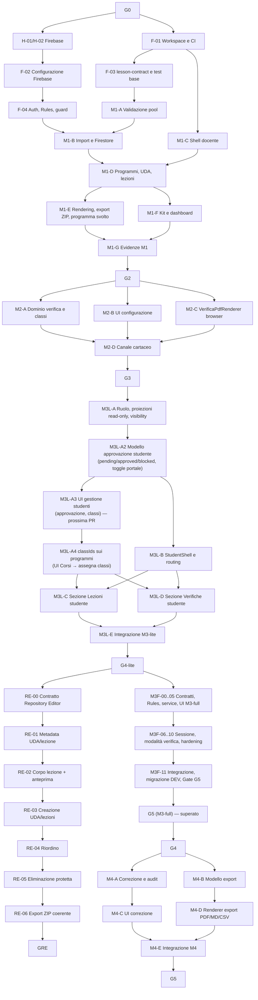

# SchoolForge — Piano di implementazione

**Versione:** 4.1
**Data:** 24 giugno 2026
**Stato:** piano esecutivo per agenti di coding
**Input vincolanti:** `brief.md`, `analisi-requisiti.md`, `architettura.md`, `api-contract.md`
**Regola di precedenza:** requisiti e architettura prevalgono su questo piano in caso di conflitto

---

## 1. Scopo del piano

Il piano trasforma la baseline in pacchetti di lavoro eseguibili da agenti di coding. Ogni pacchetto produce un risultato osservabile, ha un solo responsabile tecnico, dichiara dipendenze e include la verifica necessaria.

### 1.1 Sequenza dei moduli

| Modulo | Capacità rilasciata | Può fermarsi qui? |
|---|---|---|
| M1 — Repository didattico | Programmi, UDA, Markdown/pool, import validato, rendering, export ZIP, programma svolto (PDF + Markdown). | Sì |
| M2 — Verifiche e cartaceo | Configurazione, classi, selezione da pool, PDF browser, download docente, canale cartaceo fisico senza record (al più `downloadCount`). | Sì |
| M3-lite — Portale studente (Google, read-only) | Login Google, risoluzione ruolo docente/studente, StudentShell con Lezioni e Verifiche in sola lettura, download PDF studente per verifiche `attiva`+`public`. Nessuna Cloud Function. | Sì |
| RE — Repository Editor | Editor minimale per creare, modificare, eliminare e riordinare UDA/lezioni, inclusi front matter e corpo Markdown. Nessuna AI, nessuna Cloud Function. | Sì |
| QE — Question Editor | Editor pool domande Markdown-first (`.pool.md`): crea/modifica/elimina domande dal portale, aggiorna `questionIndex` su Firestore senza reimport ZIP. Nessuna AI, nessuna Cloud Function. Specifica in `question-editor-roadmap.md`. | Sì |
| M3-full — Verifiche online e consegne studenti ✅ | Avvio online, salvataggio bozza, consegna immutabile, codice consegna, modalità verifica (deterrenza leggera), monitor consegne docente. Nessuna Cloud Function. Completato — Gate G5 superato, vedi `m3-full-roadmap.md` e `documentazione/evidenze/g5-m3-full-checklist-finale.md`. | Sì |
| M4 — Correzione ed export | Punteggi, percentuali, rettifiche, eliminazione e `Esporta verifiche` in PDF/Markdown/CSV. Dipende da M3-full. | Sì |

**M5 — Correzione AI** è fuori scope V1 ed è pianificato per la V2. Vedi la sezione "V2 — Roadmap futura" in fondo. M5 non fa parte del perimetro né delle dipendenze della V1.

Il Modulo 3 (Portale digitale) è diviso in **M3-lite** e **M3-full**, entrambi completati; Gate G5 superato per M3-full. Dopo M3-lite sono stati completati **RE — Repository Editor** (RE-00 → RE-07) e **QE — Question Editor** (QE-00 → QE-05). Il prossimo modulo dipendente da M3-full è **M4 — Correzione ed export**, non ancora implementato.

---

## 2. Ruoli, autorità e azioni umane

| Ruolo | Responsabilità |
|---|---|
| Docente / owner | Proprietario Firebase, billing, backup, restore e decisioni C-02/C-03. Approva i gate. |
| Agente di coding | Implementa il pacchetto assegnato, esegue test, aggiorna documentazione strettamente collegata. |
| Revisore tecnico | Verifica DoD, confini del pacchetto, test, sicurezza e coerenza con la baseline. |

### 2.1 Attività che richiedono il Docente

| ID | Azione umana | Quando | Un agente può farla? |
|---|---|---|---|
| H-01 | Creare progetti Firebase `dev` e `prod`, attivare billing Blaze, mantenere la proprietà. | Prima del provisioning reale. | Solo dopo accesso CLI autorizzato e approvazione esplicita. |
| H-02 | Creare Firestore e bucket nella regione Milano `europe-west8`. | Prima del primo deploy dati. | Può eseguire la configurazione tecnica se H-01 è completata. |
| H-03 | Configurare budget e avvisi di spesa; verificare l'export Firestore manuale dalle impostazioni. | Prima di dati reali, gate G1. | Può assistere con accesso autorizzato; il Docente verifica l'esito. |
| H-04 | Scegliere il formato iniziale di `Esporta verifiche`: PDF, Markdown o CSV come default. | Prima del pacchetto M4-D. | Il renderer è implementabile dall'agente dopo la scelta. |
| H-05 (V2) | Confermare provider AI e modello (C-02 risolta: OpenAI `gpt-4o-mini` o Anthropic Claude `claude-haiku-4-5-20251001`) e condizioni d'uso. | V2, prima di M5-A. | No, è C-02. |
| H-06 (V2) | Decidere regola didattica della correzione automatica. | V2, prima di M5-D. | No, è C-03. |

---

## 3. Regole del workflow per agenti

### 3.1 Definition of Ready (DoR)

Un pacchetto può partire solo se:

1. le sue dipendenze sono `completate` e le evidenze sono disponibili;
2. eventuali gate umani applicabili sono approvati;
3. input, file modificabili e criteri di accettazione sono dichiarati;
4. non esiste un altro pacchetto attivo sugli stessi file;
5. l'agente può eseguire verifiche senza dati reali o segreti di produzione.

### 3.2 Workflow obbligatorio

1. Leggere brief, requisiti, architettura, api-contract e questo piano.
2. Verificare il DoR e dichiarare subito un blocco reale.
3. Implementare solo lo scope assegnato.
4. Eseguire i test dichiarati e aggiungere test per regressioni introdotte.
5. Confrontare il diff con i vincoli: no account studente custom, no email, no PDF persistenti, no AI in V1 (M5 è V2), no ampliamento LMS, nessuna Cloud Function in M3-lite o nella specifica M3-full corrente; eventuali Cloud Functions fuori M5 richiedono nuova decisione esplicita.
6. Consegnare handoff con file, test, evidenze, rischi e dipendenze sbloccate.

### 3.3 Definition of Done (DoD)

Un pacchetto è `completato` solo se:

- funziona nel percorso previsto e gestisce il fallimento principale;
- typecheck, lint, test unitari e test di integrazione sono verdi;
- non introduce segreti, dati reali o scritture client dirette a percorsi Firestore proibiti;
- documentazione, tipi e test interessati sono aggiornati;
- il revisore verifica il diff e il criterio di accettazione;
- il branch è integrabile senza modifiche non correlate.

### 3.4 Regole di dimensionamento

Un pacchetto è abbastanza piccolo da essere verificato in una review e abbastanza completo da produrre una capacità riconoscibile. Non si combinano backend, UI, migrazioni e deploy in un singolo pacchetto senza motivazione.

### 3.5 Workflow Git

`main` contiene solo lavoro revisionato. Ogni pacchetto usa `feat/<id>-<slug>` o `fix/<id>-<slug>`. Il merge richiede pipeline verde e review. Il deploy `prod` richiede gate del modulo e azione manuale del Docente.

---

## 4. Gate e stato del delivery

| Gate | Condizione di ingresso | Evidenza richiesta | Autorizza |
|---|---|---|---|
| G0 — Baseline | Brief, requisiti, architettura e piano coerenti. | Review documentale e C-01 formalizzata. | Bootstrap del repository. |
| G1 — Fondazioni Firebase | H-01/H-02/H-03 completate; CI ed Emulator Suite disponibili. | Progetti separati, budget, export Firestore manuale disponibile, Security Rules default-deny. | M1 con dati sintetici. |
| G2 — Repository didattico | M1 integrato. | Import valido/invalido, rendering senza pool, ZIP e programma svolto. | M2. |
| G3 — Verifiche e cartaceo | M2 integrato. | PDF browser, canale cartaceo senza record di tentativo né accessLog (al più `downloadCount`), nessun PDF persistito. | M3-lite. |
| G4-lite — Portale studente (M3-lite) | M3-lite integrato. | Login Google risolve TeacherShell/StudentShell; un Google-autenticato non-owner scopre lezioni pubblicate e verifiche `attiva`+`public` solo se `students/{uid}.status == "approved"` e `settings/studentAccess.studentPortalEnabled == true` (mai per la sola autenticazione); PDF studente senza soluzioni; nessuna Cloud Function introdotta. | RE, M3-full (completato), o uso operativo stabile. |
| GRE — Repository Editor | RE integrato. | Il docente crea/modifica/elimina/riordina UDA e lezioni, modifica front matter e corpo Markdown, vede anteprima, export ZIP resta portabile, publicLessons resta coerente, eliminazioni bloccate se ci sono verifiche collegate. | QE, M3-full, polish ulteriore o uso operativo stabile. |
| GQE — Question Editor | QE integrato (QE-01→QE-05). | Il docente crea/modifica/elimina domande nel pool, `questionIndex` aggiornato atomicamente, picker verifiche riflette le modifiche, export ZIP include il pool aggiornato, nessuna regressione sui pool esistenti. | M3-full, polish ulteriore o uso operativo stabile. |
| G5 — Portale digitale (M3-full) ✅ | G4-lite e GRE superati; M3-full integrato. | Flusso avvio→bozza→consegna; immutabilità post-consegna; unicità submission; verifica chiusa blocca bozze; monitor docente real-time; modalità verifica attiva. **Superato** — vedi gate G5 in `m3-full-roadmap.md §8` e checklist finale in `documentazione/evidenze/g5-m3-full-checklist-finale.md`. | M4. |
| G6 — Correzione ed export | M4 integrato, G5 (M3-full) superato e H-04 completata. | Punteggi, rettifiche, eliminazione, export PDF/Markdown/CSV da snapshot. | Uso manuale completo — fine V1. |
| G6 — AI assistita (V2) | M5-A..C integrati e H-05 completata. | Contesto chiuso, audit, proposte assistite per risposta, approvazione massiva. | AI assistita. |
| G7 — AI automatica (V2) | G6 e H-06 completati. | Opt-in per verifica, audit e rollback. | Correzione automatica. |

C-02 e C-03 riguardano la V2 e non bloccano M1–M4. M3-full è completato (Gate G5 superato); M4 (Correzione ed export) può quindi essere pianificato. Il progetto resta comunque in grado di fermarsi a ogni gate superato mantenendo un prodotto utile.

---

## 5. Dipendenze e parallelismo

```mermaid
flowchart TD
    G0 --> F1["F-01 Workspace e CI"]
    G0 --> H1["H-01/H-02 Firebase"]
    H1 --> F2["F-02 Configurazione Firebase"]
    F1 --> F3["F-03 lesson-contract e test base"]
    F2 --> F4["F-04 Auth, Rules, guard"]
    F3 --> M1A["M1-A Validazione pool"]
    F4 --> M1B["M1-B Import e Firestore"]
    M1A --> M1B
    F1 --> M1C["M1-C Shell docente"]
    M1B --> M1D["M1-D Programmi, UDA, lezioni"]
    M1C --> M1D
    M1D --> M1E["M1-E Rendering, export ZIP, programma svolto"]
    M1D --> M1F["M1-F Kit e dashboard"]
    M1E --> M1G["M1-G Evidenze M1"]
    M1F --> M1G
    M1G --> G2
    G2 --> M2A["M2-A Dominio verifica e classi"]
    G2 --> M2B["M2-B UI configurazione"]
    G2 --> M2C["M2-C VerificaPdfRenderer browser"]
    M2A --> M2D["M2-D Canale cartaceo"]
    M2B --> M2D
    M2C --> M2D
    M2D --> G3
    G3 --> M3LA["M3L-A Ruolo, proiezioni read-only, visibility"]
    M3LA --> M3LA2["M3L-A2 Modello approvazione studente\n(pending/approved/blocked, toggle portale)"]
    M3LA2 --> M3LA3["M3L-A3 UI gestione studenti\n(approvazione, classi) — prossima PR"]
    M3LA2 --> M3LB["M3L-B StudentShell e routing"]
    M3LA3 --> M3LA4["M3L-A4 classIds sui programmi\n(UI Corsi → assegna classi)"]
    M3LA4 --> M3LC["M3L-C Sezione Lezioni studente"]
    M3LB --> M3LC
    M3LA4 --> M3LD["M3L-D Sezione Verifiche studente"]
    M3LB --> M3LD
    M3LC --> M3LE["M3L-E Integrazione M3-lite"]
    M3LD --> M3LE
    M3LE --> G4LITE["G4-lite"]
    G4LITE --> RE0["RE-00 Contratto Repository Editor"]
    RE0 --> RE1["RE-01 Metadata UDA/lezione"]
    RE1 --> RE2["RE-02 Corpo lezione + anteprima"]
    RE2 --> RE3["RE-03 Creazione UDA/lezioni"]
    RE3 --> RE4["RE-04 Riordino"]
    RE4 --> RE5["RE-05 Eliminazione protetta"]
    RE5 --> RE6["RE-06 Export ZIP coerente"]
    RE6 --> REG["GRE"]
    G4LITE --> M3FA["M3F-00..05 Contratti, Rules, service, UI M3-full"]
    M3FA --> M3FB["M3F-06..10 Sessione, modalità verifica, hardening"]
    M3FB --> M3FD["M3F-11 Integrazione, migrazione DEV, Gate G5"]
    M3FD --> G5FULL["G5 (M3-full) — superato"]
    G5FULL --> G4
    G4 --> M4A["M4-A Correzione e audit"]
    G4 --> M4B["M4-B Modello export"]
    M4A --> M4C["M4-C UI correzione"]
    M4B --> M4D["M4-D Renderer export PDF/MD/CSV"]
    M4C --> M4E["M4-E Integrazione M4"]
    M4D --> M4E
    M4E --> G5
```

I rami paralleli possono partire insieme solo dopo aver fissato i contratti TypeScript. Due agenti non modificano contemporaneamente lo stesso file di Security Rules, tipi condivisi o struttura Firestore.

---

## 6. Pacchetti preparatori

| ID | Outcome e scope | Dipende da | Parallelo | Evidenza DoD |
|---|---|---|---|---|
| F-01 | Monorepo TypeScript: workspace, build, lint, test, formattazione, convenzioni branch e CI senza deploy. | G0 | H-01/H-02 | Pipeline esegue build, lint, unit test su fixture. |
| F-02 | Configurare Firebase `dev`/`test`, CLI, Emulator Suite, variabili non segrete. Non creare risorse `prod` senza H-01/H-02. | H-01/H-02 | F-01 | Emulatori avviabili e configurazioni separate. |
| F-03 | Package `lesson-contract`: tipi dominio, parser pool v1, fixture e test contratto. | F-01 | F-02 | Parser accetta/rifiuta i casi di `analisi-requisiti.md`. |
| F-04 | Firebase Auth docente, `ownerUid` nelle Security Rules, Security Rules default-deny, audit base. | F-01/F-02 | F-03 | Owner autorizzato; soggetto diverso rifiutato da test Emulator. |

---

## 7. M1 — Repository didattico

| ID | Outcome e scope | Dipende da | Parallelo | Evidenza DoD |
|---|---|---|---|---|
| M1-A | Validazione client-side di UDA, lezioni e pool con `lesson-contract`; errori strutturati file/domanda/campo. | F-03/F-04 | M1-C | Pool invalido non invalida la lezione; fixture complete. |
| M1-B | Import isolato su Cloud Storage e Firestore (Security Rules), commit `activeImportId`, indice per import e cleanup. | M1-A/F-04 | M1-C | Import valido visibile; fallimento non altera il Programma corrente. |
| M1-C | Shell docente: sessione Auth, layout responsive, tema chiaro/scuro, errori e conferme comuni. | F-01/F-04 | M1-A/M1-B | Owner accede; non-owner non entra; test accessibilità base. |
| M1-D | CRUD Programmi/UDA/Lezioni, navigazione struttura didattica, flag "svolto" per programma svolto. | M1-B/M1-C | — | Struttura navigabile e operazioni auditabili. |
| M1-E | Rendering Markdown sanitizzato, asset, esclusione pool; export ZIP; programma svolto in PDF e Markdown generati nel browser. | M1-D | — | ZIP portabile, rendering senza soluzioni, programma svolto corretto in entrambi i formati. |
| M1-F | Kit template Programma/UDA/Lezione/Pool e dashboard di prontezza, senza editor o generazione contenuti. | M1-D | M1-E | Template conforme e dashboard con validità, pool assente/invalido e domande eleggibili. |
| M1-G | Test E2E M1, review sicurezza import, evidenze G2. | M1-E/M1-F | — | G2 approvabile. |

---

## 8. M2 — Verifiche e canale cartaceo

| ID | Outcome e scope | Dipende da | Parallelo | Evidenza DoD |
|---|---|---|---|---|
| M2-A | Dominio verifica: stati, bozza modificabile, `publishedSnapshot` immutabile all'attivazione, classi, minimi e varianti. Transazioni Firestore client-side per attivazione/chiusura. | G2 | M2-B/M2-C | Attivazione invalida rifiutata; configurazione attiva immutabile; classi persistite. |
| M2-B | UI docente: crea/modifica/attiva verifiche, gestione classi nelle impostazioni, messaggi di blocco comprensibili. | G2, contratto M2-A | M2-A/M2-C | Il docente non può superare vincoli da UI. |
| M2-C | `VerificaPdfRenderer` browser unico (`mode="teacher" \| "student"`) con `@react-pdf/renderer`: PDF docente (intestazione vuota) e PDF studente (dati precompilati, soluzioni nascoste). | G2 | M2-A/M2-B | PDF conforme ai campi del brief; mode student senza soluzioni; nessun file in Storage. |
| M2-D | Canale cartaceo: link pubblico, PDF dal `publishedProjection` nel browser e download diretto, solo variante `tutte_uguali`. Nessun record di tentativo né accessLog; al più incremento atomico di `downloadCount`. | M2-A/M2-B/M2-C | — | Nessun record di tentativo o accesso creato; nessun lock; nessun PDF persistito. |
| M2-E | Test integrazione/E2E M2, evidenze G3. | M2-D | — | PDF browser verificato; canale cartaceo senza record. |

---

## 9. M3-lite — Portale studente (Google, read-only)

| ID | Outcome e scope | Dipende da | Parallelo | Evidenza DoD |
|---|---|---|---|---|
| M3L-A | Modello dati e Security Rules: campo `visibility` su `verifications`, proiezione `publicLessons` scritta nello stesso flusso di import, documento `settings/ownerPublic` per il routing. Nessuna Cloud Function. | G3 | — | Owner mantiene accesso completo; test Emulator sulle regole owner/proiezioni. Nota: la prima versione trattava "Google autenticato non-owner" come sufficiente per leggere le proiezioni; corretto in M3L-A2. |
| M3L-A2 | Modello di approvazione studente: `settings/studentAccess` (`studentPortalEnabled`, `newStudentRequestsEnabled`), `students/{uid}` (`status: pending/approved/blocked`, `classId`), Security Rules Firestore che negano ogni discovery studente finché non è `approved` + portale attivo. Nessuna Cloud Function. Storage non ripete il gate Firestore e serve solo Markdown autenticati su path già scoperti. | M3L-A | — | Google non-owner senza `students/{uid}`, `pending` o `blocked` non scopre `publicLessons`/`publishedProjection`; `approved` scopre contenuti solo se `studentPortalEnabled == true`; owner non impattato; test Emulator per ogni combinazione. |
| M3L-A3 | UI docente di gestione studenti: creare/approvare/bloccare `students/{uid}`, assegnare `classId`. | M3L-A2 | — | Il docente approva uno studente dall'interfaccia senza scrivere Firestore a mano; audit dell'approvazione. |
| M3L-A4 | `classIds` sui programmi (`programs/{id}.classIds: string[]`) e UI Corsi per assegnare un programma a zero, una o più classi. Le UDA e lezioni ereditano la visibilità dal programma (nessun campo classi proprio). | M3L-A3 | — | Programmi legacy senza `classIds` normalizzati a `[]` in lettura (nessuna migrazione distruttiva); `setProgramClassIds` deduplica; un programma senza classi non è visibile a nessuno studente; Security Rules invariate (owner-write già sufficiente). |
| M3L-B | StudentShell: routing `/student/*`, login Google, risoluzione ruolo (`uid == ownerUid` → TeacherShell, altrimenti StudentShell), layout mobile-first. | M3L-A2 | M3L-C/M3L-D | Docente va a TeacherShell; utente Google non-owner va a StudentShell (il routing del ruolo non richiede l'approvazione: solo le letture di contenuto la richiedono); nessun accesso anonimo. |
| M3L-C | Sezione Lezioni studente: elenco ad albero Programma→UDA→Lezioni e rendering read-only da `publicLessons`, filtrato per `classId` dello studente, riuso del renderer Markdown sanitizzato del docente. | M3L-B, M3L-A4 | M3L-D | Lo studente approvato vede le lezioni pubblicate dei soli programmi la cui `classIds` include la propria classe; nessun pool, soluzione, percorso tecnico o `questionIndex` raggiungibile; uno studente non approvato, senza classe, o con classe incompatibile non vede nulla; Security Rules estese con lettura studente su `programs`/`publicLessons` gated per classe. |
| M3L-D | Sezione Verifiche studente: elenco filtrato `active`+`public`+classe compatibile via `collectionGroup` su `publishedProjection`, azione "Scarica PDF" con `downloadStudentPdfFromProjection` (riuso del layout esistente). | M3L-B, M3L-A4, M3L-C | M3L-C | Solo verifiche `active`+`public` con `classId` coincidente sono visibili a uno studente approvato; una verifica senza `classId` non è mai visibile; nessuna consegna o risposta online; PDF senza soluzioni; Security Rules estese con `classId`/`visibility` duplicati sulla proiezione (necessario per la validazione della `collectionGroup` `list`, non solo comodità). |
| M3L-E light | Verifica minima di integrazione M3-lite: audit dei test già esistenti (StudentShell, StudentLessonsView/service, StudentVerificationsView/service, RoleGate, rules `m3l-*`) contro la checklist G4-lite, chiusura dell'unico gap trovato (StudentShell non esercitava mai il ramo dati reali di `loadStudentLessons`/`loadStudentVerifications`), checklist manuale G4-lite. Nessuna Cloud Function, nessuna feature nuova, nessun E2E Playwright. | M3L-C/M3L-D | — | Checklist G4-lite in `documentazione/evidenze/`; 2 test di integrazione aggiunti a `StudentShell.test.tsx`; nessuna soluzione o dato tecnico ottenibile dal client studente; nessuna lettura concessa a uno studente non approvato. E2E Playwright e review di sicurezza estesa restano fuori scope (M3L-E completo, se servirà). |

---

## 10. RE — Repository Editor

> Fase prodotto completata dopo M3-lite (RE-00 → RE-07, tutte implementate e mergiate su `main`). Non sostituisce M3-full e non anticipa correzione o AI: estende il Modulo 1 rendendo modificabile da portale il repository didattico già importato. La roadmap dettagliata è in `repository-editor-roadmap.md`; la checklist manuale DEV di RE-07 è in `documentazione/evidenze/repository-editor-checklist-manuale.md`.

| ID | Outcome e scope | Dipende da | Parallelo | Evidenza DoD |
|---|---|---|---|---|
| RE-00 | Contratto Repository Editor: tipi, campi `order`, metadata modificabili, responsabilità di aggiornamento Storage/Firestore/`publicLessons`, regole di blocco eliminazione. Nessuna UI completa. | G4-lite | — | Contratti aggiornati; test minimi se cambia codice; piano RE-01 chiaro. |
| RE-01 | Editor metadata UDA/lezione: modifica front matter UDA e lezione senza ancora editare il corpo Markdown. | RE-00 | — | Metadata persistiti e mostrati correttamente in docente/studente dove applicabile. |
| RE-02 | Editor corpo lezione con anteprima Markdown sanitizzata. | RE-01 | — | Storage aggiornato; rendering docente e studente leggono il nuovo contenuto; errore salvataggio gestito. |
| RE-03 | Creazione UDA e lezioni da UI, con front matter minimo valido e filename tecnico stabile generato automaticamente. | RE-02 | — | Nuove UDA/lezioni visibili nel docente; se il programma è assegnato a classi, `publicLessons` è coerente. |
| RE-04 | Riordino UDA e lezioni tramite `order`, senza rinominare file solo per cambiare ordine. | RE-03 | — | Ordine persistito, stabile su refresh, mobile-friendly. |
| RE-05 | Eliminazione protetta di UDA/lezioni. Blocca se esistono verifiche collegate; mostra elenco verifiche bloccanti. | RE-04 | — | Eliminazione sicura; nessuna verifica resta con riferimenti rotti. |
| RE-06 | Export ZIP coerente con modifiche da editor. | RE-05 | — | ZIP esportato resta Markdown-first e leggibile fuori da SchoolForge. |
| RE-07 | Hardening RE: test integrazione, checklist manuale DEV, aggiornamento documentazione operativa. | RE-06 | — | GRE approvabile; nessuna regressione su import, lezioni studente, verifiche cartacee. |

**RE-00 → RE-07 implementate.** Gate GRE (§4) considerato superato: il docente crea/modifica/elimina/riordina UDA e lezioni, l'eliminazione è bloccata se esistono verifiche collegate, l'export ZIP resta portabile e coerente con l'`order` corrente. Checklist manuale DEV in `documentazione/evidenze/repository-editor-checklist-manuale.md`.

### 10.1 Vincoli RE

- Non implementare editor WYSIWYG avanzato.
- Non implementare editor pool nella prima iterazione.
- Non introdurre AI o Cloud Functions.
- Non usare rinomina file come meccanismo primario di ordinamento.
- Non eliminare UDA/lezioni se esistono verifiche collegate.
- Mantenere export ZIP e Markdown portabili.

---

## 10b. QE — Question Editor (QE-00 → QE-05 completati)

> Fase prodotto successiva a RE, specifica completa in `question-editor-roadmap.md`. Rende editabili i pool domande dal portale senza reimport ZIP. Non dipende da M3-full e non introduce Cloud Functions o AI.

| ID | Outcome e scope | Dipende da | Parallelo | Evidenza DoD |
|---|---|---|---|---|
| QE-00 | Specifica e roadmap Question Editor: obiettivo, fuori scope, modello dati, formato pool, relazione `questionIndex`/verifiche, UX alto livello, rischi, costi, roadmap QE-01→QE-05. Solo documentazione. | GRE | — | Questo documento. Completato. |
| QE-01 | Serializzatore pool: `poolSerializer.ts` che converte `ParsedPool` → YAML front matter valido da riscrivere nel file `.pool.md`. Test unitari round-trip (parse→serialize→reparse). Nessuna UI, nessuna scrittura Firebase. | QE-00 | — | Round-trip senza perdita per i tre tipi di domanda; formato identico a quello prodotto dall'import. |
| QE-02 | Service layer Domande: `poolEditorService.ts` con `loadPool` (legge `.pool.md` da Storage e parsifica), `savePool` (serialize→upload Storage→update `questionIndex`+`lessons/{id}`), `deletePool`. Guard per conflitti bozze prima di eliminare. Test integrazione con Emulator. | QE-01 | — | Scrittura atomica Storage-poi-Firestore; `questionIndex` coerente; `lessons.poolStatus`/`questionCount` aggiornati; errore distinto su fallimento Firestore post-Storage. |
| QE-03 | UI sezione Domande: voce "Domande" nel menu docente; `DomandeView.tsx` con sidebar Corso→UDA→Lezione (indicatore pool presente/assente + conteggio); pannello lista domande con editMode; form crea/modifica domanda inline; eliminazione domanda/pool con conferma; messaggi blocco per conflitti bozze. | QE-02 | — | Il docente crea/modifica/elimina domande dal portale; studente non impattato; nessuna regressione su lezioni/verifiche. |
| QE-04 | Integrazione picker verifiche e contatori: verifica che `listQuestionIndex` rifletta domande create/modificate dall'editor; contatori `questionCount`/`poolStatus` nella dashboard di prontezza aggiornati; test di regressione pick→activate. | QE-03 | — | Nuova domanda da editor appare nel picker; verifica attiva con vecchio snapshot non è modificata; dashboard prontezza corretta. |
| QE-05 | Hardening QE: test E2E crea domanda→picker→attiva verifica→modifica domanda→verifica attiva invariata→chiudi; checklist manuale DEV; documentazione operativa aggiornata. | QE-04 | — | GQE approvabile; nessuna regressione su import ZIP, lezioni studente, verifiche cartacee/online. |

---

## 11. M3-full — Portale digitale (completato — Gate G5 superato)

> Specifica completa in `m3-full-roadmap.md`. Tutti i pacchetti M3F-00 → M3F-11C sono completati; il Gate G5 è superato (checklist finale in `documentazione/evidenze/g5-m3-full-checklist-finale.md`). Il vecchio modello gateway Cloud Functions descritto nella prima stesura della specifica non è mai stato il perimetro implementato.

| ID | Outcome e scope | Dipende da | Parallelo | Evidenza DoD |
|---|---|---|---|---|
| M3F-00 | Specifica M3-full: modello dati, stati, Security Rules desiderate, UX docente/studente, modalità verifica, gate G5. Solo documentazione. | G4-lite/GRE | — | `m3-full-roadmap.md` approvato. Completato. |
| M3F-01 | Tipi Firestore e indici per `submissions`/`submissionReceipts`, più `onlineEnabled` retrocompatibile. | M3F-00 | — | Typecheck/build verdi; indici JSON presenti. Completato. |
| M3F-02 | Service layer submission client-only: avvio bozza, salvataggio, consegna atomica con receipt, codice consegna. | M3F-01 | — | Test unitari service verdi; nessuna Cloud Function. Completato. |
| M3F-03 | Security Rules per submission/receipt con test Emulator Suite: unicità path deterministico, immutabilità, gate active+onlineEnabled, receipt post-consegna. | M3F-02 | — | Test rules positivi/negativi verdi. Completato. |
| M3F-04 | UI studente OnlineExamView + ConfirmationView + modalità verifica deterrente. | M3F-03 | — | Flusso avvio→bozza→consegna→receipt. Completato. |
| M3F-05 | UI docente: toggle onlineEnabled, pubblicazione online, monitor consegne. | M3F-03 | M3F-04 | Monitor stati/consegne/eventi attenzione. Completato. |
| M3F-06 | Sessione obbligatoria e UX prova: ripresa bozza, shell senza navigazione, navigatore domande, risposta singola cancellabile, uscita fullscreen solo dopo consegna riuscita. | M3F-04/M3F-05 | — | Refresh/login riporta nella prova; nessuna uscita applicativa prima della consegna; test mirati verdi. Completato. |
| M3F-07 | Modalità verifica globale/per classe in Studenti, audit e listener studente. | M3F-06 | M3F-09 | Controllo owner-only; default per classe; blocco globale confermato. Completato — reso effettivo end-to-end da M3F-08. |
| M3F-08 | Proiezione sicura corpo lezioni in `publicLessons`, sincronizzazione import/editor, migrazione e Rules. | M3F-07 | M3F-09 | Una chiamata diretta non legge lezioni durante il blocco; Storage resta canonico; backfill pronto e idempotente (dati DEV **non** migrati in questa PR — rimandato a M3F-11). Completato. |
| M3F-09 | Rifiniture docente: permesso download PDF, monitor sempre visibile sulla verifica selezionata, dettaglio eventi, tabella stabile. | M3F-05 | M3F-07/M3F-08 | Toggle PDF indipendente; un solo listener; popup eventi senza risposte; nessun layout shift. Completato. |
| M3F-10 | Hardening costi e concorrenza: autosave dirty-only introdotto a 60s e poi portato a 120s in M3F-11B; mutex sincrono save/consegna, attesa della write pendente, blocco definitivo dopo `submitted`, audit lifecycle listener/timer. | M3F-06/M3F-09 | — | Nessuna write su bozza invariata o post-consegna; revision guard preservata; consegna fallita riabilita editing/autosave; test race e cleanup verdi. Completato. |
| M3F-11 ✅ | Integrazione, migrazione DEV, smoke manuale del docente, checklist G5. | M3F-06→M3F-10 | — | Gate G5 superato; nessun accesso lezioni durante blocco; checklist finale in `documentazione/evidenze/g5-m3-full-checklist-finale.md`. Completato. |

---

## 12. M4 — Correzione ed export

Il concept UX approvato per accesso dalla tabella **Consegne online**, workspace di correzione, stati e restituzione studente è fissato in [`m4-correzione-ux-concept.md`](m4-correzione-ux-concept.md). La numerazione dei pacchetti segue la stessa convenzione di M3F-00→11C/RE-00→07/QE-00→05 (M4-00 → M4-04), sostituendo la numerazione precedente M4-A→E.

| ID | Outcome e scope | Dipende da | Parallelo | Evidenza DoD |
|---|---|---|---|---|
| M4-00 ✅ | Contratto tecnico minimo della correzione: tipi `CorrectionDoc`/`QuestionEvaluation`/`CorrectionEventDoc`/`CorrectionReturnDoc` (`src/types/firestore.ts`), helper puri di scoring/transizione (`correctionContract.ts`). Nessun service layer, nessuna Security Rule, nessuna UI. | G5 (M3-full, superato) | — | Typecheck/lint/build verdi; test unitari mirati sugli helper verdi; nessuna modifica a Rules/indici/dipendenze. Completato. |
| M4-01 ✅ | Service layer client + Security Rules per `corrections`/`correctionEvents`/`correctionReturns`, test Emulator Suite. Nessuna UI. | M4-00 | — | Vedi scheda dettagliata sotto: transizioni di stato, unicità/immutabilità, letture owner-only e proiezione studente coperte da test Rules positivi/negativi. Completato. |
| M4-02 | UI correzione: apertura dalla tabella **Consegne online** esistente, workspace per domanda, salvataggio esplicito, completa/restituisci/riapri. | M4-01 | — | Correzione manuale completa senza voto elettronico; nessuna regressione sul monitor consegne esistente. |
| M4-03 | Popup `Registro Correzioni` (tabella nome/cognome/punteggio/percentuale/data, export PDF/CSV opzionale) e renderer export `Esporta verifiche` (PDF/Markdown/CSV dal modello canonico). Attende H-04 per il formato di default. | M4-02/H-04 | — | Registro consultabile ed esportabile; export contiene tutte e sole le consegne definitive richieste; nessuna persistenza. |
| M4-04 | Integrazione M4, test E2E correzione/export, evidenze gate G6. | M4-02/M4-03 | — | Ciclo digitale manuale completo. |

#### M4-00 — Contratto tecnico minimo della correzione (Completato)

| Campo | Valore |
|---|---|
| Prerequisiti | G5 (M3-full, superato) |
| File creati | `apps/web/src/features/repository/corrections/correctionContract.ts` (helper puri: `isValidQuestionPoints`/`assertValidQuestionPoints`, `isQuestionEvaluated`/`isCorrectionComplete`, `computeCorrectionTotals`, `isValidCorrectionStatusTransition`/`assertValidCorrectionStatusTransition`, `deriveCorrectionUiStatus`, `isReopenedCorrection`, `computeQuestionEvaluationDeltas`, `computeGeneralFeedbackDelta`), `apps/web/src/features/repository/corrections/__tests__/correctionContract.test.ts` |
| File modificati | `apps/web/src/types/firestore.ts` (`CorrectionStatus`, `QuestionEvaluation`, `CorrectionDoc`, `QuestionEvaluationDelta`, `CorrectionEventType`, `CorrectionEventDoc`, `CorrectionReturnQuestionView`, `CorrectionReturnDoc`), `documentazione/m4-correzione-ux-concept.md`, `documentazione/api-contract.md`, `documentazione/architettura.md`, `documentazione/sicurezza.md` |
| Decisioni formalizzate | Path deterministico `corrections/{submissionId}` (== id di `submissions`); nessuna copia di `answers`/`teacherSnapshot`/`publishedProjection` dentro `corrections`; `maxPoints` per domanda congelato da `publishedProjection.questions[order]` alla creazione (mai da `teacherSnapshot.questions`, assente sulle verifiche legacy pre-SEC-02); range punteggio `[0, maxPoints]` con `maxPoints` anch'esso validato (finito, non negativo) e rifiuto esplicito fuori range; percentuale `round(totalPoints/maxPoints*100)`, `null` solo se `maxPoints == 0`; completezza = mappa non vuota **e** ogni domanda con `points !== null`; transizioni ammesse `in_progress→completed`, `completed→returned`, `completed→in_progress`, `returned→in_progress`; nessuna transizione diretta `returned→completed` né `in_progress→returned`; "Da correggere" derivato lato UI dall'assenza del documento, mai un documento placeholder; `reopenCount` su `CorrectionDoc` (0 alla creazione, incrementato a ogni riapertura, mai azzerato) come unico segnale persistente che distingue il primo giro di compilazione (nessun evento su salvataggio) da un salvataggio dopo riapertura (evento `scoreAdjusted` con delta minimale se qualcosa è cambiato); `correctionEvents` senza il tipo `'hidden'` (comportamento non formalizzato, rimandato a M4-01); `correctionReturns` ridefinito come proiezione **autosufficiente** (testo/opzioni/risposta consegnata copiati, non un riferimento a `submissions`/`publishedProjection` che potrebbero non essere più leggibili), con `points` sempre `number` (mai `null`) per domanda e due toggle indipendenti `visibleToStudent`/`solutionsVisible` che appartengono alla singola restituzione, non a `VerificationDoc`. |
| Test minimi | Helper `correctionContract.ts` (23 test): range punteggio (incl. NaN/Infinity/decimali, `maxPoints` negativo/NaN/Infinity), completezza (incl. `0` vs `null`, mappa vuota → non completa), somma/arrotondamento percentuale (incl. `maxPoints` 0, arrotondamenti non esatti), transizioni valide/non valide, derivazione stato UI senza documento, `isReopenedCorrection` alla soglia, `computeQuestionEvaluationDeltas` (nessun delta se invariato, solo domande cambiate, domanda assente dallo snapshot precedente trattata come non valutata, mai l'oggetto valutazione completo), `computeGeneralFeedbackDelta` (invariato vs cambiato). |
| Evidenza richiesta | `pnpm format:check`, `pnpm lint`, `pnpm typecheck`, test mirati (`correctionContract.test.ts`), `pnpm build` verdi. Nessun `pnpm test:rules` (Rules non modificate). Nessun deploy. |

#### M4-01 — Service layer e Security Rules correzione (Completato)

| Campo | Valore |
|---|---|
| Prerequisiti | M4-00 |
| File creati | `apps/web/src/features/repository/corrections/correctionsService.ts` (`openOrLoadCorrection`, `saveCorrection`, `completeCorrection`, `returnCorrection`, `reopenCorrection`, `setReturnVisibleToStudent`, `setSolutionsVisible`), `apps/web/src/features/repository/corrections/correctionReturnSize.ts` (limite dimensionale conservativo), `apps/web/src/features/repository/corrections/__tests__/correctionsService.test.ts` (30 test), `apps/web/src/rules/m4-01-corrections.rules.test.ts` (test Emulator dedicati) |
| File modificati | `firestore.rules` (helper `submissionData`/`correctionData`/`isValidCorrectionTransition`, blocchi `corrections`/`correctionEvents`/`correctionReturns`), `apps/web/src/types/firestore.ts` (`CorrectionReturnDoc.updatedAt`, bookkeeping tecnico non UX), `documentazione/piano-implementazione.md`, `documentazione/api-contract.md`, `documentazione/sicurezza.md` |
| Scope service layer | `openOrLoadCorrection(submissionId, ownerUid, db)`: legge `corrections/{submissionId}`; se presente lo restituisce senza riscriverlo; se assente valida la submission (`status == 'submitted'`, `ownerUid` combaciante) e crea la correction dentro un `runTransaction` che ri-verifica l'esistenza (idempotente/resistente a due aperture ravvicinate), con `evaluations` inizializzate da `publishedProjection.questions` (`order`, `maxPoints`, `points: null`) e `reopenCount: 0`. `saveCorrection(...)`: rifiuta un set di domande diverso da quello congelato, valida ogni punteggio con `assertValidQuestionPoints`, non scrive nulla se il salvataggio è identico allo stato corrente; a `reopenCount === 0` una sola `updateDoc` senza evento; a `reopenCount > 0` un `writeBatch` con update + evento `scoreAdjusted` (delta minimale) solo se qualcosa è davvero cambiato. `completeCorrection(...)`: richiede `isCorrectionComplete`. `returnCorrection(...)`: costruisce `correctionReturns` autosufficiente da submission+publishedProjection+correction (mai la submission riscritta), verifica il limite dimensionale, scrive update+projection+evento `returned` in un solo `writeBatch`. `reopenCorrection(...)`: incrementa `reopenCount` di 1, azzera i timestamp, se proveniva da `returned` nasconde `correctionReturns` (`visibleToStudent: false`) nello stesso batch dell'evento `reopened`. `setReturnVisibleToStudent`/`setSolutionsVisible`: no-op se il valore richiesto è già quello attuale; `setSolutionsVisible(true)` legge `teacherSnapshot.questions` (mai il pool corrente) e rifiuta esplicitamente su verifiche legacy senza snapshot soluzioni; `setSolutionsVisible(false)` rimuove fisicamente `correctAnswer` da ogni domanda. |
| Limite dimensionale | `CORRECTION_RETURN_MAX_BYTES = 700_000` byte (`correctionReturnSize.ts`), stessa soglia/margine di `TEACHER_SNAPSHOT_QUESTIONS_MAX_BYTES` — verificato prima della scrittura in `returnCorrection` e di nuovo in `setSolutionsVisible(true)`; nessun troncamento automatico, errore esplicito. |
| Scope Security Rules | `corrections`: create solo owner su submission `submitted` propria, identità pinnata, stato iniziale fisso; update con identità/`createdAt` immutabili, solo transizioni della matrice `isValidCorrectionTransition`, `reopenCount` incrementato di esattamente 1 solo sulla transizione verso `in_progress`; nessuna delete. `correctionEvents`: create solo owner collegata a una correction propria esistente, tipo in `['reopened','scoreAdjusted','returned']`; sola lettura/creazione, mai update/delete. `correctionReturns`: create/update solo owner con identità pinnata a una correction propria; lettura owner sempre, lettura studente solo propria e solo se `visibleToStudent == true`; nessuna delete. Confine esplicito (documentato nel codice): le Rules validano ownership, identità, forma di primo livello e la matrice di transizione — mai il contenuto dettagliato di `evaluations`/`questionDeltas` (range punteggi, coerenza dei delta), che resta responsabilità del service owner-only (`correctionContract.ts`), come già avviene altrove in questo codebase per `teacherSnapshot`/`config`. |
| Test minimi | Service (30 test): creazione idempotente; submission assente/non `submitted`/altro owner rifiutata; inizializzazione da snapshot congelato; save con calcolo corretto; punteggio invalido e set domande incoerente rifiutati; save identico senza scrittura; primo ciclo senza evento; save post-riapertura con delta minimale ed evento atomico; complete su mappa incompleta/vuota rifiutata; return atomica senza soluzioni; reopen incrementa di 1 e nasconde la proiezione; `setSolutionsVisible` true inserisce/false rimuove fisicamente; limite dimensionale. Rules (`m4-01-corrections.rules.test.ts`): casi owner positivi su create/update/read per le tre collezioni; isolamento tra owner diversi; studente mai lettore/scrittore di `corrections`/`correctionEvents`; append-only (`correctionEvents` mai aggiornabile/eliminabile); transizioni invalide negate (`returned→completed`, `in_progress→returned`, incrementi di `reopenCount` errati); identità immutabili; studente legge solo la propria `correctionReturns` quando `visibleToStudent == true` (negata quando `false` o di un altro studente); nessuna delete in nessuna delle tre collezioni. |
| Evidenza richiesta | `pnpm format:check`, `pnpm lint`, `pnpm typecheck`, test service mirati (30/30), `pnpm test:rules` completo verde (12 file, 352 test totali incluso il nuovo `m4-01-corrections.rules.test.ts` — eseguito perché `firestore.rules` è stato modificato), `pnpm build` verdi. Nessun deploy. |
| Esplicitamente fuori scope M4-01 | UI (M4-02); Registro Correzioni ed export (M4-03); eliminazione submission/correzione; voto elettronico; AI; azioni batch su più correzioni (`visibleToStudent`/`solutionsVisible` restano per-studente). |

**Fix post-review (stessa PR)**: la review ha trovato che `setReturnVisibleToStudent`/`setSolutionsVisible` controllavano solo l'esistenza di `correctionReturns`, non lo stato canonico della correction — dopo una riapertura (`reopenCorrection` nasconde la proiezione ma non la elimina) i due toggle potevano riportarla visibile o farla crescere con le soluzioni mentre una rettifica era in corso. Corretto:
- **Service**: entrambi i toggle ora leggono anche `corrections/{submissionId}` e procedono solo se `status == 'returned'`; correction assente o in altro stato → errore leggibile, nessuna scrittura (`assertCorrectionCurrentlyReturned`).
- **Rules**: nuovo helper `correctionDataAfter(submissionId)` (`getAfter()`). Create/update di `correctionReturns` richiede `correctionDataAfter(submissionId).status == 'returned'`, con un'unica eccezione strettamente delimitata per l'hide atomico di `reopenCorrection` (transizione `returned → in_progress` nello stesso batch, e la scrittura su `correctionReturns` tocca solo `visibleToStudent`+`updatedAt`, con `visibleToStudent == false`). Questo continua a consentire `returnCorrection()` (correction e proiezione aggiornate nello stesso batch) e nega ogni altro update mentre la correction è `in_progress`/`completed`.
- **Integrità minima eventi**: `correctionEvents` ora richiede `timestamp == request.time` e una combinazione coerente `type`/`previousStatus`/`nextStatus` (`reopened`: completed|returned→in_progress; `returned`: completed→returned; `scoreAdjusted`: in_progress→in_progress), con `nextStatus` verificato contro `correctionDataAfter(correctionId).status` — senza validare in profondità `questionDeltas`.
- Test aggiunti: 6 test service (toggle negati dopo riapertura/su `completed`, nessuna scrittura), 21 test Rules (`m4-01-corrections.rules.test.ts` ora 68 test totali) su batch di return/reopen-hide atomici, update stale negati, timestamp arbitrario negato, combinazioni type/status incoerenti negate. `pnpm test:rules` completo: 12 file, 366 test.

---

> **M5 — Correzione AI** è spostato interamente alla V2. I pacchetti M5-A..E non fanno parte della V1: sono dettagliati nella sezione "V2 — Roadmap futura" in fondo a questo documento.

---

## 13. Qualità, CI/CD e costi

### 12.1 Pipeline minima

| Stage | Trigger | Blocca | Contenuto |
|---|---|---|---|
| Verifica | Ogni push/PR | Merge | Format, lint, typecheck, unit test e build. |
| Integrazione | PR verso `main` | Merge | Firebase Emulator Suite: Auth, Firestore, Storage; Functions riservate a M5 (V2) — M3-full (completato) non ne introduce. |
| E2E | Prima dei gate G2–G7 (inclusi G4-lite e G4) | Gate | Browser test sui flussi del modulo e casi negativi. |
| Deploy `dev` | Merge su `main` | — | Deploy controllato senza dati reali. |
| Deploy `prod` | Gate approvato + azione manuale Docente | Go-live | Backup verificato, release notes e smoke test. |

### 12.2 Regole di costo

- Sviluppo e test usano Emulator Suite e fixture sintetiche.
- Nessuna VM, Cloud SQL, container sempre acceso, coda dedicata o servizio enterprise senza decisione documentata.
- M3-lite e la specifica M3-full corrente non introducono Cloud Functions. Qualsiasi Function aggiuntiva fuori M5 deve essere giustificata e approvata con nuova decisione esplicita.
- PDF e documenti generati nel browser, mai su server, in nessun canale.
- Il Docente controlla budget/avvisi prima del primo deploy `prod`.
- In V2, ogni pacchetto che aggiunge una chiamata a provider esterno (AI) dichiara volume atteso e costo variabile.

### 12.3 Regole di rilascio e rollback

1. Le modifiche Firestore devono essere compatibili con la versione applicativa precedente durante il deploy.
2. Le funzionalità incomplete sono invisibili o disabilitate tramite flag server-side.
3. Il rollback del codice non cancella Markdown, snapshot digitali, consegne o audit.
4. Un errore import non scrive su Firestore; un errore di avvio digitale non crea un participant lock parziale.
5. Un incidente dati attiva C-01: fermare le scritture interessate, valutare l'ultimo export Firestore manuale, ripristinare e documentare.

---

## 14. Handoff, dashboard e criteri finali

### 13.1 Handoff obbligatorio

Ogni pacchetto concluso produce:

- ID e risultato conseguito;
- file modificati e confini rispettati;
- comandi di test eseguiti ed esito;
- evidenze per il gate interessato;
- debito tecnico o rischio residuo reale;
- dipendenze sbloccate e prossima azione concreta.

### 13.2 Dashboard di avanzamento

| Campo | Valore |
|---|---|
| Pacchetto | ID e titolo. |
| Stato | `non_avviato`, `in_corso`, `bloccato`, `in_review`, `completato`. |
| Dipendenze | ID e stato; descrivere il blocco effettivo. |
| Branch/PR | Riferimento. |
| Test | Comandi, evidenza e risultato. |
| Gate | Gate coinvolto e decisione umana richiesta. |
| Rischi | Solo rischi nuovi o modificati. |
| Prossima azione | Una singola azione verificabile. |

### 13.3 Criteri di successo

1. Ogni modulo rilascia una capacità usabile senza anticipare AI o scope LMS.
2. Nessun agente lavora su un pacchetto senza DoR o ignora un gate umano.
3. M3-lite rispetta la risoluzione del ruolo (docente vs studente Google), le proiezioni read-only e l'assenza di PDF persistenti; M3-full (completato) rispetta autenticazione Google approvata, unicità/immutabilità della submission e snapshot pubblicato immutabile — nessun lock nome+cognome né log IP, modello superato dalla specifica client-only realizzata (vedi `m3-full-roadmap.md`).
4. `Esporta verifiche` è costruito da tutte le consegne definitive e non dalle lezioni correnti (dipende da M3-full).
5. Test automatici, E2E e review crescono insieme al prodotto.
6. Firebase resta configurato con costo minimo; nessuna Cloud Function aggiuntiva senza approvazione; M3-lite non ne richiede.
7. Il progetto può fermarsi dopo G2, G3, G4-lite, G4, o G5 mantenendo un prodotto utile.

---

## Appendice A — Primo pacchetto da assegnare

Il primo pacchetto assegnabile è **F-01 — Workspace e CI**. Il provisioning Firebase reale non parte finché il Docente non ha completato H-01 e H-02. Dopo F-01, F-02 e F-03 possono avanzare in parallelo; F-04 richiede sia il workspace sia l'ambiente Firebase `dev`.

---

## Appendice B — Schede pacchetti dettagliate

Ogni scheda standardizza prerequisiti, file e verifica. I percorsi seguono il monorepo descritto in `toolchain.md`.

### F-01 — Workspace e CI

| Campo | Valore |
|---|---|
| Prerequisiti | G0 |
| File da creare | `package.json`, `pnpm-workspace.yaml`, `apps/web/`, `packages/lesson-contract/`, `functions/`, config lint/format, workflow CI |
| File da modificare | — |
| Test minimi | Pipeline esegue build, lint, typecheck e unit test su una fixture banale |
| Evidenza richiesta | Log CI verde con i quattro step; albero del workspace |

### F-02 — Configurazione Firebase

| Campo | Valore |
|---|---|
| Prerequisiti | H-01/H-02 |
| File da creare | `firebase.json`, `.firebaserc`, `firestore.indexes.json`, config emulatori |
| File da modificare | `package.json` (script emulatori) |
| Test minimi | Avvio Emulator Suite (Auth/Firestore/Storage/Functions) sulle porte di `toolchain.md` |
| Evidenza richiesta | Output `firebase emulators:start`; alias `dev`/`test` separati |

### F-03 — lesson-contract e test base

| Campo | Valore |
|---|---|
| Prerequisiti | F-01 |
| File da creare | `packages/lesson-contract/src/index.ts`, fixture pool valide/invalide, `*.contract.test.ts` |
| File da modificare | `apps/web/src/contracts/lesson.ts` (riesporta dal package) |
| Test minimi | Il parser accetta/rifiuta i casi di `analisi-requisiti.md` con errori file/domanda/campo |
| Evidenza richiesta | Report Vitest contract; elenco casi coperti |

### F-04 — Auth, Rules, guard

| Campo | Valore |
|---|---|
| Prerequisiti | F-01/F-02 |
| File da creare | `firestore.rules`, `storage.rules`, test Emulator delle regole, guard auth SPA |
| File da modificare | `apps/web/src/lib/firebase.ts` |
| Test minimi | Owner autorizzato; soggetto diverso rifiutato; default-deny |
| Evidenza richiesta | Test Emulator regole verdi; matrice percorsi/ruoli |

### M1 — Repository didattico

#### M1-A — Validazione pool

| Campo | Valore |
|---|---|
| Prerequisiti | F-03/F-04 |
| File da creare | `apps/web/src/features/repository/validate*.ts`, `*.test.ts` |
| File da modificare | `apps/web/src/contracts/lesson.ts` (se servono helper) |
| Test minimi | Pool invalido non invalida la lezione; errori strutturati per file/domanda/campo |
| Evidenza richiesta | Fixture complete e report test |

#### M1-B — Import e Firestore

| Campo | Valore |
|---|---|
| Prerequisiti | M1-A/F-04 |
| File da creare | `apps/web/src/features/repository/import*.ts`, `src/types/firestore.ts` |
| File da modificare | `firestore.rules` (lessons/udas/questionIndex) |
| Test minimi | Import valido visibile; fallimento non lascia contenuti parziali |
| Evidenza richiesta | Test integrazione Emulator import atomico |

#### M1-C — Shell docente

| Campo | Valore |
|---|---|
| Prerequisiti | F-01/F-04 |
| File da creare | `apps/web/src/routes/teacher/`, layout, tema chiaro/scuro |
| File da modificare | router SPA |
| Test minimi | Owner accede; non-owner non entra; accessibilità base |
| Evidenza richiesta | E2E login; check a11y |

#### M1-D — Programmi, UDA, lezioni

| Campo | Valore |
|---|---|
| Prerequisiti | M1-B/M1-C |
| File da creare | feature CRUD struttura, flag "svolto" |
| File da modificare | `src/types/firestore.ts` |
| Test minimi | Struttura navigabile; operazioni auditabili |
| Evidenza richiesta | E2E navigazione; auditEvents prodotti |

#### M1-E — Rendering, export ZIP, programma svolto

| Campo | Valore |
|---|---|
| Prerequisiti | M1-D |
| File da creare | renderer Markdown sanitizzato, export ZIP, programma svolto PDF+MD |
| File da modificare | `apps/web/src/components/pdf/` |
| Test minimi | ZIP portabile; rendering senza pool; programma svolto nei due formati |
| Evidenza richiesta | ZIP esportato; rendering senza soluzioni |

#### M1-F — Kit e dashboard di prontezza

| Campo | Valore |
|---|---|
| Prerequisiti | M1-D |
| File da creare | `apps/web/src/features/repository/templates/`, `readiness*.ts` |
| File da modificare | router docente e contratti repository |
| Test minimi | Template conformi; dashboard con validità, pool assente/invalido e domande eleggibili |
| Evidenza richiesta | Download template e stato dashboard verificati |

#### M1-G — Integrazione M1

| Campo | Valore |
|---|---|
| Prerequisiti | M1-E/M1-F |
| File da creare | `*.e2e.ts` M1 |
| File da modificare | — |
| Test minimi | E2E M1 completo; review sicurezza import |
| Evidenza richiesta | Evidenze G2 |

### M2 — Verifiche e canale cartaceo

#### M2-A — Dominio verifica e classi

| Campo | Valore |
|---|---|
| Prerequisiti | G2 |
| File da creare | dominio verifica, transazioni attivazione/chiusura, gestione classi |
| File da modificare | `src/types/firestore.ts`, `firestore.rules` |
| Test minimi | Attivazione invalida rifiutata; config attiva immutabile; classi persistite |
| Evidenza richiesta | Test integrazione transazioni |

#### M2-B — UI configurazione

| Campo | Valore |
|---|---|
| Prerequisiti | G2, contratto M2-A |
| File da creare | UI crea/modifica/attiva verifiche, impostazioni classi |
| File da modificare | router teacher |
| Test minimi | Il docente non può superare vincoli da UI |
| Evidenza richiesta | E2E configurazione |

#### M2-C — VerificaPdfRenderer

| Campo | Valore |
|---|---|
| Prerequisiti | G2 |
| File da creare | `apps/web/src/components/pdf/VerificaPdfRenderer.tsx` (mode teacher\|student) |
| File da modificare | — |
| Test minimi | PDF docente (intestazione vuota) e studente (precompilato) conformi al brief; mode student nasconde soluzioni; nessun file in Storage |
| Evidenza richiesta | PDF generati nei due mode |

#### M2-D — Canale cartaceo

| Campo | Valore |
|---|---|
| Prerequisiti | M2-A/M2-B/M2-C |
| File da creare | link pubblico, download PDF browser, incremento atomico opzionale di `downloadCount` |
| File da modificare | `firestore.rules` (incremento `downloadCount` su `verifications`) |
| Test minimi | Nessun record di tentativo né voce accessLog; nessun lock; più download ammessi; nessun PDF persistito |
| Evidenza richiesta | Nessun `deliveryAttempt`/accessLog creato; PDF non in Storage |

#### M2-E — Integrazione M2

| Campo | Valore |
|---|---|
| Prerequisiti | M2-D |
| File da creare | `*.e2e.ts` M2 |
| File da modificare | — |
| Test minimi | PDF browser e log accessi verificati |
| Evidenza richiesta | Evidenze G3 |

### M3-lite — Portale studente (Google, read-only)

#### M3L-A — Ruolo, proiezioni read-only, visibility

| Campo | Valore |
|---|---|
| Prerequisiti | G3 |
| File da creare | `firestore.rules` (regole owner/studente, `publicLessons`, `settings/ownerPublic`, `visibility` su `verifications`), `src/types/firestore.ts` (campi nuovi) |
| File da modificare | flusso di import (scrive anche `publicLessons`), flusso di attivazione verifica (`visibility: "hidden"` iniziale) |
| Test minimi | Owner mantiene accesso completo; `visibility` commutabile solo dal docente su verifica `attiva` |
| Evidenza richiesta | Test Emulator ruoli owner/studente; matrice percorsi/ruoli aggiornata |

> Nota di sicurezza (post-M3L-A): la prima versione trattava "Google autenticato non-owner" come sufficiente per leggere `publicLessons`/`publishedProjection`. M3L-A2 corregge questo, prima del merge, introducendo il gate di approvazione.

#### M3L-A2 — Modello di approvazione studente (pending/approved/blocked)

| Campo | Valore |
|---|---|
| Prerequisiti | M3L-A |
| File da creare | `apps/web/src/features/repository/students/access.ts` (helper `canReadStudentContent`), test rules dedicati |
| File da modificare | `firestore.rules` (`settings/studentAccess`, `students/{uid}`, gate `isApprovedStudent()` su `publicLessons`/`publishedProjection`), `storage.rules` (niente letture cross-service Firestore; solo Markdown autenticati su path importati), `src/types/firestore.ts` (`StudentAccessSettings`, `StudentDoc`) |
| Test minimi | Google non-owner senza `students/{uid}` non scopre contenuti Firestore; `pending`/`blocked` non scoprono contenuti; `approved` scopre solo se `studentPortalEnabled == true`; pool sempre negato in Storage; anonimo sempre negato; owner non impattato |
| Evidenza richiesta | Test Emulator per ogni combinazione stato/toggle, Firestore e Storage |
| Fuori scope (rinviato a M3L-A3) | UI docente per creare/approvare/bloccare uno studente; assegnazione `classId`; filtro lezioni/verifiche per classe |

#### M3L-A3 — UI gestione studenti

| Campo | Valore |
|---|---|
| Prerequisiti | M3L-A2 |
| File da creare | UI docente per il registro `students/{uid}` (elenco richieste, approva/blocca, assegna classe), UI toggle `studentPortalEnabled`/`newStudentRequestsEnabled` |
| File da modificare | — |
| Test minimi | Il docente approva/blocca uno studente dall'interfaccia; il toggle del portale è visibile e funzionante; audit dell'approvazione |
| Evidenza richiesta | Test UI gestione studenti; E2E approvazione → lettura contenuti concessa |

#### M3L-A4 — classIds sui programmi e UI Corsi

| Campo | Valore |
|---|---|
| Prerequisiti | M3L-A3 |
| File da creare | — |
| File da modificare | `src/types/firestore.ts` (`ProgramDoc.classIds`), `programsService.ts` (`listPrograms` normalizza i legacy a `[]`, `createProgram` inizializza `[]`, nuova `setProgramClassIds`), `ProgramsView.tsx` (bottone "Classi", pannello checklist, indicatore riga) |
| Test minimi | Programmi legacy senza `classIds` normalizzati a `[]`; `setProgramClassIds` deduplica e salva; UI mostra "Classi: X, Y" o "Non visibile agli studenti"; UI gestisce l'assenza di classi con un messaggio chiaro; selezione/deselezione salvata solo al click esplicito su Salva |
| Evidenza richiesta | Test `programsService`/`ProgramsView` mirati; nessuna modifica a `firestore.rules`/`storage.rules` (owner-write sui programmi già sufficiente) |
| Fuori scope (rinviato a M3L-C/M3L-D) | Filtro effettivo delle lezioni/verifiche per classe nella StudentShell; UDA/lezioni non ricevono un proprio campo classi, ereditano quello del programma |

#### M3L-B — StudentShell e routing

| Campo | Valore |
|---|---|
| Prerequisiti | M3L-A2 |
| File da creare | `apps/web/src/routes/student/`, login Google, risoluzione ruolo |
| File da modificare | router SPA |
| Test minimi | Docente va a TeacherShell; utente Google non-owner va a StudentShell (il routing del ruolo non richiede approvazione); nessun accesso anonimo |
| Evidenza richiesta | E2E login Google; test dei due percorsi di routing |

#### M3L-C — Sezione Lezioni studente

| Campo | Valore |
|---|---|
| Prerequisiti | M3L-B, M3L-A4 |
| File da creare | `apps/web/src/features/repository/programs/studentLessonsService.ts` (query classe→programmi→publicLessons), `apps/web/src/features/student/StudentLessonsView.tsx` + CSS module |
| File da modificare | `firestore.rules` (lettura studente su `programs`/`publicLessons` gated per classe), `storage.rules` (lettura file lezione gated per classe, correzione post-review), `importRepository.ts` (`customMetadata.programId` sui file caricati), `StudentShell.tsx` (sostituito il placeholder Lezioni) |
| Come funziona | Il servizio legge `students/{uid}` per il proprio `classId` (assente/null → stato "nessuna classe assegnata"); interroga `programs` con `where('classIds', 'array-contains', classId)`; per ciascun programma trovato interroga `publicLessons` con `where('programId', '==', id)` (una query per programma, non una `in` combinata, per restare compatibile con la validazione Firestore delle `list` query sulle Security Rules). Programmi ordinati per titolo, lezioni per `udaDir` poi `filename`; l'UDA è raggruppata lato client per `udaDir` (nessuna lettura della sotto-collezione tecnica `udas`). Il contenuto della lezione è letto da Storage tramite `contentPath` con `fetchLessonContent`/`getBytes` già esistente, e renderizzato con `MarkdownRenderer` (riuso diretto dei due moduli stateless già usati lato docente). |
| Security Rules (Firestore) | Aggiunte due funzioni (`myStudentClassId()`, `isClassmateOf(classIds)`); `programs/{docId}` ora permette lettura allo studente approvato+portale attivo il cui `classId` è incluso in `classIds` (mai la sotto-collezione `imports/**`, resta owner-only); `publicLessons` ora richiede anche la compatibilità di classe tramite `get()` sul programma padre (prima bastava essere uno studente approvato — gap chiuso da questa PR). Un programma senza `classIds` o con array vuoto resta non leggibile da nessuno studente. |
| Security Rules (Storage, correzione post-review) | Lo stesso gap era presente sulle Storage Rules: uno studente approvato con portale attivo poteva leggere qualunque file `kind == "lesson"` di cui conoscesse il percorso, indipendentemente dalla classe. Corretto aggiungendo `myStudentClassId()`/`isClassmateOfProgram(programId)` (mirror di quelle Firestore) a `storage.rules`, e taggando ogni file caricato da `importRepository` con `customMetadata.programId` (mai `classIds`, che può cambiare dopo l'upload — la regola legge sempre il programma live). **I file caricati prima di questa correzione non hanno `programId` nei metadata e restano non leggibili da nessuno studente finché il programma non viene reimportato** (nessun backfill automatico). > **Nota post-deploy DEV**: questo mirror del filtro per classe su Storage è stato **rimosso** subito dopo, perché le Storage Rules in produzione si sono rivelate più severe dell'emulatore sulle letture cross-service (`403` non riproducibili in locale). Il modello attuale è "nessuna lettura Firestore da Storage, Firestore resta l'unico gate di discovery" — vedi `sicurezza.md` §3.2a e `api-contract.md` §6 per lo stato corrente. |
| Test minimi | Studente senza `classId` vede il messaggio "nessuna classe assegnata"; studente con `classId` vede solo le lezioni dei programmi la cui `classIds` include quella classe; un programma senza `classIds` non compare; ordinamento stabile; click su una lezione carica e mostra il Markdown; errore di caricamento contenuto mostrato in modo leggibile; StudentShell non mostra alcuna azione docente; test Security Rules Firestore mirati per approvato+classe compatibile/incompatibile/assente, pending/blocked/non registrato, programma senza classi. Test Storage (aggiornati dopo la rimozione del mirror per classe, vedi nota sopra): lettura `.md` sempre consentita a un autenticato non-owner indipendentemente da classe/approvazione/metadata, `.pool.md` sempre negato, scrittura studente sempre negata. |
| Evidenza richiesta | Test `studentLessonsService`/`StudentLessonsView`/`StudentShell` mirati; test Emulator Security Rules mirati (`m3l-student-lessons.rules.test.ts`, `m3l-storage-lesson-class-gate.rules.test.ts`, `import.rules.test.ts` aggiornato) |
| Fuori scope (rinviato) | Sezione Verifiche studente (M3L-D); consegne/risposte online; PDF lezione lato studente; Cloud Functions |

#### M3L-D — Sezione Verifiche studente

| Campo | Valore |
|---|---|
| Prerequisiti | M3L-B, M3L-A4, M3L-C |
| File da creare | `apps/web/src/features/repository/verifications/studentVerificationsService.ts`, `apps/web/src/features/student/StudentVerificationsView.tsx` + CSS module |
| File da modificare | `firestore.rules` (classe gate su `publishedProjection`), `firestore.indexes.json` (indice `COLLECTION_GROUP` per la query di scoperta), `verificationsService.ts` (`classId`/`visibility` scritti/mirrorati sulla proiezione), `verificationPdf.ts` (nuova `downloadStudentPdfFromProjection`, riuso del layout esistente), `StudentShell.tsx` (sostituito il placeholder Verifiche) |
| Come funziona | Il servizio legge `students/{uid}` per il proprio `classId` (assente/null → stato "nessuna classe assegnata"); interroga `publishedProjection` con una singola `collectionGroup` query filtrata su `classId` **e** `visibility == 'public'` (mai il documento padre `verifications/{id}`, che contiene `config.questionRefs`/`teacherSnapshot`). Ordina per `activatedAt` decrescente, poi per titolo. Il PDF studente è generato interamente nel browser da `downloadStudentPdfFromProjection`, che riusa lo stesso layout di disegno di `downloadStudentPdf` (nessuna duplicazione), senza mai toccare Storage/pool. |
| Security Rules | `verifications/{id}/publishedProjection` duplica ora anche `classId` e `visibility` dal genitore (eccezione deliberata alla regola anti-duplicazione di questo codebase — vedi `PublishedProjectionDoc`): una `collectionGroup` `list` query è validabile da Firestore solo se ogni campo su cui la regola autorizza è anche un campo su cui la query filtra, e un `get()` verso il documento padre (necessario per verificare `status`) non è validabile in questo contesto perché il segmento di percorso del genitore non è vincolato dalla query. Il blocco `match` è stato inoltre riscritto con un prefisso ricorsivo (`{path=**}/publishedProjection/{docId}`) invece di uno a profondità fissa — Firestore non registra un match a profondità fissa come idoneo per una `collectionGroup()` `list` (confermato empiricamente: anche `allow read: if true` falliva con il pattern a profondità fissa). `visibility` sostituisce quindi anche `status` nella proiezione: `setVerificationVisibility` la mirrora, `closeVerification` la forza a `'hidden'`. |
| Test minimi | Studente senza `classId` vede "nessuna classe assegnata"; approved+portale attivo+classe compatibile vede verifiche `active`+`public`; `hidden`/`draft`/`closed` non visibili; classe incompatibile o assente mai visibile; download PDF chiama il renderer studente senza soluzioni; StudentShell non mostra funzioni docente; errore di caricamento leggibile; test Security Rules mirati per l'intera matrice, incluso il caso `list` con e senza il filtro `visibility`. |
| Evidenza richiesta | Test `studentVerificationsService`/`StudentVerificationsView`/`verificationPdf` mirati; test Emulator Security Rules mirati (`m3l-student-verifications.rules.test.ts`, `m3l-data-projections.rules.test.ts` aggiornato) |
| Fuori scope (rinviato) | Consegne/risposte online; punteggio; correzione; Cloud Functions |

#### M3L-E — Integrazione M3-lite

| Campo | Valore |
|---|---|
| Prerequisiti | M3L-C/M3L-D |
| File da creare | `*.e2e.ts` M3-lite, test negativi |
| File da modificare | — |
| Test minimi | Nessun dato tecnico/soluzione ottenibile dal client studente; nessuna Cloud Function introdotta |
| Evidenza richiesta | Evidenze G4-lite |

### M3-full — Portale digitale (completato — Gate G5 superato)

> Specifica corrente in `m3-full-roadmap.md`. M3-full è client-only: nessun gateway Cloud Functions, nessun cookie server-side, nessun `startDigitalAttempt`/`continueDigitalAttempt`. Tutti i pacchetti M3F-00 → M3F-11C sono completati; Gate G5 superato — vedi `documentazione/evidenze/g5-m3-full-checklist-finale.md`.

#### M3F-03 — Security Rules submission/receipt (Completato)

| Campo | Valore |
|---|---|
| Prerequisiti | M3F-02 |
| File da creare | Test Emulator Suite mirati per `submissions` e `submissionReceipts` |
| File da modificare | `firestore.rules` |
| Test minimi | Path deterministico; create/update solo bozza propria; submitted immutabile; receipt leggibile dallo studente; submission submitted non leggibile dallo studente; owner legge submission proprie; verifica chiusa/non online blocca create/update |
| Evidenza richiesta | Test Rules positivi/negativi verdi — 46 test in `m3f-03-submissions.rules.test.ts`, suite `pnpm test:rules` completa verde (261 test, 9 file) |

#### M3F-04 — UI studente verifica online (Completato)

| Campo | Valore |
|---|---|
| Prerequisiti | M3F-03 |
| File da creare | `OnlineExamView`, `ConfirmationView`, `examDeterrence.ts`, `examAnswers.ts`, componenti modalità verifica |
| File da modificare | `StudentVerificationsView` (lista → avvio/ripresa/receipt), `studentVerificationsService`/`PublishedProjectionDoc` (mirror `onlineEnabled`), `firestore.rules` (preflight: get() sul path deterministico prima che il documento esista) |
| Test minimi | Avvio bozza, salva, indicatori compilate/vuote, alert consegna, receipt post-consegna, eventi attenzione registrati |
| Evidenza richiesta | Test componente + Rules verdi. Nessun router nuovo introdotto: `OnlineExamView`/`ConfirmationView` sono viste locali di `StudentVerificationsView`, come già avviene per le altre sezioni docente/studente (nessuna route URL). Da M3F-11B autosave al massimo ogni 120s e solo quando la bozza è "dirty"; `attentionEvents` limitato a 200 per submission, applicato lato client e verificato anche lato Security Rules. |

#### M3F-05 — UI docente monitor consegne (Completato)

| Campo | Valore |
|---|---|
| Prerequisiti | M3F-03 |
| File da creare | `submissionsMonitorService.ts` (listener `onSnapshot` compatto, un solo ascolto per verifica aperta) |
| File da modificare | `VerificationsView` (toggle online per riga + pannello "Consegne online"), `verificationsService.ts` (`setVerificationOnlineEnabled`, scrittura atomica batch parent+projection+audit), `firestore.rules` (terzo ramo `active`→`active` per `onlineEnabled`/`updatedAt`) |
| Test minimi | Toggle `onlineEnabled` (abilita senza conferma, disabilita con conferma esplicita); nessuna classe → controllo disabilitato; stati non iniziata/bozza/consegnata; timestamp; conteggio eventi attenzione (mai il dettaglio); nessuna correzione M4; listener chiuso a pannello chiuso/verifica cambiata/unmount; test Rules mirati (abilita, disabilita, non-owner negato, modifica simultanea negata, verifica chiusa non modificabile) |
| Evidenza richiesta | Test componente + service + Rules verdi (vedi `VerificationsView.test.tsx`, `verificationsService.test.ts`, `submissionsMonitorService.test.ts`, `m3f-05-online-toggle.rules.test.ts`). Smoke DEV non ancora eseguito — rimane a carico di M3F-06. |

#### M3F-06 — Sessione obbligatoria e UX prova (Completato)

| Campo | Valore |
|---|---|
| Prerequisiti | M3F-04/M3F-05 |
| File creati | `examSessionService.ts` (contratto sessione attiva: `resolveActiveSession`/`findActiveDraftSession`, entrambi basati solo su `loadStudentVerifications` — già class-scoped — e su get() deterministici `submissions/{verificationId}_{uid}`, mai una query non circoscritta) |
| File modificati | `StudentShell` (check di sessione al mount, nav Lezioni/Verifiche nascosta durante l'esame), `StudentVerificationsView` (ripresa automatica della bozza al load, nessun click richiesto), `OnlineExamView` (rimosso "Torna alla lista"; `exitFullscreen()` + distacco listener deterrenza solo dopo consegna riuscita; navigatore domande sticky; "Cancella risposta" per chiusa_singola; riepilogo consegna con compilate/vuote/da rivedere) |
| Test minimi | Refresh/login con bozza forza la prova (`examSessionService.test.ts`, `StudentShell.test.tsx`); menu e ritorno lista assenti durante la sessione; indicatori domanda compilata/vuota/da rivedere con aria-label; cancella risposta singola; `exitFullscreen()` solo dopo consegna riuscita e mai su errore; cleanup listener |
| Evidenza richiesta | Test componente/service mirati (140 test in `src/features/student/`), typecheck e build verdi. `firestore.rules` non modificato in questo pacchetto — nessuna suite Rules eseguita. Nessun deploy. |

#### M3F-07 — Modalità verifica globale/per classe (Completato — reso effettivo end-to-end da M3F-08)

| Campo | Valore |
|---|---|
| Prerequisiti | M3F-06 |
| File creati | `examMode.ts` (helper puro `normalizeExamMode`/`isExamModeActiveForClass`, fail-safe: dati assenti/incompleti/`classes` senza classi valide → disattivata) |
| File modificati | `studentAccessService.ts` (`examMode` nella lettura una tantum e nel nuovo `watchStudentAccessSettings` — un solo `onSnapshot`; `setExamMode` unica operazione owner-only per attivare globalmente/per classi/disattivare, merge senza toccare gli altri toggle, `serverTimestamp()` per `enabledAt`/`updatedAt`, audit `studentAccess.examModeUpdated`), `StudentsView.tsx` (card "Modalità verifica" + dialog di attivazione con scelta predefinita "classi" e conferma esplicita per "tutte le classi" + conferma di disattivazione + banner), `StudentShell.tsx` (listener `settings/studentAccess`, nasconde "Lezioni" e smonta `StudentLessonsView` immediatamente quando la modalità si applica alla classe dello studente, ripristino senza nuovo login), `StudentVerificationsView.tsx` (banner discreto, mai sopra una sessione d'esame in corso), `firestore.rules` (nuova funzione `examModeAppliesToClass`, applicata solo a `programs`/`publicLessons` — mai a `publishedProjection`/`submissions`) |
| Test minimi | Helper puro (scope all/classes/off/malformato); service (`setExamMode` tre transizioni + audit, `watchStudentAccessSettings` normalizzazione condivisa); UI docente (dialog classi/globale, conferme, errori, skip-write se stato invariato); StudentShell (nasconde/ripristina Lezioni, non interrompe una verifica online in corso); Rules mirate (classe bloccata negata, altra classe consentita, globale negato, owner invariato, verifiche/submission invariate) |
| Evidenza richiesta | Test componente/service/Rules mirati verdi, `pnpm test:rules` completo verde (294 test, 11 file — eseguito perché `firestore.rules` è stato modificato), typecheck e build verdi. **Rischio residuo (chiuso da M3F-08)**: al momento del completamento di M3F-07, Storage serviva ancora il Markdown della lezione a qualunque non-owner autenticato — la Modalità verifica negava solo la *discovery* Firestore (`programs`/`publicLessons`), non la lettura diretta del contenuto. M3F-08 chiude questo gap: vedi sezione dedicata sotto. |

#### M3F-08 — Proiezione sicura corpo lezioni, sincronizzazione, backfill (Completato)

| Campo | Valore |
|---|---|
| Prerequisiti | M3F-07 |
| File creati | `lessonContentSize.ts` (helper puro: `utf8ByteLength`, `assertLessonContentSize`, `normalizeLessonContent` — 700.000 byte UTF-8, ben sotto il limite Firestore di 1 MiB per documento), `publicLessonsBackfillService.ts` (backfill owner-only idempotente: seleziona solo `publicLessons` senza `content` valido, legge il `contentPath` canonico da Storage come owner, valida la dimensione, aggiorna solo la proiezione, riepilogo `{ analyzed, migrated, skipped, failed }`, concorrenza limitata a 4; scrive `settings/publicLessonsMigration` solo quando `failed.length === 0`; `isPublicLessonsMigrationComplete` legge quel singolo marker invece di scandire tutti i `publicLessons`) |
| File modificati | `types/firestore.ts` (`PublicLessonDoc.content?: string`, `PublicLessonsMigrationDoc`), `import/types.ts`/`buildImportPayload.ts` (proiezione con `content` = corpo estratto da `parseLessonMetadata`, validato prima di scrivere), `repositoryEditorService.ts` (`syncLessonMetadataDocs` con patch `content` opzionale; `createLesson` e `updateLessonMarkdownBody` validano e scrivono `content`; `updateLessonMetadata`/`reorderLesson`/`deleteLesson`/`deleteUda` non lo toccano — nessuna modifica necessaria, per costruzione), `firestore.indexes.json` (field override: `publicLessons.content` escluso dagli indici a campo singolo), `firestore.rules` (nuovo path owner-only `settings/publicLessonsMigration`), `studentLessonsService.ts` (`content` normalizzato con `normalizeLessonContent`), `StudentLessonsView.tsx` (nessuna chiamata Storage: legge `lesson.content` sincronamente, mostra "Contenuto temporaneamente non disponibile" per `null`, nessun retry), `storage.rules` (rimossa la concessione di lettura Markdown a un non-owner: `repository/{ownerUid}/**` è ora owner-only), `LessonsView.tsx` (trigger owner-only discreto per il backfill: visibilità decisa da `isPublicLessonsMigrationComplete` — una singola lettura del marker, mai una scansione di tutti i `publicLessons` a ogni mount) |
| Test minimi | Helper dimensione/content (10 test); import con `content` nella proiezione, corpo senza pool, lezione oversize rifiutata; `createLesson`/`updateLessonMarkdownBody` sincronizzano `content`, `updateLessonMetadata` non lo tocca; `studentLessonsService` normalizza legacy a `null`; `StudentLessonsView` non chiama mai Storage, mostra il messaggio "non disponibile" senza loop; backfill: migra, salta già migrati (senza leggere Storage), registra fallimenti con motivo, rilanciabile idempotente, imposta il marker solo a zero fallimenti; `isPublicLessonsMigrationComplete` (marker assente/versione non riconosciuta/versione corrente); Rules mirate owner-only sul marker (`firestore.test.ts`); suite Storage Rules completa (`storage.test.ts` + `import.rules.test.ts` aggiornati: owner legge/scrive sempre, non-owner sempre negato anche con `contentPath` noto, pool sempre negato, anonimo negato) |
| Evidenza richiesta | `pnpm test:rules` completo verde (10 file, 282 test — eseguito perché sia `storage.rules` sia `firestore.rules` sono stati modificati), test mirati verdi, typecheck e build verdi. Nessuna migrazione DEV eseguita in questa PR — rimandata a M3F-11 con la sequenza di rollout documentata in `m3-full-roadmap.md`. Nessun deploy. |

#### M3F-09 — Controllo PDF studente e rifinitura monitor consegne (Completato)

| Campo | Valore |
|---|---|
| Prerequisiti | M3F-05 |
| File creati | `studentPdfEnabled.ts` (helper puro `normalizeStudentPdfEnabled`, fail-closed su documenti legacy), `AttentionEventsDialog.tsx` (+ CSS) — dialog accessibile (focus trap, Escape, click backdrop) che elenca gli attentionEvents già arrivati dal listener del monitor, con etichette umane per ogni `AttentionEventType` e un fallback leggibile per tipi sconosciuti |
| File modificati | `types/firestore.ts` (`VerificationDoc.studentPdfEnabled?`, `PublishedProjectionDoc.studentPdfEnabled?`, nuovo `AuditAction` `verification.studentPdfEnabledChanged`), `verificationsService.ts` (`createVerification` inizializza `studentPdfEnabled: false`; `activateVerification` mirra il valore già impostato in bozza sulla nuova proiezione; nuova `setVerificationStudentPdfEnabled` — scrittura atomica in un solo `writeBatch`: documento verifica, mirror `publishedProjection` se già esiste, audit event — consentita su draft/active/closed, mai su altri campi), `submissionsMonitorService.ts` (`SubmissionMonitorItem.attentionEvents`: copia sanificata `type`+`ts` per evento, mai `answers`/`flagged`, riusa i dati già arrivati dal listener esistente), `firestore.rules` (nuova regola `update` su `verifications/{docId}` per `active`/`closed`: solo `studentPdfEnabled`+`updatedAt`, valore booleano obbligatorio, `status` invariato), `VerificationsView.tsx` (icona toggle PDF studente su ogni riga — draft/active/closed, abilitazione senza conferma, disabilitazione con conferma inline; rimossa l'icona separata "Consegne online": il pannello monitor appare automaticamente sotto la lista quando una verifica non-draft è selezionata, un solo listener `onSnapshot` keyed sull'id+status della selezione, cleanup su ogni cambio; conteggio eventi cliccabile che apre `AttentionEventsDialog` senza nuove letture; CSS: colonna Stato a larghezza fissa, etichetta online a `min-width` stabile), `StudentVerificationsView.tsx` (`studentVerificationsService.ts` normalizza `studentPdfEnabled`; "Scarica PDF" mostrato solo quando `true`, indipendente da `onlineEnabled`) |
| Test minimi | Helper `normalizeStudentPdfEnabled` (5 test); `createVerification` inizializza il campo; `activateVerification` mirra `false`/`true` sulla proiezione; `setVerificationStudentPdfEnabled` atomico su draft/active/closed, non tocca altri campi, non-owner/verifica assente rifiutati; `submissionsMonitorService` include `attentionEvents` sanificato (mai `answers`/`flagged`); `VerificationsView` — selezione verifica apre/chiude il listener monitor correttamente (incl. passaggio a un'altra verifica draft), draft mostra stato vuoto senza listener, dialog eventi: ordine cronologico, etichette umane, fallback per tipo sconosciuto, chiusura con pulsante/Escape/backdrop, mai `answers`/`flagged`; `StudentVerificationsView` — combinazioni PDF/online (entrambe, solo PDF, solo online, nessuna), legacy senza campo non mostra il pulsante; Rules mirate (`m3f-09-student-pdf.rules.test.ts`): toggle draft/active/closed, modifica simultanea di config/status/visibility/ownerUid negata, valore non booleano negato, studente non può modificarlo, mirror `publishedProjection` coerente, verifica hidden/closed non diventa leggibile |
| Evidenza richiesta | `pnpm test:rules` completo verde (11 file, 298 test — eseguito perché `firestore.rules` è stato modificato), test mirati verdi (997 test totali nella suite `vitest run`), typecheck, lint e build verdi. Nessun deploy. |

M3F-10 è completato; M3F-11 (con i sotto-pacchetti M3F-11A/B/C sotto) è completato — Gate G5 superato, vedi `documentazione/evidenze/g5-m3-full-checklist-finale.md`.

#### M3F-11A — Rifiniture UX pre-gate (Completato)

| Campo | Valore |
|---|---|
| Scope | Card Modalità verifica allineata agli altri toggle; attivazione manuale senza dialog con classi derivate da verifiche `active + onlineEnabled + classId`; pulsante "Torna a schermo intero" dopo uscita; scrollbar interna TeacherShell invisibile ma scorrimento invariato. |
| Efficienza | Una query circoscritta alle sole verifiche online attive quando si apre Studenti; nessun listener, polling o automatismo aggiuntivo. Indice composito esplicito su `verifications(ownerUid,status,onlineEnabled)`. |
| Test minimi | Scope classi deduplicato; toggle disabilitato senza classi idonee; nessuna dialog di attivazione; errore inline; callback fullscreen e richiesta di rientro; lint/typecheck/build. |
| Deploy | Hosting + indici Firestore dopo merge e CI verde; nessuna modifica a Firestore/Storage Rules. |

#### M3F-11B — Efficienza e UX svolgimento studente (Completato)

| Campo | Valore |
|---|---|
| Scope | Autosave ogni 120s e solo con risposte/flag modificati; eventi da soli persistiti al prossimo salvataggio utile o alla consegna; limite eventi 200; pannello intestazione+navigatore sticky unico, opaco e responsive; scrollbar visivamente nascosta; sidebar Lezioni studente collassata allineata al docente. |
| Vincoli | Conservare mutex, revision guard, ripresa sessione, consegna atomica e comportamento fullscreen. Nessun polling, listener o write aggiuntivo. |
| Test minimi | Timer 120s; nessuna write su bozza invariata o solo evento; evento incluso nel successivo save/consegna; limite 200; reflow pannello desktop/mobile; sidebar collassata senza spazio residuo. |
| Deploy | Nessun deploy dall'agente; merge e deploy solo dopo CI verde e review. |

#### M3F-11C — Bozze cartacee e rifiniture docente (Completato)

| Campo | Valore |
|---|---|
| Scope | Salvataggio bozza completo di titolo, classe e domande; PDF normale e con soluzioni dalla bozza corrente; snapshot immutabile creato solo all'attivazione; azioni `Salva bozza` → `Attiva verifica`; monitor completamente assente nelle bozze; dialog eventi tabellare e responsive. |
| Efficienza | Riutilizzare selezione e dati già caricati; nessuna nuova proiezione o lettura per la dialog eventi; evitare snapshot immutabili nelle bozze. |
| Test minimi | Persistenza domande bozza; reload coerente; PDF bozza e soluzioni; attivazione congela lo snapshot; monitor non montato su draft; tabella eventi senza answers/flagged. Rules test solo se il contratto Firestore cambia. |
| Deploy | Nessun deploy dall'agente; merge e deploy solo dopo CI verde e review. |

#### PERF-SEC-01A — Audit prestazioni, costi Firebase e sicurezza (Completato)

| Campo | Valore |
|---|---|
| Scope | Audit evidence-based dell'intero SchoolForge fino a M3F-11C: mappa accessi Firebase per flusso (query, filtri, limit, indici, listener, write, batch/transaction, letture Rules-dependent, Storage), stime di costo su tre scenari (uso personale, verifica online, uso ampliato), review statica di Firestore/Storage Rules, analisi bundle Vite reale. Nessuna ottimizzazione applicata: solo diagnosi, misure e priorità. |
| Efficienza | Nessuna modifica a codice applicativo, Rules o dipendenze. Bundle misurato con `pnpm build` esistente, nessuna suite di test aggiuntiva eseguita oltre `format:check`. |
| Test minimi | `pnpm format:check`, `pnpm build` (dimensioni bundle reali). Nessun `test:rules` (Rules non modificate). |
| Deploy | Nessun deploy. PR draft documentale verso `main`. |
| Evidenza | `documentazione/performance-security-audit.md` — finding classificati P0-P3 con file/riga, impatto, scenario, soluzione minimale, beneficio, rischio, verifica necessaria. |

#### PERF-SEC-01B — Remediation dei finding approvati

| Campo | Valore |
|---|---|
| Prerequisiti | PERF-SEC-01A |
| Scope | Implementa esclusivamente i finding P0/P1/P2/P3 dell'audit che vengono esplicitamente approvati (vedi `performance-security-audit.md` §9 per l'ordine indicativo proposto). Nessuna ottimizzazione non derivata dal report. |
| Test minimi | Verifica dedicata per ogni finding remediato, secondo la colonna "Verifica necessaria" del report; `test:rules` solo se un finding richiede una modifica a Rules (es. SEC-01). |
| Deploy | Nessun deploy dall'agente; merge e deploy solo dopo CI verde e review. |
| Stato | **PERF-SEC-01B-1** (PERF-05, `setVerificationVisibility`/`closeVerification` atomici via `writeBatch`) completato. **PERF-SEC-01B-2** (PERF-04 `savePool` batch/chunked; PERF-09 `loadSelectedQuestionsWithSolutions` con concorrenza limitata) completato. **PERF-SEC-01B-3** (PERF-08 `countPendingStudents` con `getCountFromServer`; guard di cancellazione `deleteProgram`/`deletePool`/UDA/lezione con query mirate `config.programId`/`config.importId`; PERF-01 esplicitamente rimandato con soglia di rivalutazione documentata) completato. **PERF-SEC-01B-4** (PERF-10, `React.lazy` di `TeacherShell`/`StudentShell` al confine ruolo in `App.tsx`/`RoleGate.tsx`, entry iniziale da 1 194.56 KB a 647.00 KB minificati [-45.8%], da 323.04 KB a 164.65 KB gzip [-49.0%]; PERF-06, import Firestore statico in `submissionsService.ts`, warning Vite eliminato) completato. Pacchetto PERF-SEC-01B (01B-1 → 01B-4) interamente completato. |

**Gate prestazioni/sicurezza (PERF-SEC-01): superato.** Nessun finding P0; tutti i finding P1 approvati sono risolti in PERF-SEC-01B (vedi tabella "Stato" sopra). I finding P2/P3 residui (PERF-01, PERF-03, PERF-07) sono documentati come rimandati in `performance-security-audit.md`, non bloccanti per la chiusura di M3-full. Con questo e con il Gate G5 (§4) superato, **M3-full è dichiarato completato** — vedi `documentazione/evidenze/g5-m3-full-checklist-finale.md`.

#### Fix snapshot immutabile — `teacherSnapshot.questions` (SEC-02)

| Campo | Valore |
|---|---|
| Prerequisiti | Nessuno (fix indipendente dalla sequenza PERF-SEC-01B) |
| Scope | `teacherSnapshot` conteneva solo `questionRefs` (puntatori ai pool correnti): modificare/eliminare un pool dopo l'attivazione poteva alterare o rompere il PDF docente di una verifica già `active`/`closed`. Aggiunge `VerificationTeacherQuestionSnapshot`/`teacherSnapshot.questions?` (testo, opzioni, soluzione, maxPoints, order), scritto una sola volta all'attivazione nella transazione già esistente; i PDF di verifiche con `questions` presente sono costruiti direttamente dallo snapshot, zero letture Storage. Fallback legacy esplicito per le verifiche attivate prima del fix (senza `questions`) — nessuna migrazione automatica. Soglia dimensionale conservativa (700 000 byte) su `questions` prima di aprire la transazione. |
| File | `types/firestore.ts`, `verificationsService.ts`, `verificationPdf.ts`, `verificationSnapshotMappers.ts` (nuovo), `verificationSnapshotLimits.ts` (nuovo), `VerificationsView.tsx`, documentazione (`api-contract.md`, `sicurezza.md`, `analisi-requisiti.md`, `architettura.md`, `performance-security-audit.md` — SEC-02). |
| Test minimi | `activateVerification`: scrive `questions` nell'ordine di `questionRefs`, legge ogni pool una sola volta, blocca prima della transazione su pool/soluzione invalidi e su snapshot troppo grande, `publishedProjection` derivata dallo stesso caricamento senza soluzioni. `VerificationsView`: PDF normale/soluzioni da snapshot imbedded senza Storage per active/closed, invariati dopo modifica/cancellazione simulata dei pool, fallback legacy invariato per verifiche senza `questions`. Nessuna Rules modificata (`teacherSnapshot` è già immutabile post-attivazione per le regole di update esistenti). |
| Deploy | Nessun deploy dall'agente; merge e deploy solo dopo CI verde e review. |
| Stato | Completato. |

### M4 — Correzione ed export

#### M4-A — Correzione e audit

| Campo | Valore |
|---|---|
| Prerequisiti | G4 |
| File da creare | servizio correzione, rettifiche append-only, eliminazione dati |
| File da modificare | `src/types/firestore.ts`, `firestore.rules` |
| Test minimi | Percentuale e storico corretti; eliminazione preserva solo audit |
| Evidenza richiesta | Test correzione/rettifica |

#### M4-B — Modello export

| Campo | Valore |
|---|---|
| Prerequisiti | G4 |
| File da creare | modello canonico export da snapshot |
| File da modificare | — |
| Test minimi | Ordine per verifica/data; indipendenza dal Markdown corrente; esclude bozze/annullate |
| Evidenza richiesta | Test modello su fixture miste |

#### M4-C — UI correzione

| Campo | Valore |
|---|---|
| Prerequisiti | M4-A |
| File da creare | UI lista/filtri (classe inclusa), dettaglio, punteggi, rettifiche, popup `Registro Correzioni` con export PDF/CSV nel browser |
| File da modificare | router teacher, `apps/web/src/components/pdf/` (renderer Registro Correzioni) |
| Test minimi | Correzione manuale completa senza voto elettronico; Registro Correzioni elenca nome/cognome/punteggio/percentuale/data ed esporta in PDF/CSV senza persistenza |
| Evidenza richiesta | E2E correzione; popup Registro Correzioni ed export |

#### M4-D — Renderer export PDF/MD/CSV

| Campo | Valore |
|---|---|
| Prerequisiti | M4-B/H-04 |
| File da creare | renderer export tre formati nel browser |
| File da modificare | `apps/web/src/components/pdf/` |
| Test minimi | Documento contiene tutte e sole le consegne richieste nei tre formati; nessuna persistenza |
| Evidenza richiesta | Export nei tre formati |

#### M4-E — Integrazione M4

| Campo | Valore |
|---|---|
| Prerequisiti | M4-C/M4-D |
| File da creare | `*.e2e.ts` M4 |
| File da modificare | — |
| Test minimi | Ciclo digitale manuale completo; snapshot dopo modifica lezione |
| Evidenza richiesta | Evidenze G5 |

---

## Appendice C — V2 — Roadmap futura

La V2 introduce il **Modulo 5 — Correzione AI**, fuori dal perimetro V1. Dipende da M4 completato e dalle decisioni C-02 (risolta) e C-03.

**C-02 risolta:** il provider AI è OpenAI API (modello di default `gpt-4o-mini`) oppure Anthropic Claude API (modello di default `claude-haiku-4-5-20251001`); il Docente configura la chiave API nelle impostazioni. La chiave vive in Secret Manager / Firebase Functions config.

Pacchetti previsti (dettaglio di specifica, non in V1):

| ID | Outcome e scope | Dipende da | Evidenza DoD |
|---|---|---|---|
| M5-A | `AiGateway`, feature flag, Secret Manager, policy C-02, audit e mock provider. | G5/H-05 | Nessun invio AI senza feature flag e chiave valida. |
| M5-B | Proposte assistite per item con contesto chiuso. | M5-A | Proposte non alterano correzioni definitive. |
| M5-C | UI assistita: proposta, approva/modifica/rifiuta, bulk approval con riepilogo. | M5-B | Audit completo; bulk non applica item incompleti. |
| M5-D | Modalità automatica con opt-in per verifica, regole configurabili, audit e rollback. Richiede C-03 e H-06. | M5-C/H-06 | Non attiva per default; reversibile. |
| M5-E | Test sicurezza, qualità e costi AI; evidenze G6/G7. | M5-C/M5-D | Nessun web/retrieval; costi osservabili; gate rispettati. |

I gate G6 (AI assistita) e G7 (AI automatica) appartengono alla V2.

### Altre funzionalità rinviate alla V2

Oltre al Modulo 5, sono rinviate alla V2 le seguenti funzionalità, fuori dal perimetro V1:

- **Editor integrato lezioni e domande:** modifica dei file Markdown delle lezioni e dei pool direttamente dal sistema. In V1 i file sono prodotti esternamente (strumenti AI come Claude o GPT, o manualmente) e SchoolForge si limita a importarli e validarli.
- **Specchietto consegne:** popup sulla verifica attiva che mostra in tempo reale chi ha consegnato e chi non ha ancora consegnato.
- **Sommario curricolare PDF:** generazione automatica di un sommario curricolare (curriculum vitae della classe) in PDF dai programmi svolti. In V1 resta disponibile l'export del programma svolto in Markdown e PDF descritto in M1; è solo la generazione di questo ulteriore sommario curricolare in PDF a essere rinviata alla V2.
